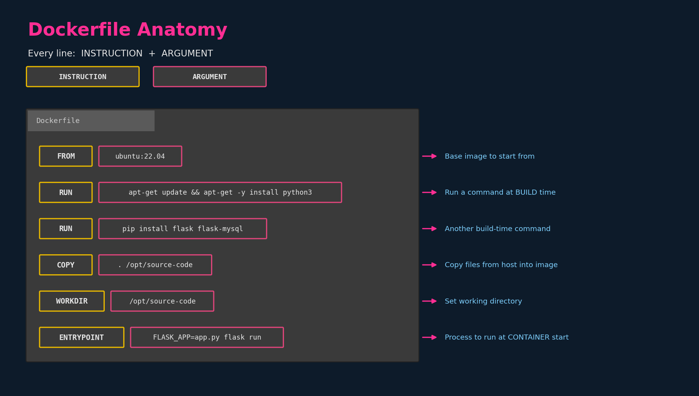
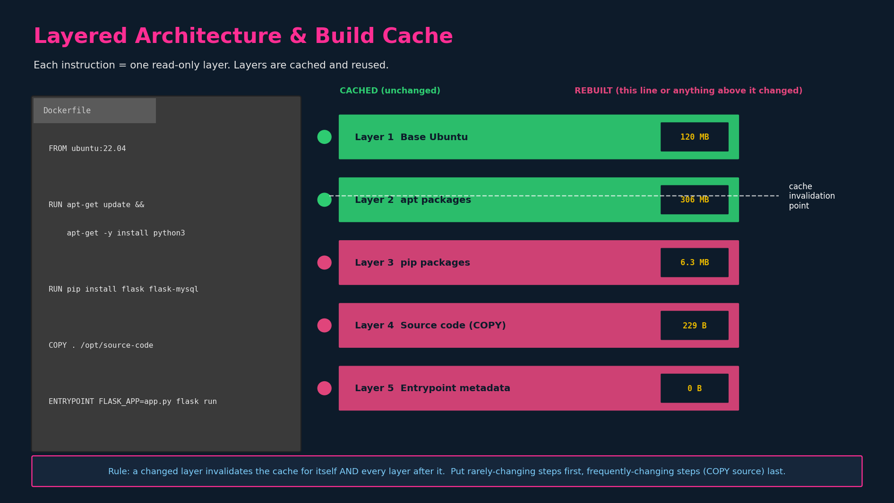

# Container Images & Docker

## 1. What an image is, and what it is not

An **image** is a packaged, read-only template: a filesystem snapshot plus
metadata (default process to run, env vars, working dir, exposed ports). It is
inert — nothing is executing.

A **container** is a running instance of an image: the image's filesystem plus a
thin writable layer on top, with a process running inside it.

The relationship is the same as **class → object**, or in terms you already use
from the Pod chapters: the image is the *desired template*, the container is the
*running realisation* of it. One image → many containers.

> Tie-back to earlier notes: a Pod spec's `image:` field is just a pointer to one
> of these templates in a registry. The kubelet pulls it, hands it to the
> container runtime (containerd → via CRI, per the runtime-evolution chapter),
> and the runtime instantiates a container from it.

---

## 2. "Containerize everything"

Historically, ops teams hand-installed and hand-configured software on hosts;
environments drifted; "works on my machine" was structural, not a joke. The
container value proposition is that the image **is** the environment — base OS
userland, dependencies, your code, and the startup command, all pinned together
and shipped as one immutable artifact.

The unit of packaging is general: if it runs on Linux, it can be packaged this
way. For CKAD, the relevant instance is **your application** packaged so the
cluster can run N identical copies of it with zero per-node setup. This is the
precondition that makes ReplicaSets/Deployments meaningful — every replica is
byte-identical because they all instantiate the same image.

---

## 3. Creating your own image — the Dockerfile

You containerise an app by writing a **Dockerfile**: a plain-text recipe of
ordered instructions. Conceptually you are writing down the steps you'd
otherwise do by hand to stand the app up on a fresh machine.

Worked example from the lecture (a Flask web app):

| # | Manual step you'd otherwise do | Dockerfile instruction |
|---|---|---|
| 1 | Pick an OS | `FROM ubuntu` |
| 2 | Update the apt repo | `RUN apt-get update` |
| 3 | Install OS-level deps | `RUN apt-get install python3` |
| 4 | Install language deps | `RUN pip install flask flask-mysql` |
| 5 | Put the source code on the box | `COPY . /opt/source-code` |
| 6 | Define how the server starts | `ENTRYPOINT FLASK_APP=.../app.py flask run` |

Then:

```bash
docker build -t mmumshad/my-custom-app .     # build image from Dockerfile in .
docker push mmumshad/my-custom-app           # push to a registry (Docker Hub)
```

> Note on the slide's `docker build Dockerfile -t ...`: the modern, correct form
> is `docker build -t name .` where `.` is the **build context** (the directory
> sent to the daemon). You only pass an explicit Dockerfile path with `-f`
> (`docker build -f path/to/Dockerfile -t name .`). The course slide is a slight
> simplification.

### 3.1 Anatomy: every line is INSTRUCTION + ARGUMENT



- **INSTRUCTION** — the command word, conventionally uppercase (`FROM`, `RUN`,
  `COPY`, `ENTRYPOINT`, `CMD`, `WORKDIR`, `ENV`, `EXPOSE`...).
- **ARGUMENT** — what that instruction acts on.

The very first instruction must be `FROM` — every image is built *on top of*
another image (even "from scratch" is an explicit empty base). You are never
starting from true nothing; you're starting from someone else's layers.

#### Instruction reference (the CKAD-relevant subset)

| Instruction | When it runs | What it does |
|---|---|---|
| `FROM` | build | Sets the base image. Mandatory, first. |
| `RUN` | build | Executes a command in a new layer and commits it. |
| `COPY` | build | Copies files from the build context into the image. |
| `ADD` | build | Like `COPY` but also handles URLs / auto-extracts tars. Prefer `COPY` unless you need those. |
| `WORKDIR` | build | Sets the working dir for subsequent instructions and at runtime. |
| `ENV` | build/run | Sets an environment variable baked into the image. |
| `EXPOSE` | metadata | Documents which port the app listens on (does **not** publish it). |
| `ENTRYPOINT` | container start | The process the container runs. |
| `CMD` | container start | Default command, or default args to `ENTRYPOINT`. |

> `ENTRYPOINT` vs `CMD` gets its own deep treatment in the next chapter
> (commands & arguments) because it maps directly onto a Pod's `command:` and
> `args:` fields, which **is** examinable. Flag for later: Pod `command:`
> overrides `ENTRYPOINT`; Pod `args:` overrides `CMD`.

---

## 4. Layered architecture (and the build cache)



### 4.1 The core idea

Docker builds the image **one layer per instruction**. Each layer records only
the *filesystem delta* introduced by that instruction — not a full copy of
everything. A `docker history` output makes this concrete:

| Layer | Instruction | Size |
|---|---|---|
| 1 | `FROM ubuntu` (base) | ~120 MB |
| 2 | `RUN apt-get update && apt-get -y install python` | ~306 MB |
| 3 | `RUN pip install flask flask-mysql` | ~6.3 MB |
| 4 | `COPY . /opt/source-code` | ~229 B |
| 5 | `ENTRYPOINT ...` (metadata only) | 0 B |

You inspect this yourself with:

```bash
docker build -t mmumshad/simple-webapp .
docker history mmumshad/simple-webapp     # shows each layer + its size
docker image inspect mmumshad/simple-webapp
```

Layer 5 being **0 B** is worth pausing on: `ENTRYPOINT` changes only image
*metadata* (which process to start), not the filesystem, so its layer carries no
bytes. Same is true for `CMD`, `ENV`, `EXPOSE`, `WORKDIR` — they're cheap
metadata layers. The expensive layers are the ones that write files: base OS and
package installs.

### 4.2 The build cache

When Docker builds, it walks instructions top to bottom. For each instruction it
asks: *"have I already built a layer for this exact instruction, on top of this
exact parent layer?"* If yes, it **reuses the cached layer** and prints
`---> Using cache`. It does the actual work only from the first instruction
where something changed.

Two practical consequences:

**(a) Failure recovery.** If a build fails at, say, step 5 of 8, the layers for
steps 1–4 are already cached. Fix the Dockerfile and rerun `docker build` — it
fast-forwards through 1–4 from cache and resumes real work at step 5. You do
**not** re-download Ubuntu and re-run apt every time. This is why iterating on a
Dockerfile is fast after the first build.

**(b) Adding/changing steps.** If you append new instructions at the end, every
existing layer is reused and only the new ones are built. But — and this is the
rule that bites people — **a change at line N invalidates the cache for line N
and every line after it.** The cache is a chain, not a set: each layer is keyed
on its instruction *plus its parent*. Change the parent and all children are
invalid even if their own instructions are byte-identical.

> Concrete failure mode: you edit one line of source code. `COPY . /opt/...` is
> near the end, so only layers 4–5 rebuild — fast. But if you'd put
> `COPY . /opt/...` *before* the `RUN pip install`, then every source edit would
> bust the cache on the pip install too, and you'd reinstall all Python deps on
> every code change. This is why **ordering matters**: stable, slow-changing
> instructions first (base, OS packages, language deps); volatile, fast-changing
> instructions (your source) last.

This ordering principle is the single most useful Dockerfile optimisation and
the one most likely to come up in real work even though the exam won't ask you
to author a Dockerfile.

### 4.3 Why layers are shared (storage + pull efficiency)

Layers are content-addressed and **shared across images**. If ten of your images
all `FROM ubuntu:22.04`, that ~120 MB base layer is stored once on the host and
once over the wire. A `docker pull` only fetches layers the host doesn't already
have. This is the same reason a Deployment scaling from 3→30 pods on a node
doesn't pull the image 30 times — the runtime already has the layers cached
locally after the first pull.

> Tie-back: this connects to the "why Services/replicas are cheap" reasoning —
> layer sharing is part of why running many identical containers is not 30× the
> disk/network cost.

---

## 5. The writable container layer

When a container starts from an image, the runtime adds a thin **read-write
layer** on top of the read-only image layers (copy-on-write). Implications you
should be able to state:

- The image layers are immutable and shared between all containers from that
  image.
- Anything a container writes (logs, temp files, app state) goes in *its own*
  writable layer.
- That writable layer is **destroyed when the container is removed**. This is
  exactly the motivation for Volumes (later config chapter): persistence has to
  live outside the container's writable layer.

> Tie-back: this is the concrete mechanical reason a restarted/replaced Pod
> loses local filesystem state, which is why `emptyDir` vs `persistentVolume`
> matters. Flag for the Volumes chapter.

---

## 6. Image naming / tags (CKAD-relevant)

Image reference format:

```
[registry/]repository[:tag]
docker.io/library/nginx:1.27        # fully qualified
nginx:1.27                          # registry+library defaulted
nginx                               # tag defaults to :latest
```

Exam-relevant points:

- **`:latest` is not "newest forever"** — it's just the default tag and is
  mutable. Pinning an explicit tag (`nginx:1.27`) is the predictable choice.
- Pod `imagePullPolicy` interacts with this: `IfNotPresent` (default for tagged
  images) reuses a cached image; `Always` re-checks the registry. Worth knowing
  because a "my change didn't take effect" troubleshooting scenario is often a
  stale cached image under `IfNotPresent`.

---

## 7. Commands to actually know

```bash
# Build & inspect
docker build -t myapp:1 .            # build from ./Dockerfile, tag it
docker build -f sub/Dockerfile -t myapp:1 .
docker history myapp:1               # per-layer sizes — proves the cache story
docker image inspect myapp:1         # full metadata (entrypoint, env, layers)
docker images                        # list local images + sizes

# Run / introspect (overlaps with the DNS/exec workflow from earlier notes)
docker run -d --name web myapp:1
docker exec -it web sh               # 'sh' not 'bash' on minimal images
docker logs web

# Push
docker tag myapp:1 youruser/myapp:1
docker push youruser/myapp:1
```

> Local-lab tie-in: you have Docker Desktop on the WSL2 Ubuntu setup, so all of
> the above runs as-is on the ThinkPad. `docker history` against any image you
> build is the fastest way to *see* the layer/cache behaviour rather than just
> read about it — recommend doing that once before moving on.
