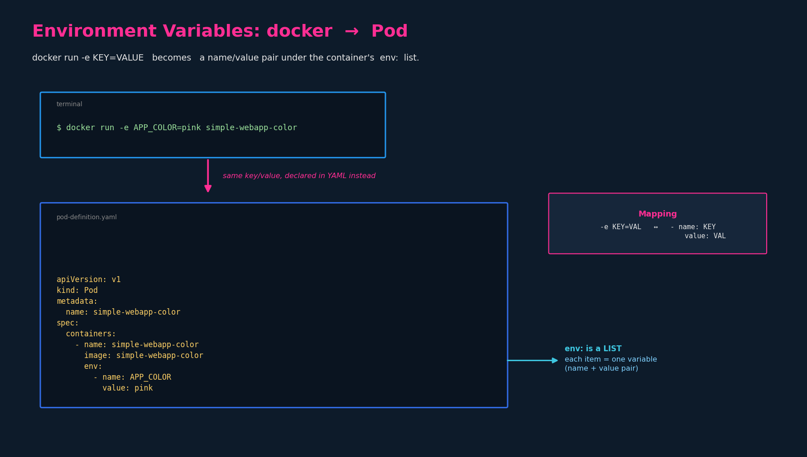
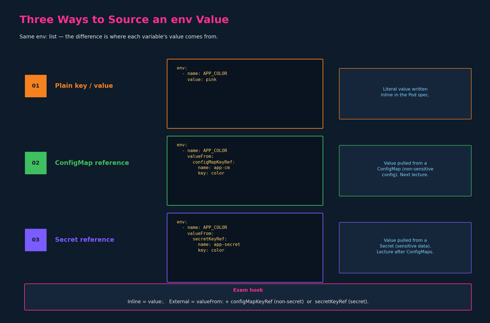

# Environment Variables

## 1. The Docker parallel

In Docker you inject an environment variable at run time with `-e`:

```bash
docker run -e APP_COLOR=pink simple-webapp-color
```

In Kubernetes the same key/value pair is declared in the Pod spec, under the
container's `env:` field, instead of on a command line.



```yaml
apiVersion: v1
kind: Pod
metadata:
  name: simple-webapp-color
spec:
  containers:
    - name: simple-webapp-color
      image: simple-webapp-color
      ports:
        - containerPort: 8080
      env:
        - name: APP_COLOR
          value: pink
```

Mapping to remember: `-e KEY=VALUE` becomes one list item with `name:` (the
key) and `value:` (the value).

---

## 2. `env:` is a list

`env:` is a **list** — each element is one environment variable, expressed as a
`name`/`value` pair. Multiple variables = multiple list items:

```yaml
env:
  - name: APP_COLOR
    value: pink
  - name: APP_MODE
    value: prod
```

This is the same "it's a YAML list" structure as `containers:`, `ports:`,
`command:`/`args:` — the dash before each `name:` is not optional and is a
common indentation slip under exam time pressure (tie-back to the recurring
YAML-indentation failure mode).

> Quoting note (same gotcha as `args:` in ch.02): values that look numeric or
> boolean should be quoted — `value: "8080"`, `value: "true"` — or YAML types
> them as int/bool and the field, which expects a string, is rejected.

---

## 3. Three ways to source a value

The `env:` structure is always the same; the difference is *where the value
comes from*.



### 3.1 Plain key/value (literal)

Value written directly inline. What we used above.

```yaml
env:
  - name: APP_COLOR
    value: pink
```

### 3.2 From a ConfigMap

Value pulled from a ConfigMap object (non-sensitive configuration). Uses
`valueFrom:` + `configMapKeyRef:` instead of `value:`.

```yaml
env:
  - name: APP_COLOR
    valueFrom:
      configMapKeyRef:
        name: app-cm        # the ConfigMap object
        key: color          # the key within it
```

> Covered in depth in `04-configmaps.md` (next lecture). Flagged here only so
> the `valueFrom:` shape is familiar when it arrives.

### 3.3 From a Secret

Value pulled from a Secret object (sensitive data — passwords, tokens). Same
shape, `secretKeyRef:` instead of `configMapKeyRef:`.

```yaml
env:
  - name: APP_COLOR
    valueFrom:
      secretKeyRef:
        name: app-secret
        key: color
```

> Covered in the lecture after ConfigMaps. Will get its own chapter file.

### 3.4 The distinction to lock in

| Source | Field under the variable |
|---|---|
| Literal | `value: <thing>` |
| ConfigMap | `valueFrom: { configMapKeyRef: { name, key } }` |
| Secret | `valueFrom: { secretKeyRef: { name, key } }` |

`value:` and `valueFrom:` are mutually exclusive for a given variable — one or
the other, never both.

---

## 4. CKAD speed notes

- Imperative seed, then edit:
  ```bash
  k run webapp --image=simple-webapp-color $do > pod.yaml
  # add the env: block in vim
  ```
- `kubectl run` can set a literal env var inline without editing YAML:
  ```bash
  k run webapp --image=simple-webapp-color --env="APP_COLOR=pink"
  ```
  Repeat `--env` for multiple. This only does the literal form (3.1) — ConfigMap
  and Secret refs still require editing the manifest.
- `kubectl set env` edits env vars on existing workloads:
  ```bash
  k set env deployment/webapp APP_MODE=prod
  k set env pod/webapp --list          # show current env
  ```
  `set env` only works on controllers/pods that exist; for a fresh manifest the
  `run --env` or edit-in-vim path is faster.
- Verify what actually landed in the running container:
  ```bash
  k exec webapp -- env | grep APP_COLOR
  ```
  This is the same `exec` workflow from the DNS chapter — useful when an env var
  "isn't taking" (often a ConfigMap/Secret key name mismatch, which surfaces
  here in later chapters).

## References

- [Define Environment Variables for a Container](https://kubernetes.io/docs/tasks/inject-data-application/define-environment-variable-container/) — the `env:` list, literal values, and `$(VAR)` substitution.
- [Configure a Pod to Use a ConfigMap](https://kubernetes.io/docs/tasks/configure-pod-container/configure-pod-configmap/) — the `valueFrom.configMapKeyRef` source shape referenced in §3.2.
- [Distribute Credentials Securely Using Secrets](https://kubernetes.io/docs/tasks/inject-data-application/distribute-credentials-secure/) — the `valueFrom.secretKeyRef` source shape referenced in §3.3.
