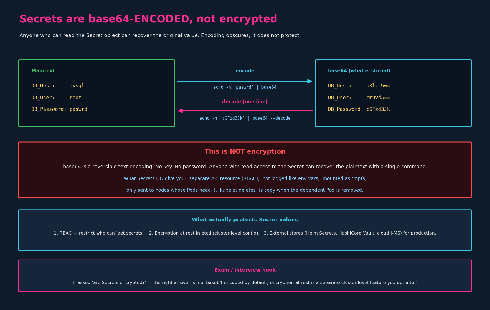

# Secrets

The field names (`secretRef`, `secretKeyRef`, `secret:`) are a
close-but-not-identical mirror of ConfigMap field names — a classic exam trap.
Read alongside `04-configmaps.md`; the shapes are ~90% the same, so this chapter
focuses on what's *different*.

---

## 1. The problem Secrets solve

Hardcoding credentials in source code is the obvious wrong answer: they leak
through Git history, log scrapers, and
every developer who pulls the repo. Moving them to a ConfigMap is **also
wrong** — ConfigMap values are stored in plain text and visible to anyone with
`get configmaps` permission. Sensitive values need a different resource.

That resource is the **Secret**. Same two-phase workflow as ConfigMaps:

1. **Create** the Secret.
2. **Inject** it into a Pod.

What makes a Secret different from a ConfigMap:

- Stored values are **base64-encoded** in the object (not plain text).
- It's a **separate API kind** (`kind: Secret`), so RBAC policies can restrict
  access to Secrets independently of ConfigMaps.
- When mounted as a volume, the files live on **tmpfs** (in-memory) on the
  node, not on disk.
- Not surfaced in command-output / logs by default the way env-var values
  sometimes are.

What makes a Secret **not** different:

> **base64 is encoding, not encryption.** Anyone with read access to the Secret
> can decode the value with one command. See section 4.

---

## 2. Creating a Secret — imperative

Mirrors ConfigMap creation almost exactly. Note the subcommand:
`create secret generic` (the `generic` type is what you want for arbitrary
key/value secrets — there are also `tls` and `docker-registry` types for
specific use cases).

### 2.1 From literals (the fast exam path)

```bash
kubectl create secret generic <secret-name> \
  --from-literal=<key>=<value>

# real example, multiple keys = repeat the flag:
kubectl create secret generic app-secret \
  --from-literal=DB_Host=mysql \
  --from-literal=DB_User=root \
  --from-literal=DB_Password=paswrd
```

You give it **plaintext** on the command line. `kubectl` does the base64
encoding for you before sending it to the API server. The object that lands in
etcd has base64-encoded values; the original plaintext is gone from the wire
after the API call.

### 2.2 From a file

```bash
kubectl create secret generic <secret-name> \
  --from-file=<path-to-file>

kubectl create secret generic app-secret \
  --from-file=app_secret.properties
```

This is still imperative — the imperative-vs-declarative distinction is about
**which command you run**, not whether files are involved:

- **Imperative** = `kubectl create secret ...` with flags. kubectl figures out
  the object shape from your args. The file in `--from-file` is *input data*
  (the secret values), not a manifest describing the object.
- **Declarative** = `kubectl apply -f <manifest>`. You hand kubectl a YAML file
  that *is* the full object definition (`kind: Secret`, `metadata:`, `data:` …).

So `--from-file=app_secret.properties` reads a file, but the file is just where
the values are coming from; you're still telling `kubectl create` to construct
the Secret. The same behavior from the ConfigMap chapter applies: by default
the **filename becomes the key** and the **whole file content becomes the
value**, which is usually not what you want for env-var-style secrets. For
clean `KEY=value` pairs use `--from-literal`.

---

## 3. Creating a Secret — declarative

Same shape as a ConfigMap manifest, but `kind: Secret`, and the values under
`data:` must be **base64-encoded by you** — kubectl does *not* encode them when
you use `apply -f`.

```yaml
# secret-data.yaml
apiVersion: v1
kind: Secret
metadata:
  name: app-secret
data:
  DB_Host: bXlzcWw=          # echo -n 'mysql'  | base64
  DB_User: cm9vdA==          # echo -n 'root'   | base64
  DB_Password: cGFzd3Jk      # echo -n 'paswrd' | base64
```

```bash
kubectl create -f secret-data.yaml
# or:
kubectl apply  -f secret-data.yaml
```

> **Two things to keep straight:** (1) it's encoding, not encryption; and
> (2) for the declarative path you encode the values *yourself before* writing
> them into `data:`. `kubectl create -f` does not re-encode what you put in
> the file. Putting raw plaintext under `data:` will be rejected as invalid
> base64.

### 3.1 Two convenience options

- **`stringData:`** lets you write plaintext in the manifest and have the API
  server base64-encode it for you on submit:
  ```yaml
  stringData:
    DB_Password: paswrd     # written as plaintext, stored as base64
  ```
  Useful for hand-written manifests, but the file itself now contains
  plaintext, so don't commit it to source control. On read-back, you'll see
  values under `data:` (base64) — `stringData:` is write-only sugar.
- Encoding loop for `data:` values:
  ```bash
  echo -n 'paswrd' | base64                     # encode
  echo -n 'cGFzd3Jk' | base64 --decode          # decode
  ```
  `-n` is essential — without it `echo` appends a newline and the encoded
  value silently includes the `\n`, which breaks comparisons.

---

## 4. base64 is encoding, not encryption

This is the conceptual point of the chapter.



base64 is a reversible text encoding designed to safely represent binary data
as ASCII (so the JSON/YAML that ships Secrets through the API doesn't choke on
non-printable bytes). It has **no key and no password**. Decoding is a single
command anyone can run:

```bash
$ kubectl get secret app-secret -o yaml
# ...
data:
  DB_Password: cGFzd3Jk

$ echo -n 'cGFzd3Jk' | base64 --decode
paswrd
```

If someone can `get secrets` in your namespace, they can read the values. The
encoding doesn't slow them down for more than one shell pipe.

### What Secrets DO give you (the real benefits)

- **A distinct API resource.** RBAC can grant `get/list configmaps` while
  denying `get/list secrets` — you can't separate the two if everything's
  jammed into one ConfigMap.
- **No accidental display.** `kubectl describe secret` shows key names and
  sizes (`10 bytes`) but not values, while `describe configmap` shows
  everything. The base64 encoding also keeps multi-line / binary values from
  splashing across terminal output.
- **tmpfs mounts.** When mounted as a volume, Secret files are written to
  `tmpfs` on the node — RAM, not disk — and disappear when the Pod is removed.
- **Selective transmission.** The kubelet only pulls a Secret onto the nodes
  whose Pods actually use it. When the dependent Pod is deleted, the kubelet
  also deletes its local copy of the Secret data from that node.

### Practical rules

- **Do not check Secret object definitions into source control.** A manifest
  with `data:` (base64) or `stringData:` (plaintext) is effectively a
  cleartext credentials file. Pre-commit hooks / `.gitignore` for
  `secret-*.yaml` is the minimum bar.
- **Enable encryption at rest for Secrets in etcd.** Cluster-level config; not
  on by default. Without it, anyone who can read the etcd data files (a node
  compromise, a backup leak) gets every Secret in cleartext.
- **For real workloads, use a dedicated tool.** Helm Secrets and HashiCorp
  Vault are common; the broader category is **external secret stores** —
  Vault, cloud KMS (AWS/GCP/Azure), Sealed Secrets, External Secrets
  Operator, SOPS-encrypted manifests, etc. These solve the storage,
  rotation, and audit problems that built-in Secrets don't.

### What actually protects Secret *contents*

1. **RBAC** — restrict who can `get`/`list` secrets in each namespace. This is
   the single biggest practical lever.
2. **Encryption at rest in etcd** — a cluster-level config (the API server's
   `--encryption-provider-config` flag); not on by default. Once enabled, the
   bytes in etcd are encrypted, but the API still returns base64 to anyone
   with read access — so RBAC still matters.
3. **External secret stores** — Vault, Helm Secrets, cloud KMS, External
   Secrets Operator, etc., for real-world prod where the threat model demands
   more.

### The exam/interview answer

> "Are Kubernetes Secrets encrypted?"
>
> **No.** By default the values are base64-encoded — reversible without a
> key. Encryption at rest in etcd is a separate cluster-level feature you opt
> into. The practical protection for Secret values is RBAC.

---

## 5. Viewing Secrets

```bash
kubectl get secrets                           # NAME, TYPE, DATA (# keys), AGE
kubectl describe secret app-secret            # shows KEYS + sizes, NOT values
kubectl get secret app-secret -o yaml         # shows base64-encoded values
```

`describe` deliberately hides values — `get -o yaml` (or `-o json`) is how you
see them, and they come back base64-encoded.

You'll also see a `default-token-...` secret of type
`kubernetes.io/service-account-token` in every namespace. That's auto-created
for the namespace's default ServiceAccount and used by Pods to talk to the API
server. Don't delete it. It's a forward reference into the ServiceAccounts
chapter.

---

## 6. Injecting into a Pod — the three methods

Mirrors the three ConfigMap consumption methods exactly. Field names change;
shapes don't. If you have `04-configmaps.md §5` clear, this section is a
substitution exercise.

| ConfigMap (ch.04) | Secret (here) | Result |
|---|---|---|
| `envFrom: [ configMapRef: {…} ]` | `envFrom: [ secretRef: {…} ]` | All keys → env vars |
| `valueFrom: { configMapKeyRef: {…} }` | `valueFrom: { secretKeyRef: {…} }` | One key → one env var |
| `volumes: [ configMap: { name } ]` | `volumes: [ secret: { secretName } ]` | All keys → files |

> Naming gotcha worth burning in: the volume form uses **`secret:`** with
> **`secretName:`** as the inner field (not `name:`, like ConfigMap volumes
> use). It's the one place the parallelism breaks slightly. Get this wrong and
> the manifest validates but doesn't mount what you think.

### 6.1 Method 1 — `envFrom` (whole Secret → all env vars)

```yaml
apiVersion: v1
kind: Pod
metadata:
  name: simple-webapp-color
spec:
  containers:
    - name: simple-webapp-color
      image: simple-webapp-color
      ports:
        - containerPort: 8080
      envFrom:
        - secretRef:
            name: app-secret
```

Inside the container, `DB_Host`, `DB_User`, `DB_Password` all exist as env
vars, with the **decoded plaintext values**. kubelet decodes on injection —
the container sees the original values, not the base64 form.

### 6.2 Method 2 — single `env` with `secretKeyRef` (one key → one env var)

```yaml
spec:
  containers:
    - name: simple-webapp-color
      image: simple-webapp-color
      env:
        - name: DB_Password           # env var name (your choice)
          valueFrom:
            secretKeyRef:
              name: app-secret        # which Secret
              key: DB_Password        # which key within it
```

### 6.3 Method 3 — volume mount (keys → files)

Same as ConfigMaps, the complete pattern needs a matching `volumeMounts:` on
the container:

```yaml
spec:
  containers:
    - name: simple-webapp-color
      image: simple-webapp-color
      volumeMounts:
        - name: app-secret-volume
          mountPath: /opt/app-secret-volumes
          readOnly: true                      # idiomatic for secret mounts
  volumes:
    - name: app-secret-volume
      secret:
        secretName: app-secret                # <-- note: secretName, not name
```

Result, inside the container:

```bash
$ ls /opt/app-secret-volumes
DB_Host  DB_Password  DB_User

$ cat /opt/app-secret-volumes/DB_Password
paswrd
```

Each key becomes a file; the file's contents are the **decoded** value.
Stored on tmpfs (RAM) on the node, not on disk. Like ConfigMap volume mounts,
this form picks up Secret updates without restarting the Pod (after a short
sync delay) — env-var forms do not.

### 6.4 Finding these fields without memorizing (exam technique)

Same recall trick as ConfigMaps, with `secret*` in place of `configMap*`:

```bash
k explain pod.spec.containers.envFrom          # whole secret -> secretRef {name}
k explain pod.spec.containers.env.valueFrom    # one key      -> secretKeyRef {name, key}
k explain pod.spec.volumes.secret              # as files     -> secret {secretName, items}
```

That last lookup also settles the one broken parallel — `explain` shows the
volume field is **`secretName`**, not `name`. Docs (open on the exam):
**"Managing Secrets using kubectl"** / **"Distribute Credentials Securely Using
Secrets"** have copy-paste YAML for all three shapes.

---

## 7. CKAD speed notes

- Imperative is faster — prefer it under time pressure:
  ```bash
  k create secret generic app-secret \
    --from-literal=DB_Host=mysql \
    --from-literal=DB_User=root \
    --from-literal=DB_Password=paswrd
  ```
- Need a YAML skeleton to edit? Same `$do` pattern:
  ```bash
  k create secret generic app-secret \
    --from-literal=DB_Password=paswrd $do > sec.yaml
  ```
- Encode/decode one-liners (memorize, `-n` is mandatory):
  ```bash
  echo -n 'paswrd'    | base64
  echo -n 'cGFzd3Jk'  | base64 --decode
  ```
- Verify what landed in the container — same exec pattern as the env / DNS
  chapters:
  ```bash
  k exec simple-webapp-color -- env | grep DB_           # env methods
  k exec simple-webapp-color -- ls   /opt/app-secret-volumes
  k exec simple-webapp-color -- cat  /opt/app-secret-volumes/DB_Password
  ```
- **Common exam stumbles to pre-empt** (the field-name traps live in §6/§6.4):
  - `data:` requires base64-encoded values; `stringData:` accepts plaintext.
    Mixing them up gives a `secret data illegal base64 data` error.
  - Forgot `-n` on `echo` → trailing newline encoded into your secret →
    mysterious auth failures.

## References

- [Managing Secrets using kubectl](https://kubernetes.io/docs/tasks/configmap-secret/managing-secret-using-kubectl/) — `create secret generic`, `--from-literal`/`--from-file`, and decoding with `-o jsonpath` + `base64 --decode`.
- [Distribute Credentials Securely Using Secrets](https://kubernetes.io/docs/tasks/inject-data-application/distribute-credentials-secure/) — copy-paste YAML for the three consumption methods (`envFrom`, `secretKeyRef`, volume mount).
- [Secrets](https://kubernetes.io/docs/concepts/configuration/secret/) — built-in Secret types, base64-not-encryption caveat, and encryption-at-rest / RBAC guidance.
