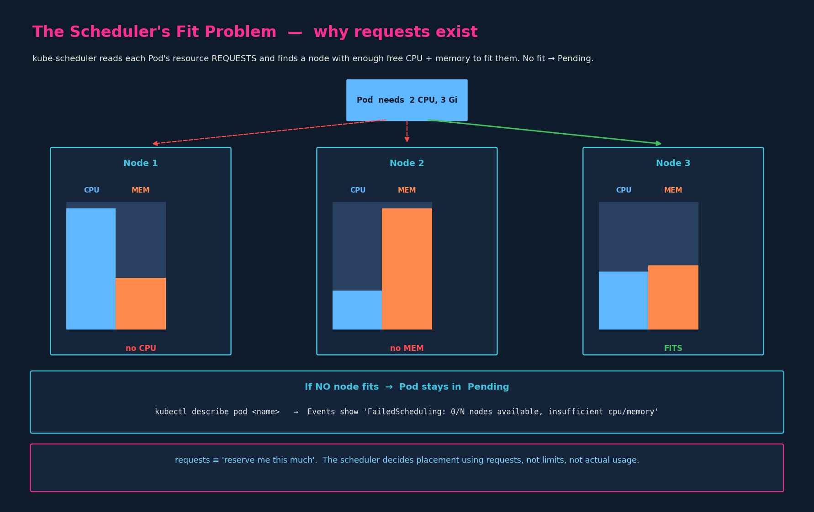
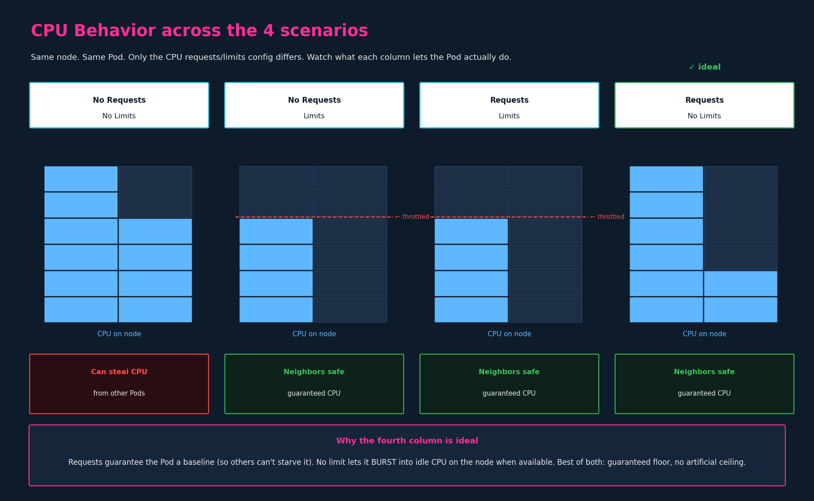
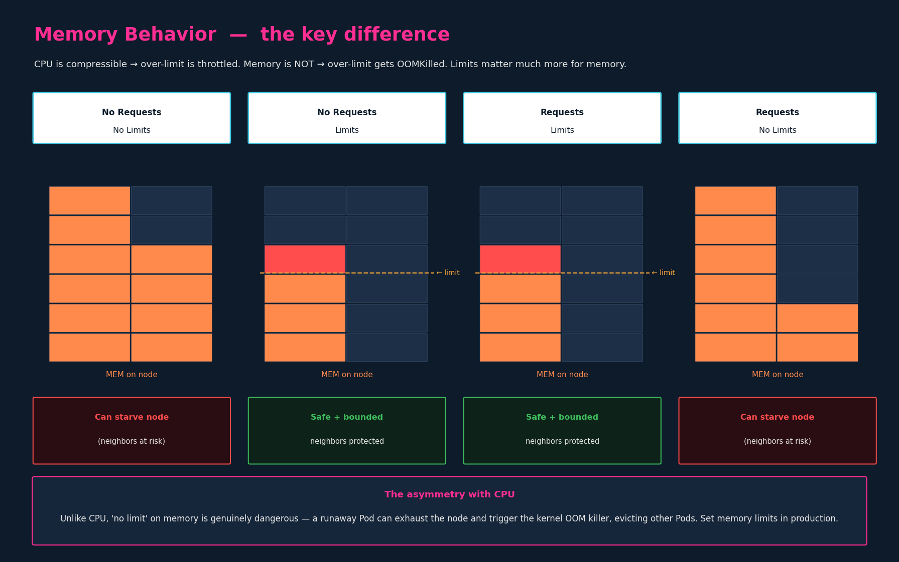

# Resource Requirements

Companion file: `bytes-and-cpu-units-reference.md` — refresher on
bits/bytes/kilo-vs-kibi and CPU millicores; read alongside §3.

## 1. Why this matters: the scheduler's fit problem

Every Pod, once scheduled, **consumes resources from a node** — CPU and
memory (and other things like ephemeral storage). The **kube-scheduler**'s
job is to pick a node for each new Pod by looking at what the Pod *says it
needs* (its **requests**) and what each node *has free*.



The scheduler's algorithm, simplified:

1. **Filter** — discard any node that can't fit the Pod's requests
   (insufficient free CPU, insufficient free memory, port conflicts, taints
   that don't tolerate, etc.).
2. **Score** — among the remaining nodes, score each one and pick the best
   (least-loaded, locality preferences, etc.).
3. **Bind** — assign the Pod to that node. Now it counts against that node's
   allocatable capacity.

If **no** node passes step 1, the Pod stays in `Pending` until something
changes — a node gets freed up, capacity is added, or the Pod's requests are
edited down. This is one of the most common "why isn't my Pod running"
scenarios.

### How to diagnose a stuck Pod

Drop into `describe` and read the Events:

```bash
kubectl describe pod <name>
# Events:
#   FailedScheduling   0/3 nodes are available:
#                      3 Insufficient cpu, 2 Insufficient memory.
```

The message tells you *which* resource is short and *how many* nodes failed
which check. "Insufficient cpu" + Pending = the scheduler couldn't find a
node with enough free CPU to satisfy your `requests.cpu`.

> **Key insight:** the scheduler decides placement using **requests**, not
> limits, and not actual usage. A Pod that requests `cpu: 100m` but actually
> burns 2 CPUs in production will still be scheduled to a node that has
> 100m free — because requests are what the scheduler reserves against.

---

## 2. Requests vs Limits

Two concepts, easy to conflate. Both go under
`spec.containers[*].resources:` — never at the Pod level.

| | What it means | When it's enforced | What happens if exceeded |
|---|---|---|---|
| `requests` | "Reserve me at least this much" | At **scheduling time** | (N/A — requests aren't a ceiling) |
| `limits`   | "I will not be allowed to use more than this" | At **runtime** | **CPU**: throttled. **Memory**: OOMKilled. |

Both are per-resource (CPU and memory each get their own request and limit).

Full example:

```yaml
apiVersion: v1
kind: Pod
metadata:
  name: simple-webapp-color
spec:
  containers:
    - name: simple-webapp-color
      image: simple-webapp-color
      ports:
        - containerPort: 8080
      resources:
        requests:
          cpu: 1
          memory: "1Gi"
        limits:
          cpu: 2
          memory: "2Gi"
```

This Pod **reserves** 1 CPU and 1 GiB of memory (the scheduler will only
place it on a node with that much free), and is **capped** at 2 CPU and 2 GiB
of memory (the kubelet/runtime will enforce this).

> Units are covered in `bytes-and-cpu-units-reference.md` — read it now if
> `1Gi` vs `1G` or `100m` CPU is fuzzy. Quick version: `m` = millicores
> (1000m = 1 CPU); `Gi` = gibibytes (2³⁰ bytes, base-2); `G` = gigabytes
> (10⁹ bytes, base-10). Almost always use the `Gi/Mi/Ki` (base-2) variants
> for memory.

---

## 3. The four scenarios — CPU behavior

Same node, same Pod, four different configurations of `requests`/`limits` for
CPU. The CPU column on the node shows how much CPU the Pod is allowed to use.



Walking each column:

### 3.1 No requests, no limits  ❌

The Pod has no floor *and* no ceiling. It can use as much CPU as is free on
the node — including CPU that **other Pods** on the same node need to do
their work. Other Pods get **CPU-starved**: they're slow because this Pod is
hogging it.

The bigger problem: when a new Pod is scheduled here later with its own
requests, this no-requests Pod doesn't count against capacity (it requested
zero), so the node can be over-scheduled. Things degrade quietly.

### 3.2 No requests, limits  ❌

A ceiling but no floor. The Pod is throttled at the limit — fine — but with
no `requests` it has no *guarantee* of any CPU. Under contention, other Pods
with explicit requests can crowd it out and this Pod gets less than its
limit anyway. You get the downside of a limit (throttled) without the upside
of a request (guaranteed share).

Subtle: Kubernetes will, in many setups, set `requests = limits` by default
when only `limits` is specified. But relying on that is fragile and varies
by cluster config — *don't*; set `requests` explicitly.

### 3.3 Requests AND limits  (acceptable, but not ideal)  ⚠️

Floor + ceiling. The Pod is guaranteed its `requests.cpu` and capped at
`limits.cpu`. Neighbors are safe; the Pod is predictable. The downside:
**when there's idle CPU on the node, this Pod can't use it.** Throttled at
the limit even though CPU is available right there.

This is the most common production default — predictability over
performance. Reasonable choice; not the lecture's ideal.

### 3.4 Requests, NO limits  ✅  (the ideal per the lecture)

Floor but no ceiling. The Pod is **guaranteed** its `requests.cpu` (other
Pods can't starve it), and it can **burst** into any idle CPU on the node
when it needs to. Best of both worlds:

- Neighbors are protected: this Pod can't take CPU that another Pod has
  reserved via *its* requests.
- This Pod is not artificially constrained when there's unused capacity.

Why this works only for CPU: **CPU is compressible**. If the node fills up
and someone else needs their share, the kernel can throttle this Pod back
down to its request instantly. No data is lost; the Pod just runs slower
for a moment.

> Important caveat: "no limits" CPU is great in
> *single-tenant or well-known workloads*. In a multi-tenant cluster
> (different teams sharing a cluster), running with no CPU limit is often
> forbidden by policy because it makes capacity planning unpredictable. The
> CKAD answer is "requests + no limit"; the real-world answer is "it
> depends on your operating environment."

---

## 4. Memory behavior — the critical asymmetry

CPU's story does **not** apply to memory. This is the most important
operational point in the chapter.



**Memory is not compressible.** You can't "throttle" memory back — the
process either has the bytes or it doesn't. If a container exceeds its
memory limit, the kubelet/kernel **kills it** with an OOMKilled event. The
container restarts (per `restartPolicy`), and the cycle may repeat —
`CrashLoopBackOff` is the symptom you see in `kubectl get pods`.

The asymmetry has two consequences:

**(a) Memory limits matter much more than CPU limits.** A Pod over its CPU
limit is throttled — annoying. A Pod over its memory limit is dead. Set
memory limits.

**(b) "Requests but no limits" is *dangerous* for memory.** Without a memory
limit, a runaway Pod can grow until it exhausts the node. When the node hits
OOM, the kernel's OOM killer picks
victims based on heuristics — and it doesn't always pick the offender. It
can evict other Pods, including system Pods, taking the node into an unsafe
state and cascading failure across the cluster.

So: the CPU lecture's "requests, no limits" guidance is *wrong for memory*.
The right rule for memory is **always set a limit**, and set it high enough
that legitimate spikes don't trigger OOM but low enough that runaway growth
is contained.

### The runaway-memory pattern

Symptoms:

- One Pod's memory usage climbing without bound.
- Eventually other Pods on the same node start dying with no obvious cause
  (the OOM killer picked them).
- The node may become `NotReady` if the kubelet itself is starved.
- The scheduler reassigns evicted Pods, possibly to other nodes — which
  then have *their* memory usage rise. Cascading.

The fix is the limit. The diagnosis trail:

```bash
kubectl get pods -o wide                     # see which node
kubectl describe pod <name>                  # look for OOMKilled in events
kubectl describe node <node>                 # look for MemoryPressure
kubectl top pod                              # current usage (requires metrics-server)
kubectl top node
```

`OOMKilled` in events + last container state's exit code 137 is the
fingerprint.

---

## 5. Defaults — what you get if you specify nothing

> **By default, a container has no requests and no limits.** It can consume
> as much of the node as it wants, and the scheduler reserves nothing for
> it.

This is exactly the worst column in both diagrams. In any environment where
multiple Pods share a node — which is every real environment — you should
set both requests and (especially for memory) limits.

Two mechanisms exist for *enforcing* this at the namespace level:
**LimitRange** (per-Pod defaults) and **ResourceQuota** (aggregate caps).
Both are namespace-scoped admission-time controls.

---

## 6. LimitRange — namespace-scoped defaults and bounds

A `LimitRange` is a namespace-scoped object that defines, for that
namespace:

- **`default`** — default *limits* applied to containers that don't specify
  any.
- **`defaultRequest`** — default *requests* applied to containers that
  don't specify any.
- **`min` / `max`** — bounds the namespace will accept; Pods requesting
  outside this range are rejected at admission.

Example (CPU LimitRange):

```yaml
# limit-range-cpu.yaml
apiVersion: v1
kind: LimitRange
metadata:
  name: cpu-resource-constraint
spec:
  limits:
    - type: Container
      default:
        cpu: 500m
      defaultRequest:
        cpu: 500m
      max:
        cpu: "1"
      min:
        cpu: 100m
```

Now any container created in this namespace **without** `resources.requests.cpu`
or `resources.limits.cpu` automatically gets `500m` for both. Any container
that asks for more than `1` CPU or less than `100m` is rejected.

Memory LimitRange is the same shape with `memory:` values (`1Gi`, `500Mi`,
etc.). You can put CPU and memory in the same LimitRange under one
`limits:` entry; the lecture shows them separated for clarity.

### The critical gotcha

> **LimitRange affects only Pods created AFTER it exists.** Existing Pods
> in the namespace are not retroactively defaulted or rejected.

So creating a LimitRange in a namespace that already has running Pods does
**not** apply requests/limits to those running Pods. They keep running with
whatever (or nothing) they were created with. To apply LimitRange to
existing workloads, you have to recreate (delete + apply) the Pods.

This is the same "admission-time only" principle as several other K8s
mechanisms — the rule is set forward, not backward.

### Verifying

```bash
kubectl get limitranges                              # short: lr
kubectl describe limitrange cpu-resource-constraint
```

---

## 7. ResourceQuota — namespace-scoped aggregate caps

A `ResourceQuota` is a namespace-scoped object that caps the **total**
amount of resources all objects in the namespace can collectively request
or limit. This is the "fair share between teams sharing a cluster" tool.

```yaml
apiVersion: v1
kind: ResourceQuota
metadata:
  name: my-resource-quota
spec:
  hard:
    requests.cpu: 4
    requests.memory: 4Gi
    limits.cpu: "10"
    limits.memory: 10Gi
```

In this namespace:

- The sum of all containers' `requests.cpu` cannot exceed 4 CPUs.
- The sum of all containers' `requests.memory` cannot exceed 4 GiB.
- The sum of all containers' `limits.cpu` cannot exceed 10.
- The sum of all containers' `limits.memory` cannot exceed 10 GiB.

If a new Pod's requests would push the namespace over any of these caps,
the create call is rejected at admission.

```bash
kubectl get resourcequotas                  # short: quota
kubectl describe resourcequota my-resource-quota
# Shows Used vs Hard for each tracked resource
```

ResourceQuota can also cap counts of objects: `pods: 10`, `services: 5`,
`secrets: 20`, etc. — but the resources-CPU/memory shape above is the
common one.

### LimitRange vs ResourceQuota — don't conflate

| | LimitRange | ResourceQuota |
|---|---|---|
| Scope | Per-container defaults & bounds | Namespace-wide aggregate caps |
| Field shape | `default`, `defaultRequest`, `min`, `max` | `hard:` totals |
| Enforces what | "Each container is between X and Y" | "All containers combined ≤ Z" |
| When checked | Container admission | Namespace admission (sum) |
| Affects existing? | No (forward only) | No (caps future creates) |

Both exist in the same namespace concurrently — they solve different
problems. LimitRange normalizes individual Pods; ResourceQuota caps the
namespace's footprint.

---

## 8. CKAD speed notes

- **The block goes under each container, not the Pod**:
  ```yaml
  spec:
    containers:
      - name: app
        image: ...
        resources:           # <-- under the container item
          requests:
            cpu: "100m"
            memory: "128Mi"
          limits:
            cpu: "500m"
            memory: "256Mi"
  ```
  Putting `resources:` under `spec:` directly (Pod level) is a recurring
  exam slip — same family of mistake as the `securityContext` indentation
  trap from chapter 07.

- **Quote values, especially with units.**
  - `cpu: 1` — fine (integer)
  - `cpu: "1"` — also fine
  - `cpu: 100m` — fine (no special chars)
  - `memory: 1Gi` — fine; `memory: "1Gi"` — also fine and safer
  - `memory: 1.5Gi` — fine
  - When in doubt, **quote** — never wrong, and avoids the YAML
    string-vs-number gotcha from earlier chapters.

- **No imperative shortcut for the resources block.** `kubectl run` does
  have `--requests=` and `--limits=` flags, useful when generating a
  starter:
  ```bash
  k run web --image=nginx --requests=cpu=100m,memory=128Mi \
    --limits=cpu=500m,memory=256Mi $do > pod.yaml
  ```
  …but they only work on `run` (Pods). For Deployments/most other
  resources, edit YAML.

- **Editing resources on existing workloads:**
  ```bash
  k set resources deployment/web \
    --requests=cpu=200m,memory=256Mi --limits=cpu=1,memory=512Mi
  ```
  Triggers a rolling update for the Deployment. For raw Pods, `set
  resources` works but Pods can't update resources in place on most setups;
  you'd `k replace --force -f`.

- **Verify on the running container:**
  ```bash
  k describe pod <name>                       # shows requests/limits
  k top pod                                    # shows current usage (needs metrics-server)
  k get pod <name> -o jsonpath='{.spec.containers[0].resources}'
  ```

- **Common exam scenarios:**
  - "Set this Pod's CPU request to 100m and memory request to 256Mi" →
    container-level `resources.requests`.
  - "Create a LimitRange in namespace X with default memory limit 512Mi" →
    `kind: LimitRange`, `default.memory: 512Mi`, `defaultRequest.memory`
    likely the same.
  - "Limit namespace Y to 10 CPUs total" → `kind: ResourceQuota`,
    `hard.limits.cpu: "10"`.

## References

- [Resource Management for Pods and Containers](https://kubernetes.io/docs/concepts/configuration/manage-resources-containers/) — requests vs limits, CPU/memory units, scheduling-by-requests, and OOMKilled behaviour.
- [Assign Memory Resources to Containers and Pods](https://kubernetes.io/docs/tasks/configure-pod-container/assign-memory-resource/) — hands-on memory requests/limits and the OOM-kill demonstration.
- [Configure Default Memory Requests and Limits for a Namespace](https://kubernetes.io/docs/tasks/administer-cluster/manage-resources/memory-default-namespace/) — LimitRange defaults applied at namespace admission.
