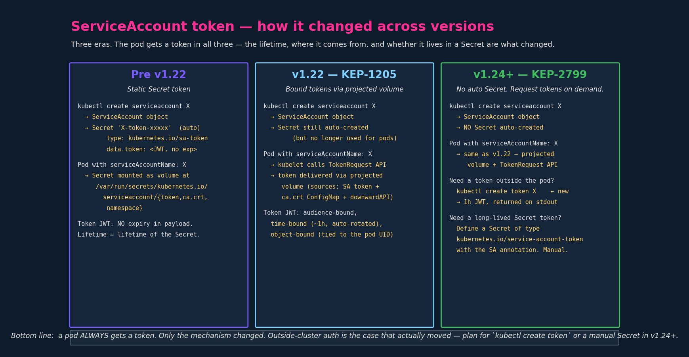
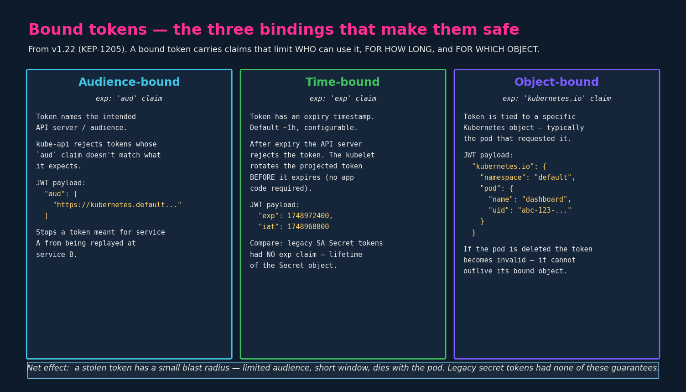
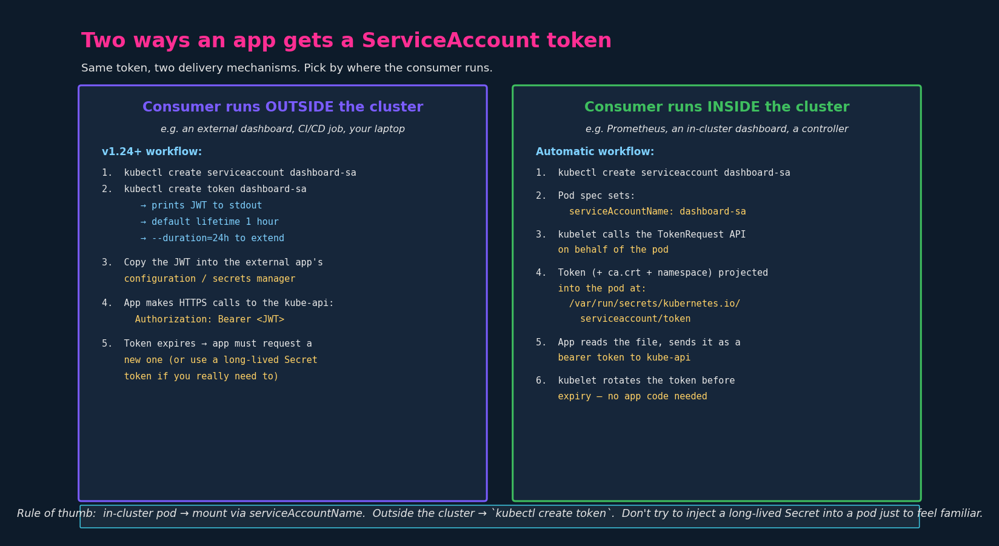

# Service Accounts

## 1. Two kinds of accounts in Kubernetes

Kubernetes distinguishes:

- **User accounts** — humans. Admins, developers, SREs accessing the cluster
  with `kubectl`. Kubernetes does not store users itself; auth is delegated
  to certificates, OIDC, webhook authenticators, etc. User accounts are NOT
  Kubernetes objects.

- **Service accounts** — processes. Anything that talks to the kube-api
  programmatically: Prometheus scraping `/metrics`, Jenkins deploying, a
  custom controller, your own Python app listing Pods. Service accounts ARE
  Kubernetes objects (`kind: ServiceAccount`) and live in a namespace.

Humans on one side, robots on the other. The whole chapter is about how the
robots authenticate. Every controller you install (cert-manager,
external-dns, ArgoCD, the metrics-server) ships with its own ServiceAccount
and a ClusterRole/Role. SAs are the universal "this is what the workload is
allowed to do" knob in any non-trivial cluster.

---

## 2. The core object model

```
ServiceAccount  ──── identity (namespaced object, just a name + metadata)
      │
      │  bound to (legacy) or referenced by (modern)
      ▼
  Token (JWT)   ──── credential the SA presents to kube-api
      │
      │  + RBAC binding (RoleBinding or ClusterRoleBinding)
      ▼
  Authorized actions on the API
```

The ServiceAccount object itself is almost empty — it's basically a name
that lives in a namespace. The interesting things are:

1. The **token** (JWT) that proves "I am this SA."
2. The **RBAC bindings** that say "this SA is allowed to do these things."

This chapter is about the token. RBAC is its own chapter.

---

## 3. Lifecycle, command by command

```bash
# Create a ServiceAccount
kubectl create serviceaccount dashboard-sa
# serviceaccount/dashboard-sa created

# List them
kubectl get serviceaccount         # or `kubectl get sa`
# NAME            SECRETS   AGE
# default         0         218d     # one per namespace, auto-created
# dashboard-sa    0         5s

# Describe (interesting fields differ by cluster version — see §5/§6)
kubectl describe sa dashboard-sa
```

In v1.24+ output the `SECRETS` column is `0` because no Secret is
auto-created. Pre-1.24 you'd see `1` and `Mountable secrets:
dashboard-sa-token-xxxxx` in the describe output.

---

## 4. The "default" ServiceAccount

**Every namespace has a `default` ServiceAccount that Kubernetes creates
automatically.** Every Pod that doesn't specify a `serviceAccountName`
silently uses `default`. The mount happens whether you asked for it or not:
the pod gets a volume at `/var/run/secrets/kubernetes.io/serviceaccount/`
with the token, the CA cert, and the namespace.

You can see this on any Pod:

```bash
kubectl describe pod my-pod
# ...
# Mounts:
#   /var/run/secrets/kubernetes.io/serviceaccount from kube-api-access-xxxxx (ro)
# Volumes:
#   kube-api-access-xxxxx:
#     Projected (a volume that contains injected data from multiple sources)
```

And exec in to see the files:

```bash
kubectl exec -it my-pod -- ls /var/run/secrets/kubernetes.io/serviceaccount
# ca.crt  namespace  token

kubectl exec -it my-pod -- cat /var/run/secrets/kubernetes.io/serviceaccount/token
# eyJhbGciOiJSUzI1NiIs... (a JWT)
```

The three files together are everything a process inside the pod needs to
make authenticated calls to `https://kubernetes.default.svc`:

| File        | Purpose                                                |
|-------------|--------------------------------------------------------|
| `token`     | The JWT bearer token. Sent as `Authorization: Bearer …` |
| `ca.crt`    | The cluster CA. Used to verify the kube-api TLS cert    |
| `namespace` | The namespace the pod is in (handy for the app)        |

**Disabling the automount** — sometimes you want a pod that explicitly
should NOT be able to talk to the API:

```yaml
apiVersion: v1
kind: Pod
metadata:
  name: nginx
spec:
  serviceAccountName: default            # or any SA
  automountServiceAccountToken: false    # disables the volume mount
  containers:
    - name: nginx
      image: nginx
```

Same field can be set on the ServiceAccount itself (`automountServiceAccountToken: false`)
to make it the default for any pod that uses that SA. Pod-level setting wins
when both are present.

---

## 5. How a pod actually gets its token — version by version

This is the part that matters for the exam and for reading docs/old blog
posts without getting confused.



### Pre v1.22 — Static Secret token (legacy)

- `kubectl create sa X` → ServiceAccount object PLUS a Secret named
  `X-token-xxxxx` of type `kubernetes.io/service-account-token`.
- The Secret's `data.token` field holds a JWT with **no expiry claim**.
- A pod with `serviceAccountName: X` got that Secret mounted at the
  well-known path.
- The token lived as long as the Secret did. If it leaked, it stayed
  valid forever.

### v1.22 — Bound tokens (KEP-1205)

[KEP-1205](https://github.com/kubernetes/enhancements/tree/master/keps/sig-auth/1205-bound-service-account-tokens)
introduced the **TokenRequest API** and changed how pods get tokens. The
ServiceAccount still has an auto-created Secret, but pods no longer use it.
Instead:

1. The kubelet, when starting the pod, calls the TokenRequest API on the
   pod's behalf.
2. It receives a fresh JWT with three new claims (see §6 — audience-bound,
   time-bound, object-bound).
3. The token is delivered to the pod via a **projected volume** — a volume
   type that combines several sources into one mountpoint.

If you `kubectl get pod my-pod -o yaml` on a v1.22+ cluster you'll see:

```yaml
spec:
  containers:
    - name: nginx
      image: nginx
      volumeMounts:
        - mountPath: /var/run/secrets/kubernetes.io/serviceaccount
          name: kube-api-access-6mtg8
          readOnly: true
  volumes:
    - name: kube-api-access-6mtg8
      projected:
        defaultMode: 420
        sources:
          - serviceAccountToken:         # the JWT, from TokenRequest API
              expirationSeconds: 3607    # ≈ 1 hour
              path: token
          - configMap:                   # the cluster CA cert
              items:
                - key: ca.crt
                  path: ca.crt
              name: kube-root-ca.crt
          - downwardAPI:                 # the pod's namespace
              items:
                - fieldRef:
                    apiVersion: v1
                    fieldPath: metadata.namespace
                  path: namespace
```

Three sources, one mount path, same three files (`token`, `ca.crt`,
`namespace`) — but the token is now ephemeral and bound to the pod. The
kubelet refreshes it before expiry, transparently. **The app reading
`/var/run/secrets/.../token` doesn't change.** That's the design goal: keep
the contract, harden the implementation.

### v1.24+ — No auto Secret (KEP-2799)

[KEP-2799](https://github.com/kubernetes/enhancements/tree/master/keps/sig-auth/2799-reduction-of-secret-based-service-account-token)
finished the cleanup:

- `kubectl create sa X` now creates **only** the ServiceAccount. No Secret.
- Pods still get tokens via TokenRequest + projected volume (same as v1.22).
- If you need a token outside of a pod, you ask for one explicitly.
- If you really still need a long-lived Secret token, you create the Secret
  yourself, with a specific annotation (see §8).

The motivation, in the official words from the docs:

> Since 1.22, this type of Secret is no longer used to mount credentials
> into Pods, and obtaining tokens via the TokenRequest API is recommended
> instead of using service account token Secret objects.

The reasoning: Secret tokens are persistent, non-expiring, and readable by
any client with `get secret` permission — a much bigger blast radius than a
bound token in a projected volume.

---

## 6. Bound tokens — the three bindings

The JWT issued by TokenRequest carries three claims that legacy tokens did
not. Decoded payload looks something like:

```json
{
  "aud": ["https://kubernetes.default.svc.cluster.local"],
  "exp": 1748972400,
  "iat": 1748968800,
  "iss": "https://kubernetes.default.svc.cluster.local",
  "kubernetes.io": {
    "namespace": "default",
    "pod": {
      "name": "dashboard",
      "uid": "47349a47-07c2-412a-bf0e-11dc0ad16508"
    },
    "serviceaccount": {
      "name": "dashboard-sa",
      "uid": "..."
    }
  },
  "nbf": 1748968800,
  "sub": "system:serviceaccount:default:dashboard-sa"
}
```



- **Audience-bound** (`aud`): the token names which API server / audience
  it's meant for. kube-api rejects tokens whose `aud` doesn't match what
  it expects. Stops cross-service replay.
- **Time-bound** (`exp`): token expires (default ~1h, configurable via
  `expirationSeconds`). The kubelet rotates it on the pod's behalf
  *before* expiry. Stops indefinite reuse if leaked.
- **Object-bound** (`kubernetes.io.pod.uid`): token is tied to the pod
  that requested it. If the pod is deleted, the token becomes invalid.
  Stops a token from outliving its workload.

You can verify this yourself by exec'ing into a pod, `cat`ing the token,
and pasting it into [jwt.io](https://jwt.io). (Don't paste real cluster
tokens into a public site — for study only, on a throwaway cluster.)

---

## 7. Attaching a SA to a pod

The pod-side configuration is one field:

```yaml
apiVersion: v1
kind: Pod
metadata:
  name: my-kubernetes-dashboard
spec:
  serviceAccountName: dashboard-sa       # use this SA's token
  containers:
    - name: my-kubernetes-dashboard
      image: my-kubernetes-dashboard
```

`serviceAccountName` is **immutable for a bare Pod** — you can't edit the
field on a running pod, you have to delete and recreate it. With a
Deployment, you patch the Pod template and the rollout creates new pods
with the new SA. This is one of the reasons everything real-world runs
under a Deployment, not bare Pods.

If you omit `serviceAccountName` you get `default` — see §4.

---

## 8. Outside-the-cluster: `kubectl create token`

When the consumer of the token doesn't run as a pod (an external dashboard,
a CI job, your own laptop app hitting the API), you need to obtain a token
explicitly. This is what KEP-2799 standardized:

```bash
# Get a 1-hour token for dashboard-sa (default)
kubectl create token dashboard-sa
# eyJhbGciOiJSUzI1NiIs...

# Longer duration
kubectl create token dashboard-sa --duration=24h

# Bind to a specific audience
kubectl create token dashboard-sa --audience=https://my-app.example.com

# Bind to a specific object (e.g. a Secret) — token dies if the object does
kubectl create token dashboard-sa --bound-object-kind=Secret \
                                  --bound-object-name=my-secret
```

The token returned has the same bindings as a pod's token — it's just
issued on demand instead of by the kubelet. Use it as
`Authorization: Bearer <jwt>` in HTTPS calls to the kube-api.



---

## 9. Mounting a Secret as a volume (the "dashboard" pattern)

Deploying a *third-party* application **inside** the cluster (e.g. a custom
Kubernetes dashboard, but the same pattern applies to Prometheus, Grafana,
ArgoCD — anything that needs to talk to the kube-api from inside).

Two ways to deliver the SA token to that pod:

**Modern (v1.22+, automatic).** Set `serviceAccountName: dashboard-sa` on
the pod and let the projected volume do its thing. The app reads from
`/var/run/secrets/kubernetes.io/serviceaccount/token`. This is what you
should reach for first.

**Legacy / explicit Secret mount.** If you have an old app that expects a
specific file path, or you genuinely need a non-expiring token (rare, and
discouraged), you can mount a `kubernetes.io/service-account-token` Secret
as a volume yourself:

```yaml
apiVersion: v1
kind: Pod
metadata:
  name: my-kubernetes-dashboard
spec:
  serviceAccountName: dashboard-sa
  containers:
    - name: dashboard
      image: my-kubernetes-dashboard
      volumeMounts:
        - name: sa-token
          mountPath: /etc/dashboard/credentials
          readOnly: true
  volumes:
    - name: sa-token
      secret:
        secretName: dashboard-sa-token       # the Secret you created in §10
```

This is "treat the SA token like any other Secret" — fine when you
understand the tradeoff (no expiry, no rotation, sits in etcd readable by
anyone with `get secret`). For the exam, the projected-volume default is
the right answer unless the question specifically asks otherwise.

---

## 10. Long-lived SA token Secret (when you actually need one)

In v1.24+, if you really want a static long-lived token in a Secret (for
example, integrating with a legacy system that can't refresh tokens), you
create the Secret manually with the right type and an annotation pointing
at the SA:

```yaml
apiVersion: v1
kind: Secret
metadata:
  name: dashboard-sa-token
  annotations:
    kubernetes.io/service-account.name: dashboard-sa
type: kubernetes.io/service-account-token
```

```bash
kubectl apply -f secret-definition.yml
# Controller populates data.token after a moment
kubectl get secret dashboard-sa-token -o jsonpath='{.data.token}' | base64 -d
```

The token controller (in kube-controller-manager) sees the annotation, fills
in `data.token`, `data.ca.crt`, and `data.namespace`. The SA must already
exist — the controller does not create it.

The official docs are explicit about when to do this:

> You should only create a service account token Secret object if you can't
> use the TokenRequest API to obtain a token, and the security exposure of
> persisting a non-expiring token credential in a readable API object is
> acceptable to you.

Read: avoid unless you have a concrete reason.

---

## 11. Exam-pattern gotchas

- **The cluster version matters for what you observe.** On a v1.24+ exam
  cluster, `kubectl get sa` shows `SECRETS 0`. Don't be surprised by it —
  it's not broken.
- **`serviceAccountName` is on `spec`, not `metadata`.** Easy YAML typo.
- **`serviceAccountName`, not `serviceAccount`** — there's a deprecated
  `serviceAccount` field that still parses but you want the `Name` variant.
- **Pod must be recreated to change the SA** (for bare Pods). Use a
  Deployment if you're going to iterate.
- **Default SA in every namespace.** When the question is "create a Pod
  that does X" with no mention of an SA, you're implicitly using
  `default` — and `default` typically has no RBAC, which means your pod
  has no permissions on the API. Real workloads almost always need a
  dedicated SA + RoleBinding.
- **Disabling the mount** with `automountServiceAccountToken: false` is a
  reasonable hardening default for pods that don't need API access.
  Recognise it if you see it in a manifest.
- **`kubectl create token X`** is the v1.24+ way to get a token. Memorise
  this — it replaces the old `kubectl describe secret X-token-xxxxx`
  workflow you'll still see in older tutorials.

---

## 12. Imperative shortcuts

```bash
# Create
kubectl create serviceaccount dashboard-sa
k create sa dashboard-sa                                  # short

# Inspect
kubectl get sa
kubectl describe sa dashboard-sa
kubectl get sa dashboard-sa -o yaml

# Token (v1.24+)
kubectl create token dashboard-sa
kubectl create token dashboard-sa --duration=24h
kubectl create token dashboard-sa --audience=https://my-app.example.com

# Generate Pod YAML with SA attached
kubectl run nginx --image=nginx --serviceaccount=dashboard-sa \
        --dry-run=client -o yaml
# Note: --serviceaccount on `run` is deprecated in newer kubectl; safer to
# `--dry-run=client -o yaml` then add `serviceAccountName:` by hand, or
# `kubectl set serviceaccount deployment/foo dashboard-sa` for Deployments.

# Set the SA on an existing Deployment
kubectl set serviceaccount deployment/my-deploy dashboard-sa
```

`$do` (alias for `--dry-run=client -o yaml`) is the workhorse here for any
exam question that says "create a Pod that uses ServiceAccount X."
