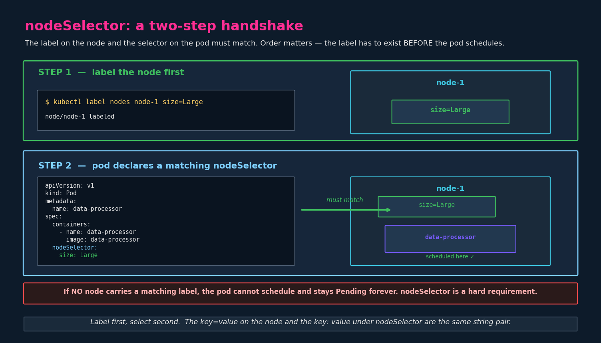
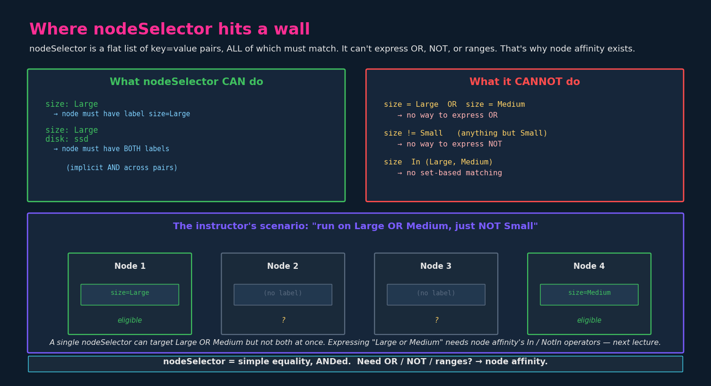

# Node Selectors

## 1. The problem

Setup: a 3-node cluster where two nodes are small (limited CPU/memory)
and one node is large. You have compute-intensive data-processing
workloads that need the big node, and lighter workloads that can run
anywhere.

By default, **the scheduler treats all nodes as equal candidates** — it
places pods based on available resources and other constraints, but it
has no idea that "this node is the big one, send the heavy jobs here."
A heavy data-processing pod could land on a small node and exhaust its
resources.

> **From the resource-limits chapter (`08-resource-requirements.md`):**
> this is the flip side of requests/limits. Requests tell the scheduler
> *how much* a pod needs; node selectors tell it *which specific node*
> to use. You'd often combine them — a high memory request plus a
> nodeSelector pinning the pod to the big node.

We want a way to say "this pod should only run on the large node." That's
what node selectors do.

---

## 2. The mechanism: labels + nodeSelector

It's a two-part handshake, and **the order matters**:

1. **Label the node** with an arbitrary key=value pair.
2. **Add a `nodeSelector`** to the pod spec referencing that same
   key=value.

The scheduler will then only place the pod on nodes carrying the matching
label.



### Step 1 — label the node

```bash
kubectl label nodes <node-name> <label-key>=<label-value>

# Concrete: tag node-1 as the large one
kubectl label nodes node-1 size=Large
# node/node-1 labeled
```

The key/value are yours to choose — `size=Large`, `disktype=ssd`,
`gpu=true`, whatever describes the node meaningfully. There's no
predefined vocabulary (though Kubernetes does ship some built-in labels
like `kubernetes.io/hostname` and `kubernetes.io/arch` — see §6).

Verify the label landed:

```bash
kubectl get nodes --show-labels
kubectl get node node-1 -o jsonpath='{.metadata.labels}'
```

### Step 2 — select the node from the pod

```yaml
apiVersion: v1
kind: Pod
metadata:
  name: myapp-pod
spec:
  containers:
    - name: data-processor
      image: data-processor
  nodeSelector:
    size: Large      # ← matches the node's size=Large label
```

`nodeSelector` is a map under `spec` (a sibling of `containers:`, not
inside it). Each key:value pair must match a label on the target node.

```bash
kubectl create -f pod-definition.yaml
# Pod is scheduled onto node-1, the only node with size=Large.
```

---

## 3. The ordering trap

**The label must exist on a node before the pod tries to schedule.** This
is the single most common mistake and a favorite exam trick.

If you apply a pod with `nodeSelector: {size: Large}` but no node carries
`size=Large`, the scheduler can't find a home for the pod and it sits in
**`Pending`** indefinitely. It will not error, it will not fall back to
another node — `nodeSelector` is a **hard requirement**.

```bash
kubectl get pod myapp-pod
# NAME         READY   STATUS    RESTARTS   AGE
# myapp-pod    0/1     Pending   0          30s

kubectl describe pod myapp-pod
# Events:
#   Warning  FailedScheduling  ...  0/3 nodes are available:
#   3 node(s) didn't match Pod's node affinity/selector.
```

That `FailedScheduling` / "didn't match node affinity/selector" event is
the tell. When you see a `Pending` pod on the exam, `kubectl describe pod`
and check the Events — a nodeSelector mismatch is a common cause.

The fix is either to label a node or to remove/correct the selector.

---

## 4. Works on Pods, Deployments, anything with a pod template

`nodeSelector` is a field of the **PodSpec** — so it works anywhere a pod
template appears:

```yaml
# In a Deployment, it goes under spec.template.spec
apiVersion: apps/v1
kind: Deployment
metadata:
  name: data-processor
spec:
  replicas: 3
  selector:
    matchLabels:
      app: data-processor
  template:
    metadata:
      labels:
        app: data-processor
    spec:
      nodeSelector:          # ← pod-template level, sibling of containers
        size: Large
      containers:
        - name: data-processor
          image: data-processor
```

Same nesting lesson as `serviceAccountName` and `volumeMounts` from the
earlier chapters: pod-level fields live under `spec.template.spec` in a
Deployment, not at the top-level Deployment `spec`.

---

## 5. Multiple labels = implicit AND

If you list more than one key:value under `nodeSelector`, **all of them
must match** — it's an implicit AND:

```yaml
nodeSelector:
  size: Large
  disktype: ssd
# Pod schedules only on nodes that have BOTH size=Large AND disktype=ssd
```

There is no OR, no NOT, no "one of these." That limitation is the whole
motivation for the next chapter — see §7.

---

## 6. A note on built-in node labels

Kubernetes auto-applies some labels to every node. You can select on
these without labeling anything yourself:

| Label                          | Example value     | Meaning                  |
|--------------------------------|-------------------|--------------------------|
| `kubernetes.io/hostname`       | `node-1`          | The node's hostname      |
| `kubernetes.io/arch`           | `amd64`, `arm64`  | CPU architecture         |
| `kubernetes.io/os`             | `linux`, `windows`| Operating system         |
| `node.kubernetes.io/instance-type` | `m5.large`    | Cloud instance type      |
| `topology.kubernetes.io/zone`  | `us-east-1a`      | Cloud availability zone  |

Selecting on `kubernetes.io/arch: arm64` to keep a pod on ARM nodes, for
instance, needs no manual labeling. Useful to know exists; you mostly
create your own labels for CKAD scenarios.

---

## 7. Limitations — and why node affinity is next

`nodeSelector` is intentionally simple: a flat map of key=value pairs,
all ANDed together, exact-match only. That simplicity is also its ceiling.



Example: suppose you want a pod to run on a node that is **Large OR
Medium** — basically "anything that isn't Small." `nodeSelector` cannot
express this:

- **No OR.** `nodeSelector` can target `size: Large` or `size: Medium`,
  but not "Large or Medium."
- **No NOT.** Can't say "anything except Small."
- **No set/range matching.** Can't say "size in (Large, Medium)."

To express any of those, you need **node affinity** (next chapter), which
introduces operators like `In`, `NotIn`, `Exists`, `DoesNotExist` and the
distinction between *required* and *preferred* rules. Node affinity is a
superset of node selector — anything `nodeSelector` does, node affinity
can do, plus the expressive cases above.

Mental bridge to carry into the next lecture:

```
nodeSelector  →  simple equality, ANDed, hard requirement
node affinity →  In / NotIn / Exists operators,
                 required OR preferred rules,
                 everything nodeSelector can do and more
```

---

## 8. Node selectors vs taints/tolerations (don't confuse them)

This pairs with diagram 21 from the taints chapter. Quick reinforcement
because the exam likes to mix them:

| | Taints/Tolerations | Node Selector / Affinity |
|---|---|---|
| Set on | the **node** (taint) + **pod** (toleration) | the **node** (label) + **pod** (selector) |
| Direction | **repel** — keep pods off | **attract** — pull pods toward |
| Question | "who is *allowed* here?" | "where does this pod *want* to go?" |
| Pod with no rule | runs anywhere untainted | runs anywhere |

The classic "dedicate a node" pattern uses **both**: taint the node so
nothing else lands there, and label it + select it so your target pod
goes there. Either alone is incomplete (covered in chapter 10 §4).

---

## 9. Imperative shortcuts

```bash
# Label a node
kubectl label nodes node-1 size=Large

# Overwrite an existing label
kubectl label nodes node-1 size=Medium --overwrite

# Remove a label (trailing minus, like taints)
kubectl label nodes node-1 size-

# See node labels
kubectl get nodes --show-labels
kubectl get node node-1 -o jsonpath='{.metadata.labels}'

# Find nodes by label
kubectl get nodes -l size=Large
kubectl get nodes -l 'size in (Large,Medium)'   # selector syntax on the CLI

# Generate a pod, then add nodeSelector by hand (no direct flag)
kubectl run myapp --image=nginx $do > pod.yaml
# edit: add nodeSelector: { size: Large } under spec:
```

Note the symmetry with taints: remove a label with a trailing `-`
(`size-`), just like removing a taint (`key=value:effect-`). No
imperative flag adds a `nodeSelector` to generated YAML — it's always a
manual edit, so practice the `$do` → edit flow.

## References

- [Assigning Pods to Nodes](https://kubernetes.io/docs/concepts/scheduling-eviction/assign-pod-node/) — `nodeSelector`, node labels, and how affinity extends it (the OR/NOT limitation in §7).
- [Well-Known Labels, Annotations and Taints](https://kubernetes.io/docs/reference/labels-annotations-taints/) — the built-in node labels (`kubernetes.io/hostname`, `kubernetes.io/arch`, `topology.kubernetes.io/zone`) covered in §6.
