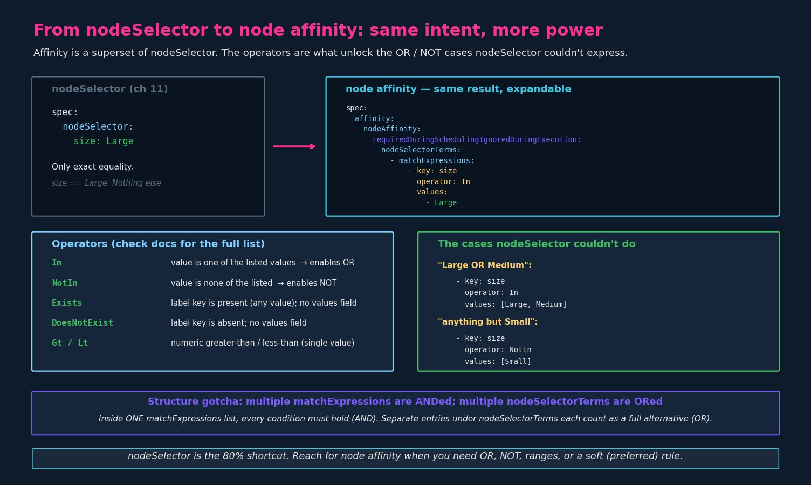
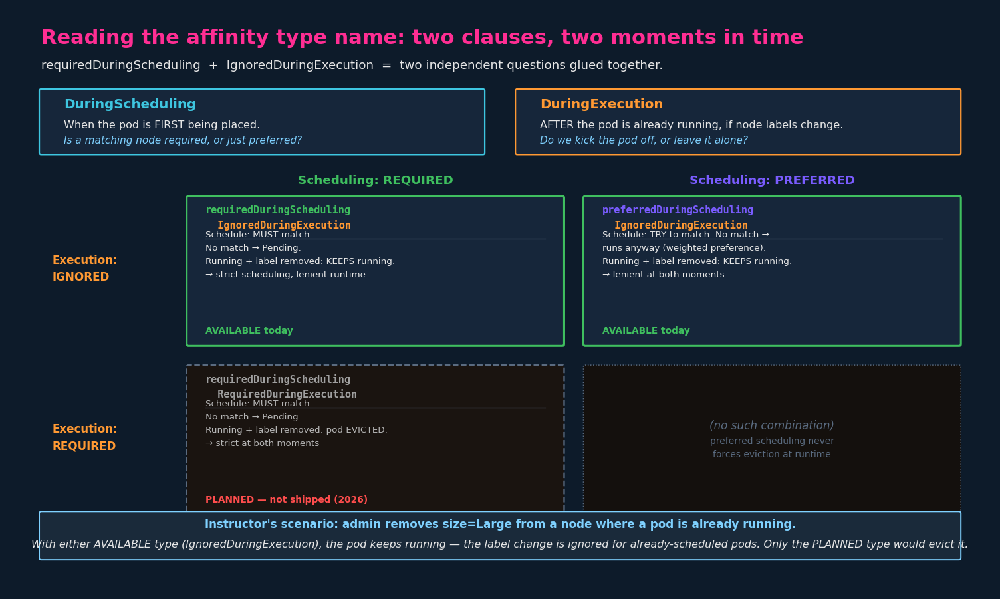

# Node Affinity

## 1. Why node affinity exists

Same goal as node selectors: **ensure pods land on particular nodes.**
The difference is expressiveness. `nodeSelector` is a flat set of
key=value pairs, all ANDed, exact-match only — it cannot express:

- **OR** — "Large or Medium"
- **NOT** — "anything except Small"
- **ranges** — "more than 4 cores"
- **soft preferences** — "prefer this, but run anyway if you can't"

Node affinity adds all of that. The cost is more configuration: where
`nodeSelector` is two indented lines, node affinity is a nested block
with operators and rule types. It's more complex and more verbose, but
it's a true superset.



---

## 2. The structure

Node affinity lives under `spec.affinity.nodeAffinity`. Here's the
equivalent of `nodeSelector: {size: Large}` written as affinity:

```yaml
apiVersion: v1
kind: Pod
metadata:
  name: myapp-pod
spec:
  containers:
    - name: data-processor
      image: data-processor
  affinity:
    nodeAffinity:
      requiredDuringSchedulingIgnoredDuringExecution:
        nodeSelectorTerms:
          - matchExpressions:
              - key: size
                operator: In
                values:
                  - Large
```

Walk the nesting top-down, because the depth is where mistakes happen:

- `affinity:` — the parent block (also houses `podAffinity` and
  `podAntiAffinity`, later chapters).
- `nodeAffinity:` — node-targeting rules.
- `requiredDuringSchedulingIgnoredDuringExecution:` — the rule **type**
  (see §4). This is the long one people fumble.
- `nodeSelectorTerms:` — a **list** of terms. Multiple terms are ORed.
- `matchExpressions:` — a **list** of conditions within a term. Multiple
  expressions are ANDed.
- Each expression has `key`, `operator`, and (for most operators)
  `values` (a list).

The key/value still reference a label you put on the node first — the
labeling step from chapter 11 is unchanged:

```bash
kubectl label nodes node-1 size=Large
```

---

## 3. Operators

The `operator` is what gives affinity its power. The full list:

| Operator       | Meaning                                              | `values`?   |
|----------------|------------------------------------------------------|-------------|
| `In`           | label value is one of the listed values              | required    |
| `NotIn`        | label value is none of the listed values             | required    |
| `Exists`       | label key is present (value irrelevant)              | omit        |
| `DoesNotExist` | label key is absent                                  | omit        |
| `Gt`           | label value greater than (numeric, single value)     | one value   |
| `Lt`           | label value less than (numeric, single value)        | one value   |

The two that solve the motivating examples:

```yaml
# "Large OR Medium" — In with multiple values
- key: size
  operator: In
  values:
    - Large
    - Medium

# "anything but Small" — NotIn
- key: size
  operator: NotIn
  values:
    - Small

# "has a 'size' label at all, whatever it is" — Exists, no values
- key: size
  operator: Exists
```

`NotIn` and `DoesNotExist` are also how you build **node anti-affinity**
— there's no separate `nodeAntiAffinity` object (unlike pods, which do
have `podAntiAffinity`). For nodes, you express "stay away from" with a
negative operator.

---

## 4. Affinity types: DuringScheduling × DuringExecution

This is the part worth slowing down on. The long type names look
intimidating but they're just **two independent questions glued
together**:

- **DuringScheduling** — what happens when the pod is *first being
  placed*? Is a matching node `required`, or merely `preferred`?
- **DuringExecution** — what happens *after* the pod is already running,
  if the node's labels later change? `Ignored` (leave the pod alone) or
  `Required` (evict it)?



### The two types available today

**`requiredDuringSchedulingIgnoredDuringExecution`**
- Scheduling: a matching node is **mandatory**. No match → pod stays
  `Pending` (exactly like nodeSelector's hard behavior).
- Execution: if labels change after the pod is running, it's **ignored**
  — the pod keeps running.
- This is your default choice and the most common on the exam.

**`preferredDuringSchedulingIgnoredDuringExecution`**
- Scheduling: the scheduler **tries** to find a matching node, but if
  none is available, it schedules the pod **anyway** (on a best-effort,
  weighted basis). The pod will not be left `Pending` just because the
  preference can't be satisfied.
- Execution: same as above — label changes mid-run are ignored.
- Use when placement is a nice-to-have, not a hard requirement.

> **The DuringScheduling distinction maps directly onto node selectors:**
> `required` behaves like `nodeSelector` (no match → Pending).
> `preferred` is the softer option that has no nodeSelector equivalent —
> it lets the pod run somewhere even if the ideal node isn't available.

The `preferred` type also takes a **weight** (1–100), letting you rank
multiple soft preferences:

```yaml
affinity:
  nodeAffinity:
    preferredDuringSchedulingIgnoredDuringExecution:
      - weight: 1
        preference:
          matchExpressions:
            - key: size
              operator: In
              values:
                - Large
```

(Note the shape differs slightly from `required`: `preferred` is a list
of `{weight, preference}` objects, not `nodeSelectorTerms`. The exam
rarely makes you write the `preferred` form from scratch, but recognise it.)

### IgnoredDuringExecution — what it actually means

`IgnoredDuringExecution` is about **what happens to an already-running
pod when the cluster changes underneath it.**

Scenario: a pod is running on a node labeled `size=Large`. An admin runs
`kubectl label nodes node-1 size-` (removes the label) or changes it to
`size=Small`. The pod's affinity rule no longer matches the node it's on.
**What happens to the running pod?**

With both currently-available types (`...IgnoredDuringExecution`), the
answer is: **nothing.** The label change is *ignored* for pods that are
already scheduled and running. The affinity rule is only consulted at
*scheduling time*. Once a pod is placed, it stays put regardless of later
label changes.

The official docs put it the same way: <cite index="4-1">"IgnoredDuringExecution" means that the pod will still run if labels on a node change and affinity rules are no longer met.</cite>

### The "planned" type — RequiredDuringExecution

A third type is proposed but **as of 2026 has not shipped.** The proposed
`requiredDuringSchedulingRequiredDuringExecution` would add eviction:
<cite index="4-1">There are future plans to offer requiredDuringSchedulingRequiredDuringExecution which will evict pods from nodes as soon as they don't satisfy the node affinity rule(s).</cite>

So under the *planned* type, removing the `size=Large` label from a node
would cause Kubernetes to evict any running pod that required it. That
behavior does not exist yet — only the two `IgnoredDuringExecution`
variants are real. Don't expect `RequiredDuringExecution` on the CKAD
exam; just know the naming pattern and that it's the eviction-on-change
variant.

> **Sidebar — this isn't the only eviction mechanism.** The
> `NoExecute` taint effect (chapter 10) *does* evict already-running
> pods that don't tolerate a newly-added taint. So Kubernetes has a
> runtime-eviction story on the *taint* side already — it's the
> *affinity* side that's still scheduling-time-only. Different
> mechanism, similar end effect. Don't conflate them: taints evict on a
> new taint; affinity (today) never evicts.

---

## 5. Required vs preferred — choosing

A practical rule:

- **`required`** when the workload genuinely cannot run correctly
  elsewhere (needs the GPU, needs the licensed node, compliance pins it
  to a zone). Accept that it may stay `Pending` if no node qualifies.
- **`preferred`** when you'd like the placement but running somewhere
  beats not running at all — if it's more important that the job runs,
  use `preferred`.

The data-processing example argues for `required` (you don't want a heavy
job on a small node), but the "must run" framing is where `preferred`
earns its place.

---

## 6. Diagnosing affinity problems

Same playbook as nodeSelector — a `required` rule with no matching node
leaves the pod `Pending`:

```bash
kubectl get pod myapp-pod
# NAME         READY   STATUS    RESTARTS   AGE
# myapp-pod    0/1     Pending   0          20s

kubectl describe pod myapp-pod
# Events:
#   Warning  FailedScheduling  ...  0/3 nodes are available:
#   3 node(s) didn't match Pod's node affinity/selector.
```

That `didn't match Pod's node affinity/selector` message covers both
nodeSelector and node affinity — they share the scheduler code path. If
you see it: check that a node actually carries the label, and that your
`operator`/`values` express what you think they do.

---

## 7. nodeSelector vs node affinity — when to use which

| | nodeSelector | node affinity |
|---|---|---|
| Syntax | 2 lines, flat map | nested block with operators |
| Matching | exact equality only | In, NotIn, Exists, Gt, Lt, ... |
| Logic | AND only | AND (within term) + OR (across terms) |
| Hard/soft | hard only | hard (`required`) or soft (`preferred`) |
| Runtime label change | n/a (scheduling only) | ignored (today) |

Practical guidance: reach for `nodeSelector` first — it's faster to type
and covers the simple "pin to a labeled node" case, which is most of
them. Switch to node affinity the moment you need OR/NOT/ranges or a soft
preference. They can coexist on the same pod (both must be satisfied),
though you rarely need both.

---

## 8. Structure gotchas (exam)

- **`nodeSelectorTerms` is a list; `matchExpressions` is a list.** Two
  levels of list nesting is the #1 YAML mistake here. Each
  `- matchExpressions:` is an item under `nodeSelectorTerms`.
- **Multiple `matchExpressions` within one term = AND.** All conditions
  must hold.
- **Multiple `nodeSelectorTerms` = OR.** Each term is a full alternative;
  satisfying any one is enough.
- **`Exists`/`DoesNotExist` take no `values`.** Including a `values`
  field with them is malformed.
- **`values` is always a list**, even for a single value (`values:
  [Large]` or a `- Large` item). Not `value: Large`.
- **It's `requiredDuringSchedulingIgnoredDuringExecution`** — the exact
  string. The docs page (kubernetes.io → "Assigning Pods to Nodes") is
  open during the exam; copy it from there rather than typing from memory.
- **`preferred` has a different shape** (`weight` + `preference`) than
  `required` (`nodeSelectorTerms`). Don't mix them up.

---

## 9. Imperative shortcuts

There's **no imperative way** to add affinity — it's always a YAML edit.
The flow on the exam:

```bash
# Label the target node(s) first
kubectl label nodes node-1 size=Large

# Generate a pod skeleton, then hand-edit the affinity block
kubectl run myapp --image=nginx $do > pod.yaml
# open pod.yaml, add the spec.affinity.nodeAffinity block

# Verify nodes have the labels you expect
kubectl get nodes -l size=Large
kubectl get nodes --show-labels

# After applying, confirm placement
kubectl get pod myapp -o wide        # shows which NODE it landed on
```

Because the structure is fiddly and there's no generator, the single
biggest time-saver is the docs page — pull the `requiredDuring...`
example and edit it rather than typing the nesting from scratch.
