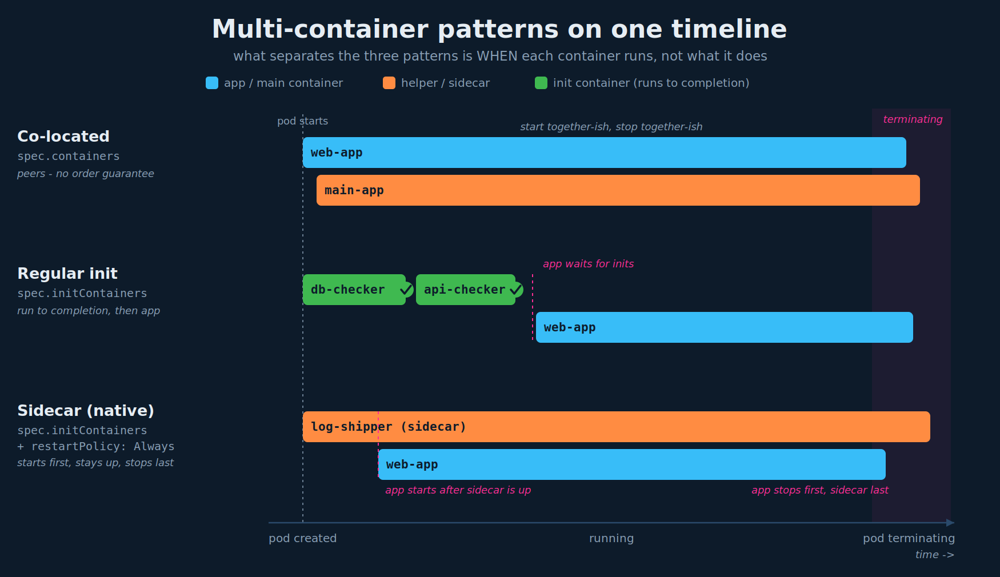
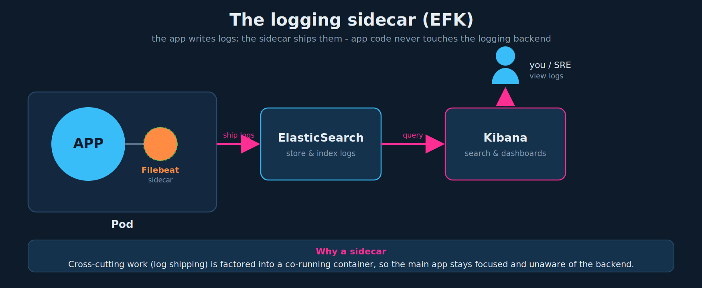

# Multi-Container Pods: Design Patterns

## 1. Three patterns, one question: *when* does each container run?

Three ways containers can be combined in a single pod. The only thing that really separates them is the **lifecycle relationship** between the helper container(s) and the main app:

| Pattern | Defined under | When the helper runs | Lives for the pod's life? |
|---|---|---|---|
| **Co-located** | `spec.containers` | alongside the app, no ordering guarantee | yes |
| **Regular init** | `spec.initContainers` | *before* the app, runs to completion, then exits | no (it finishes and is gone) |
| **Sidecar (native)** | `spec.initContainers` + `restartPolicy: Always` | starts *before* the app, then keeps running alongside it | yes |

Keep that table in your head; everything below is detail. The diagram below is the single mental model for the whole lecture: it plots all three patterns on one timeline so you can *see* the ordering differences.



## 2. Co-located containers

Multiple containers listed under `spec.containers`. They are peers: all are "app" containers, all start when the pod starts, and all run for the pod's lifetime. This is exactly the multi-container pod from chapter 01.

```yaml
apiVersion: v1
kind: Pod
metadata:
  name: simple-webapp
  labels:
    name: simple-webapp
spec:
  containers:
    - name: web-app
      image: web-app
      ports:
        - containerPort: 8080
    - name: main-app          # second peer container, same spec.containers list
      image: main-app
```

Characteristics:

- **No guaranteed start order.** The kubelet starts both; you cannot assume `web-app` is up before `main-app` (or vice versa).
- **No guaranteed shutdown order.** On termination they are stopped without a defined sequence.
- Both must keep running for the pod to stay healthy; both count toward readiness.

This is the *traditional* way people ran "sidecars" before native sidecars existed. It works, but the lack of ordering and the shutdown behavior cause real problems, which is exactly what the sidecar pattern in section 4 fixes.

## 3. Regular init containers

Containers listed under `spec.initContainers`. They run **one at a time, in order, to completion, before any app container starts**. Use them for prerequisite/setup work: wait for a dependency to be reachable, run a schema migration, clone a git repo into a shared volume, fix file permissions.

```yaml
apiVersion: v1
kind: Pod
metadata:
  name: simple-webapp
  labels:
    name: simple-webapp
spec:
  containers:
    - name: web-app
      image: web-app
      ports:
        - containerPort: 8080
  initContainers:                                # sibling of spec.containers
    - name: db-checker
      image: busybox
      command: ['wait-for-db-to-start.sh']       # command MUST be a YAML list (see gotchas)
    - name: api-checker
      image: busybox
      command: ['wait-for-another-api.sh']
```

Mechanics you must know for the exam:

- **Sequential, to completion.** `db-checker` runs and must exit 0, *then* `api-checker` runs and must exit 0, *then* the app containers (`web-app`) start. The app waits for all of them.
- **Failure handling.** If an init container fails, the kubelet restarts it according to the pod's `restartPolicy` until it succeeds (if `restartPolicy: Never`, the pod fails). The pod stays in an `Init:...` state and the app never starts.
- **Different image is fine and common.** Init containers often use a tooling image (`busybox`, `curl`, etc.) distinct from the app image.
- **They are not services.** An init container that never exits will block the pod forever - it must complete. (A long-running helper belongs in section 4, not here.)
- **Pod status** walks through `Init:0/2` -> `Init:1/2` -> `PodInitializing` -> `Running`. A bad init container shows `Init:Error` or `Init:CrashLoopBackOff`.

## 4. Sidecar containers (native)

A sidecar is a helper that must run **alongside** the app for the pod's whole life (log shipper, metrics exporter, service-mesh proxy, config reloader). The native sidecar is declared as an **init container with `restartPolicy: Always`** on that container.

```yaml
apiVersion: v1
kind: Pod
metadata:
  name: simple-webapp
  labels:
    name: simple-webapp
spec:
  containers:
    - name: web-app
      image: web-app
      ports:
        - containerPort: 8080
  initContainers:
    - name: log-shipper
      image: busybox
      command: ['setup-log-shipper.sh']
      restartPolicy: Always     # THIS turns an init container into a sidecar
```

That one field changes the lifecycle completely:

- **Starts before the app, in init order** - so the app can rely on the sidecar (proxy, logging) already being up.
- **Keeps running** instead of running to completion, because `restartPolicy: Always` overrides the normal init "run once and exit" behavior.
- **Shuts down after the app containers** during termination, so it can flush/forward whatever the app produced on the way down.
- **Does not block Job completion.** In a `Job`, a sidecar in `spec.containers` (co-located) would keep the pod from ever completing because it never exits; a native sidecar is understood by Kubernetes to not count, so the Job can finish.
- Native sidecars are stable as of Kubernetes **1.29** (the `restartPolicy` field on an init container). On older clusters you fall back to co-locating the helper in `spec.containers`.

## 5. Co-located vs sidecar - the distinction to nail

Both end up with two containers running for the pod's life, so on the surface they look identical. The difference is **ordering and termination guarantees**, and it is the most likely thing to be probed:

| | Co-located (`spec.containers`) | Native sidecar (`spec.initContainers` + `restartPolicy: Always`) |
|---|---|---|
| Declared under | `spec.containers` | `spec.initContainers` |
| Starts before the main app? | No guarantee | Yes - app waits for the sidecar to start |
| Runs for the pod's life? | Yes | Yes |
| Shutdown order | No guarantee | Sidecar stops *after* the main containers |
| Blocks a Job from completing? | Yes (never-exiting helper hangs the Job) | No |
| Restart if it crashes | Per pod `restartPolicy` | Always restarted |

One-line rule: **if a helper must run alongside the app but needs to start first and shut down last (or lives in a Job), use a native sidecar; if order genuinely does not matter, plain co-location is fine.** What is loosely called a "sidecar" in everyday usage is often really the co-located form - the native sidecar is the construct that earns the name's guarantees.

## 6. Real-world: the logging sidecar (EFK)

A logging pipeline: the app writes logs; a **Filebeat sidecar** in the same pod tails those logs off a shared volume and ships them to **ElasticSearch**, where **Kibana** queries and visualizes them. The application code knows nothing about the logging backend - the sidecar owns that concern.



This is the canonical "why sidecars exist" story: cross-cutting work (log shipping, TLS termination, metrics) is factored into a co-running container so the main app stays focused and unaware.

## 7. Exam-pattern gotchas

- **`command` is a YAML list, not a string.** A bare string like `command: 'wait-for-db-to-start.sh'` fails schema validation. Real YAML needs a list: `command: ['wait-for-db-to-start.sh']` or `command: ["sh", "-c", "..."]`.
- **`initContainers` is a sibling of `containers`**, both directly under `spec`. Putting it inside `containers` (or mis-indenting it) is a classic failure.
- **Container-level `restartPolicy` vs pod-level.** The `restartPolicy: Always` that defines a sidecar sits *inside an init container entry*. It is a different field from `spec.restartPolicy` (the pod-wide one). Only `Always` is meaningful for a sidecar.
- **Native sidecars need a recent cluster (1.29+).** If `restartPolicy` on an init container is rejected, the cluster is too old - use co-location instead.
- **A regular init container must exit.** If you give an init container a long-running command, the pod is stuck in `Init:` forever. That is the tell that you actually wanted a sidecar.
- **Debugging targets a specific container.** Init and sidecar logs need `-c`: `kubectl logs <pod> -c db-checker`. `kubectl describe pod` shows a dedicated **Init Containers** section with per-container state and restart counts.
- **Readiness.** The app is not reachable until init containers complete; a crash-looping init container keeps the whole pod out of service.

## 8. Imperative shortcuts

There is no imperative flag for init or sidecar containers - scaffold a single-container pod, then hand-edit the YAML:

```bash
# scaffold ($do = --dry-run=client -o yaml), then add initContainers: by hand
kubectl run simple-webapp --image=web-app --port=8080 $do > pod.yaml
# edit pod.yaml: add a sibling "initContainers:" block under spec, then:
kubectl apply -f pod.yaml
```

Debug / inspect commands worth keeping in the command reference:

```bash
kubectl get pod <pod>                       # watch the Init:0/2 -> Running progression
kubectl describe pod <pod>                  # "Init Containers" section: state + restarts
kubectl logs <pod> -c db-checker            # logs from a specific init container
kubectl logs <pod> -c log-shipper           # logs from the sidecar
kubectl explain pod.spec.initContainers     # recall the field path under exam pressure
```

## References

- [Sidecar Containers](https://kubernetes.io/docs/concepts/workloads/pods/sidecar-containers/) — native sidecar pattern (init container + `restartPolicy: Always`), start/stop ordering, Job behavior
- [Init Containers](https://kubernetes.io/docs/concepts/workloads/pods/init-containers/) — sequential run-to-completion init containers and pod status progression
- [Pods](https://kubernetes.io/docs/concepts/workloads/pods/) — co-located containers and the shared Pod context
