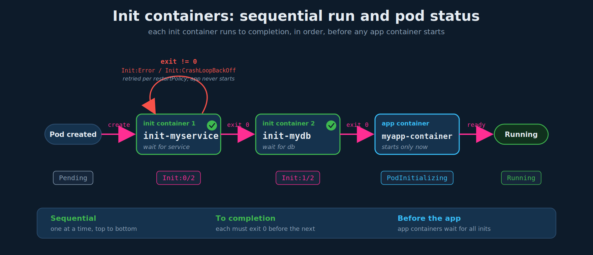

# Init Containers

## 1. The motivation

Two kinds of process:

- **Long-running, stays alive for the pod's life.** In a multi-container pod, each container normally runs a process expected to stay alive as long as the pod does - the web app and its logging agent both stay up, and if any container fails the pod restarts it. This is the ordinary `spec.containers` case.
- **Run-to-completion, runs once and exits.** Sometimes you want a process that does a job and finishes: pull code or a binary from a repository that the main app will use (a one-time setup at pod creation), or wait for an external service or database to be reachable before the app starts. That is what `initContainers` is for.

An init container is configured exactly like any other container, except it lives under a separate `initContainers` section of the pod spec.

## 2. Single init container

A one-time `git clone` of a repo the app will use:

```yaml
apiVersion: v1
kind: Pod
metadata:
  name: myapp-pod
  labels:
    app: myapp
spec:
  containers:
  - name: myapp-container
    image: busybox:1.28
    command: ['sh', '-c', 'echo The app is running! && sleep 3600']
  initContainers:                                  # sibling of spec.containers
  - name: init-myservice
    image: busybox
    command: ['sh', '-c', 'git clone <some-repository-that-will-be-used-by-application> ;']
```

- When the pod is first created, the init container runs, and its process **must run to completion (exit 0)** before the real application container starts.
- The app container does not start until the init work is done.

## 3. Multiple init containers

Wait for two dependencies to resolve in DNS before starting the app:

```yaml
apiVersion: v1
kind: Pod
metadata:
  name: myapp-pod
  labels:
    app: myapp
spec:
  containers:
  - name: myapp-container
    image: busybox:1.28
    command: ['sh', '-c', 'echo The app is running! && sleep 3600']
  initContainers:
  - name: init-myservice
    image: busybox:1.28
    command: ['sh', '-c', 'until nslookup myservice; do echo waiting for myservice; sleep 2; done;']
  - name: init-mydb
    image: busybox:1.28
    command: ['sh', '-c', 'until nslookup mydb; do echo waiting for mydb; sleep 2; done;']
```

- You can configure multiple init containers. Each runs **one at a time, in sequential order** (top to bottom).
- If any init container fails to complete, Kubernetes **restarts the pod repeatedly until that init container succeeds**.

Reference: `https://kubernetes.io/docs/concepts/workloads/pods/init-containers/`

## 4. How it actually sequences

The sequence is observable through pod status, which is exam-relevant when a pod is stuck:



- `init-myservice` runs to completion, **then** `init-mydb` runs to completion, **then** all app containers start in parallel. App containers never start early.
- Pod status walks through `Init:0/2` -> `Init:1/2` -> `PodInitializing` -> `Running`. The `N/M` is "init containers completed / total".
- A failing init container shows `Init:Error` or `Init:CrashLoopBackOff`, and the pod is stuck there - the app never starts.

Precision on "restarts the pod until the init container succeeds": that is true **only for the default `restartPolicy: Always` (and `OnFailure`)**. With `restartPolicy: Never`, a failed init container puts the whole pod into `Failed` and it is **not** retried. Know which restart policy you are under.

Other things worth knowing for the exam:

- **Init containers do not support liveness/readiness/startup probes.** Probes assume a long-running process; an init container must exit, so probes are not allowed on them.
- **An init container that never exits hangs the pod forever.** If you find yourself wanting a helper that keeps running, you want a sidecar (init container + `restartPolicy: Always`), not a plain init container - see `02-design-patterns.md`.
- **Different image is normal.** Init containers typically use a small tooling image (`busybox`, `curl`, etc.) distinct from the app image.
- **Resource accounting (corner case):** the pod's effective request/limit is `max(largest single init container, sum of app containers)`, because init containers run sequentially and not at the same time as the app. Rarely tested, but it explains scheduling surprises.

## 5. Why `busybox:1.28` specifically

Pin `busybox:1.28` rather than `busybox:latest`: `nslookup` in newer busybox images changed behavior and can fail or print differently inside clusters, which breaks the `until nslookup ...` wait pattern. `1.28` is the version the upstream Kubernetes docs use for exactly this example. Takeaway: pin image tags - `:latest` is a reproducibility and exam-time hazard.

## 6. Common real uses

- **Wait for a dependency** (the `until nslookup ...; sleep` pattern above) - block the app until a Service or DB is resolvable.
- **Fetch/prepare data** - clone a repo, download a binary or config, into a volume the app then reads (pairs with the shared-volume idea from chapter 01).
- **Run a one-time setup** - a schema migration or a `chown`/`chmod` to fix permissions on a mounted volume before the app uses it.

## 7. Exam-pattern gotchas

- **`initContainers` is a sibling of `containers`**, both directly under `spec` at the same indentation. Nesting it inside `containers` or mis-indenting it is the classic failure (and the usual source of "did not find expected key" parse errors).
- **`command` must be a YAML list** - `['sh', '-c', '...']`, not a bare string. The instructor's examples already use the list form; keep it that way.
- **Order matters and is literal** - init containers run in the order written, top to bottom. If `init-mydb` must run before `init-myservice`, reorder the list.
- **They must exit.** A long-running command in an init container leaves the pod stuck in `Init:` indefinitely. That is the tell you actually wanted a sidecar.
- **Debugging targets the specific container** with `-c`: `kubectl logs myapp-pod -c init-myservice`.
- **Reading status:** `Init:1/2` means one of two init containers finished; `Init:CrashLoopBackOff` means an init container keeps failing. `kubectl describe pod` has a dedicated **Init Containers** section with state, exit code, and restart count.

## 8. Imperative shortcuts

No imperative flag creates init containers - scaffold a single-container pod, then hand-edit the YAML to add the `initContainers` block:

```bash
# scaffold ($do = --dry-run=client -o yaml), then add an initContainers: block under spec
kubectl run myapp-pod --image=busybox:1.28 $do > pod.yaml
# edit pod.yaml, then:
kubectl apply -f pod.yaml --dry-run=client     # validate YAML BEFORE applying for real
kubectl apply -f pod.yaml
```

Debug / inspect commands for the command reference:

```bash
kubectl get pod myapp-pod -w                   # watch Init:0/2 -> Init:1/2 -> Running
kubectl logs myapp-pod -c init-myservice       # logs from a specific init container
kubectl describe pod myapp-pod                 # "Init Containers" section: state + exit code + restarts
kubectl explain pod.spec.initContainers        # recall the field path under exam pressure
```

## References

- [Init Containers](https://kubernetes.io/docs/concepts/workloads/pods/init-containers/) — full behavior: sequential ordering, run-to-completion, failure/restart, resource accounting
- [Sidecar Containers](https://kubernetes.io/docs/concepts/workloads/pods/sidecar-containers/) — when a long-running helper needs `restartPolicy: Always` instead of a plain init container
- [Pod Lifecycle](https://kubernetes.io/docs/concepts/workloads/pods/pod-lifecycle/) — how init containers fit the pod lifecycle and `Initialized` condition
