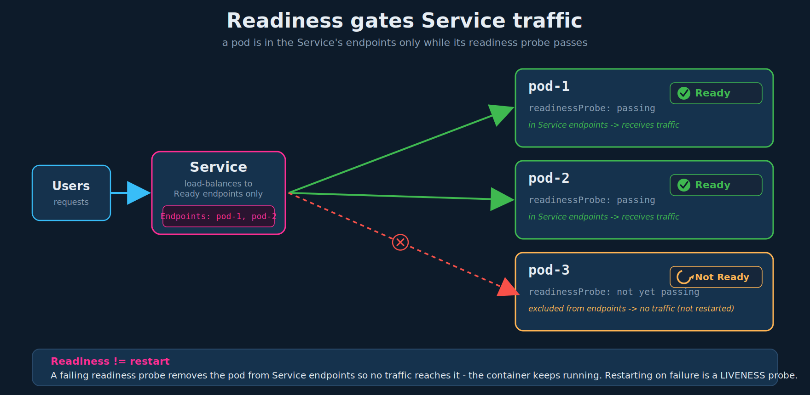

# Pod Status, Conditions, and Readiness Probes

## 1. Pod status (phase) - where the pod is in its lifecycle

A pod's status tells you where it is in its lifecycle:

- **Pending** - the scheduler is finding a node to place the pod on. The pod sits here until it is scheduled.
- **ContainerCreating** - once scheduled, images are pulled and containers are started.
- **Running** - all containers have started; the pod stays here until the program completes or is terminated.

Precision: the actual `pod.status.phase` field has only five values - `Pending`, `Running`, `Succeeded`, `Failed`, `Unknown`. `ContainerCreating` is **not** a phase; it is the reason shown in the `STATUS` column of `kubectl get pods`, derived from a container's "waiting" state. While images pull, the phase is still `Pending`. `Succeeded`/`Failed` matter for run-to-completion pods (Jobs). So the three "statuses" are really `Pending` (covering both scheduling and image pull) -> `Running`, with `ContainerCreating` being the human-readable reason in between.

## 2. Pod conditions - complementing status

Conditions are a set of booleans (`True`/`False`) that complement the phase, each describing one aspect of pod readiness. View them with `kubectl describe pod <pod>` (the **Conditions** section).

| Condition | `True` when |
|---|---|
| `PodScheduled` | the pod has been assigned to a node |
| `Initialized` | all init containers have completed successfully (ties to chapter 03 of the previous section) |
| `ContainersReady` | all containers in the pod report ready |
| `Ready` | the pod can serve requests and is eligible to be added to the endpoints of matching Services |

```bash
kubectl describe pod simple-webapp        # Conditions: section lists the four above
kubectl get pod simple-webapp             # READY column (e.g. 1/1) = containers ready / total
```

This lecture focuses on the **`Ready`** condition.

## 3. The problem: "Ready" does not always mean ready

`Ready` is meant to signal that the application inside the pod is up and able to accept user traffic. The catch: **by default, Kubernetes considers a container ready the moment its process starts** - it has no insight into whether the app inside has finished warming up.

Example: a Jenkins server that takes a while to warm up. The container process is running, so the pod reports `Ready`, yet the Jenkins UI cannot actually serve a user for another 10-15 seconds. The status says ready; the reality says no.

Why this bites you: you deploy the app in a pod and put a **Service** in front to route user traffic to it. The Service routes based on the pod's `Ready` condition, and it will start routing the instant the pod reports ready. If the app is not truly ready, the Service sends real user requests to a pod that errors out.

## 4. The fix: readiness probes

Developers know when their app is actually ready - so you define a test (a **probe**) that Kubernetes runs against the container. Until the probe passes, the container is held **not ready**, so `Ready` stays `False` and the Service does not route to it.

Three probe mechanisms:

| Type | Field | Use case | Passes when |
|---|---|---|---|
| HTTP | `httpGet` (`path`, `port`) | web servers / APIs | HTTP response code is 200-399 |
| TCP | `tcpSocket` (`port`) | databases, brokers | a TCP connection can be opened |
| Exec | `exec` (`command`) | anything scriptable | the command exits `0` |

### HTTP probe

```yaml
apiVersion: v1
kind: Pod
metadata:
  name: simple-webapp
  labels:
    name: simple-webapp
spec:
  containers:
  - name: simple-webapp
    image: simple-webapp
    ports:
      - containerPort: 8080
    readinessProbe:
      httpGet:
        path: /api/ready
        port: 8080
```

### TCP and Exec forms

```yaml
    readinessProbe:
      tcpSocket:
        port: 3306
```

```yaml
    readinessProbe:
      exec:
        command:
          - cat
          - /app/is_ready      # command MUST be a YAML list
```

## 5. Tuning the probe

Timing fields control how patient and how strict the probe is:

```yaml
    readinessProbe:
      httpGet:
        path: /api/ready
        port: 8080
      initialDelaySeconds: 10      # wait this long before the FIRST probe
      periodSeconds: 5             # then probe every 5s
      failureThreshold: 8          # this many consecutive fails before giving up
```

Full field set and defaults:

| Field | Meaning | Default |
|---|---|---|
| `initialDelaySeconds` | delay before the first probe runs | `0` |
| `periodSeconds` | interval between probes | `10` |
| `timeoutSeconds` | how long a single probe waits before it counts as failed | `1` |
| `failureThreshold` | consecutive failures before the container is marked not ready | `3` |
| `successThreshold` | consecutive successes needed to flip back to ready | `1` |

`initialDelaySeconds` is the one you tune for slow starters like the Jenkins example - too low and the probe fails during warmup, flapping the pod in and out of the Service.

## 6. How a Service actually uses readiness

The mechanism worth internalizing:

- A pod's IP is added to the Service's **Endpoints/EndpointSlice only while the pod is `Ready`**. Not ready -> not in endpoints -> receives no traffic.
- A failing readiness probe **removes a running pod from the Service endpoints**; it does **not** restart the container. (Restarting on failure is what a *liveness* probe does - that distinction is the single most common probe mix-up, and it is the next file.)
- For multi-replica setups, this is what makes scaling and rolling updates safe: a freshly created replica is held out of rotation until its probe passes, while the existing ready replicas keep serving. No user request ever lands on a pod that is still "Creating."



## 7. Exam-pattern gotchas

- **Readiness failure does not restart anything.** It only pulls the pod out of Service endpoints. If your task says "the container should be restarted when unhealthy," that is a *liveness* probe, not readiness.
- **`exec.command` is a YAML list**, not a string - same rule as init containers and the sidecar lab.
- **`port` can be a number or a named port** (a `name:` you defined under `ports:`). Both are valid.
- **No probe = optimistically ready.** A container with no readiness probe is considered ready as soon as it starts - which is exactly the premature-traffic problem from section 3.
- **Probe lives at the container level**, under each entry in `spec.containers`, not at the pod level. In a multi-container pod each container can have its own probe, and **all** containers must be ready for `ContainersReady`/`Ready` to be `True`.
- **Tune `initialDelaySeconds` for slow apps.** A probe that starts firing before the app can answer will keep the pod out of rotation and look like a broken deployment.
- **Debugging:** `kubectl describe pod` shows the probe config and surfaces probe failures as **Events**; `kubectl get pod` `READY` column (e.g. `0/1`) tells you containers are running but not passing readiness.

## 8. Imperative shortcuts

There is no imperative flag for probes - generate the pod YAML and add the `readinessProbe` block by hand:

```bash
kubectl run simple-webapp --image=simple-webapp --port=8080 $do > pod.yaml
# add readinessProbe under the container, then validate before applying:
kubectl apply -f pod.yaml --dry-run=client
kubectl apply -f pod.yaml
```

Field-recall and debug commands for the command reference:

```bash
kubectl explain pod.spec.containers.readinessProbe          # recall the field tree
kubectl explain pod.spec.containers.readinessProbe.httpGet
kubectl get pod simple-webapp                                # READY column: 0/1 vs 1/1
kubectl describe pod simple-webapp                           # Conditions + probe failure events
```

## References

- [Configure Liveness, Readiness and Startup Probes](https://kubernetes.io/docs/tasks/configure-pod-container/configure-liveness-readiness-startup-probes/) — probe handlers, YAML, and timing fields
- [Pod Lifecycle](https://kubernetes.io/docs/concepts/workloads/pods/pod-lifecycle/) — container probes and pod conditions (`Ready`, `ContainersReady`)
