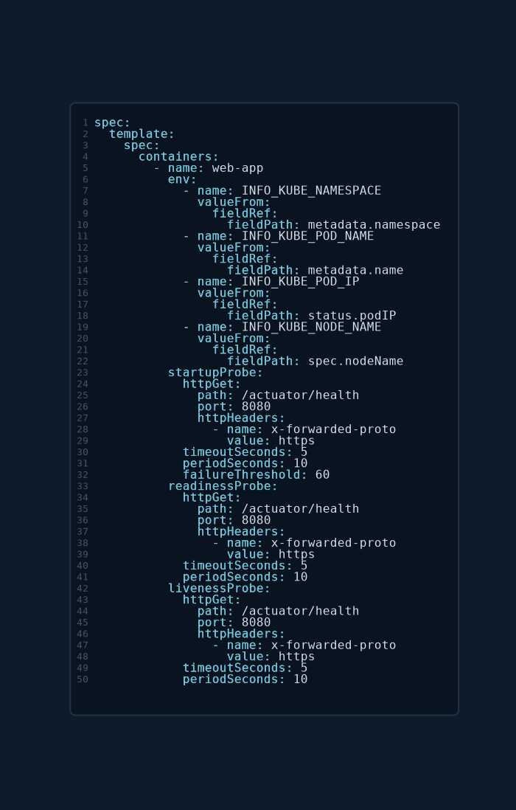

# Startup Probes

## 1. The problem it solves

Liveness probes assume the app starts reasonably fast. Slow-starting apps (JVM/Spring Boot, legacy monoliths, anything with a long warmup) break that assumption: if `initialDelaySeconds` is too small, the liveness probe fails **during startup**, the kubelet kills the container before it finishes booting, and you get a permanent restart loop (`CrashLoopBackOff`).

The old workaround was cranking `initialDelaySeconds` / `failureThreshold` on the liveness probe high enough to cover the worst-case boot. That's a bad trade: a value large enough for a cold start also makes the liveness probe **slow to react** to a real hang for the rest of the container's life.

A **startup probe** separates the two concerns. It runs **only during startup** and, while it is running, **disables the liveness and readiness probes**. Once it succeeds **once**, it never runs again and liveness/readiness take over with their own (tight) timings.

## 2. How it gates the other probes

```
container starts
   │
   ├─ startupProbe runs   (liveness + readiness are SUSPENDED)
   │     ├─ fails up to failureThreshold times → container killed & restarted
   │     └─ succeeds once  → startupProbe never runs again
   │
   └─ liveness + readiness take over for the rest of the container's life
```

- While the startup probe has not yet succeeded, a liveness failure **cannot** kill the container — that's the whole point.
- The total startup grace window is **`failureThreshold × periodSeconds`**. If the app isn't up by then, the container is killed and restarted (a genuinely stuck boot).
- After the startup probe passes, liveness can use a small `periodSeconds` / `failureThreshold` and react quickly to hangs, because it no longer has to tolerate the slow boot.

## 3. Defining a startup probe

Same three handlers (`httpGet`, `tcpSocket`, `exec`) and same YAML shape as liveness/readiness — only the key name `startupProbe` differs:

```yaml
    startupProbe:
      httpGet:
        path: /healthz
        port: 8080
      periodSeconds: 10          # probe every 10s
      failureThreshold: 30       # 30 × 10s = 300s (5 min) of startup grace
      timeoutSeconds: 5
```

| Field | Meaning | Note for startup |
|---|---|---|
| `periodSeconds` | interval between probes | with `failureThreshold`, sets the total grace window |
| `failureThreshold` | consecutive fails before killing the container | make it generous — cover worst-case cold start |
| `timeoutSeconds` | per-probe timeout | |
| `successThreshold` | consecutive successes to pass | **must be `1`** (same rule as liveness) |
| `initialDelaySeconds` | delay before first probe | usually unnecessary — that's what `failureThreshold` is for |

Rule of thumb: pick `failureThreshold × periodSeconds` ≈ the app's worst-case boot time, then let liveness/readiness run tight afterward.

## 4. Real-world example (Spring Boot Actuator)

This is a production `Deployment` (`caas-management-plane`) using all three probes plus downward-API env vars.



```yaml
spec:
  template:
    spec:
      containers:
        - name: caas-management-plane
          env:
            - name: INFO_KUBE_NAMESPACE
              valueFrom:
                fieldRef:
                  fieldPath: metadata.namespace
            - name: INFO_KUBE_POD_NAME
              valueFrom:
                fieldRef:
                  fieldPath: metadata.name
            - name: INFO_KUBE_POD_IP
              valueFrom:
                fieldRef:
                  fieldPath: status.podIP
            - name: INFO_KUBE_NODE_NAME
              valueFrom:
                fieldRef:
                  fieldPath: spec.nodeName
          startupProbe:
            httpGet:
              path: /actuator/health
              port: 8080
              httpHeaders:
                - name: x-forwarded-proto
                  value: https
            timeoutSeconds: 5
            periodSeconds: 10
            failureThreshold: 60        # 60 × 10s = 600s (10 min) startup grace
          readinessProbe:
            httpGet:
              path: /actuator/health
              port: 8080
              httpHeaders:
                - name: x-forwarded-proto
                  value: https
            timeoutSeconds: 5
            periodSeconds: 10
          livenessProbe:
            httpGet:
              path: /actuator/health
              port: 8080
              httpHeaders:
                - name: x-forwarded-proto
                  value: https
            timeoutSeconds: 5
            periodSeconds: 10
```

What each piece is doing:

- **All three probes hit the same `GET /actuator/health:8080`.** That endpoint is Spring Boot Actuator's health check. (Actuator can also expose split groups — `/actuator/health/liveness` and `/actuator/health/readiness` — but here all three share the aggregate `/health`.)
- **`startupProbe` with `failureThreshold: 60` → 10 minutes of boot grace.** A JVM + Spring context can take a while cold; during those 10 minutes liveness/readiness are suspended, so no restart loop and no premature "ready." Once `/health` returns 200 once, the startup probe is done.
- **`readinessProbe`** (default `failureThreshold: 3`, so ~30s to drop out): gates Service traffic. If `/health` degrades, the pod leaves the Service endpoints but is **not** restarted.
- **`livenessProbe`** (same timing): restarts the container if `/health` stays unhealthy — but only *after* the startup probe has passed.
- **`httpHeaders: x-forwarded-proto: https`.** The app sits behind a TLS-terminating proxy/mesh and expects HTTPS. Without this header the framework may issue an HTTP→HTTPS redirect (a 3xx that isn't 200–399 in the way you want, or a redirect loop), and the probe fails. The header tells the app the request already arrived over HTTPS so it serves `/health` directly.
- **Downward-API env vars (`fieldRef`)** inject the pod's namespace, name, IP, and node name into the app — commonly surfaced in logs/metrics so each instance can identify itself. Not a probe feature, but part of the same real-world manifest; see `02-configuration/03-environment-variables.md` for `fieldRef`.

Note the readiness and liveness probes here **share** `/health` with no dependency split — see the caveat in `02-liveness-probes.md §5`: a liveness endpoint that checks downstreams can turn a dependency blip into a mass restart. Splitting into Actuator's `liveness`/`readiness` groups avoids that.

## 5. Exam-pattern gotchas

- **Startup probe = "give a slow app time to boot."** If a question says a container is being killed/restarted before it finishes starting, the answer is a **startup probe** (not a bigger `initialDelaySeconds` on liveness).
- **Grace window = `failureThreshold × periodSeconds`.** Know this arithmetic; it's the whole knob.
- **While the startup probe runs, liveness and readiness are disabled.** The container can't be restarted by liveness until the startup probe succeeds once.
- **`successThreshold` must be `1`** for startup (and liveness) probes — the API rejects other values.
- **Same three handlers** as the other probes (`httpGet` / `tcpSocket` / `exec`); `exec.command` is a YAML **list**.
- **Per container**, under each `spec.containers` entry, like the other probes.

## 6. Imperative shortcuts

No imperative flag for probes — generate the pod YAML and add the `startupProbe` block by hand:

```bash
kubectl run app --image=app --port=8080 $do > pod.yaml
# add startupProbe under the container, then validate:
kubectl apply -f pod.yaml --dry-run=client
kubectl apply -f pod.yaml
```

```bash
kubectl explain pod.spec.containers.startupProbe        # recall the field tree
kubectl describe pod app                                 # Events: "Startup probe failed" / "Killing"
kubectl get pod app                                      # RESTARTS climbing = startup grace too short
```

## References

- [Configure Liveness, Readiness and Startup Probes](https://kubernetes.io/docs/tasks/configure-pod-container/configure-liveness-readiness-startup-probes/) — "Protect slow starting containers with startup probes" and probe fields
- [Pod Lifecycle](https://kubernetes.io/docs/concepts/workloads/pods/pod-lifecycle/) — container probes: how the startup probe gates liveness and readiness
