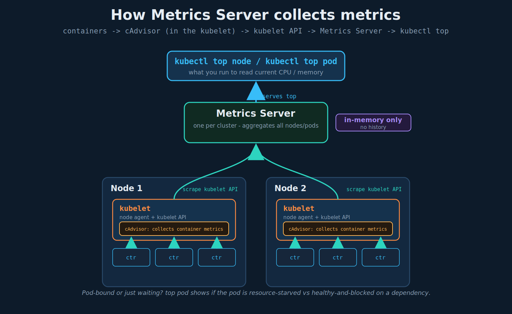

# Monitoring and Debugging Applications (Metrics Server)

## 1. What you would want to monitor

In Kubernetes, what resources do you want to watch? Two levels:

- **Node-level:** how many nodes exist, how many are healthy, and per-node CPU, memory, network, disk.
- **Pod-level:** how many pods exist, how many are healthy, and per-pod performance (CPU, memory, etc.).

Pod-level metrics answer whether a pod is *starved (CPU throttled / near its memory limit) or healthy and just waiting on something downstream*. `kubectl top pod` on a worker pod tells you whether the pod is resource-bound; if the pod's CPU/memory are comfortable, the bottleneck is downstream (e.g. the DB), not the pod. That distinction is the whole point of pod-level metrics.

## 2. Monitoring solutions: open-source vs proprietary

Kubernetes does not ship a full monitoring stack; you choose one:

- **Open-source:** Metrics Server, Prometheus, Elastic Stack.
- **Proprietary:** Datadog, Dynatrace.

"Proprietary" means **commercial/closed-source**, typically paid and often vendor-hosted (you ship metrics to their platform). **Open-source** means the source is freely available and you run it yourself. Proprietary tools buy you turnkey dashboards, alerting, and support for a fee and some loss of control; open-source costs operational effort but is free and self-hosted. "Paid vs free" is the rough heuristic, though some open-source tools also sell hosted/enterprise tiers.

This lecture focuses on **Metrics Server**.

## 3. Heapster vs Metrics Server

Historical note so old docs/blogs make sense: **Heapster** was the original cluster monitoring/aggregation project. It is now **deprecated**. **Metrics Server** is the slimmed-down successor for core resource metrics. If you see Heapster referenced anywhere, treat it as legacy - use Metrics Server.

## 4. What Metrics Server is

- **One per cluster.** It aggregates CPU/memory metrics from all nodes and pods.
- **In-memory only.** It stores the aggregated metrics in memory and does **not** persist them to disk. There is no historical data - it is a snapshot of *current* usage. For history/trends you need Prometheus or a proprietary tool. This is the single most important fact about Metrics Server for the exam.

Because it is in-memory and current-only, Metrics Server powers `kubectl top` and the Horizontal Pod Autoscaler, but it is not a monitoring *system* by itself.



## 5. Where the numbers come from: kubelet and cAdvisor

The collection path:

- Each node runs a **kubelet** - the Kubernetes agent on the node (you met it earlier as the executor that actually runs containers).
- Inside the kubelet is **cAdvisor (Container Advisor)**, the component that collects per-container performance metrics (CPU, memory, etc.) from the containers running on that node.
- cAdvisor exposes those metrics through the **kubelet API**.
- **Metrics Server** scrapes the kubelet API on every node and aggregates the results in memory.

So the flow is: containers -> cAdvisor (in kubelet) -> kubelet API -> Metrics Server -> `kubectl top`.

## 6. Getting Metrics Server running

It is not always installed by default. Two paths:

```bash
# Minikube: built-in addon
minikube addons enable metrics-server
```

```bash
# Any other cluster: deploy from the official manifests
git clone https://github.com/kubernetes-sigs/metrics-server.git
kubectl create -f deploy/1.8+/
```

That deploy creates the supporting RBAC and API wiring - among the objects you will see created: a `ServiceAccount`, a `Deployment` and `Service` named `metrics-server`, several `ClusterRole`/`ClusterRoleBinding` objects, and the `v1beta1.metrics.k8s.io` **APIService** that registers `top` with the API server.

Note: the modern install is usually a single `components.yaml` from the metrics-server releases page rather than the older `deploy/1.8+/` directory; on local clusters like kind/minikube you sometimes need the `--kubelet-insecure-tls` flag because the kubelet's serving certificate is self-signed.

## 7. Viewing metrics

Once Metrics Server has had a few moments to collect (it is not instant after install):

```bash
kubectl top node      # per-node CPU(cores), CPU%, MEMORY(bytes), MEMORY%
kubectl top pod       # per-pod CPU(cores), MEMORY(bytes)
```

Example shape:

```
$ kubectl top node
NAME         CPU(cores)   CPU%   MEMORY(bytes)   MEMORY%
kubemaster   166m         8%     1337Mi          70%
kubenode1    36m          1%     1046Mi          55%

$ kubectl top pod
NAME    CPU(cores)   MEMORY(bytes)
nginx   166m         8m... (Mi)
redis   36m          ...
```

Reading the units ties back to resource requirements: CPU in **millicores** (`166m` = 0.166 of a core), memory in **bytes with Mi/Gi suffixes** (binary units).

## 8. Exam-pattern gotchas

- **`kubectl top` needs Metrics Server.** No Metrics Server -> `top` errors with something like "Metrics API not available." If a question asks for resource usage and `top` fails, the missing piece is Metrics Server.
- **In-memory, current-only.** Metrics Server keeps no history. Any question about *trends over time* points to Prometheus/proprietary, not Metrics Server.
- **Give it a moment.** Right after install, `top` may show nothing until the first scrape completes.
- **`top pod` vs `top node`.** Pod metrics sum container usage in the pod; `--containers` breaks it out per container. Node metrics include system overhead, so node usage > sum of pod usage.
- **cAdvisor lives in the kubelet**, not as a separate pod - a common conceptual question. The kubelet is the collector's home.

## 9. Imperative shortcuts / command reference

```bash
minikube addons enable metrics-server                 # minikube install
kubectl top node                                       # node CPU/memory
kubectl top pod                                         # pod CPU/memory
kubectl top pod --containers                            # break out per-container usage
kubectl top pod -l app=myapp                            # filter by label
kubectl top pod -n <namespace>                          # specific namespace
kubectl get apiservice v1beta1.metrics.k8s.io           # verify Metrics Server is registered/available
```

## References

- [Resource metrics pipeline](https://kubernetes.io/docs/tasks/debug/debug-cluster/resource-metrics-pipeline/) — cAdvisor -> kubelet -> metrics-server -> Metrics API flow behind `kubectl top`
- [Tools for Monitoring Resources](https://kubernetes.io/docs/tasks/debug/debug-cluster/resource-usage-monitoring/) — resource metrics pipeline vs full (Prometheus) pipeline
- [kubernetes-sigs/metrics-server](https://github.com/kubernetes-sigs/metrics-server) — upstream repo and `components.yaml` install (`--kubelet-insecure-tls` for local clusters)
