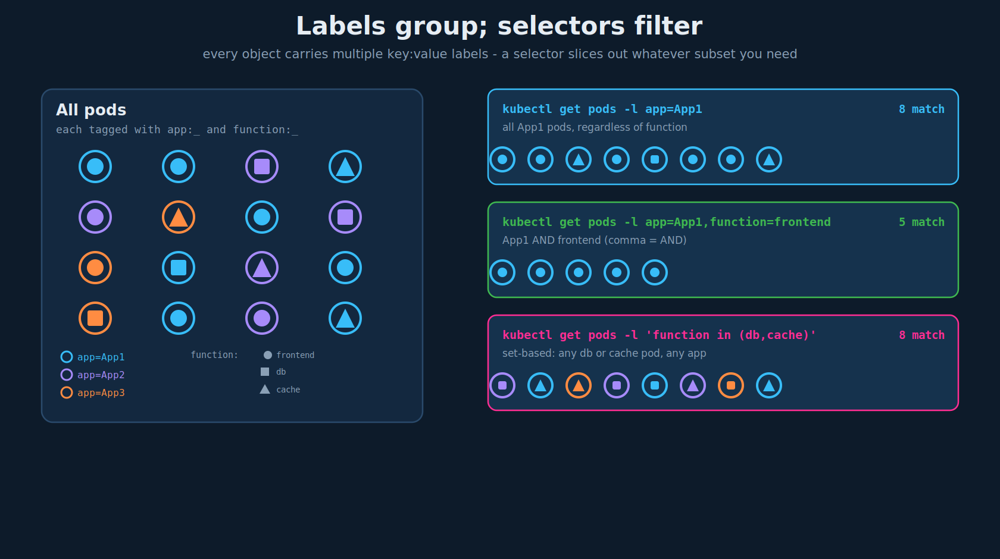

# Labels, Selectors, and Annotations

## 1. The mental model: group, then filter

There is no single "correct" grouping of objects; you attach **multiple** properties and slice by whatever criterion you need later.

That is exactly what labels are. A **label** is an arbitrary `key: value` tag you attach to an object. You can attach as many as you like, and the power is not the tagging itself but **filtering** by it afterward: "all blue animals," "blue birds," "everything in the frontend that is a web server." Labels are how you carve a meaningful subset out of a large set of objects.



## 2. Labels

Labels live under `metadata.labels` as key/value pairs. Common conventions: an `app` label (which application this object belongs to) and a `function` label (its role - `Front-end`, `web-server`, `database`, etc.).

```yaml
apiVersion: v1
kind: Pod
metadata:
  name: simple-webapp
  labels:
    app: App1
    function: Front-end       # quote values that aren't plain alphanumerics
spec:
  containers:
  - name: simple-webapp
    image: simple-webapp
    ports:
      - containerPort: 8080
```

Notes that matter:

- Labels are **identifying** metadata - meant to be selected on. Keep them short and meaningful.
- A value must be a string. Numbers and booleans need quoting (`version: "2"`, `enabled: "true"`), or the YAML parser turns them into the wrong type and selectors silently fail to match.
- Keys may be prefixed (`app.kubernetes.io/name`) - the `kubernetes.io/` and `k8s.io/` prefixes are reserved for Kubernetes' own well-known labels.

## 3. Selectors

A **selector** filters objects by their labels. On the command line:

```bash
kubectl get pods --selector app=App1        # only pods labelled app=App1
kubectl get pods -l app=App1                 # -l is the short form
kubectl get pods -l app=App1,function=Front-end   # comma = AND
kubectl get pods -l 'env in (dev,staging)'   # set-based selector
kubectl get pods -l '!tier'                  # pods that do NOT have a 'tier' label
```

A handy companion flag - show the labels themselves:

```bash
kubectl get pods --show-labels
```

There are two selector grammars (this distinction is exam-relevant - see section 6):

- **Equality-based:** `app=App1`, `app!=App1`. Used by older objects (Services, ReplicationControllers) and the CLI.
- **Set-based:** `in`, `notin`, `exists` (`app in (App1,App2)`, `!tier`). Used by `matchExpressions` in ReplicaSets/Deployments and supported by the CLI.

## 4. How controllers use selectors (the important part)

Labels are not just for `kubectl get`. Controllers **find the objects they manage** by selector. This is where bugs live, so it is worth seeing concretely.

### ReplicaSet discovering its pods

A ReplicaSet has labels in **two** places, and they mean different things - this is the single most common point of confusion:

```yaml
apiVersion: apps/v1
kind: ReplicaSet
metadata:
  name: simple-webapp
  labels:                     # (A) labels ON the ReplicaSet object itself
    app: App1
    function: Front-end
spec:
  replicas: 3
  selector:
    matchLabels:              # (B) which PODS this ReplicaSet owns/manages
      app: App1
  template:
    metadata:
      labels:                 # (C) labels stamped onto the pods it creates
        app: App1
        function: Front-end
    spec:
      containers:
      - name: simple-webapp
        image: simple-webapp
```

The rule that ties it together: **`spec.selector.matchLabels` (B) must match the labels in `spec.template.metadata.labels` (C).** If they disagree, the API rejects the ReplicaSet (or it creates pods it then cannot recognize as its own). The labels on the ReplicaSet itself (A) are independent - they are how *something else* (a higher-level selector, or you on the CLI) would find the ReplicaSet.

### Service routing to pods

A Service finds its backend pods the same way - its `spec.selector` is matched against pod labels, and matching pods' IPs become the Service endpoints (ties directly to the readiness chapter: only *Ready* matching pods are added):

```yaml
apiVersion: v1
kind: Service
metadata:
  name: my-service
spec:
  selector:
    app: App1               # routes to every pod labelled app=App1
  ports:
    - protocol: TCP
      port: 80
      targetPort: 9376
```

Note the Service's `selector` is a flat map (equality-based, no `matchLabels`/`matchExpressions`) - a small but testable difference from the ReplicaSet form.

## 5. Real-world examples

### NetworkPolicy -> database egress

A NetworkPolicy is a textbook selector use: the policy uses a **pod selector** to choose which pods it applies to, then defines egress rules for exactly those pods. Example shape:

```yaml
apiVersion: networking.k8s.io/v1
kind: NetworkPolicy
metadata:
  name: web-app-egress
spec:
  podSelector:
    matchLabels:
      app: web-app                   # the policy applies to pods with this label
  policyTypes:
    - Egress
  egress:
    - to:
        - ipBlock:                    # the CockroachDB cluster endpoints
            cidr: 10.x.x.x/32
      ports:
        - protocol: TCP
          port: 26100                 # all DB destinations shared this port
```

What is happening: `podSelector` picks the app's pods by label, `policyTypes: [Egress]` says "control outbound traffic for these pods," and the `egress` block whitelists TCP to the CockroachDB destinations on `26100` so the app can insert into the database. The selector is the hinge - it scopes the whole policy to just the pods carrying `app: web-app`. (Note: in NetworkPolicy YAML the selector is written as `matchLabels` or `matchExpressions`; the semantics are equality on the `app` label. NetworkPolicy is a later topic; this is just to anchor why selectors matter.)

### `function` as an organizing label

The `function` label maps cleanly to a real microservice estate: `function: Front-end`, `function: web-server`, `function: app-server`, `function: database`, `function: cache`, `function: auth`. Combined with `app`, you can address any slice: `-l app=payments,function=cache` is "the cache tier of the payments app."

## 6. Annotations

Labels and annotations are both `key: value` metadata, but they serve **opposite** purposes, and the exam likes this contrast:

| | Labels | Annotations |
|---|---|---|
| Purpose | **identify & select** objects | attach **non-identifying** info |
| Selectable? | yes - the whole point | **no** - you cannot `kubectl get -l` on an annotation |
| Typical content | `app`, `tier`, `env`, `release` | build IDs, git commit, contact email, tool config, change-cause |
| Size/charset | constrained (short, limited charset) | freeform, can be large (URLs, JSON blobs) |

```yaml
metadata:
  labels:
    app: App1                          # used to SELECT this object
  annotations:
    kubernetes.io/change-cause: "kubectl set image ... webapp=webapp:2"
    build-version: "1.34.2"
    contact: "team-payments@example.com"
```

Use annotations for information you want to **record or hand to tooling** but never **filter on**. Concrete cases you will actually meet:

- `kubernetes.io/change-cause` - what `kubectl apply --record` / `rollout history` shows as the reason for a revision.
- Ingress controller config (`nginx.ingress.kubernetes.io/...`), TLS/cert-manager hints, Prometheus scrape settings - tools read these annotations to configure behavior.
- Build/commit metadata for traceability back to CI.

Rule of thumb: **if you will ever select on it, it is a label; otherwise it is an annotation.**

## 7. Exam-pattern gotchas

- **ReplicaSet/Deployment `selector.matchLabels` must equal `template.metadata.labels`.** Mismatch = the object is rejected or orphans its pods. This is the classic selector exam trap.
- **Service `selector` is a flat map** (equality-based) - no `matchLabels:` wrapper, unlike ReplicaSets. Don't cross the two forms.
- **Quote non-string label values.** `version: 2` becomes an int and won't match a selector looking for `"2"`; write `version: "2"`.
- **Annotations are not selectable.** If a task says "select/filter pods by X," X must be a label. You cannot `-l` on an annotation.
- **`-l` AND-combines** comma-separated terms; there is no OR in equality selectors (use set-based `in (...)` for alternatives).
- **`--show-labels`** is the fast way to see why a selector isn't matching.

## 8. Imperative shortcuts / command reference

```bash
# add / change / remove a label on a live object
kubectl label pod simple-webapp tier=frontend
kubectl label pod simple-webapp tier=backend --overwrite
kubectl label pod simple-webapp tier-                 # trailing dash removes the label

# add an annotation
kubectl annotate pod simple-webapp description="payments frontend"

# select / inspect
kubectl get pods -l app=App1                          # equality
kubectl get pods -l 'env in (dev,staging)'            # set-based
kubectl get pods -l '!tier'                           # label-absent
kubectl get pods --show-labels                        # reveal labels
kubectl get pods -L app -L function                   # labels as columns
```

## References

- [Labels and Selectors](https://kubernetes.io/docs/concepts/overview/working-with-objects/labels/) — label syntax, equality- vs set-based selectors, reserved prefixes.
- [Annotations](https://kubernetes.io/docs/concepts/overview/working-with-objects/annotations/) — non-identifying metadata, how it differs from labels, size limits.
