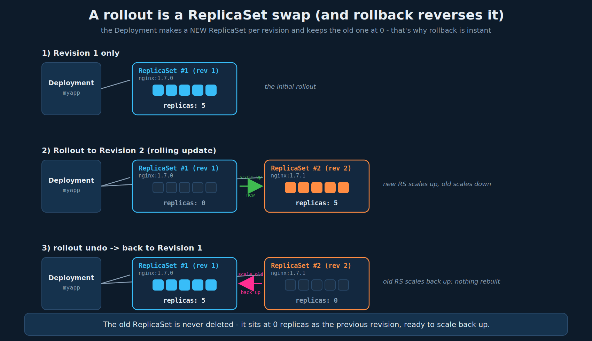

# Deployment Updates and Rollbacks

## 1. Rollouts and revisions

A new rollout creates a new ReplicaSet, recorded as a revision. This clicks once you see the object hierarchy:

```
Deployment  ->  ReplicaSet  ->  Pods
```

A **Deployment does not manage pods directly.** It manages **ReplicaSets**, and each ReplicaSet manages the pods. This indirection is the whole trick behind rollouts and rollbacks.

- **Creating** a Deployment triggers the first **rollout**, which creates **ReplicaSet #1**, which creates the pods. That state is **Revision 1**.
- **Upgrading** (changing the pod template - most often the container image, e.g. `nginx:1.7.0` -> `nginx:1.7.1`) triggers a **new rollout**. The Deployment does **not** edit the existing ReplicaSet. It creates a **brand-new ReplicaSet #2** for the new template, scales it up, and scales the old one down. That new state is **Revision 2**.

The key insight: **the old ReplicaSet is not deleted - it is kept around at 0 replicas.** That retained ReplicaSet *is* the revision. So "Revision 2" is literally ReplicaSet #2. Rollback is then just "scale the old ReplicaSet back up and the new one down" - no rebuild, no re-pull, because the old ReplicaSet (with its old template and image) is still sitting there.



This also explains the hash-suffixed pod names: each ReplicaSet's name carries a template hash (`myapp-deployment-67c749c58c`), and its pods inherit it (`...-67c749c58c-x7k2p`). When you see two ReplicaSets, one at 5 replicas and one at 0, you are looking at the current revision and the previous one.

## 2. Deployment strategies: Recreate vs RollingUpdate

The core problem: you have N replicas on the old version and want them on the new version. Two strategies:

### Recreate

Destroy **all** old pods first, then create all new ones. Simple, but there is a window where **zero** pods are running - the application is **down** during the switch.

```yaml
spec:
  strategy:
    type: Recreate
```

- **Downtime: yes** (full outage during the swap).
- Use when: the app cannot run two versions simultaneously (e.g. an incompatible schema migration, or a singleton that can't have two instances).
- **Not the default.**

### RollingUpdate (the default)

Take down old pods **a few at a time** and bring up new ones in their place, so the app stays available throughout. No downtime, and old + new versions run side by side during the transition.

```yaml
spec:
  strategy:
    type: RollingUpdate
    rollingUpdate:
      maxUnavailable: 25%      # how many below desired you can dip (default 25%)
      maxSurge: 25%            # how many above desired you can temporarily add (default 25%)
```

- **Downtime: no** (rolling, always some pods serving).
- `maxUnavailable` / `maxSurge` control the pace and whether you trade capacity for speed.
- **This is the default** - if you write no `strategy:`, you get RollingUpdate.

Switching a Deployment from `Recreate` to `RollingUpdate` means upgrades stop causing a brief outage and instead roll pod-by-pod with the old version still serving until the new pods are ready. The trade-off: during a rolling update, **both versions are live at once**, so the app (and anything it talks to, like a DB schema) must tolerate mixed versions. That is the one real gotcha of switching off Recreate.

You can confirm which strategy a Deployment uses:

```bash
kubectl describe deployment myapp-deployment   # StrategyType: RollingUpdate (and RollingUpdateStrategy: 25% max unavailable, 25% max surge)
```

## 3. maxUnavailable and maxSurge in depth

Both knobs are defined **relative to `spec.replicas`** (the desired count) and only apply to `RollingUpdate`. Together they bound two numbers for the whole rollout:

- **maxUnavailable** - how far *below* desired the count of **available** (Ready) pods may dip. It sets the **floor**:
  `minAvailable = replicas - maxUnavailable`
- **maxSurge** - how many pods *above* desired may exist **temporarily** (old + new combined). It sets the **ceiling**:
  `maxTotal = replicas + maxSurge`

Both default to `25%`. Each can be an absolute integer (`2`) or a percentage (`25%`). The rollout controller keeps every intermediate step inside `[minAvailable, maxTotal]`.

### Rounding rules (they matter)

Percentages rarely divide evenly, so Kubernetes rounds in the **safe** direction for each knob:

- **maxSurge rounds UP** - bias toward *more* capacity.
- **maxUnavailable rounds DOWN** - bias toward *more* availability.

They can't both resolve to `0` (that would forbid any progress); if your numbers do, the API bumps `maxUnavailable` to `1`.

Example at `replicas: 10`, both `25%`:
- `maxSurge = ceil(0.25 * 10) = 3` -> up to **13** pods total.
- `maxUnavailable = floor(0.25 * 10) = 2` -> at least **8** Ready at all times.

### The mental model

During the rollout the controller repeatedly:
1. **Surges up** - creates new-RS pods as long as total pods `<= replicas + maxSurge`.
2. **Scales down** - deletes old-RS pods as long as available pods stay `>= replicas - maxUnavailable`.
3. Waits for new pods to become **Ready** (all containers pass readiness) before counting them toward availability, then repeats until the new RS is at `replicas` and the old is at `0`.

So `maxSurge` controls **how much extra capacity/cost** you spend to go faster, and `maxUnavailable` controls **how much serving capacity you're willing to lose** while it happens.

### Worked examples (replicas = 10)

| maxUnavailable | maxSurge | Min Ready | Max total | Behavior |
|---|---|---|---|---|
| `25%` (=2) | `25%` (=3) | 8 | 13 | Default. Fast, uses spare capacity, briefly runs 30% extra pods. |
| `0` | `1` | 10 | 11 | **Zero capacity loss.** One new pod at a time comes up Ready *before* an old one leaves. Slowest, safest, +1 pod of cost. |
| `0` | `25%` (=3) | 10 | 13 | Zero capacity loss but 3-wide, so ~3x faster than `0/1`. Needs room for 3 extra pods. |
| `1` | `0` | 9 | 10 | **No surge** (fixed total, e.g. a node/quota ceiling). Must drop a pod before adding one -> always runs at reduced capacity during the roll. |
| `50%` (=5) | `50%` (=5) | 5 | 15 | Aggressive. Half-capacity dips allowed, huge surge. Fast but risky and expensive. |

Reading the extremes:
- **`maxUnavailable: 0`** means "never serve with fewer than `replicas` Ready pods." It *forces* `maxSurge >= 1` because the only way to replace a pod without dipping is to add the replacement first.
- **`maxSurge: 0`** means "never exceed `replicas` total pods." It *forces* `maxUnavailable >= 1` because the only way to make room for a new pod is to remove an old one first - so you always run degraded during the roll. Use only when a hard ceiling (node count, quota, a licensed sidecar) blocks surging.

### How to choose the numbers

Work backwards from three questions:

1. **How much serving capacity can I lose mid-deploy?**
   - Can't lose any (prod, tight SLO) -> `maxUnavailable: 0`.
   - Have headroom / tolerant traffic -> `maxUnavailable: 25%` (default) is fine.
   `minAvailable` should stay at or above the replica count your traffic actually needs at peak. If 10 replicas exist but peak needs 8, `maxUnavailable: 2` is the most you can afford.

2. **How much extra capacity (cost / quota / node room) can I burn briefly?**
   - Cluster has room -> larger `maxSurge` = faster rollout.
   - Tight `ResourceQuota` or expensive pods -> `maxSurge: 1` (or a small %).
   Before setting `maxSurge`, confirm the surge pods actually **fit**: `(replicas + maxSurge)` pods must satisfy CPU/mem requests, node capacity, and any `ResourceQuota`. A surge that can't schedule = a stuck rollout.

3. **How fast do I need it, and how long does one pod take to become Ready?**
   Rollout time is roughly:
   `time ≈ ceil(replicas / batchWidth) * podReadyTime`
   where `batchWidth` is effectively `maxSurge` (for `maxUnavailable: 0`) or `maxUnavailable + maxSurge`. Slow-to-Ready pods (big JVM, slow sidecar warmup) make narrow batches painfully slow - widen `maxSurge` rather than raising `maxUnavailable`.

Percentages vs integers: use **percentages** when the Deployment is autoscaled (HPA changes `replicas`, and the % keeps behaving sensibly); use **integers** when you want an exact, predictable batch regardless of scale.

## 4. Rolling updates with sidecar containers

This is the case that bites real services. A pod with app + logging + Kerberos-auth sidecars is **Ready only when *every* container is Ready** - the pod's availability is gated by its *slowest* container. That changes how you tune the knobs.

### Why sidecars change the math

- **Longer time-to-Ready.** A Kerberos sidecar must acquire a TGT; a logging sidecar must establish its upstream connection. Until each passes its readiness check, the whole pod is unavailable. Your `podReadyTime` (and thus rollout time) is dominated by the slowest sidecar, not the app.
- **The rollout can't "see" sidecar health unless you give each sidecar a readiness probe.** With no probe, a container counts as Ready the instant it's *running* - so the pod can be marked Ready and receive traffic before the auth sidecar actually has a valid ticket. Give the auth/logging sidecars their **own readiness probes** so the pod isn't declared available prematurely.
- **Startup ordering.** Use **native sidecars** (init containers with `restartPolicy: Always`, stable since 1.29) for things the app *depends on* at startup, like a Kerberos ticket cache. Native sidecars start **before** the app container and the app waits on them, so the app never boots into a missing-ticket state. Plain multi-container sidecars start in parallel with no ordering guarantee.

### Recommended strategy for prod/higher environments

```yaml
spec:
  replicas: 10
  minReadySeconds: 15            # hold a pod as "not yet available" for 15s after Ready,
                                 # so sidecars can warm connections/tickets before the roll advances
  strategy:
    type: RollingUpdate
    rollingUpdate:
      maxUnavailable: 0          # never serve below desired capacity
      maxSurge: 1                # (or a small %) bring a fully-Ready replacement up first
```

Why this shape:
- **`maxUnavailable: 0`** - the new pod (app + all sidecars Ready) must come up *before* any old pod is removed, so capacity never dips while a slow sidecar is still initializing. This is the "surge up, then scale down" pattern and it's the default answer for zero-impact deploys.
- **`maxSurge: 1` (or `25%`)** - `1` is gentlest on cost/quota (only one extra full pod-with-sidecars at a time) but makes the rollout serial: `time ≈ replicas * podReadyTime`. If sidecars are slow *and* you have cluster headroom, widen to `maxSurge: 25%` (3 at a time here) to parallelize and cut rollout time ~3x. Confirm the surge pods - **including sidecar CPU/mem requests** - fit your quota and nodes.
- **`minReadySeconds`** - guards against a pod that reports Ready but whose sidecar connection/ticket isn't truly warm yet. The rollout treats the pod as available only after it's stayed Ready for this long, and it delays tearing down the old pod - a cheap safety margin for flaky sidecar startup.

### Extra guards worth pairing with this

- **Readiness probe on each sidecar** (and the app) so "Ready" means genuinely serveable.
- **`PodDisruptionBudget`** (`minAvailable: 9` or `maxUnavailable: 1`) protects the *same* floor against node drains/evictions, not just rollouts - rollout knobs don't cover involuntary disruption.
- **`preStop` hook + `terminationGracePeriodSeconds`** so a pod being scaled down finishes in-flight requests and the auth/logging sidecars flush/release cleanly instead of being killed mid-request.
- **Kerberos specifics:** make sure ticket renewal survives the pod's lifetime and that the sidecar's readiness probe fails if the ticket is missing/expired - otherwise a pod can pass the initial roll and silently lose auth later.

## 5. How an update happens under the hood

When you change the template on a Deployment that wants 5 replicas:

1. The Deployment creates a **new ReplicaSet** for the new template.
2. It scales the new ReplicaSet **up** while scaling the old ReplicaSet **down**, a step at a time (RollingUpdate), respecting `maxSurge`/`maxUnavailable`.
3. When the new ReplicaSet is at 5 and the old is at 0, the rollout is complete. The old ReplicaSet stays at 0 as the previous revision.

`kubectl get replicasets` during/after a rollout shows this directly - two ReplicaSets, the new one ramping to 5, the old one draining to 0.

## 6. How to trigger an update

### Option A - edit the YAML, then apply (the GitOps / pipeline way)

Change the field (commonly the image) in the Deployment manifest and apply:

```bash
# deployment-definition.yml: spec.template.spec.containers[].image: nginx:1.7.1
kubectl apply -f deployment-definition.yml
```

This is the typical CI/CD path: a push builds a new image (new tag/digest), the pipeline updates the image field in the manifest, and `apply` reconciles the change - which the Deployment turns into a new rollout/revision.

### Option B - `kubectl set image` (imperative, and the behavior caveat)

```bash
kubectl set image deployment/myapp-deployment nginx-container=nginx:1.9.1
```

This also triggers a rollout, but with **different behavior** the instructor flagged: it changes the image on the **live object only**. Your YAML file on disk now **disagrees** with the cluster. The next time someone runs `kubectl apply -f deployment-definition.yml` from the (unchanged) file, it will revert the image. So `set image` is fast for the exam and quick fixes, but in a GitOps/pipeline world it causes drift between Git and the cluster. Rule: use `apply` when the file is the source of truth; use `set image` only for throwaway/exam changes.

## 7. Watching, recording, and inspecting rollouts

### Status

```bash
kubectl rollout status deployment/myapp-deployment
# Waiting for rollout to finish: 5 of 10 updated replicas are available...
# deployment "myapp-deployment" successfully rolled out
```

### History and the `--record` flag

```bash
kubectl rollout history deployment/myapp-deployment
# REVISION   CHANGE-CAUSE
# 1          <none>
# 2          kubectl apply --filename=deployment-definition.yml --record=true
```

- `--record=true` (appended to the command that caused the change) stores that command as the revision's **CHANGE-CAUSE**, which is just the `kubernetes.io/change-cause` **annotation** (ties back to chapter 01). Without it, CHANGE-CAUSE shows `<none>` - harder to tell revisions apart later.
- Note (beyond the lecture): `--record` is **deprecated** in current kubectl. The modern equivalent is to set the annotation yourself: `kubectl annotate deployment/myapp-deployment kubernetes.io/change-cause="updated nginx to 1.9.1"`. Know `--record` for the exam; know the annotation for real life.

### Inspecting a specific revision with `--revision`

```bash
kubectl rollout history deployment/myapp-deployment --revision=1
# shows the pod template (image, labels, etc.) captured at revision 1
```

Use this to see *what* a revision actually contained before deciding whether to roll back to it.

## 8. Rollback

If a new version misbehaves, undo it:

```bash
kubectl rollout undo deployment/myapp-deployment
# rolls back to the immediately previous revision
```

Mechanically: the **current ReplicaSet scales down to 0** and the **previous ReplicaSet scales back up** to the desired count. Because the old ReplicaSet was retained, this is fast - no image re-pull, no rebuild.

Roll back to a **specific** revision instead of just the previous one:

```bash
kubectl rollout undo deployment/myapp-deployment --to-revision=1
```

`kubectl get replicasets` after a rollback shows the swap reversed: the old ReplicaSet back at 5, the new one at 0.

You can also pause/resume a rollout to batch several changes into one revision:

```bash
kubectl rollout pause deployment/myapp-deployment
# make several changes... they don't roll out yet
kubectl rollout resume deployment/myapp-deployment   # one rollout for all of them
```

## 9. Command reference (the important ones)

```bash
# create / scaffold
kubectl create deployment myapp --image=nginx:1.7.0 --replicas=5
kubectl create deployment myapp --image=nginx $do > deploy.yaml   # $do = --dry-run=client -o yaml

# update
kubectl apply -f deployment-definition.yml                         # file is source of truth (preferred)
kubectl set image deployment/myapp nginx-container=nginx:1.9.1      # live-only; causes file drift
kubectl edit deployment myapp                                      # live edit (also drifts from file)
kubectl scale deployment myapp --replicas=8                        # scale (not a template change)

# watch / inspect
kubectl rollout status deployment/myapp                            # progress of current rollout
kubectl rollout history deployment/myapp                           # revisions + CHANGE-CAUSE
kubectl rollout history deployment/myapp --revision=2              # what's in revision 2
kubectl get replicasets                                            # see old(0)/new(N) ReplicaSets
kubectl describe deployment myapp                                  # StrategyType, surge/unavailable, events

# record a change-cause
kubectl annotate deployment/myapp kubernetes.io/change-cause="nginx 1.9.1"   # modern
# kubectl apply -f deploy.yml --record=true                        # legacy/deprecated equivalent

# roll back
kubectl rollout undo deployment/myapp                              # to previous revision
kubectl rollout undo deployment/myapp --to-revision=1             # to a specific revision

# pause / resume (batch changes into one rollout)
kubectl rollout pause deployment/myapp
kubectl rollout resume deployment/myapp
```

## 10. Exam-pattern gotchas

- **Deployment -> ReplicaSet -> Pod.** A Deployment never edits a ReplicaSet's template; it makes a **new** ReplicaSet per revision and keeps the old at 0. That retained ReplicaSet is what makes rollback instant.
- **RollingUpdate is the default**; Recreate must be set explicitly and causes downtime. If a question says "no downtime," that's RollingUpdate; "can't run two versions at once," that's Recreate.
- **`set image` / `edit` cause file drift.** They change the live object, not your YAML. In a pipeline, the next `apply` from the unchanged file reverts them. Prefer `apply` when the file is source of truth.
- **`--record` is deprecated**; use the `kubernetes.io/change-cause` annotation. Empty CHANGE-CAUSE means nobody recorded it.
- **`--revision=N` inspects, `--to-revision=N` rolls back.** Don't confuse the two flags.
- **`scale` is not a rollout.** Changing replica count doesn't create a new revision; only template changes do.
- **RollingUpdate means mixed versions briefly coexist** - the app and its dependencies must tolerate that. This is the real-world risk of moving off Recreate.
- **maxSurge rounds UP, maxUnavailable rounds DOWN**, both off `spec.replicas`; they can't both be `0`. `maxUnavailable: 0` forces a surge (add before remove); `maxSurge: 0` forces running degraded (remove before add).
- **A pod is Ready only when *every* container is Ready.** With sidecars, the slowest container gates availability - give each sidecar its own readiness probe, and use `maxUnavailable: 0` + `maxSurge: 1`/`minReadySeconds` for zero-capacity-loss rollouts.
