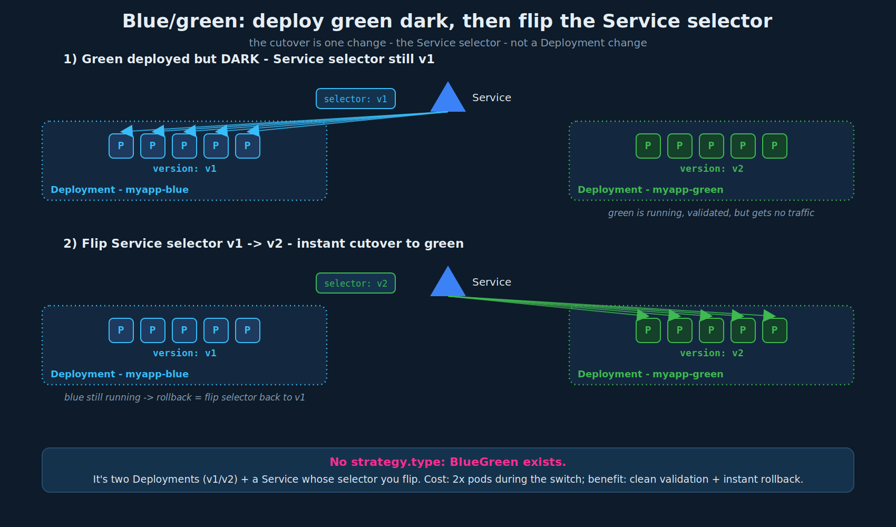

# Deployment Strategies: Blue/Green

## 1. Recap: the two built-in strategies

- **Recreate** - tear down all old pods, then create all new ones. There is a window with **zero pods running = downtime**. Not the default. Set explicitly with `strategy.type: Recreate`.
- **RollingUpdate** - replace pods a few at a time so the app stays up; **the default**. Covered in `02-deployment-updates-rollbacks.md`.

Key framing for this lecture: **Recreate and RollingUpdate are the only values you can put in `strategy.type`.** Blue/Green and Canary are **not** `strategy.type` options - they are *patterns* you assemble from other primitives (Deployments, Services, labels). Do not look for `strategy: BlueGreen` in a Deployment spec; it does not exist.

## 2. What blue/green is

Run **two complete environments side by side**:

- **Blue** = the current version, serving all live traffic.
- **Green** = the new version, fully deployed but receiving **no** traffic yet.

You stand green up alongside blue, test/validate green while users are still hitting blue, and when green checks out you **switch all traffic from blue to green at once** (a single cutover, not a gradual roll). If green misbehaves after the switch, you flip straight back to blue.

Contrast with the built-ins: RollingUpdate gradually mixes old and new (both serve traffic during the roll); blue/green keeps the new version isolated from traffic until one instantaneous switch. That gives you a clean validation window and an instant rollback, at the cost of running **double the pods** during the transition.



## 3. The CKAD way: implement it with primitives

This is the part to know cold. Blue/green with vanilla Kubernetes is a **label + Service-selector trick** - no special object, no `strategy` field.

### Step 1 - Blue deployment, live

A Deployment whose pods carry `version: v1`, and a Service whose selector targets `version: v1`. All traffic flows to blue.

```yaml
# myapp-blue.yml
apiVersion: apps/v1
kind: Deployment
metadata:
  name: myapp-blue
  labels:
    app: myapp
    type: front-end
spec:
  replicas: 5
  selector:
    matchLabels:
      version: v1
  template:
    metadata:
      name: myapp-pod
      labels:
        version: v1            # pods are tagged v1
    spec:
      containers:
        - name: app-container
          image: myapp-image:1.0
```

```yaml
# service-definition.yaml
apiVersion: v1
kind: Service
metadata:
  name: my-service
spec:
  selector:
    version: v1                # Service routes to v1 pods only
```

### Step 2 - Green deployment, deployed but dark

A **second, separate** Deployment with the new image and pods tagged `version: v2`. Apply it - green is now running, but the Service still selects `version: v1`, so **green receives no traffic**. This is your validation window: test green directly (port-forward, an internal test Service, etc.) while users stay on blue.

```yaml
# myapp-green.yml
apiVersion: apps/v1
kind: Deployment
metadata:
  name: myapp-green
  labels:
    app: myapp
    type: front-end
spec:
  replicas: 5
  selector:
    matchLabels:
      version: v2
  template:
    metadata:
      name: myapp-pod
      labels:
        version: v2            # pods are tagged v2
    spec:
      containers:
        - name: app-container
          image: myapp-image:2.0    # the new version
```

### Step 3 - Cut over by flipping the Service selector

When green is validated, change the **Service's selector** from `version: v1` to `version: v2`. The Service instantly stops sending to blue and sends everything to green.

```yaml
# service-definition.yaml (the only change)
spec:
  selector:
    version: v2                # flip v1 -> v2: all traffic now hits green
```

```bash
kubectl apply -f service-definition.yaml
# or imperatively:
kubectl patch service my-service -p '{"spec":{"selector":{"version":"v2"}}}'
```

The cutover is atomic from the Service's point of view - it recomputes its endpoints to the v2 pods. **Rollback is just flipping the selector back to `v1`** (blue is still running). Once you are confident in green, you can delete the blue Deployment to reclaim the capacity.

## 4. Service mesh

**Istio** is a **service mesh** - an infrastructure layer that runs alongside your pods (typically as an **Envoy sidecar proxy** injected into each pod - this is exactly the sidecar pattern from `../03-multi-container-pods/02-design-patterns.md`) and takes over service-to-service traffic management.

Why a mesh is the "better" way to do blue/green and canary:

- A plain Kubernetes **Service selector is all-or-nothing** - traffic goes 100% to whatever the selector matches. You cannot say "10% to green."
- A mesh can split traffic by **weight and rules** - "90% blue / 10% green," or "route requests with header `x-beta: true` to green." That is what makes true canary (gradual percentage shift) and sophisticated blue/green possible.

Istio is the best-known mesh; **Linkerd** is the other common one. Meshes are **not required for CKAD** - the exam-relevant blue/green is the label-switch method in section 3. Just know the term and why it exists: the mesh gives you traffic *percentages and rules* that the native Service primitive cannot.

## 5. Trade-offs

| | Blue/Green | RollingUpdate (default) |
|---|---|---|
| Old + new live at once? | yes, but only **one** serves traffic | yes, **both** serve traffic during the roll |
| Traffic switch | instant, all-at-once | gradual, pod-by-pod |
| Validation before traffic | yes - full window with zero user impact | no - new pods take traffic as they come up |
| Rollback | instant (flip selector back) | another rollout (rescale ReplicaSets) |
| Resource cost | **2x pods** during transition | ~`maxSurge` extra pods |
| Mixed-version exposure to users | none (clean switch) | yes (briefly) |

Blue/green's appeal is the clean validation window and instant switch/rollback; its cost is running double capacity for a while. If an app cannot tolerate two versions serving users simultaneously (the RollingUpdate downside), blue/green is the pattern that avoids it without Recreate's downtime - blue serves continuously right up to the atomic switch.

## 6. Exam-pattern gotchas

- **There is no `strategy.type: BlueGreen`.** Only `Recreate` and `RollingUpdate` are valid `strategy.type` values. Blue/green is assembled from two Deployments + a Service selector flip.
- **The switch is a Service selector change**, not a Deployment change. Editing the Deployment is not how you cut over; editing the Service's `selector` is.
- **Label both Deployments distinctly** (`version: v1` / `version: v2`) and make each Deployment's `selector.matchLabels` match its own pod template (the rule from chapter 01/02). The Service then selects whichever version label you want live.
- **Service `selector` is a flat map** (no `matchLabels:`), unlike the Deployment selector - don't cross the forms.
- **Green still needs its own replicas running before you switch** - the point is to validate it with real pods, just no production traffic.

## 7. Command reference

```bash
# stand up blue and green (separate Deployments)
kubectl apply -f myapp-blue.yml
kubectl apply -f myapp-green.yml         # green now running, no traffic yet

# validate green without production traffic
kubectl port-forward deployment/myapp-green 8080:8080      # hit it directly

# cut over: flip the Service selector v1 -> v2
kubectl patch service my-service -p '{"spec":{"selector":{"version":"v2"}}}'
# or edit service-definition.yaml and: kubectl apply -f service-definition.yaml

# verify the Service now points at green
kubectl describe service my-service       # Selector: version=v2; Endpoints = green pod IPs
kubectl get endpoints my-service          # confirm the backing pod IPs switched

# rollback: flip back to blue
kubectl patch service my-service -p '{"spec":{"selector":{"version":"v1"}}}'

# once confident, retire blue
kubectl delete -f myapp-blue.yml
```
