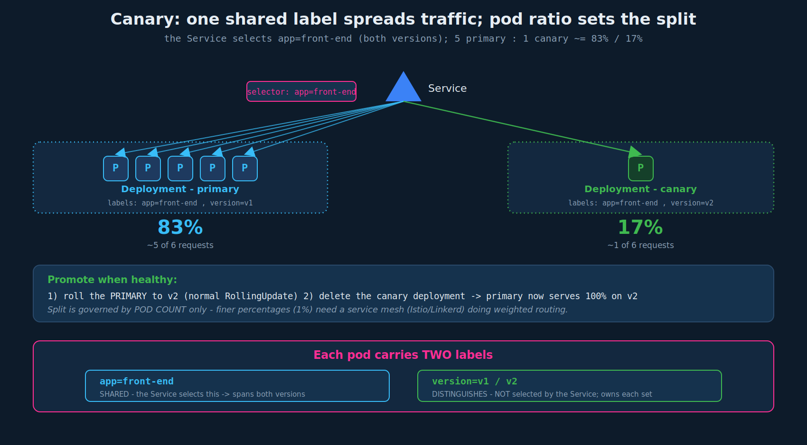

# Deployment Strategies: Canary

## 1. What canary is

Release the new version to a **small slice of live traffic first**, watch it, and only widen once it proves healthy. The flow:

1. Deploy the new version (the **canary**) alongside the current one.
2. Route only a **small percentage** of real traffic to it; keep the rest on the stable version.
3. Run your tests/observability against the canary under that small load.
4. If it looks good, **upgrade the primary deployment to the new version** (e.g. via a normal RollingUpdate), then **delete the canary**.

The name comes from "canary in a coal mine" - a small early-warning probe that takes the risk before the bulk of traffic does.



### Progressive vs simplified canary

**Progressive (incremental) canary** - 10% -> 25% -> 50% -> 100% - is how real-world canary tooling (Argo Rollouts, Flagger, Istio) does it, with automated analysis at each step. The **simplified** canary is: one small slice -> validate -> promote the rest in a single step. Both are legitimately "canary"; the simplified variant is the one that works with plain Kubernetes primitives. There are many ways to do it (manual step-ups, automated analysis gates, time-based promotion, metric-triggered rollback).

## 2. The CKAD way: shared label + pod ratio

Canary with vanilla primitives solves two problems:

**Goal 1 - route traffic to *both* versions.** Give the pods in *both* deployments a **common label** (e.g. `app: front-end`) and point the Service selector at *that* shared label. Now the Service's endpoints include pods from both deployments, so traffic spreads across both.

**Goal 2 - send only a *small* percentage to the new version.** A Service load-balances roughly evenly **across all matching pods**. So the split is governed entirely by **how many pods each deployment runs**. Give the primary 5 pods and the canary 1 pod, and ~1 in 6 requests hits the canary - an **~83% / 17%** split.

### The label scheme (the key detail)

Each pod ends up with **two** labels that do different jobs:

- A **shared** label the Service selects on - identical in both deployments: `app: front-end`.
- A **version** label that distinguishes them - `version: v1` (primary) vs `version: v2` (canary). The Service does **not** select on this; it is there so *you* can tell them apart and so each Deployment's own selector can target its own pods.

```yaml
# myapp-primary.yml
apiVersion: apps/v1
kind: Deployment
metadata:
  name: myapp-primary
spec:
  replicas: 5                       # 5 pods -> ~83% of traffic
  selector:
    matchLabels:
      app: front-end                # NOTE: primary's own selector
  template:
    metadata:
      labels:
        version: v1
        app: front-end              # shared label the Service uses
    spec:
      containers:
        - name: app-container
          image: myapp-image:1.0
```

```yaml
# myapp-canary.yml
apiVersion: apps/v1
kind: Deployment
metadata:
  name: myapp-canary
spec:
  replicas: 1                       # 1 pod -> ~17% of traffic
  selector:
    matchLabels:
      app: front-end
  template:
    metadata:
      labels:
        version: v2
        app: front-end              # SAME shared label
    spec:
      containers:
        - name: app-container
          image: myapp-image:2.0    # the new version
```

```yaml
# service-definition.yaml
apiVersion: v1
kind: Service
metadata:
  name: my-service
spec:
  selector:
    app: front-end                  # selects BOTH deployments' pods
```

> Caveat about the matching labels: because both deployments share `app: front-end`, you have to be careful that each Deployment's `selector.matchLabels` still uniquely owns its own pods in practice. Keeping both selectors on `app: front-end` works for simplicity; in the real world you would typically include the `version` label in each Deployment's own `matchLabels` (`app: front-end` + `version: vN`) so a Deployment never tries to adopt the other's pods, while the *Service* selects only on the shared `app: front-end`. Either way, the Service-level selector is the shared label.

## 3. Promote and clean up

Once the canary looks healthy:

1. **Upgrade the primary** deployment to the new image (`kubectl set image` or edit-and-apply) - this rolls the 5 primary pods to v2 via the normal **RollingUpdate**.
2. **Delete the canary** deployment - its 1 pod is no longer needed; the primary now serves 100% on v2.

```bash
kubectl set image deployment/myapp-primary app-container=myapp-image:2.0
kubectl rollout status deployment/myapp-primary
kubectl delete deployment myapp-canary
```

## 4. The hard limit of native primitives

With **only** Kubernetes primitives + a Service, traffic distribution is **always governed by the pod count**. You cannot ask for an arbitrary percentage. To send ~1% to the canary you would need something like **100 primary pods to 1 canary pod** - the granularity is "1 / total pods," so fine-grained splits are impractical.

This is exactly the gap a **service mesh** (Istio, Linkerd - see the blue/green file) fills: a mesh routes by **weight**, so you can declare "99% primary / 1% canary" with *one* pod each, and shift the weight progressively without touching replica counts. That weighted routing is why true progressive canary needs a mesh or a controller like Argo Rollouts/Flagger - not on CKAD, but the reason the native approach feels coarse.

| | Native primitives (CKAD) | Service mesh (Istio etc.) |
|---|---|---|
| Split mechanism | pod **count** ratio | traffic **weight** rule |
| Finest split | 1 / (total pods) | arbitrary % (e.g. 1%) |
| Progressive shift | rescale deployments | change a weight number |
| On CKAD? | yes | no |

## 5. Canary vs blue/green vs rolling (quick contrast)

| | Rolling (default) | Blue/Green | Canary |
|---|---|---|---|
| New version exposed to users | gradually, as pods replace | not until one atomic switch | yes, to a **small slice** first |
| Both versions serve at once? | briefly, uncontrolled mix | no (clean switch) | **yes, by design**, controlled ratio |
| Validate under real traffic before full rollout? | no | yes (with zero traffic) | yes (with a little traffic) |
| Native split control | n/a | all-or-nothing | by pod count |
| Resource cost | ~maxSurge extra | 2x | primary + a few canary pods |

Canary's distinction: it deliberately puts the new version in front of **real users**, just a few of them, so you catch problems that zero-traffic validation (blue/green) might miss - at the price of some users hitting the unproven version.

## 6. Exam-pattern gotchas

- **No `strategy.type: Canary`** (just like blue/green). It's a pattern: two Deployments + a shared label + a Service + pod-ratio.
- **The Service selects the shared label** (`app: front-end`), *not* the version label. Selecting the version label would defeat the purpose (you'd only get one version).
- **Pods carry two labels**: the shared one (Service selects this) and the version one (distinguishes/owns). Mixing these up is the classic mistake.
- **Split = pod ratio.** 5 primary : 1 canary ≈ 83/17. You cannot get fine percentages without large pod counts - that's the native limitation.
- **Promotion is a normal RollingUpdate** of the primary, then delete the canary.
- **Each Deployment's `selector.matchLabels` must still match its own template labels** (chapter 01/02 rule) - in practice include `version` there so deployments don't fight over pods.

## 7. Command reference

```bash
# stand up primary (stable) and canary (new), both sharing app: front-end
kubectl apply -f myapp-primary.yml      # replicas: 5, version v1
kubectl apply -f myapp-canary.yml       # replicas: 1, version v2
kubectl apply -f service-definition.yaml   # selector: app=front-end (both)

# confirm the Service is backed by pods from BOTH deployments
kubectl get endpoints my-service          # should list 6 pod IPs (5 + 1)
kubectl get pods -l app=front-end --show-labels   # see version v1 and v2 mixed

# adjust the split by scaling (more canary pods = more canary traffic)
kubectl scale deployment myapp-canary --replicas=2   # now ~5:2

# promote: roll the primary to v2, then remove the canary
kubectl set image deployment/myapp-primary app-container=myapp-image:2.0
kubectl rollout status deployment/myapp-primary
kubectl delete deployment myapp-canary
```

## References

- [Canary Deployment](https://kubernetes.io/docs/concepts/workloads/controllers/deployment/#canary-deployment) — the label + multiple-Deployment approach behind one Service.
- [Service](https://kubernetes.io/docs/concepts/services-networking/service/) — how a Service load-balances across all matching pods, so the split follows pod count.
