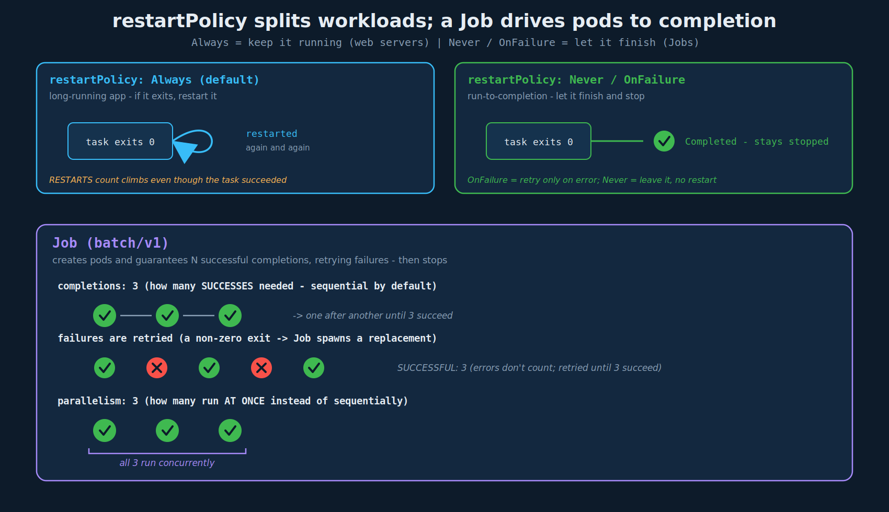

# Jobs (and restartPolicy)

## 1. Two kinds of workload

Most workloads so far (web servers, the apps behind Deployments/ReplicaSets) are meant to run **indefinitely** - if the process exits, Kubernetes restarts it to keep it up. But some workloads are **run-to-completion**: do a task, finish, stop. Batch processing, analytics, report generation, a one-off migration, an image-processing pass. For these you do **not** want Kubernetes restarting the container after it succeeds.

This is the same distinction you saw with init containers (run once, exit) vs app containers (stay up) - now applied at the workload level: **Deployment/ReplicaSet = run forever; Job = run once and finish.**

## 2. The problem: default restart behavior fights run-to-completion

In Docker first: `docker run ubuntu expr 3 + 2` runs, prints `5`, and the container **exits** (status `Exited (0)`). Docker leaves it stopped - fine.

Do the equivalent as a bare pod in Kubernetes and you hit a surprise: the container runs, prints `5`, exits 0 - and Kubernetes **restarts it anyway**, over and over, because a pod's default restart behavior is to keep the container running. You see this in the pod's climbing `RESTARTS` count even though the task succeeded.

## 3. `restartPolicy` (the fix)

The behavior is governed by **`spec.restartPolicy`** on the pod, which defaults to **`Always`**. Three valid values:

| `restartPolicy` | Behavior | Use for |
|---|---|---|
| `Always` (default) | restart the container whenever it stops, success or failure | long-running apps (web servers) - Deployments/ReplicaSets |
| `OnFailure` | restart **only** if it exits non-zero; leave it stopped on success | run-to-completion that should retry on error |
| `Never` | never restart, regardless of exit code | run-to-completion where you handle retries yourself |

```yaml
apiVersion: v1
kind: Pod
metadata:
  name: math-pod
spec:
  containers:
    - name: math-add
      image: ubuntu
      command: ['expr', '3', '+', '2']
  restartPolicy: Never        # don't resurrect the container after it exits
```

With `Never` (or `OnFailure`), the pod runs the command, prints `5`, exits, and **stays** `Completed` - no restart loop. This is the precise mechanism the init-containers and liveness notes pointed at: `Always`/`OnFailure` retry a failed init container, `Never` fails the pod; and for a sidecar the per-container `restartPolicy: Always` is what keeps it running. Same field, different layer.

> Note: `restartPolicy` lives on the **pod**, and only `Always`/`OnFailure`/`Never` are valid. It is **not** the same as a Deployment's `strategy.type` (Recreate/RollingUpdate) - different field, different purpose. Easy to conflate; don't.

## 4. Kubernetes Jobs

A bare pod with `restartPolicy: Never` solves the restart loop, but it is still just one pod with no higher-level management. A **Job** is the proper object for run-to-completion work: it creates one or more pods, **ensures they run to successful completion**, retries failed pods, and tracks how many have succeeded. Contrast with a ReplicaSet, which keeps a fixed number of pods running *forever*; a Job drives pods to *finish*.



### Definition

A Job is `kind: Job`, `apiVersion: batch/v1`, and its `spec.template` is a **pod template** - the same pod spec you already know, nested under the Job:

```yaml
apiVersion: batch/v1
kind: Job
metadata:
  name: math-add-job
spec:
  template:
    spec:
      containers:
        - name: math-add
          image: ubuntu
          command: ['expr', '3', '+', '2']
      restartPolicy: Never      # REQUIRED in a Job template (Always is rejected)
```

The pod-definition fields move under `spec.template` (note: the template has its own `spec:`, holding `containers:` and `restartPolicy:`). The Job's `metadata`/`apiVersion` differ from the pod's; everything below `template.spec` is a normal pod.

### Create, view, delete

```bash
kubectl create -f job-definition.yaml
kubectl get jobs                       # NAME  DESIRED  SUCCESSFUL  AGE  (e.g. 1  1  38s)
kubectl get pods                       # the job's pod: STATUS Completed, RESTARTS 0
kubectl logs math-add-job-l87pn        # the pod's output, e.g. "5"
kubectl delete job math-add-job        # deletes the job AND its pods
```

`kubectl get jobs` shows `DESIRED` vs `SUCCESSFUL` completions; the pod ends `Completed`, not `Running`. Deleting the Job cleans up its pods.

## 5. Multiple completions and parallelism

### `completions` - run the task N times (sequentially by default)

```yaml
spec:
  completions: 3            # need 3 successful pod completions
  template:
    spec:
      containers: [...]
      restartPolicy: Never
```

The Job creates pods until **3 have succeeded**. By default they run **one after another** (sequentially): pod 1 completes, then pod 2, then pod 3.

### Retry on failure

If a pod **fails** (non-zero exit), the Job creates a **replacement** to still reach `completions`. An image that fails randomly (e.g. `kodekloud/random-error`) shows a mix of `Completed` and `Error` in the pod list, with the Job spawning extra pods until 3 *succeed* (`SUCCESSFUL 3`). The Job guarantees N **successes**, retrying failures along the way.

### `parallelism` - run them at the same time

```yaml
spec:
  completions: 3
  parallelism: 3            # run up to 3 pods at once instead of sequentially
  template:
    spec:
      containers: [...]
      restartPolicy: Never
```

`parallelism` caps how many pods run **concurrently**. With `completions: 3, parallelism: 3`, all three run in parallel; the Job keeps `parallelism` pods in flight until `completions` successes are reached. Tune `parallelism` to trade speed for resource pressure.

| Field | Meaning | Default |
|---|---|---|
| `completions` | total **successful** pods required | 1 |
| `parallelism` | max pods running **concurrently** | 1 (sequential) |
| `backoffLimit` | retries before the Job is marked Failed | 6 |
| `activeDeadlineSeconds` | wall-clock cap on the whole Job | none |

Real-world tie-in: a Job with `parallelism` is exactly how you'd fan out a large batch insert across N workers and have Kubernetes guarantee every shard completes (retrying failed shards) - rather than babysitting a single long pod manually.

## 6. Exam-pattern gotchas

- **A Job template cannot use `restartPolicy: Always`** - the API rejects it. Use `Never` or `OnFailure`. (`Always` is only for long-running pods.)
- **`restartPolicy` is on `template.spec`, not on the Job's top-level `spec`.** Mis-placing it is a common error. The Job spec holds `completions`/`parallelism`/`backoffLimit`; the *pod* spec inside `template` holds `restartPolicy` and `containers`.
- **`OnFailure` vs `Never` change *where* retries happen.** `OnFailure` restarts the **same** container in place; `Never` leaves the failed pod and the Job creates a **new** pod. Both reach `completions`, but the pod list looks different (in-place restart count vs more pods).
- **Completed pods are not cleaned up automatically** by default - they linger as `Completed` so you can read logs. Delete the Job (or set `ttlSecondsAfterFinished`) to clean up.
- **Job pod status is `Completed`, not `Running`**; `kubectl get jobs` tracks `SUCCESSFUL`/completions, not READY.
- **`completions` counts successes, not attempts** - failed pods don't count; the Job retries until N succeed (or `backoffLimit` is hit).

## 7. Command / imperative reference

```bash
# imperative create (then add completions/parallelism by editing, no flags for those)
kubectl create job math-add-job --image=ubuntu -- expr 3 + 2
kubectl create job math-add-job --image=ubuntu --dry-run=client -o yaml -- expr 3 + 2 > job.yaml

# apply / inspect / clean up
kubectl create -f job-definition.yaml
kubectl get jobs
kubectl get pods                                 # Completed pods, RESTARTS 0
kubectl logs <job-pod-name>                       # task output
kubectl describe job math-add-job                 # completions, parallelism, events, failures
kubectl delete job math-add-job                   # removes the job and its pods
kubectl explain job.spec                          # recall completions/parallelism/backoffLimit
```

## References

- [Jobs](https://kubernetes.io/docs/concepts/workloads/controllers/job/) — run-to-completion pods, `completions`/`parallelism`, `backoffLimit`, and `ttlSecondsAfterFinished`.
- [Pod restart policy](https://kubernetes.io/docs/concepts/workloads/pods/pod-lifecycle/#restart-policy) — `Always`/`OnFailure`/`Never` semantics that gate Job pod retries.