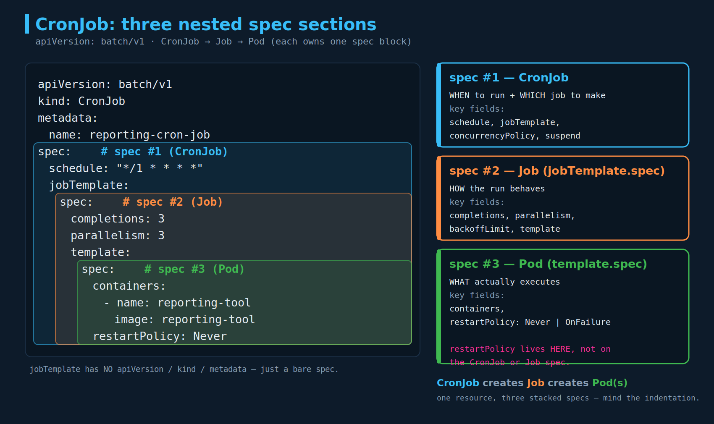

# CronJobs

## 1. What a CronJob is

A CronJob is a Job that runs **on a schedule** — the Kubernetes analog of Linux `cron`. The relationship is a three-link chain:

```
CronJob  --(on each schedule tick)-->  Job  --(creates)-->  Pod(s)
```

The key move: take the **`spec` of a Job definition** and drop it, almost verbatim, into a new CronJob definition under the `jobTemplate` property. You are not writing the Job's behavior from scratch — you are embedding a Job spec inside a CronJob spec and letting the CronJob controller stamp out a fresh Job every time the schedule fires.

Watch the nesting: a CronJob manifest contains **three `spec:` sections**, and getting their indentation wrong is the single most common way to break the file. That is the subject of the diagram below.

---

## 2. The cron schedule format

The `schedule` field is a standard 5-field cron expression:

```
 # ┌───────────── minute        (0 - 59)
 # │ ┌───────────── hour         (0 - 23)
 # │ │ ┌───────────── day of month (1 - 31)
 # │ │ │ ┌───────────── month     (1 - 12)
 # │ │ │ │ ┌───────────── day of week (0 - 6, Sun=0; 7 is also Sun on some systems)
 # │ │ │ │ │
 # * * * * *   <command to execute>
```

| Field | Position | Range |
|---|---|---|
| minute | 1st | 0–59 |
| hour | 2nd | 0–23 |
| day of month | 3rd | 1–31 |
| month | 4th | 1–12 |
| day of week | 5th | 0–6 (Sun=0; some systems also accept 7=Sun) |

Operators worth knowing for the exam:

| Syntax | Meaning | Example |
|---|---|---|
| `*` | every value | `* * * * *` = every minute |
| `*/n` | every *n* units | `*/5 * * * *` = every 5 minutes |
| `a-b` | range | `0 9-17 * * *` = top of every hour, 9am–5pm |
| `a,b,c` | list | `0 0 * * 1,3,5` = midnight Mon/Wed/Fri |
| combo | — | `0 2 * * 0` = 02:00 every Sunday |

The example `"*/1 * * * *"` means **every minute** (`*/1` is functionally identical to `*`).

**Quote it.** In YAML, `schedule: "*/1 * * * *"` should be a **quoted string**. The value starts with `*`, and a bare `*` at the start of a YAML scalar is a parse hazard (and `*anchor` is reserved alias syntax). Quoting is the safe habit; flag this as a CKAD gotcha.

---

## 3. The three nested specs — the core gotcha

This is the heart of the lecture. A CronJob manifest stacks three `spec:` blocks, each owning a different resource:



| spec | Path | Owns | Representative fields |
|---|---|---|---|
| **spec #1** | `spec` | the **CronJob** | `schedule`, `jobTemplate`, `concurrencyPolicy`, `suspend` |
| **spec #2** | `spec.jobTemplate.spec` | the **Job** | `completions`, `parallelism`, `backoffLimit`, `template` |
| **spec #3** | `spec.jobTemplate.spec.template.spec` | the **Pod** | `containers`, `restartPolicy` |

How to keep them straight under exam pressure: read them as **WHEN / HOW / WHAT**.

- **spec #1 (CronJob) = WHEN** — when to run, and which Job to create.
- **spec #2 (Job) = HOW** — how many runs (`completions`), how much parallelism, how many retries.
- **spec #3 (Pod) = WHAT** — what container actually executes, and what happens when it exits (`restartPolicy`).

Note one easy-to-miss detail: **`jobTemplate` has no `apiVersion`, `kind`, or `metadata`** — it is a *bare* spec, not a full object. You do not paste an entire `kind: Job` document under `jobTemplate`; you paste only the part *below* a Job's `spec:`. Pasting a complete Job manifest there is a classic indentation/validation failure.

---

## 4. apiVersion: use batch/v1

**`apiVersion: batch/v1beta1` for CronJob is deprecated and removed. Do not use it.**

- CronJob graduated to **stable `batch/v1`** in Kubernetes **1.21**.
- `batch/v1beta1` for CronJob was **removed entirely in Kubernetes 1.25**.

On any current cluster — including the CKAD exam environment, which tracks a recent Kubernetes release — `apiVersion: batch/v1beta1` for a CronJob will be rejected outright (`no matches for kind "CronJob" in version "batch/v1beta1"`). **Always write `apiVersion: batch/v1`.**

(The Job resource itself has been `batch/v1` for a long time; only CronJob carried the beta version.)

---

## 5. No native file references — `jobTemplate` is inlined

Vanilla Kubernetes manifests do not support referencing another file the way a method calls another method.

- **There is no `$ref`, no `include`, no import in core Kubernetes YAML.** `jobTemplate` is not a pointer to `job-definition.yaml` — it is the Job spec **inlined**, copied in full. The CronJob document is entirely self-contained. The apiserver never reads other files; it only sees the single manifest you `apply`.
- "Take the Job's spec and put it under `jobTemplate`" is literally a copy operation — manual inlining, not a function reference.

What *does* give you that composition, when you want it:

| Tool | What it does for this problem |
|---|---|
| **Kustomize** (`kubectl apply -k`) | Bases + overlays; share a common Pod/Job spec across environments without retyping. Built into `kubectl`. |
| **Helm** | Templating + values; a chart can render the Job spec into both a standalone Job and a CronJob from one source. |
| **YAML anchors/aliases** (`&`, `*`) | In-file reuse only — and `kubectl` strips them on the way in, so they help *authoring* but the stored object is still fully expanded. |

For CKAD, none of that is in scope — expect to **hand-write all three specs inline** and get the indentation right. The composition tooling is a CKA/real-world concern.

---

## 6. Full CronJob definition (corrected)

`cron-job-definition.yaml`:

```yaml
apiVersion: batch/v1            # NOT batch/v1beta1 — that was removed in k8s 1.25
kind: CronJob
metadata:
  name: reporting-cron-job
spec:                           # spec #1 — CronJob
  schedule: "*/1 * * * *"       # quote it; runs every minute
  jobTemplate:                  # a bare Job spec — no apiVersion/kind/metadata here
    spec:                       # spec #2 — Job
      completions: 3
      parallelism: 3
      template:
        spec:                   # spec #3 — Pod
          containers:
            - name: reporting-tool
              image: reporting-tool
          restartPolicy: Never  # required on Job/CronJob pods: Never or OnFailure
```

`restartPolicy` belongs to the **Pod** spec (#3), and for Job-backed pods it must be `Never` or `OnFailure` — `Always` is invalid here (this is the thread we closed in `05-jobs.md`; it carries straight over because the CronJob just runs Jobs).

Apply it:

```bash
kubectl create -f cron-job-definition.yaml
# or, to be re-apply-friendly:
kubectl apply -f cron-job-definition.yaml
```

---

## 7. CronJob-specific fields

These live in **spec #1** (the CronJob spec) — `concurrencyPolicy` and `suspend` in particular show up in questions and in `kubectl get cronjob` output.

| Field | Default | What it does |
|---|---|---|
| `concurrencyPolicy` | `Allow` | What happens if a previous run is still going when the next tick fires. `Allow` = run them concurrently; `Forbid` = skip the new run; `Replace` = kill the in-flight job and start fresh. |
| `suspend` | `false` | `true` pauses scheduling **without deleting** the CronJob. This is the `SUSPEND` column in `kubectl get cronjob`. Existing jobs keep running; no new ones are created. |
| `startingDeadlineSeconds` | unset | If a scheduled run is missed (e.g. controller was down) by more than this many seconds, that run is skipped and counted as failed instead of fired late. |
| `successfulJobsHistoryLimit` | `3` | How many completed Jobs to retain for inspection. |
| `failedJobsHistoryLimit` | `1` | How many failed Jobs to retain. |
| `timeZone` | controller TZ (usually UTC) | Stable since k8s 1.27. Lets you pin the schedule to an IANA zone, e.g. `"America/New_York"`. Without it, the schedule is interpreted in the kube-controller-manager's time zone. |

The `timeZone` field matters more than it looks: a `0 2 * * *` "2 AM" job with no `timeZone` runs at 2 AM **UTC**, not 2 AM Eastern — a real footgun for batch windows tied to a business day.

---

## 8. Inspecting CronJobs and the Jobs they spawn

```bash
kubectl get cronjob
# NAME                SCHEDULE      SUSPEND   ACTIVE   LAST SCHEDULE   AGE
# reporting-cron-job  */1 * * * *   False     0        30s             5m
```

Older `kubectl` shows a 4-column form (`NAME SCHEDULE SUSPEND ACTIVE`); current `kubectl` adds `LAST SCHEDULE` and `AGE`. Same data, don't be thrown if the columns differ.

```bash
kubectl get jobs            # the Jobs the CronJob has created (one per fired tick)
kubectl get pods            # the Pods those Jobs created
kubectl describe cronjob reporting-cron-job   # events: "Created job ..." each tick
```

Mental model for debugging: if pods aren't appearing, walk the chain top-down — is the **CronJob** firing (`describe` events / `ACTIVE`)? Is the **Job** being created (`get jobs`)? Are the **Pods** failing (`get pods`, then `logs`)? Same apply → read error → fix loop, just one layer taller.

---

## Exam-pattern gotchas

- **`apiVersion: batch/v1`**, never `batch/v1beta1`. The slides are wrong on this; v1beta1 was removed in k8s 1.25 and the exam runs a recent version.
- **Three `spec:` blocks, correct indentation.** CronJob spec → `jobTemplate.spec` (Job) → `template.spec` (Pod). Mis-indent any one and the API rejects it (`unknown field` / `error validating`).
- **`jobTemplate` is a bare spec** — no `apiVersion`, `kind`, or `metadata` under it. Don't paste a whole Job manifest there.
- **Quote the schedule:** `schedule: "*/1 * * * *"`. A leading `*` unquoted is a YAML hazard.
- **`restartPolicy` is required** and lives in the **Pod** spec (#3); only `Never` or `OnFailure` are valid for Job-backed pods.
- **`containers:` is a list** — the `- name:` dash matters (same rule as every pod spec).
- **vim discipline:** before pasting this much nested YAML, `:set paste` (autoindent will otherwise mangle the indentation — exactly the failure this chapter warns about). `:set list` to reveal stray tabs.

---

## Imperative shortcuts / command reference

`kubectl create cronjob` exists and is the fast path when the question allows it:

```bash
# minimal: name + image + schedule
kubectl create cronjob reporting-cron-job \
  --image=reporting-tool \
  --schedule="*/1 * * * *"

# scaffold YAML to edit (your $do alias = --dry-run=client -o yaml)
k create cronjob reporting-cron-job --image=reporting-tool --schedule="*/1 * * * *" $do > cj.yaml

# pass a command to the container (everything after -- is the command)
kubectl create cronjob report --image=busybox --schedule="*/5 * * * *" -- /bin/sh -c "date; echo done"

# pause / resume without deleting
kubectl patch cronjob reporting-cron-job -p '{"spec":{"suspend":true}}'

# kick off a one-time Job from an existing CronJob (handy for testing the schedule's payload now)
kubectl create job --from=cronjob/reporting-cron-job manual-run-001
```

**Imperative limitation:** `kubectl create cronjob` produces a **single-container** pod and gives you **no flag for `completions` or `parallelism`**. If the question asks for those, scaffold with `$do`, then hand-edit `spec.jobTemplate.spec` to add `completions:`/`parallelism:`, validate with `--dry-run=client`, then apply.

## References

- [CronJob](https://kubernetes.io/docs/concepts/workloads/controllers/cron-jobs/) — schedule syntax, `jobTemplate`, `concurrencyPolicy`, `suspend`, `timeZone`, history limits.
- [Jobs](https://kubernetes.io/docs/concepts/workloads/controllers/job/) — the Job spec that `jobTemplate` inlines (`completions`/`parallelism`/`backoffLimit`).
