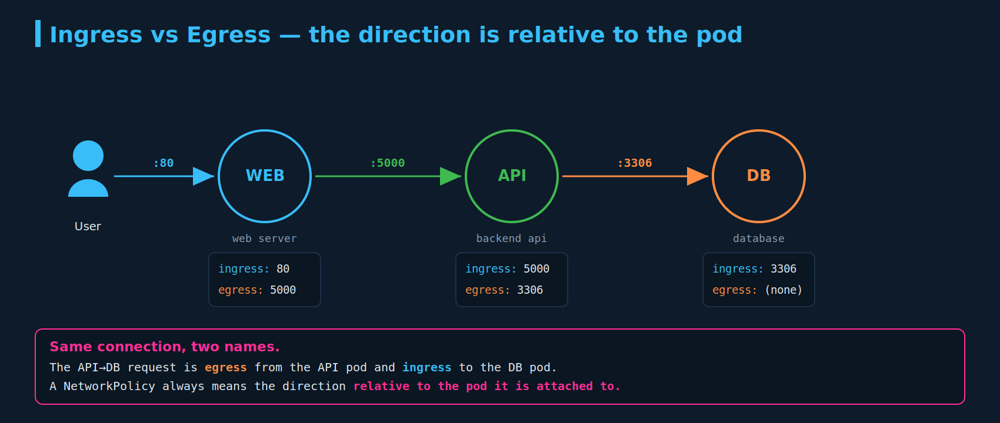
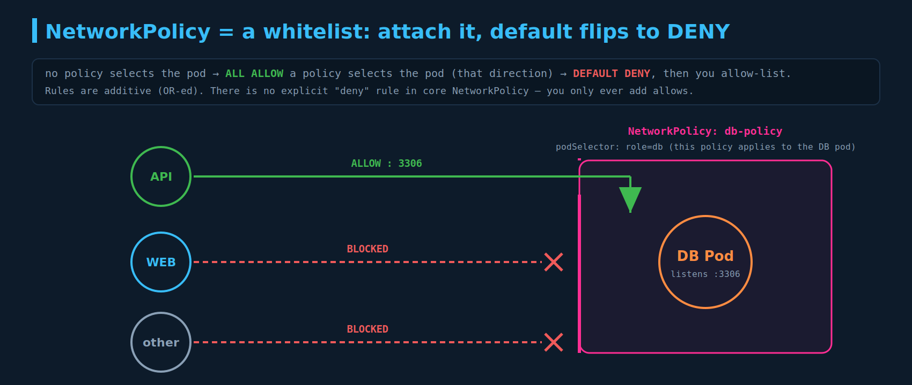
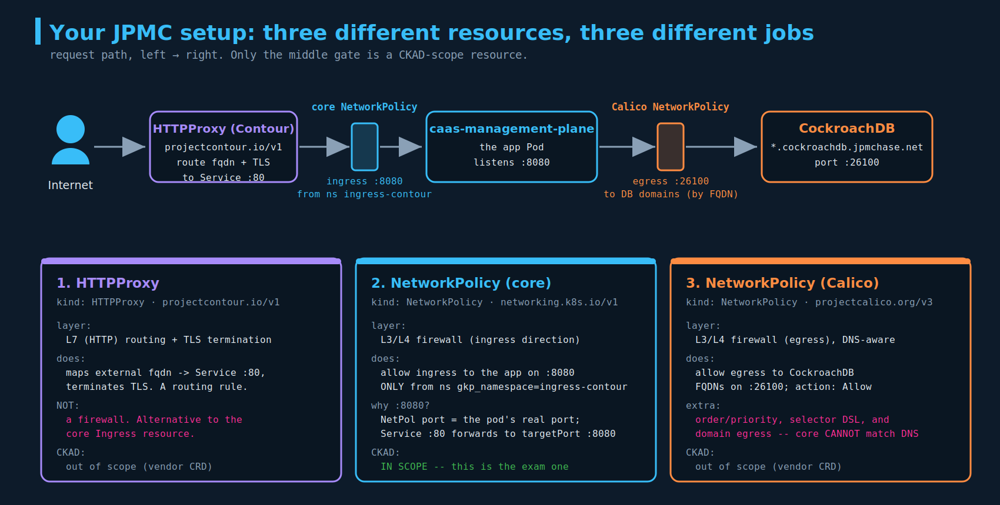

# Network Policies

NetworkPolicy is the only firewall primitive in core Kubernetes and shows up directly on the exam — you'll be asked to write one that allows/denies traffic between specific pods/namespaces on specific ports. The `from`/`to` selector semantics are a classic trap. There is no `kubectl` generator, so you must hand-write the YAML fast.

---

## 1. The scenario, and defining ingress / egress

A three-tier app, following one user request through it:

```
User --:80--> WEB server --:5000--> API server --:3306--> DB
```

A user hits the **web server** on port 80. The web server calls the **API** on port 5000. To do its work the API reads/writes the **database** on port 3306. The two directions of traffic are **ingress** and **egress**:

- **Ingress = incoming traffic. Traffic arriving *at* a pod.** The pod is the destination/server.
- **Egress = outgoing traffic. Traffic *leaving* a pod to reach something else.** The pod is the source/client.

Every flow in the app as ingress/egress **per pod**:

| # | Pod | Direction | Port | Meaning |
|---|---|---|---|---|
| 1 | web | ingress | 80 | user's request arrives at web |
| 2 | web | egress | 5000 | web reaches out to the API |
| 3 | api | ingress | 5000 | web's request arrives at the API |
| 4 | api | egress | 3306 | API reaches out to the DB |
| 5 | db | ingress | 3306 | API's request arrives at the DB |



Note that the **response** path (the data flowing back to the user) is deliberately not listed as separate rules. That matters for NetworkPolicy and is covered in section 6 — you do **not** write a reverse rule for replies.

---

## 2. Direction is *relative to the pod*

**The same connection has two names depending on which pod you're standing in.** Flow #2 and flow #3 above are the *same* web&#8594;API connection: it's **egress** from the web server and **ingress** to the API server. Neither label is "more correct" — they describe the same packet from opposite ends.

So the only question that ever matters is: **which pod is this NetworkPolicy attached to?**

- A policy attached to the **DB** pod controlling who may reach it &#8594; you care about **ingress** (flow #5).
- A policy attached to the **API** pod controlling where it may connect out &#8594; you care about **egress** (flow #4).

One NetworkPolicy can govern **ingress** to a pod (who may call it) and a separate one govern **egress** from it (which databases it may call out to). Same pod, two policies, two directions.

---

## 3. The Kubernetes networking model: "no routes to configure"

The Kubernetes **networking model** every conformant cluster must satisfy:

1. **Every pod gets its own unique IP address** (the `10.244.x.x` addresses in his Network Security slide are pod IPs; the `192.168.1.1x` are the node IPs).
2. **Every pod can reach every other pod directly, on any node, with no NAT** — the source pod sees the real destination pod IP and vice versa.
3. You, the user, **do not add routes, set up tunnels, or configure forwarding** by hand. The **CNI plugin** (Calico, Cilium, Flannel, Weave, …) wires up the routing/overlay so the flat "every pod can talk to every pod" network just exists.

That flat reachability is the **default "all-allow"**: out of the box, any pod can talk to any other pod or Service in the cluster, across namespaces, with nothing blocking it. NetworkPolicy is the tool you reach for when "everything can talk to everything" is too permissive — e.g. you don't want the web tier to be able to open a socket straight to the database. Without a NetworkPolicy, *any* compromised pod in the namespace could `curl` your DB directly.

---

## 4. The NetworkPolicy resource

A **NetworkPolicy** is a namespaced object that you **attach to a set of pods** (via a `podSelector`) and inside which you define **allow** rules for ingress and/or egress.

The single most important behavioural rule:

> **As soon as a pod is selected by *any* NetworkPolicy for a given direction, that direction switches from "allow all" to "deny all except what the policy allows."** If no policy selects the pod, it stays wide open.

So NetworkPolicy is a **whitelist**: you never write "deny" rules in core Kubernetes — you attach a policy (which implicitly denies the selected direction) and then poke specific holes with `from`/`to` rules. Rules are **additive / OR-ed**: if pod traffic matches *any* allow rule across *any* policy selecting it, it's permitted.



The lecture's example: secure the DB so it accepts traffic **only** from the API pod, **only** on 3306, and blocks everything else.

```yaml
apiVersion: networking.k8s.io/v1   # the ONLY apiVersion for core NetworkPolicy
kind: NetworkPolicy
metadata:
  name: db-policy
spec:
  podSelector:              # WHICH pods this policy applies to (the DB pods)
    matchLabels:
      role: db
  policyTypes:              # which directions this policy governs
    - Ingress
  ingress:                  # allow-list of inbound rules
    - from:
        - podSelector:      # the peer allowed to connect: the API pod
            matchLabels:
              name: api-pod
      ports:
        - protocol: TCP
          port: 3306        # destination port on the DB pods
```

Field-by-field:

| Field | Role |
|---|---|
| `spec.podSelector` | Selects the **target** pods the policy is attached to. Empty (`{}`) = **all pods in the namespace**. |
| `spec.policyTypes` | `Ingress`, `Egress`, or both. Declares which directions this policy controls. |
| `spec.ingress[]` | Allow-list of inbound rules. Each entry has `from` (peers) and `ports`. |
| `spec.egress[]` | Allow-list of outbound rules. Each entry has `to` (peers) and `ports`. |
| `ports[].port` | The **destination** port on the selected/target pods (not the source port). |

---

## 5. Anatomy of a rule — selectors, peers, and the big gotcha

There are two distinct selector jobs, and conflating them is a common error:

- **`spec.podSelector`** — picks the pods the policy *is attached to* (the protected target). Matches against those pods' **labels**.
- **`from:` / `to:` peers** — pick *who is allowed to talk to / be talked to*. Three peer types, which can be combined:

| Peer type | Matches |
|---|---|
| `podSelector` | pods (in the **same namespace** by default) carrying matching labels |
| `namespaceSelector` | all pods in namespaces carrying matching labels |
| `ipBlock` | a CIDR range (with optional `except:`), for non-pod / external IPs |

### The #1 exam trap: AND vs OR in a `from`/`to` block

This is worth burning in, because the YAML difference is a single dash and the meaning flips completely.

**OR** — two separate list items (api pods **OR** anything in the prod namespace):

```yaml
ingress:
  - from:
      - podSelector:
          matchLabels:
            name: api-pod
      - namespaceSelector:          # note the leading "-": a SECOND peer
          matchLabels:
            env: prod
```

**AND** — one list item with two fields (api pods **that are specifically in** the prod namespace):

```yaml
ingress:
  - from:
      - podSelector:
          matchLabels:
            name: api-pod
        namespaceSelector:          # NO leading "-": same peer, ANDed
          matchLabels:
            env: prod
```

The first allows two independent sets of sources; the second narrows to the *intersection*. On the exam, read the dashes carefully — "from api-pods **in** namespace X" is AND; "from api-pods **and from** namespace X" is OR.

Other selector facts worth knowing:

- `podSelector: {}` (empty) inside `from` = **all pods in the policy's namespace**.
- `namespaceSelector: {}` (empty) = **all namespaces**.
- A bare `from`/`to` peer list left empty, or an `ingress: []` with no rules, means **deny all** in that direction (the implicit default with nothing to allow).
- Ports are the **target pod's** ports (the container's real port, e.g. `8080`), not the Service's port.

---

## 6. NetworkPolicy is stateful — you don't write a reverse rule

A point that confuses people coming from stateless-ACL thinking: NetworkPolicy controls **connections**, and the reply traffic of an allowed connection is **automatically permitted**. The implementation tracks the connection state.

So for the DB example, an **ingress** rule allowing API&#8594;DB on 3306 is sufficient — the DB's responses back to the API flow without you adding any egress rule on the DB or any extra ingress rule on the API. You only need rules for the *direction in which the connection is initiated*. This is why the response path wasn't enumerated as separate flows in section 1.

(Exam phrasing to watch: "allow the API to query the DB" needs **one** rule — ingress-from-API on the DB, or egress-to-DB on the API, depending on which pod you're asked to put the policy on — not a matched pair.)

---

## 7. The CNI caveat (real-world + exam-adjacent)

NetworkPolicy is enforced by the **CNI plugin**, not by the Kubernetes control plane itself. The API server will happily accept and store a NetworkPolicy object even if nothing enforces it.

- **Enforce it:** Calico, Cilium, Weave Net, Kube-router, Antrea.
- **Historically does *not* (plain):** **Flannel** — it provides pod networking but ignores NetworkPolicy objects. You can `kubectl apply` a perfect policy on a Flannel cluster and traffic still flows freely.

Practical upshot for a kind lab: kind's default CNI (kindnet) doesn't enforce NetworkPolicy either, so to *test* policies locally you need to install a policy-capable CNI (Calico or Cilium) when creating the cluster. On the exam, assume the cluster's CNI enforces policies — but know that "I applied it and nothing changed" can mean the CNI, not your YAML.

---

## 8. Egress example

To control the API pod's *outbound* access to the DB instead, attach the policy to the API pod and use `egress`/`to`:

```yaml
apiVersion: networking.k8s.io/v1
kind: NetworkPolicy
metadata:
  name: api-egress-to-db
spec:
  podSelector:
    matchLabels:
      name: api-pod          # attached to the API pod now
  policyTypes:
    - Egress
  egress:
    - to:
        - podSelector:
            matchLabels:
              role: db
      ports:
        - protocol: TCP
          port: 3306
```

**Egress gotcha:** if you lock down egress, you almost always also need to allow **DNS** (UDP/TCP 53 to `kube-dns`/CoreDNS), or the pod can't resolve Service names and connections fail in confusing ways. The lecture doesn't mention this; it bites people constantly in the real world.

```yaml
    # add this rule alongside the DB rule when restricting egress:
    - to:
        - namespaceSelector: {}          # CoreDNS usually lives in kube-system
      ports:
        - protocol: UDP
          port: 53
        - protocol: TCP
          port: 53
```

---

## 9. Real-world example: three resources, two layers

A common real-world edge setup uses three different kinds of resource doing three different jobs at two different network layers — they are **not** three NetworkPolicies, which is a common source of confusion.



| File | `kind` / `apiVersion` | Layer | Job | On CKAD? |
|---|---|---|---|---|
| 1 | `HTTPProxy` · `projectcontour.io/v1` | **L7 (HTTP)** routing | Route the external hostname to the Service and terminate TLS | **No** (Contour CRD) |
| 2 | `NetworkPolicy` · `networking.k8s.io/v1` | **L3/L4** firewall (ingress) | Allow inbound to the app pod **only** from the ingress-contour namespace, on `8080` | **Yes** |
| 3 | `NetworkPolicy` · `projectcalico.org/v3` | **L3/L4** firewall (egress) | Allow the app pod to reach the CockroachDB hosts on `26100` | **No** (Calico CRD) |

**File 1 — Contour `HTTPProxy` (not a firewall).** `kind: HTTPProxy`, `apiVersion: projectcontour.io/v1`. This is Contour's CRD alternative to the core `Ingress` resource — it's about **routing**: take requests for `fqdn: ${cluster-host}`, terminate TLS using the named secret, and forward matching paths (`prefix: /`) to the app Service on `port: 80`. It does **not** allow or deny pod-to-pod traffic. The word "ingress" collides three ways —
> - **ingress** (lowercase) = a *traffic direction* (this chapter).
> - **`Ingress`** (`networking.k8s.io/v1`) = a *resource* for L7 HTTP routing into the cluster.
> - **`HTTPProxy`** (Contour) = a *vendor resource* that does the same L7 routing job as `Ingress`.
>
> All three are "ingress" in plain English, but only the first is what a NetworkPolicy means by it.

**File 2 — core `NetworkPolicy` (the CKAD one).** `kind: NetworkPolicy`, `apiVersion: networking.k8s.io/v1`. A `podSelector` on the app, `ingress` `from` a `namespaceSelector` matching the `ingress-contour` namespace, on TCP `8080`. Plain English: *only pods in the ingress-contour namespace may open connections to the app, and only on 8080.* This is the firewall that ensures traffic reaches the app **through Contour** and not directly from some random namespace.

- **Why `8080` and not `80`?** The HTTPProxy routes to the **Service** on `80`, but a Service's port is just a front door — it forwards to the pods' **`targetPort`** (`8080`, the port the container actually listens on). **NetworkPolicy ports are the *pod's* real ports**, never the Service port. So `Service :80 -> pod :8080`, and the policy correctly names `8080`.

**File 3 — Calico `NetworkPolicy` (a richer superset).** `kind: NetworkPolicy`, `apiVersion: projectcalico.org/v3` — **not** the core resource despite the identical `kind`. This is Calico's own CRD, and it does things core NetworkPolicy cannot:

| Calico feature | Core `networking.k8s.io/v1` equivalent |
|---|---|
| `order: 1004` (rule precedence) | none — core rules are unordered and purely additive |
| `selector: app == '...'` (expression DSL) | `podSelector.matchLabels` / `matchExpressions` (no inline `==` syntax) |
| `action: Allow` (also `Deny`, `Log`, `Pass`) | **allow-only** — core has no explicit `Deny`/`Log` |
| `destination.domains: [ ... ]` (**egress by DNS name**) | **not possible** — core egress can only target pods, namespaces, or `ipBlock` CIDRs, never FQDNs |

That last row is the big one: the DB egress rule allows by **domain name** on port `26100`. Core Kubernetes NetworkPolicy **cannot match DNS names** — expressing this with the CKAD-scope resource would require pinning the DB's IP ranges in an `ipBlock`, which is brittle for a managed CockroachDB fleet behind rotating IPs. That limitation is *why* such a project uses Calico's CRD here.

**Net:** for the exam, only **File 2's** flavor exists. Files 1 and 3 are real-world vendor extensions — good to recognize, out of scope to write.

---

## Exam-pattern gotchas

- **`apiVersion: networking.k8s.io/v1`** for the CKAD NetworkPolicy. If you see `projectcalico.org/v3`, that's a vendor CRD, not the exam resource (same `kind`, different API).
- **AND vs OR in `from`/`to`:** separate `-` list items = OR; multiple fields under one `-` = AND (intersection). The single most common mistake.
- **Default-deny on selection:** attaching a policy flips the selected direction to deny-except-allowed. A pod with *no* policy is wide open.
- **Stateful:** allow the connection direction only; replies are automatic. No reverse rule.
- **Ports are destination/target-pod ports**, not Service ports and not source ports.
- **`podSelector: {}` = all pods in the namespace**; `namespaceSelector: {}` = all namespaces.
- **NetworkPolicy is namespaced** — it only selects pods in its own namespace; cross-namespace sources need a `namespaceSelector`.
- **CNI must enforce it** — Flannel/kindnet don't. "Applied but no effect" is often the CNI, not the YAML.
- **Egress lockdown breaks DNS** unless you also allow port 53 to CoreDNS.
- **`Ingress` the resource ≠ `ingress` the rule.** Don't let the naming collide (the `Ingress` resource is the next chapter's topic).

---

## Imperative shortcuts / command reference

There is **no `kubectl create networkpolicy` generator** — you cannot scaffold this with `kubectl create ... $do`. NetworkPolicy must be **hand-written**. On the exam, copy the skeleton from the official docs ("Network Policies" page has a full example) and edit it. Practice typing the skeleton from memory.

```bash
# inspect
kubectl get netpol                      # 'netpol' is the short name
kubectl get networkpolicy -A
kubectl describe netpol db-policy        # shows parsed Ingress/Egress rules + selectors

# apply / delete
kubectl apply -f db-policy.yaml
kubectl delete netpol db-policy

# find the labels you need to write selectors (do this FIRST)
kubectl get pods --show-labels
kubectl get ns --show-labels             # for namespaceSelector

# test connectivity (proves the policy works)
kubectl exec -it <client-pod> -- nc -zv <db-svc> 3306     # or curl/wget
```

Exam workflow: `--show-labels` on the source and target pods (and namespaces) **before** writing the policy, so your `matchLabels` are exact. Then `apply`, then `exec`+`nc`/`curl` to confirm allowed traffic passes and disallowed traffic hangs/fails.
