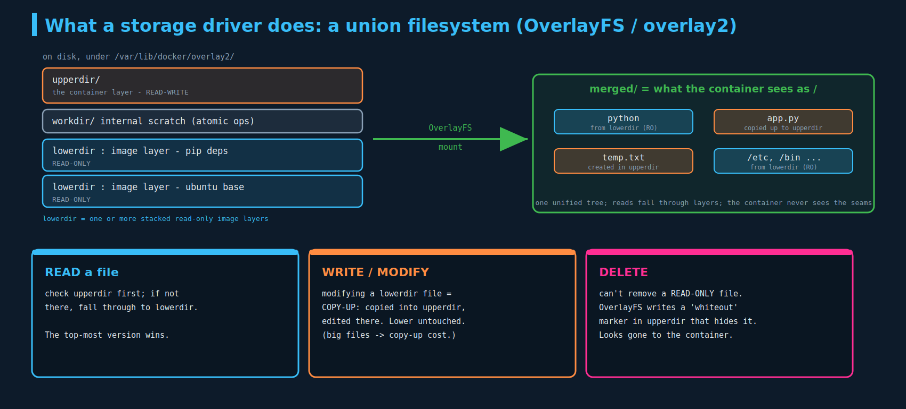
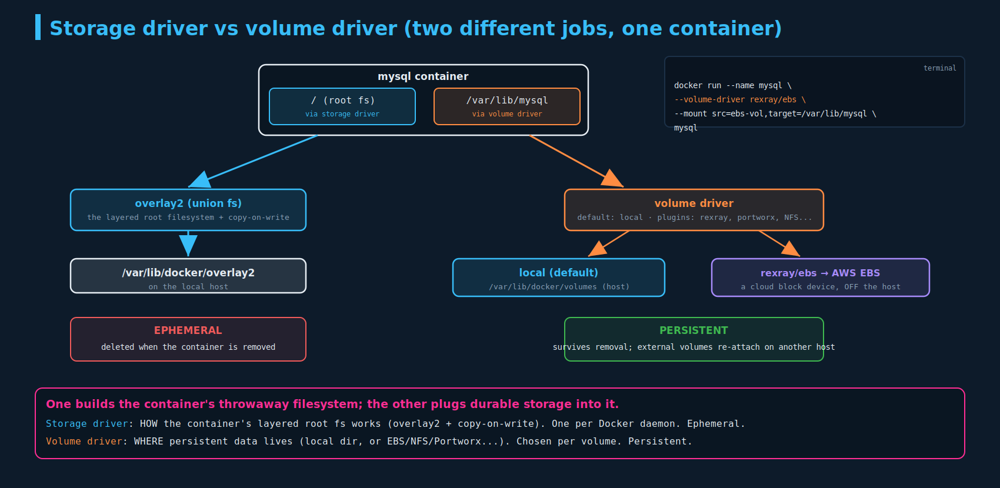

#  Volume Driver Plugins (and what storage drivers actually do)

Still **background, not directly examinable.** You won't be asked about overlay2, rexray, or `--volume-driver` on the exam. But the volume-driver-plugin idea is the direct ancestor of the **CSI / StorageClass provisioner** model that *is* examinable, so this chapter goes a level deeper on the mechanism. Learn the mental model; the Docker specifics are just the vehicle. Read `01-docker-storage.md` first (it introduced the two driver types).

---

## 1. The two driver types

Docker's storage splits into **storage drivers** and **volume drivers**:

- **Storage drivers** — AUFS, ZFS, BTRFS, Device Mapper, Overlay/overlay2. They implement the **layered image + container filesystem** and copy-on-write.
- **Volume drivers** — Local (default), plus plugins: Azure File Storage, Convoy, DigitalOcean Block Storage, Flocker, gce-docker, GlusterFS, NetApp, RexRay, Portworx, VMware vSphere Storage. They manage **volumes** — the persistent storage you attach.

`01-docker-storage.md` covered *what* they are. This chapter covers **what storage drivers actually do** (section 2), a proper **compare/contrast** (section 4), with the volume-driver-plugin example in between (section 3).

---

## 2. What a storage driver actually does

### The general OS picture first

In any operating system, programs don't talk to disks directly. They call standard filesystem operations — `open`, `read`, `write`, `stat` — against the kernel's **Virtual File System (VFS)** layer. Below VFS sit **filesystem drivers** (ext4, xfs, NTFS, tmpfs, OverlayFS…), each translating those uniform operations into reads/writes on *some* backing representation: a disk partition, RAM, a network share, or — for a **union filesystem** — other directories. "A storage/filesystem driver" is just the code that maps standard file operations onto a particular storage representation.

### Docker's storage driver = a union filesystem with copy-on-write

Docker's **storage driver** (historically called the *graph driver*) is a specific application of that idea: it implements the **layered image model** — stack many read-only image layers plus one writable container layer and present them as a single root filesystem, using copy-on-write. The modern default, **overlay2**, is built directly on the Linux kernel's **OverlayFS** union filesystem. So Docker's storage driver rides on top of a real kernel filesystem driver.

A **union filesystem** presents multiple stacked directories as one merged view — this is the old "union mount / overlay mount" idea. OverlayFS implements it with four pieces:



- **lowerdir** — one or more **read-only** layers (your image layers).
- **upperdir** — the single **read-write** layer (the container layer).
- **workdir** — an internal scratch directory OverlayFS needs for atomic operations.
- **merged** — the unified mount the container actually sees as `/`.

The three operations are the whole behaviour:

- **Read** a file: look in `upperdir` first; if it's not there, fall through to `lowerdir`. The top-most version wins, and the container sees one seamless tree.
- **Write/modify** a file that lives in a read-only `lowerdir`: **copy-up** — OverlayFS copies it into `upperdir` and edits the copy. The original is never touched. (Copying up a *large* file on first write has a real cost — a known gotcha.)
- **Delete** a file from `lowerdir`: you can't remove a read-only file, so OverlayFS writes a **whiteout** marker in `upperdir` that masks it. The container sees it as gone.

**Copy-on-write** is the principle underneath all three: don't duplicate data until something writes to it. That's why ten containers from the same image **share** one on-disk copy of the read-only layers, and only their individual diffs cost space — fast startup, big disk savings.

### The family of storage drivers (they differ by *mechanism*)

| Driver | Mechanism | Notes |
|---|---|---|
| **overlay2** | union filesystem (file-level COW) on kernel OverlayFS | the modern default; efficient multi-layer support |
| **aufs** | the original union filesystem | out-of-tree (never merged into mainline Linux) → Docker moved off it |
| **btrfs / zfs** | the filesystem's own **snapshots/subvolumes** do COW | each layer = a snapshot; fast COW, but the host root fs must *be* btrfs/zfs |
| **devicemapper** | **block-level** COW via LVM thin-provisioning + dm snapshots | each container gets a thin virtual block device; older RHEL/CentOS; deprecated |
| **vfs** | **no COW** — a full deep copy of every layer | works anywhere but huge disk + slow; testing/fallback only |

So storage drivers cluster into: file-level union (aufs, overlay2), snapshotting filesystems (btrfs, zfs), block snapshots (devicemapper), and naive copy (vfs). You almost never choose this — Docker picks based on your OS/kernel. (`docker info | grep -i 'storage driver'` shows the active one; expect `overlay2`.)

---

## 3. Volume drivers and plugins

A **volume driver** is a Docker plugin that implements the volume lifecycle — create, mount, unmount, remove — against a particular **storage backend**. The default **`local`** driver just makes a directory under `/var/lib/docker/volumes` on the host. Third-party drivers point volumes at storage that lives **off the host**: cloud block storage (AWS EBS, GCE PD, DigitalOcean, Azure), networked/distributed filesystems (NFS, GlusterFS, NetApp), or software-defined storage (Portworx).

Example using **REX-Ray** to put a MySQL volume on **AWS EBS**:

```bash
docker run -it \
  --name mysql \
  --volume-driver rexray/ebs \
  --mount src=ebs-vol,target=/var/lib/mysql \
  mysql
```

`--volume-driver rexray/ebs` selects the driver; `--mount src=ebs-vol,...` tells it to provision/attach an EBS volume named `ebs-vol` and mount it at `/var/lib/mysql`. Now MySQL's data lives on a **cloud block device**, not the local disk. The payoff: the data is durable and **host-independent** — if the container is rescheduled onto another host, that host can attach the same EBS volume and the data follows.

> REX-Ray itself is largely retired now (superseded by CSI — see section 5), but the *concept* it demonstrates is exactly what survives in Kubernetes.

---

## 4. Storage driver vs volume driver — compare and contrast



| | **Storage driver** | **Volume driver** |
|---|---|---|
| What it manages | the container's **layered root filesystem** (image layers + the writable layer) | **volumes** — persistent data you explicitly attach |
| Mechanism | union/overlay fs or block snapshots + **copy-on-write** | mounts a **backing store** (local dir or external/cloud) into the container |
| Data lifecycle | **ephemeral** — dies with the container | **persistent** — outlives the container |
| Scope | **one per Docker daemon** (it's how *every* container's fs works) | **per volume** — different volumes can use different drivers |
| Where data lives | `/var/lib/docker/overlay2` on the host | `local`: `/var/lib/docker/volumes`; plugin: external (EBS, NFS, Portworx…) |
| Do you configure it? | rarely — Docker picks by OS/kernel | sometimes — `--volume-driver` for external storage |
| Examples | overlay2, aufs, btrfs, zfs, devicemapper, vfs | local, rexray, portworx, glusterfs, netapp, azure-file, vsphere |

The one-sentence contrast: **the storage driver builds the container's throwaway filesystem (the layers + copy-on-write); the volume driver plugs durable storage into it.** One is about *how the container's filesystem works*; the other is about *where your persistent data lives*.

A single-host setup only ever needs the default **`local`** volume driver — data is on the box's own disk. You'd reach for an external volume driver the moment data had to survive a *host* dying or move between hosts — which is precisely what the next Kubernetes chapters formalize.

---

## 5. Where this goes in Kubernetes (the examinable descendant)

This volume-driver-plugin idea didn't disappear — it got standardized. In Kubernetes, the **Container Storage Interface (CSI)** is the vendor-neutral plugin API for storage backends. Cloud providers ship CSI drivers (e.g. the **EBS CSI driver**), and a **StorageClass** names a **provisioner** (a CSI driver) that **dynamically provisions** a PersistentVolume when a PersistentVolumeClaim asks for storage.

So the mapping is: **Docker volume driver plugin → Kubernetes CSI driver + StorageClass provisioner.** Same idea — pluggable backends for persistent storage — one level up and standardized. *That* layer (PV / PVC / StorageClass) is the examinable CKAD material coming next; this Docker chapter is the conceptual on-ramp.

---

## Imperative / command reference

```bash
docker info | grep -i 'storage driver'     # active storage driver (expect overlay2)
docker plugin ls                            # installed volume/other plugins
docker plugin install rexray/ebs            # install a volume-driver plugin
docker volume create --driver rexray/ebs ebs-vol
docker run --volume-driver rexray/ebs --mount src=ebs-vol,target=/var/lib/mysql mysql
docker system df                            # space used by images / containers / volumes / cache
```

---

## Exam-pattern gotchas / scope

- **Not directly examinable.** No overlay2/rexray/`--volume-driver` questions on CKAD. The examinable descendant is **CSI + StorageClass provisioners** (and PV/PVC), covered next.
- **Storage driver = per daemon, ephemeral, union/COW.** **Volume driver = per volume, persistent, a backing-store mount.** Don't conflate them — this is the distinction the exam *does* lean on conceptually when you reason about why pod data needs a PV.
- **overlay2** is the default on any modern host; you rarely set the storage driver.
- The Kubernetes equivalent of a **bind mount** is `hostPath`; of a Docker **volume**, an `emptyDir` (ephemeral) or a **PV** (persistent). Keep that map handy for the next chapters.

## References

- [Volumes](https://kubernetes.io/docs/concepts/storage/volumes/) — the volume types Kubernetes exposes, including the `csi` type that is the standardized descendant of Docker volume-driver plugins
- [Compute, Storage, and Networking Extensions](https://kubernetes.io/docs/concepts/extend-kubernetes/compute-storage-net/) — how Kubernetes pluggable storage works (CSI and the deprecated FlexVolume), the direct successor to Docker's volume-driver plugin model
- [Storage Classes](https://kubernetes.io/docs/concepts/storage/storage-classes/) — the `provisioner` field where a CSI driver plugs in for dynamic provisioning
