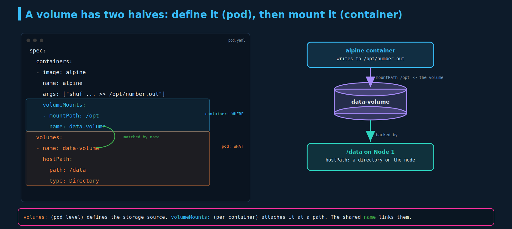
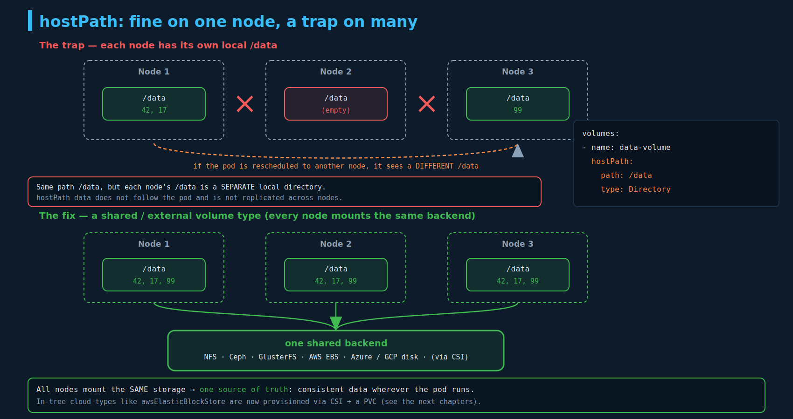

# Volumes in Kubernetes

The first **examinable** storage topic. You'll write `volumes` + `volumeMounts` into pod specs, pick a volume type, and reason about why `hostPath` breaks on a multi-node cluster. `emptyDir` and the `volumes`/`volumeMounts` wiring show up directly on tasks. Builds on the Docker "why" from `01-docker-storage.md` and `02-volume-driver-plugins.md`.

---

## 1. Why volumes

Same premise as Docker, restated for Kubernetes: **pods are transient.** A pod's containers behave like normal Docker containers — any data created during the run lives in the ephemeral container layer and is **destroyed when the pod dies** (the read-write-layer point from `01-docker-storage.md`). A **volume** is storage attached to the pod that **outlives the container**: data the container writes into the volume is retained, and survives restarts, until explicitly deleted.

Example: a `random-number-generator` pod runs `shuf` to append a random number to `/opt/number.out` on each run. Without a volume, that file dies with the pod. Mount a volume at `/opt`, and the number persists.

---

## 2. The two halves: `volumes` and `volumeMounts`

There are **two separate pieces**, in two different places in the pod spec:



1. **`spec.volumes`** (pod level) — **defines** the storage and gives it a **name**. This is *what* the storage is (a host directory, an NFS share, an EBS disk, an empty scratch dir…).
2. **`spec.containers[].volumeMounts`** (container level) — **attaches** that named volume into the container at a `mountPath`. This is *where* it shows up inside the container.

The two are linked by the **`name`**: the `volumeMounts.name` must match a `volumes.name`. Read it as **WHAT (volume) → WHERE (mount)**.

```yaml
apiVersion: v1
kind: Pod
metadata:
  name: random-number-generator
spec:
  containers:
  - image: alpine
    name: alpine
    command: ["/bin/sh","-c"]
    args: ["shuf -i 0-100 -n 1 >> /opt/number.out;"]
    volumeMounts:                 # container level: WHERE it appears
    - mountPath: /opt             #   inside this container, at /opt
      name: data-volume           #   ...is the volume named data-volume
  volumes:                        # pod level: WHAT the storage is
  - name: data-volume
    hostPath:                     #   a directory on the node
      path: /data
      type: Directory
```

So: the container writes to `/opt`; because `/opt` is the mount point of `data-volume`, and `data-volume` is backed by the node's `/data`, the data actually lands in `/data` on the node and persists after the container is gone. **The container never knows or cares what's behind the mount** — that's the whole point of decoupling `volumes` (the source) from `volumeMounts` (the attachment).

---

## 3. `hostPath` — store data in a directory on the node

**`hostPath`**: the volume *is* a directory on the **node's** filesystem. There's a logical volume in the pod, but the bytes live in (here) `/data` on whichever node the pod runs on. This is the direct Kubernetes cousin of a Docker **bind mount**.

The `type` field controls behaviour:

| `type` | Meaning |
|---|---|
| `Directory` | the path **must already exist** as a directory (the example) |
| `DirectoryOrCreate` | create the directory (mode 0755) if missing |
| `File` / `FileOrCreate` | same, for a file |
| `Socket` / `CharDevice` / `BlockDevice` | must exist and be that type |
| (empty `""`) | no checks |

> **CKS aside (not CKAD):** `hostPath` is a security footgun — a pod can mount sensitive host paths (`/etc`, `/var/run/docker.sock`, the kubelet dir). CKS and Pod Security Standards restrict it. For CKAD just know it exists and why it's avoided in production.

---

## 4. The multi-node problem

`hostPath` works fine on a **single-node** cluster. On a **multi-node** cluster it's a trap, and this is the key insight:



Every node has its **own** `/data` directory. They share the *path* `/data`, but they are **separate local directories on separate machines** — not the same data. So:

- A pod on **Node 1** writes its numbers to Node 1's `/data`.
- If that pod is rescheduled (or a replica lands) on **Node 2**, it reads **Node 2's** `/data` — which is a different directory, probably empty. The data didn't follow the pod.
- `hostPath` does **not** replicate or sync across nodes. The pods "expect all the nodes to have the same data," and they don't — unless you set up some external replicated/shared storage yourself.

**The fix:** use a volume type backed by **shared/external storage** that every node mounts the same way, so there's one source of truth regardless of which node the pod lands on.

---

## 5. Volume types: the menu

Instead of `hostPath`, swap in a storage backend. Kubernetes supports many:

- **`emptyDir`** — ephemeral scratch space (see below). Pod-scoped.
- **`hostPath`** — a node directory (the trap above).
- **Networked / shared:** `nfs`, `cephfs`, `glusterfs`, ScaleIO, Flocker — genuinely shared across nodes.
- **Cloud block storage:** `awsElasticBlockStore`, `azureDisk`/`azureFile`, `gcePersistentDisk`.

Inline cloud example:

```yaml
  volumes:
  - name: data-volume
    awsElasticBlockStore:        # in-tree plugin — see note
      volumeID: <volume-id>
      fsType: ext4
```

> **Note (dated):** these **in-tree cloud volume plugins** (`awsElasticBlockStore`, `gcePersistentDisk`, `azureDisk`, …) are **deprecated** and being removed in favor of **CSI**. On a current cluster you don't write `awsElasticBlockStore:` directly in the pod — you create a **PersistentVolumeClaim** bound to a **PersistentVolume** that a **StorageClass** provisions via the cloud's **CSI driver**. PV / PVC / StorageClass are the next chapters and the real CKAD storage objects.

### `emptyDir` — exam-critical

`emptyDir` is the most common CKAD volume:

```yaml
  volumes:
  - name: scratch
    emptyDir: {}
```

- Created **empty** when the pod is assigned to a node; lives **as long as the pod** runs there; **deleted when the pod is removed** (ephemeral, like the container layer — but **shared across containers in the same pod**).
- Primary use: **scratch space**, or **sharing files between containers in one pod** (the sidecar/init pattern — one container writes, another reads, via a shared `emptyDir`).
- `emptyDir: { medium: Memory }` backs it with tmpfs (RAM) instead of disk.

---

## 6. The Docker → Kubernetes storage map (tying the section together)

| Docker (chapters 01–02) | Kubernetes (this chapter) |
|---|---|
| bind mount (`-v /host/path:/c`) | **`hostPath`** volume |
| ephemeral container layer | a container with **no** volume (data dies with it) |
| a throwaway volume shared between containers | **`emptyDir`** |
| named volume / external volume driver | **PV + PVC + StorageClass** (CSI) — next chapters |

---

## Imperative / command reference

There's no clean `kubectl` generator for volumes — you scaffold the pod and edit the YAML:

```bash
kubectl run rng --image=alpine --dry-run=client -o yaml \
  --command -- /bin/sh -c "shuf -i 0-100 -n 1 >> /opt/number.out" > pod.yaml
# then hand-add spec.volumes and the container's volumeMounts, and apply

kubectl explain pod.spec.volumes                 # discover volume types/fields
kubectl explain pod.spec.containers.volumeMounts # mountPath/name/readOnly/subPath
kubectl describe pod <name>                      # Mounts: section shows what's mounted where
```

`readOnly: true` on a `volumeMount` mounts it read-only; `subPath` mounts just one file/subdir of the volume (handy to drop a single config file into a dir without clobbering it).

---

## Exam-pattern gotchas

- **`volumes` is pod-level (`spec.volumes`); `volumeMounts` is per-container.** Both are required, and the **`name` must match** between them — the #1 mistake.
- **`mountPath`** is where the volume appears *inside the container*; the volume `name` references the pod-level definition.
- **`hostPath` ≠ portable.** Each node's path is a separate local directory; fine for single-node/labs, wrong for multi-node prod. Data doesn't follow the pod.
- **`emptyDir`** is ephemeral (dies with the pod) but **shared across containers in the pod** — the go-to for sidecar file sharing.
- **In-tree cloud volume types are deprecated** → use a **PVC** backed by a CSI **StorageClass** instead of inline `awsElasticBlockStore:` etc.
- `type: Directory` requires the dir to exist; use `DirectoryOrCreate` to have it created.

## References

- [Volumes](https://kubernetes.io/docs/concepts/storage/volumes/) — the `volumes`/`volumeMounts` model plus every volume type covered here (`emptyDir`, `hostPath`, and the deprecated in-tree cloud plugins)
- [Configure a Pod to Use a Volume for Storage](https://kubernetes.io/docs/tasks/configure-pod-container/configure-volume-storage/) — step-by-step task defining an `emptyDir` volume and mounting it into a container
- [Persistent Volumes](https://kubernetes.io/docs/concepts/storage/persistent-volumes/) — the PV/PVC objects introduced as the fix for the multi-node `hostPath` problem
