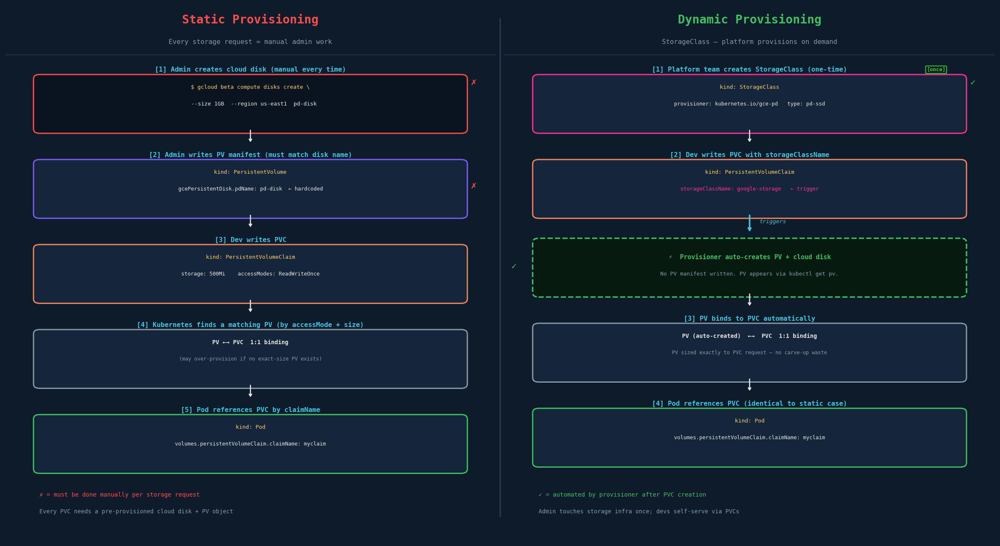
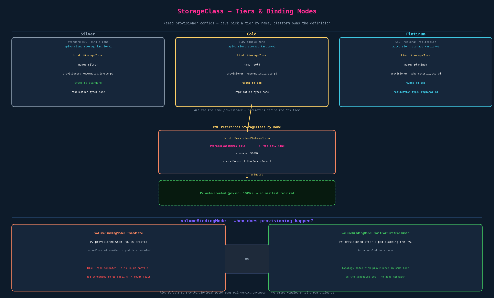

# Storage Classes

## The Problem: Static Provisioning

Everything from chapter 04 (PV → PVC → Pod) assumed somebody pre-created the underlying storage. That process has two mandatory manual steps every time a dev needs persistent storage:

**Step 1 — Provision the cloud disk:**
```bash
gcloud beta compute disks create \
  --size 1GB \
  --region us-east1 \
  pd-disk
```

**Step 2 — Write a PV manifest that references that exact disk by name:**
```yaml
apiVersion: v1
kind: PersistentVolume
metadata:
  name: pv-vol1
spec:
  accessModes:
    - ReadWriteOnce
  capacity:
    storage: 500Mi
  gcePersistentDisk:        # Must match the disk you just provisioned
    pdName: pd-disk         # Hardcoded. Change the disk name and this breaks.
    fsType: ext4
```

Then the dev writes a PVC, which Kubernetes tries to match against existing PVs. This is **static provisioning**: an admin manually provisions storage and manually creates PV objects ahead of time. It doesn't scale — every new PVC needs a pre-existing disk and a pre-existing PV.

**The pain points:**
- Admin has to touch the cloud console (or CLI) before any dev can get storage
- PV manifest is tightly coupled to the disk name — change the disk, update the manifest
- PVs can only be claimed by one PVC; if a 500Mi PV exists but a PVC asks for 200Mi, the full 500Mi is consumed (carve-up waste from ch04)
- No self-service for dev teams

---

## The Solution: StorageClasses

A **StorageClass** (SC) is a cluster-level object that describes *how* to provision storage: which provisioner creates the disk, and with what configuration. It doesn't create storage — it defines the template for automatic creation on demand.

**The shift:**

| Before (static) | After (StorageClass + dynamic) |
|---|---|
| Admin creates cloud disk | Admin creates StorageClass once |
| Admin writes PV manifest | Dev writes PVC with `storageClassName` |
| Dev writes PVC | Provisioner auto-creates PV + disk |
| Pod references PVC | Pod references PVC (unchanged) |

The PV still exists — you can see it with `kubectl get pv` — but you didn't write it. The provisioner wrote it for you, sized exactly to the PVC request.



---

## StorageClass YAML

```yaml
apiVersion: storage.k8s.io/v1          # Always this — NOT core/v1
kind: StorageClass
metadata:
  name: google-storage                  # Arbitrary name; PVCs reference this
provisioner: kubernetes.io/gce-pd      # The plugin that creates actual storage
parameters:                             # Provisioner-specific config
  type: pd-standard                    # Options: pd-standard | pd-ssd
  replication-type: none               # Options: none | regional-pd
```

Two required fields beyond metadata:
- **`provisioner`** — names the plugin. Kubernetes calls this to create/delete volumes.
- **`parameters`** — provisioner-specific key-value map. Each provisioner has its own set of valid params.

### Provisioners

**In-tree (legacy, being phased out):**

| Provisioner | Platform |
|---|---|
| `kubernetes.io/gce-pd` | GCP Persistent Disk |
| `kubernetes.io/aws-ebs` | AWS EBS |
| `kubernetes.io/azure-disk` | Azure Disk |
| `kubernetes.io/azure-file` | Azure File |
| `kubernetes.io/no-provisioner` | Local volumes (no dynamic provisioning) |

In-tree provisioners live inside the `kube-controller-manager` binary. They're baked in, which is why they're being replaced.

**Out-of-tree / CSI (the modern reality):**

CSI (Container Storage Interface) provisioners run as separate pods in the cluster — usually a controller plugin (StatefulSet) and a node plugin (DaemonSet). They're deployed via Helm or manifests from the storage vendor. Provisioner names like `ebs.csi.aws.com`, `pd.csi.storage.gke.io`, `disk.csi.azure.com`.

> **For CKAD:** you won't install CSI drivers during the exam. You will write PVCs that reference a named StorageClass. Know the wiring and what the fields do. CSI internals are CKS territory.

> **In production:** a platform team typically deploys CSI drivers (provisioner names look like vendor URIs, not `kubernetes.io/*`). A StatefulSet uses per-pod PVCs backed by whatever SC the platform defined. You write the `storageClassName`; the platform team owns what's behind it.

---

## Dynamic Provisioning — Full Flow

```yaml
# 1. Platform team creates StorageClass (one-time)
apiVersion: storage.k8s.io/v1
kind: StorageClass
metadata:
  name: google-storage
provisioner: kubernetes.io/gce-pd
parameters:
  type: pd-standard
  replication-type: none
```

```yaml
# 2. Dev creates PVC with storageClassName — this is the trigger
apiVersion: v1
kind: PersistentVolumeClaim
metadata:
  name: myclaim
spec:
  accessModes:
    - ReadWriteOnce
  storageClassName: google-storage      # ← references SC by name
  resources:
    requests:
      storage: 500Mi
```

When the PVC is created:
1. Kubernetes reads `storageClassName: google-storage`
2. Finds the SC object named `google-storage`
3. Calls the `kubernetes.io/gce-pd` provisioner: "create a 500Mi pd-standard disk"
4. Provisioner creates the disk on GCP
5. Kubernetes auto-creates a PV object bound to that disk
6. PVC binds to the PV

```yaml
# 3. Pod spec is identical to static case — nothing changes here
apiVersion: v1
kind: Pod
metadata:
  name: random-number-generator
spec:
  containers:
    - image: alpine
      name: alpine
      command: ["/bin/sh", "-c"]
      args: ["shuf -i 0-100 -n 1 >> /opt/number.out;"]
      volumeMounts:
        - mountPath: /opt
          name: data-volume
  volumes:
    - name: data-volume
      persistentVolumeClaim:
        claimName: myclaim            # Pod doesn't care how the PVC got its storage
```

---

## Multiple StorageClasses — Tiered Storage

You can define as many StorageClasses as you want. Platform teams often expose tiers that map to different cost/performance levels:

```yaml
# sc-definition.yaml — HDD, single zone
apiVersion: storage.k8s.io/v1
kind: StorageClass
metadata:
  name: silver
provisioner: kubernetes.io/gce-pd
parameters:
  type: pd-standard
  replication-type: none
```

```yaml
# sc-gold-definition.yaml — SSD, single zone
apiVersion: storage.k8s.io/v1
kind: StorageClass
metadata:
  name: gold
provisioner: kubernetes.io/gce-pd
parameters:
  type: pd-ssd
  replication-type: none
```

```yaml
# sc-platinum-definition.yaml — SSD, regional replication
apiVersion: storage.k8s.io/v1
kind: StorageClass
metadata:
  name: platinum
provisioner: kubernetes.io/gce-pd
parameters:
  type: pd-ssd
  replication-type: regional-pd       # Multi-zone redundancy
```

All three use the same provisioner. The `parameters` block is what differentiates them. A dev picks a tier by putting its name in `storageClassName`. The platform team controls what each tier actually does — devs never touch GCP IAM or disk APIs.



---

## Binding Modes

StorageClasses have a `volumeBindingMode` field that controls *when* the provisioner creates the disk:

```yaml
apiVersion: storage.k8s.io/v1
kind: StorageClass
metadata:
  name: gold
provisioner: kubernetes.io/gce-pd
volumeBindingMode: WaitForFirstConsumer    # ← topology-aware
parameters:
  type: pd-ssd
  replication-type: none
```

| Mode | Behavior | When to use |
|---|---|---|
| `Immediate` (default for most SCs) | PV provisioned as soon as PVC is created | Storage with no zone affinity (e.g., NFS, object store) |
| `WaitForFirstConsumer` | PV provisioned after a pod referencing the PVC is scheduled to a node | Zone-aware storage (AWS EBS, GCP PD, Azure Disk) |

**Why `WaitForFirstConsumer` exists:**

GCP persistent disks and AWS EBS volumes are zone-specific — a disk in `us-east1-b` can only be mounted by a pod running in `us-east1-b`. With `Immediate`, the provisioner creates the disk as soon as the PVC lands, picking an arbitrary zone. Then when a pod tries to claim it, the scheduler might place the pod in `us-east1-c`, and the disk is unreachable. Mount fails. Pod never starts.

`WaitForFirstConsumer` defers provisioning until the scheduler has picked a node for the pod. At that point, Kubernetes knows the zone and tells the provisioner: "create the disk *in this zone*." No mismatch.

> **Exam gotcha:** a PVC with `WaitForFirstConsumer` SC stays `Pending` after creation — even when the SC exists and the PVC is valid. This is correct behavior, not a bug. The PVC won't bind until a pod that references it gets scheduled. If you see a hanging PVC on the exam, `kubectl describe sc <name>` and check `VolumeBindingMode`.

---

## kind Cluster Example

kind ships with a default StorageClass backed by `rancher.io/local-path` (local-path-provisioner):

```
$ kubectl get storageclass
NAME                 PROVISIONER             RECLAIMPOLICY   VOLUMEBINDINGMODE      ALLOWVOLUMEEXPANSION
standard (default)   rancher.io/local-path   Delete          WaitForFirstConsumer   false
```

This provisions storage using local node paths inside the kind node containers (`/var/local-path-provisioner/`). Uses `WaitForFirstConsumer`, so:

```bash
# This PVC will stay Pending:
kubectl apply -f pvc.yaml
kubectl get pvc   # Status: Pending — correct, waiting for a pod

# Create a pod that uses it — PVC binds, PV appears:
kubectl apply -f pod.yaml
kubectl get pvc   # Status: Bound
kubectl get pv    # Auto-created PV appears here
```

This is the cleanest hands-on loop for dynamic provisioning without cloud credentials.

---

## What Happens When `storageClassName` is Omitted or Empty

| `storageClassName` value | Behavior |
|---|---|
| Named SC (e.g., `gold`) | Dynamic provisioning via that SC |
| `""` (empty string) | Opts out of dynamic provisioning; only binds to a manually-created PV that also has `storageClassName: ""` |
| Field absent entirely | Uses the cluster's default SC if one is annotated as default |

Check the default: `kubectl get sc` — the default has `(default)` after its name.

> If a cluster has a default SC and you omit `storageClassName` from a PVC, provisioning fires automatically. On exam clusters this is usually intentional. Set `storageClassName: ""` if you explicitly need to match a static PV.

---

## Reclaim Policy

SCs have a `reclaimPolicy` field:

| Policy | Behavior when PVC is deleted |
|---|---|
| `Delete` (SC default) | PV and underlying cloud disk are deleted |
| `Retain` (static PV default) | PV stays, marked `Released`; data preserved but PV can't be rebound until manually cleaned |

This is a frequent source of confusion: static PVs default to `Retain`, dynamically provisioned PVs default to `Delete`. If you're in a staging environment and want to recover a deleted PVC's data, `Delete` has already nuked the disk.

---

## Imperative Shortcuts

No `kubectl create storageclass` shortcut — always declarative. What you do need:

```bash
# List all SCs; identify which is default
kubectl get sc
kubectl get storageclass

# Inspect a specific SC (provisioner, binding mode, params, reclaim policy)
kubectl describe sc standard

# Check PVC status and which SC it's using
kubectl get pvc
kubectl describe pvc myclaim

# See auto-created PVs
kubectl get pv

# Apply a PVC and watch it bind
kubectl apply -f pvc.yaml
kubectl get pvc -w                     # Watch for status transition Pending → Bound

# Force-dry-run a PVC manifest
kubectl apply -f pvc.yaml --dry-run=client
```

---

## Exam-Pattern Gotchas

- **`storageClassName` typo → PVC stuck Pending.** The PVC can't find the SC if the name doesn't match exactly. `kubectl describe pvc <name>` will say `no StorageClass with that name`.
- **Don't write a PV manifest for dynamic provisioning.** Writing a manual PV alongside an SC creates a conflict: your PV may bind the PVC before the provisioner does, leaving you with a static bind that bypasses the SC entirely.
- **`WaitForFirstConsumer` PVCs look broken but aren't.** PVC Pending after creation is expected behavior with this binding mode.
- **Exam clusters have a default SC.** A PVC without `storageClassName` will use it. Always check `kubectl get sc` to understand what's in the cluster.
- **`""` vs absent field.** `storageClassName: ""` is an explicit opt-out. Omitting the field entirely is not. They behave differently.
- **Reclaim policy is the SC's, not the PV's option.** The PV inherits it at creation time; changing the SC after the fact doesn't affect existing PVs.

## References

- [Storage Classes](https://kubernetes.io/docs/concepts/storage/storage-classes/) — the StorageClass object: `provisioner`, `parameters`, `reclaimPolicy`, `volumeBindingMode`, default-class annotation, and per-backend examples
- [Dynamic Volume Provisioning](https://kubernetes.io/docs/concepts/storage/dynamic-provisioning/) — how a PVC's `storageClassName` triggers automatic PV creation, defaulting behavior, and topology-aware provisioning
- [Persistent Volumes](https://kubernetes.io/docs/concepts/storage/persistent-volumes/) — reclaim policy and the static-vs-dynamic provisioning distinction this chapter builds on
