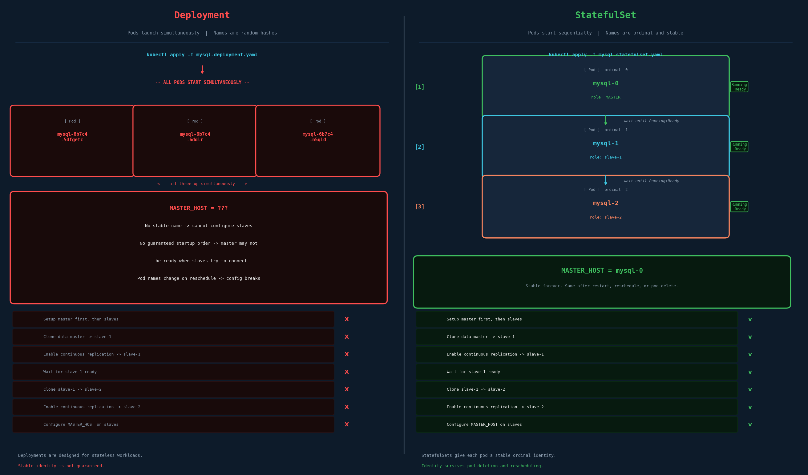
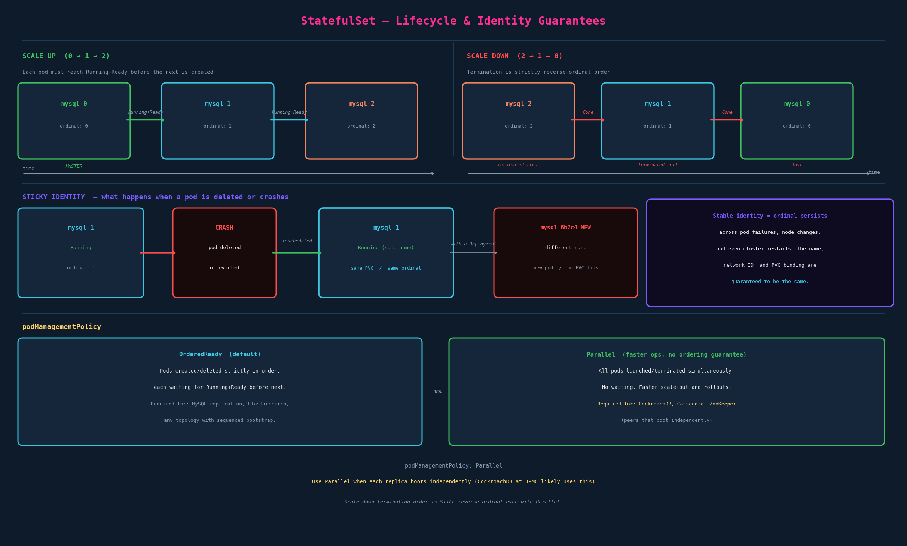

# StatefulSets

## The Problem — Stateful Applications Need Guarantees Deployments Can't Give

Start with a concrete example. You have a single MySQL instance running on a physical machine. It works. Now you want high availability, so you want to replicate it across three instances using a **master-slave topology**:

- **One master** — accepts reads and writes
- **Multiple slaves** — accept reads only; replicate continuously from master

Setting this up from scratch requires a specific sequence of operations:

1. Bring up the master instance first and configure it
2. Clone the master's data onto slave-1 (so slave-1 starts with a consistent snapshot)
3. Enable continuous replication from master → slave-1
4. Wait for slave-1 to finish catching up and reach a ready state
5. Clone data from **slave-1** (not master) onto slave-2 — this avoids overloading the master during init
6. Enable continuous replication from master → slave-2
7. Configure `MASTER_HOST` on each slave so they know where to connect

**Why steps 5 is slave-1 and not master:** the master is serving live traffic. Cloning from it costs I/O and CPU. slave-1 is already caught up and idle — use it instead. This only works if slave-1 is guaranteed to exist and be ready before slave-2 starts.

This isn't academic — it's the exact setup required for any MySQL replication topology, and the same pattern applies to many distributed databases: setup order matters, node identity matters, and stable addresses matter.

---

## Why Deployments Fail for This

If you tried to deploy this as a Kubernetes Deployment, every one of the 7 steps above breaks:

**Problem 1 — Random names.** Deployments generate pod names like `mysql-6b7c4-5dfgetc`. You can't configure `MASTER_HOST` before deployment because you don't know what the master's pod name will be. Even if you discover it post-deploy, the name changes the next time the pod is rescheduled.

**Problem 2 — Simultaneous startup.** Deployments launch all replicas at once. All three MySQL pods start at the same time. Master isn't ready when slaves try to connect.

**Problem 3 — No role distinction.** There's nothing in a Deployment that tells slave-2 to wait for slave-1 to be ready before cloning from it. Step 4 in the setup (wait for slave-1) can't be enforced.

**Problem 4 — No stable storage binding.** If a Deployment pod is rescheduled, it might get a different PVC, or no PVC at all. A slave that loses its data on reschedule has to re-clone from scratch on every node failure.

The root cause: **Deployments are designed for stateless workloads** where each replica is identical and fungible. For stateful applications, identity, order, and stability all matter.

---

## StatefulSets — What They Are

A StatefulSet is a workload API object that manages a set of pods and provides guarantees that Deployments don't:

1. **Ordered, sequential pod creation** — pods start one at a time, in ordinal order (0, 1, 2...), each waiting for Running+Ready before the next begins
2. **Stable, predictable pod names** — pods are named `<statefulset-name>-<ordinal>`, not random hashes
3. **Stable network identity** — each pod gets a consistent DNS entry via a headless service (covered in next chapter)
4. **Stable storage** — each pod gets its own PVC via `volumeClaimTemplates`, and that PVC survives pod deletion (covered in chapter 08)
5. **Ordered, reverse-ordinal termination** — pods are deleted in reverse order (2, 1, 0)

The key mental model: **a StatefulSet pod is not fungible**. `mysql-0` is the master. It's always `mysql-0`. If it crashes and gets rescheduled to a different node, it comes back as `mysql-0`, with the same PVC, the same network identity, and the same role. This is the core contract.



---

## Pod Naming — Ordinal Indices

For a StatefulSet named `mysql` with 3 replicas, you get:

```
mysql-0   ← ordinal 0; always the first pod created; always the last deleted
mysql-1   ← ordinal 1
mysql-2   ← ordinal 2; always the last pod created; always the first deleted
```

The naming scheme is `<statefulset-name>-<ordinal>`. No hashes. No randomness.

**This is the entire difference for configuration:** you can hardcode `MASTER_HOST=mysql-0` in a ConfigMap before the StatefulSet even exists, because you know that `mysql-0` will always be the master.

**Contrast with Deployment:**
```
mysql-6b7c4-5dfgetc   ← ReplicaSet hash + pod hash; changes on every reschedule
mysql-6b7c4-6ddlr
mysql-6b7c4-n5qld
```

### Ordinal Identity Is Sticky

If `mysql-1` crashes — the pod is evicted, the node fails, whatever — Kubernetes reschedules it as `mysql-1` again. Same ordinal, same name, same DNS entry (via headless service), same PVC binding. The data is there. The replication config still points to the right place.

With a Deployment, the replacement pod gets a new random name and a fresh PVC. You'd have to re-clone and re-configure replication. That's the fundamental difference in production.

---

## StatefulSet YAML

```yaml
apiVersion: apps/v1
kind: StatefulSet
metadata:
  name: mysql
spec:
  selector:
    matchLabels:
      app: mysql
  serviceName: mysql            # ← REQUIRED: headless service name (details in ch07)
  replicas: 3
  podManagementPolicy: OrderedReady   # default; use Parallel for peer-topology DBs
  updateStrategy:
    type: RollingUpdate
    rollingUpdate:
      partition: 0              # 0 = update all pods; set higher for canary (see below)
  template:                     # Pod template — same as Deployment
    metadata:
      labels:
        app: mysql
    spec:
      containers:
        - name: mysql
          image: mysql:8.0
          env:
            - name: MYSQL_ROOT_PASSWORD
              valueFrom:
                secretKeyRef:
                  name: mysql-secret
                  key: password
          ports:
            - containerPort: 3306
          volumeMounts:
            - name: data
              mountPath: /var/lib/mysql
  volumeClaimTemplates:         # Per-pod PVCs — details in ch08
    - metadata:
        name: data
      spec:
        accessModes: [ "ReadWriteOnce" ]
        storageClassName: standard
        resources:
          requests:
            storage: 10Gi
```

### Fields that differ from Deployment

| Field | Deployment | StatefulSet |
|---|---|---|
| `serviceName` | not present | **required** — names the headless service |
| `podManagementPolicy` | n/a | `OrderedReady` or `Parallel` |
| `updateStrategy.rollingUpdate.partition` | n/a | controls canary updates |
| `volumeClaimTemplates` | n/a | per-pod PVC template |

`serviceName` is the field most people miss. It must reference a headless Service that you create separately. Without it, you can create the StatefulSet but the pods won't have stable DNS entries.

---

## Pod Creation Lifecycle — In Depth



### Scale Up (create order)

When you apply a StatefulSet with 3 replicas:

1. `mysql-0` is created
2. Kubernetes waits for `mysql-0` to report `Running` and `Ready` (readiness probe passing)
3. `mysql-1` is created
4. Kubernetes waits for `mysql-1` to report `Running` and `Ready`
5. `mysql-2` is created
6. Kubernetes waits for `mysql-2` to be ready

If any pod fails to reach Ready state, the StatefulSet controller blocks — it won't create the next pod. **This is why step 4 of the MySQL setup (wait for slave-1 ready) is satisfied by default.** slave-1 being Ready is the prerequisite for slave-2 to be created, built into the StatefulSet machinery.

### Scale Down (delete order)

Deletion is strictly reverse-ordinal:

1. `mysql-2` is terminated and removed from the cluster
2. Only after `mysql-2` is fully gone does `mysql-1` terminate
3. Only after `mysql-1` is fully gone does `mysql-0` terminate

This protects the master. The highest-numbered (most recently added) replicas go first. You never lose the master while slaves are still running.

### Pod Replacement on Failure

If `mysql-1` crashes:
- The StatefulSet controller detects the pod is gone
- It creates a new pod named `mysql-1` (same name, same ordinal)
- The new pod mounts the same PVC that `mysql-1` had before
- DNS resolves `mysql-1.<headless-service>` to the new pod's IP
- Applications that were configured to talk to `mysql-1` continue working without reconfiguration

This is "sticky identity" — the pod changes (new IP, potentially new node) but its name, storage, and network identity are preserved.

---

## podManagementPolicy — OrderedReady vs Parallel

```yaml
spec:
  podManagementPolicy: OrderedReady   # or Parallel
```

### OrderedReady (default)

Sequential creation/deletion. Each pod waits for Running+Ready before the next is created. Termination is also sequential (one at a time in reverse order).

**When you need this:** any topology where bootstrap order matters. MySQL master-slave — master must be initialized before slaves can clone it. Elasticsearch — the first node bootstraps the cluster; subsequent nodes join. Any system where N depends on N-1 being ready.

**Cost:** slower scale-out and rollouts. Scaling from 3 to 6 replicas means 3 sequential pod creations, each waiting for readiness.

### Parallel

All pods created (or deleted) simultaneously. No waiting. No ordering. This is the same behavior as a Deployment replica scale-up.

**When you need this:** peer-to-peer topologies where each node bootstraps independently and discovers others through a service or gossip protocol. This includes:

- **CockroachDB** — nodes join a cluster using `--join` addresses, not sequential initialization
- **Cassandra** — uses gossip for cluster membership
- **ZooKeeper** — requires a majority quorum, but each node boots independently

A CockroachDB StatefulSet typically uses `Parallel`: nodes don't have master/slave roles — every node is a peer. Sequential startup would just slow down deployments unnecessarily.

> **Important detail:** `podManagementPolicy: Parallel` affects *creation* and *scaling*. Scale-down termination is still reverse-ordinal even with `Parallel`. The final pod is always deleted last.

---

## Update Strategies

```yaml
spec:
  updateStrategy:
    type: RollingUpdate       # or OnDelete
    rollingUpdate:
      partition: 0
```

### RollingUpdate (default)

When you update the pod template (new image, env var change, etc.), pods are updated in **reverse-ordinal order**: `mysql-2` is updated first, then `mysql-1`, then `mysql-0`.

This is deliberately the opposite of creation order. Slaves are updated before the master. If the update causes a problem, you catch it in a non-master pod before it affects the master.

### The `partition` field — Canary updates on StatefulSets

`partition` is the most powerful and least-documented feature of StatefulSet updates. It controls which pods get updated when you change the pod template.

```yaml
updateStrategy:
  type: RollingUpdate
  rollingUpdate:
    partition: 2        # Only pods with ordinal >= 2 will be updated
```

With 3 replicas and `partition: 2`, **only `mysql-2`** gets the new image when you update. `mysql-0` and `mysql-1` keep the old image.

This is a StatefulSet canary: roll out a change to the highest-ordinal pod first, validate it, then lower the partition to include more pods.

```bash
# Set partition to test only mysql-2
kubectl patch sts mysql -p '{"spec":{"updateStrategy":{"rollingUpdate":{"partition":2}}}}'
kubectl set image sts/mysql mysql=mysql:8.1

# Validate mysql-2 is working
kubectl exec mysql-2 -- mysql --version

# Roll out to mysql-1 as well
kubectl patch sts mysql -p '{"spec":{"updateStrategy":{"rollingUpdate":{"partition":1}}}}'

# Roll out to all
kubectl patch sts mysql -p '{"spec":{"updateStrategy":{"rollingUpdate":{"partition":0}}}}'
```

This pattern is common for databases where you want to verify the new version handles replication correctly before touching the master.

### OnDelete

No automatic rollout. Pods are only updated when you manually delete them (and the controller recreates them). Useful when you want full manual control over update order.

---

## StatefulSet vs Deployment — Decision Matrix

| Criterion | Deployment | StatefulSet |
|---|---|---|
| Pod names | Random hashes | Stable ordinals (`name-0`, `name-1`) |
| Startup order | Simultaneous | Sequential (or Parallel policy) |
| Termination order | Unordered | Reverse ordinal |
| Per-replica storage | Shared PVC or none | Individual PVC per pod (`volumeClaimTemplates`) |
| Network identity | Service round-robins | Stable DNS per pod (headless service) |
| Use case | Stateless: web servers, APIs, workers | Stateful: databases, message brokers, distributed coordinators |

**When NOT to use StatefulSet:** if your app doesn't need stable identity, don't reach for it. StatefulSets add operational complexity — rolling updates are slower, debugging is more nuanced, and PVC cleanup on scale-down requires manual intervention (PVCs are not automatically deleted to protect data). If your app is stateless or stores state externally (in a database you're separately managing), use a Deployment.

**Rule of thumb:** if you'd never care which pod handles a request, use Deployment. If any pod's identity, history, or stored data matters, use StatefulSet.

---

## Example — CockroachDB

CockroachDB is deployed as a StatefulSet in virtually every Kubernetes environment. Key points:

**Node identity:** each CRDB node has a stable node ID that maps to its pod name. If `cockroachdb-2` is rescheduled to a different node, it rejoins the cluster as node `cockroachdb-2` with the same store. This is the sticky identity guarantee — without StatefulSets, CRDB would see it as a brand-new node, rebalancing all ranges onto it.

**No master/slave in CRDB:** unlike MySQL, CockroachDB doesn't have a designated master. All nodes are peers that coordinate via Raft consensus. This means `podManagementPolicy: Parallel` is appropriate — you don't need ordered bootstrap.

**`--join` flag:** CRDB nodes discover each other using `--join <stable-dns-of-other-nodes>`. The stable DNS comes from the headless service + ordinal names — the headless service pattern covered in the next chapter.

**`kubectl delete pod cockroachdb-1`:** in a healthy CRDB cluster, deleting a pod is a routine operation (rolling restarts for upgrades). The pod comes back as `cockroachdb-1` with the same store files, rejoins the cluster, and resumes. This only works because of StatefulSet's sticky identity.

---

## Imperative Shortcuts

No `kubectl create statefulset` shortcut with all options — always declarative for StatefulSets. What you need:

```bash
# Apply a StatefulSet
kubectl apply -f statefulset.yaml

# Get StatefulSets
kubectl get sts
kubectl get statefulset

# Describe (see replicas, update strategy, events)
kubectl describe sts mysql

# Watch pods coming up in order
kubectl get pods -l app=mysql -w

# Scale
kubectl scale sts mysql --replicas=5
# Scaling up adds mysql-3, mysql-4 sequentially.
# kubectl get pods -w shows them appearing one at a time.

# Scale down
kubectl scale sts mysql --replicas=2
# Removes mysql-4, then mysql-3, then mysql-2.

# Check rollout status (works like deployments)
kubectl rollout status sts/mysql

# Rollout history
kubectl rollout history sts/mysql

# Undo last rollout (updates partition to previous image)
kubectl rollout undo sts/mysql

# Restart all pods (triggers rolling restart in reverse-ordinal order)
kubectl rollout restart sts/mysql

# Delete a single pod (it will be recreated with the same name)
kubectl delete pod mysql-1

# Delete StatefulSet WITHOUT deleting pods (useful for management)
kubectl delete sts mysql --cascade=orphan

# Delete StatefulSet AND pods (PVCs are NOT automatically deleted)
kubectl delete sts mysql
# You must manually delete PVCs:
kubectl delete pvc -l app=mysql
```

---

## Exam-Pattern Gotchas

- **`serviceName` is required and must exist.** If the headless Service doesn't exist, pods still come up but they won't have stable DNS. The exam might give you a StatefulSet that's missing its Service — the symptom is pods running but not reachable by stable name.
- **PVCs are NOT deleted with the StatefulSet.** `kubectl delete sts mysql` leaves PVCs behind. This is intentional (data protection), but on the exam, if you're asked to fully clean up, delete PVCs separately.
- **Scale-down leaves PVCs.** Scale from 3 to 1 and `mysql-1`, `mysql-2` PVCs still exist. If you scale back up, those pods will pick up their old PVCs.
- **`partition` is not a traffic weight.** It controls which pods get a *new image on update*, not which ones receive traffic. This confuses people who expect it to work like a Deployment canary.
- **OrderedReady + failing readiness probe = stuck StatefulSet.** If `mysql-1`'s readiness probe fails, `mysql-2` will never be created. The controller waits indefinitely. Debug with `kubectl describe pod mysql-1` and check probe failure events.
- **`kubectl rollout restart sts` updates in reverse ordinal.** The highest-numbered pod restarts first, working down to 0. Same order as updates.
- **StatefulSet pods aren't deleted during node failures by default.** The pod on a failed node shows as `Terminating` indefinitely (Kubernetes waits for the node to come back). For databases where another copy of the data is safe, you can force-delete: `kubectl delete pod mysql-1 --force --grace-period=0`.

## References

- [StatefulSets](https://kubernetes.io/docs/concepts/workloads/controllers/statefulset/) — the authoritative reference: stable identity, ordered deployment/scaling, `serviceName`, `podManagementPolicy`, update strategies with `partition`, and `volumeClaimTemplates`
- [StatefulSet Basics](https://kubernetes.io/docs/tutorials/stateful-application/basic-stateful-set/) — hands-on tutorial demonstrating ordinal naming, ordered creation/termination, stable network identity, and RollingUpdate/OnDelete
- [Dynamic Volume Provisioning](https://kubernetes.io/docs/concepts/storage/dynamic-provisioning/) — how each pod's `volumeClaimTemplates` PVC gets a per-pod PV via a StorageClass
