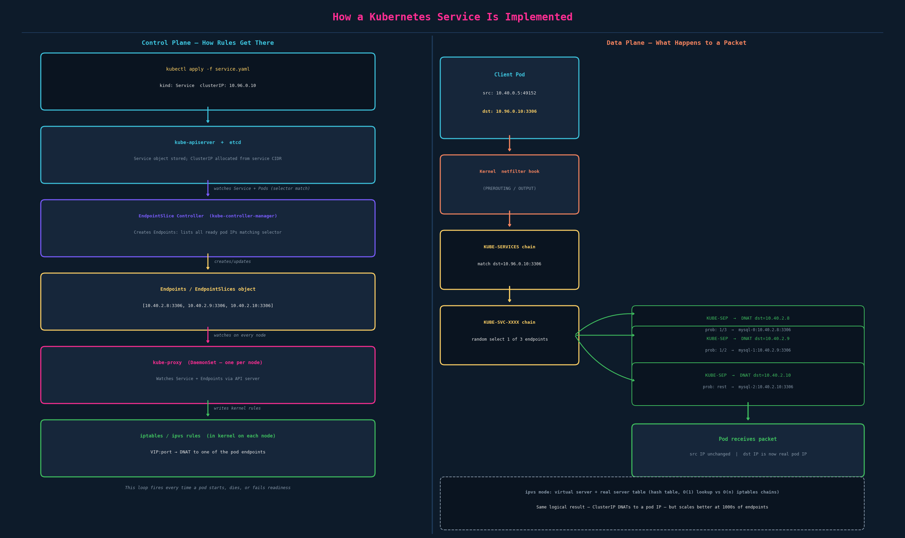
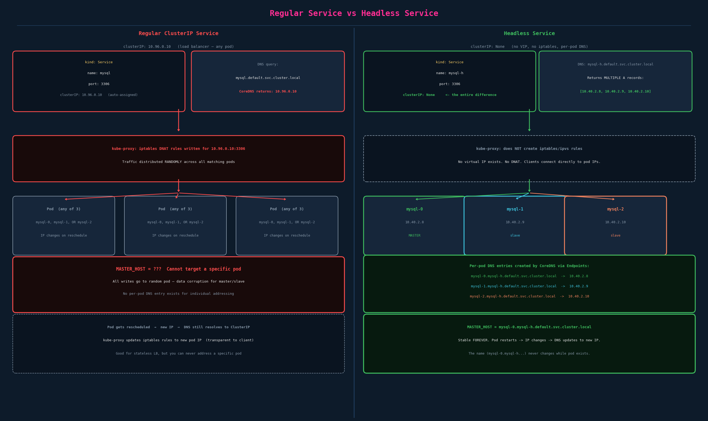

# Headless Services and Per-Pod DNS

## What ch06 Already Covers

Ch06 covers StatefulSet ordering, ordinal naming, sticky identity, `podManagementPolicy`, and update strategies. This chapter covers the **network identity** half of StatefulSets — the part that makes per-pod DNS work — and the deeper question of how Kubernetes Services are implemented at all, which is relevant to understanding why headless services are different.

---

## How a Kubernetes Service Is Actually Implemented

A Service is essentially entries in the proxy's network table so routing can happen. The full chain:

### Control Plane: How the Rules Get There

1. **You apply a Service manifest.** The API server stores it and allocates a ClusterIP from the service CIDR (e.g., `10.96.0.0/12`). No packet routing yet — just metadata in etcd.

2. **EndpointSlice controller** (inside `kube-controller-manager`) watches the Service's selector and watches Pods. When pods matching the selector become Ready, it creates/updates `EndpointSlice` objects listing their IPs and ports.
   ```
   Endpoints: [10.40.2.8:3306, 10.40.2.9:3306, 10.40.2.10:3306]
   ```
   This updates live — if `mysql-1` dies, `10.40.2.9` is removed from the list immediately.

3. **kube-proxy** runs as a DaemonSet — one pod per node. It watches Service and EndpointSlice objects via the API server. Every time the endpoint list changes, kube-proxy updates the **kernel's network rules on that node**.

4. **Kernel rules** on each node — two common modes:
   - **iptables mode (default):** kube-proxy writes iptables chains. Packet destined for `10.96.0.10:3306` hits a `KUBE-SERVICES` chain, gets redirected to a `KUBE-SVC-XXXX` chain that randomly selects one endpoint via probabilistic rules (statprob), then a `KUBE-SEP-YYYY` chain that **DNATs the packet** — rewrites the destination IP from the ClusterIP to the real pod IP. This all happens in the kernel's netfilter subsystem, before the routing decision, transparent to the application.
   - **ipvs mode:** kube-proxy creates a virtual server (`10.96.0.10:3306`) with real servers (`10.40.2.8`, etc.) in Linux IPVS (IP Virtual Server). IPVS uses a hash table — O(1) lookup vs O(n) iptables chain traversal. More efficient at scale (clusters with thousands of services and pods). Same logical result: VIP → DNAT to pod IP.
   - **nftables mode (newer):** same idea, different kernel subsystem.

5. **CoreDNS** independently handles DNS: `mysql.default.svc.cluster.local → 10.96.0.10`. No DNS-level load balancing for ClusterIP services — it's always a single IP (the VIP), and iptables/ipvs does the distribution.



### Key insight: the application knows nothing

The client pod sends a TCP connection to `10.96.0.10:3306`. The kernel silently rewrites the destination to `10.40.2.8:3306` before the packet leaves the node. The client's application code never sees the real pod IP. The response has its source IP rewritten back to `10.96.0.10` (via SNAT at the pod side). End-to-end, both sides believe they're talking to a stable VIP that never moves.

This is why services feel like "load balancers" — the kernel IS doing layer-4 load balancing, via iptables DNAT. There's no separate LB process; it's all in the kernel data path.

---

## Why a Regular Service Can't Target a Specific Pod

For a stateless web service, this is exactly what you want — traffic distributed across all replicas. For a MySQL master/slave setup, it's fatal:

- A write goes to any of the 3 pods — but only the master can accept writes
- Slaves receiving a write fail, cause data inconsistency, or both
- You can't set `MASTER_HOST` to the ClusterIP because that resolves randomly

The underlying issue: **a ClusterIP service gives you no way to address a specific pod by name.**

---

## Pod DNS — What Exists by Default

Every pod in Kubernetes gets a DNS record derived from its IP address:

```
10-40-2-8.default.pod.cluster.local   →   10.40.2.8
```

Dots in the IP are replaced with dashes. This is the pod's built-in DNS entry.

**Why this doesn't help:** when `mysql-0` is rescheduled, it gets a new IP — say `10.40.5.3`. Its DNS entry is now `10-40-5-3.default.pod.cluster.local`. The old entry (`10-40-2-8...`) is gone. You can't configure `MASTER_HOST=10-40-2-8.default.pod.cluster.local` before deployment because you don't know the IP. And even if you did, it breaks on every restart.

The pods also get a DNS name via the normal service, but that service load-balances and can't be used to target a specific pod.

---

## Headless Services: `clusterIP: None`

A headless service is a regular Service with one field changed:

```yaml
apiVersion: v1
kind: Service
metadata:
  name: mysql-h               # headless; name referenced in StatefulSet's serviceName
spec:
  ports:
    - port: 3306
  selector:
    app: mysql
  clusterIP: None             # ← This is the entire difference
```

What `clusterIP: None` does:

1. **No virtual IP is allocated.** There's nothing for kube-proxy to write iptables rules for. kube-proxy ignores this service entirely.
2. **CoreDNS behavior changes.** Instead of returning a single VIP for the service DNS name, it returns **all matching pod IPs directly** as multiple A records:
   ```
   mysql-h.default.svc.cluster.local → [10.40.2.8, 10.40.2.9, 10.40.2.10]
   ```
   The client gets the full list and picks one (or uses all for its own load balancing). No kernel DNAT involved — connections go directly to pod IPs.
3. **Per-pod DNS entries are created.** For each pod in the Endpoints list, CoreDNS creates an individual A record:
   ```
   mysql-0.mysql-h.default.svc.cluster.local  →  10.40.2.8
   mysql-1.mysql-h.default.svc.cluster.local  →  10.40.2.9
   mysql-2.mysql-h.default.svc.cluster.local  →  10.40.2.10
   ```
   These are stable **by name** even as the underlying IPs change.



### The DNS format

```
<pod-name>.<headless-service-name>.<namespace>.svc.<cluster-domain>
```

For the default cluster domain `cluster.local`:
```
mysql-0.mysql-h.default.svc.cluster.local
```

**Cluster domain doesn't change.** It's set at cluster creation time (default: `cluster.local`). You can hardcode this full DNS name in configuration — it's stable for the lifetime of the cluster. When `mysql-0` restarts with a new IP, CoreDNS updates the A record for `mysql-0.mysql-h.default.svc.cluster.local` to the new IP. The name itself never changes.

This is what "stable unique network identifier per pod" means:

| | Regular Deployment | StatefulSet + Headless |
|---|---|---|
| Pod identity | Random name (`mysql-6b7c4-abc`) | Stable ordinal (`mysql-0`) |
| Pod DNS | `10-40-2-8.default.pod.cluster.local` (IP-derived, changes on restart) | `mysql-0.mysql-h.default.svc.cluster.local` (name-based, stable) |
| Can address by stable name? | No | Yes |

---

## Getting Per-Pod DNS: Two Ways

### 1. Regular Pod or Deployment — Manual `subdomain` + `hostname`

For a pod or deployment pod template, you can opt into headless service DNS by setting two fields:

```yaml
apiVersion: v1
kind: Pod
metadata:
  name: myapp-pod
  labels:
    app: mysql
spec:
  subdomain: mysql-h          # must match the headless Service name
  hostname: mysql-pod         # the per-pod hostname portion
  containers:
    - name: mysql
      image: mysql
```

CoreDNS then creates: `mysql-pod.mysql-h.default.svc.cluster.local`

**The problem with doing this in a Deployment:** every pod in the Deployment gets the same pod template, so every pod would need a different `hostname`. You'd have to manually set different hostnames per pod — impossible with a uniform template. And even then, you don't control pod ordering.

### 2. StatefulSet — Automatic (this is the point)

When you set `serviceName: mysql-h` in a StatefulSet spec, the controller **automatically sets `hostname` and `subdomain` on every pod it creates**, using the pod's ordinal name and the service name:

```
mysql-0  →  hostname: mysql-0  subdomain: mysql-h
mysql-1  →  hostname: mysql-1  subdomain: mysql-h
mysql-2  →  hostname: mysql-2  subdomain: mysql-h
```

You don't put `hostname` or `subdomain` in the pod template yourself. The StatefulSet controller injects them. As long as the headless service exists with matching name, CoreDNS creates the per-pod entries automatically.

This is the full StatefulSet spec with `serviceName`:

```yaml
apiVersion: apps/v1
kind: StatefulSet
metadata:
  name: mysql
spec:
  serviceName: mysql-h        # ← references the headless service by name; REQUIRED
  replicas: 3
  selector:
    matchLabels:
      app: mysql
  template:
    metadata:
      labels:
        app: mysql
    spec:
      containers:
        - name: mysql
          image: mysql:8.0
          # NO subdomain or hostname here — StatefulSet controller sets them
```

The headless service and StatefulSet are **separate objects** — you deploy both:

```bash
kubectl apply -f headless-service.yaml     # must exist first (or concurrently)
kubectl apply -f statefulset.yaml
```

---

## Two-Service Pattern

For MySQL master/slave, you typically deploy two services:

```yaml
# 1. Headless: for per-pod addressing (slaves → master, init containers)
apiVersion: v1
kind: Service
metadata:
  name: mysql-h
spec:
  clusterIP: None
  selector:
    app: mysql
  ports:
    - port: 3306

---
# 2. Regular ClusterIP: for load-balanced reads (web app → any replica)
apiVersion: v1
kind: Service
metadata:
  name: mysql
spec:
  selector:
    app: mysql
  ports:
    - port: 3306
```

| Service | Name | Use |
|---|---|---|
| Headless | `mysql-h` | Slaves configure `MASTER_HOST=mysql-0.mysql-h...`; init containers clone from specific peers |
| Regular | `mysql` | Web app reads: `mysql.default.svc.cluster.local` → any pod (load balanced) |
| Writes | (direct) | Web app writes specifically to `mysql-0.mysql-h.default.svc.cluster.local` |

---

## Advanced Pattern — Sharded Leader/Standby + Envoy xDS

A more complex example: shard groups where each group has a leader pod + standby pod, and a control plane pushes the current leader's endpoint to Envoy via xDS (EDS — Endpoint Discovery Service). This maps cleanly to headless services — one StatefulSet + headless service per group (or a single StatefulSet with ordinals mapping to leader/standby roles) gives each pod a stable per-pod DNS entry.

**How the control plane uses this:**

1. Control plane watches Kubernetes `Lease` objects (or an internal Raft/election mechanism) to determine the current leader for each group
2. When election fires, the control plane knows the winning pod's name (e.g., `shard-group-0-0`)
3. Control plane constructs the stable DNS: `shard-group-0-0.shards-h.namespace.svc.cluster.local`
4. Control plane pushes this endpoint to Envoy via an xDS EDS update; Envoy routes writes for that group to it
5. Envoy's health check detects the pod going down; the control plane pushes a new EDS update with the standby

**The key property:** `shard-group-0-0.shards-h.namespace.svc.cluster.local` always resolves to the **current IP** of pod `shard-group-0-0`. If the pod restarts on a different node, DNS updates within a few seconds (CoreDNS TTL is typically 5–30 seconds). So:

- The DNS name is stable → config can reference it statically
- The DNS value (IP) stays current → connections always reach the right pod
- If the pod is completely down (between crash and reschedule), DNS temporarily doesn't resolve → Envoy's health checking stops routing until it comes back

For failover-latency-sensitive workloads, the CoreDNS TTL can introduce lag between a pod getting a new IP and DNS updating; pushing the new pod IP directly via xDS (from the Endpoints API) avoids relying on DNS TTL propagation.

---

## Exam-Pattern Gotchas

- **Headless service must exist before (or alongside) the StatefulSet.** If `serviceName: mysql-h` references a service that doesn't exist, the StatefulSet comes up but pods have no per-pod DNS entries.
- **`clusterIP: None` is the entire magic.** Omit it (or set any IP) and it's a regular service — you get load balancing, not per-pod DNS.
- **`subdomain` must match the headless service name exactly.** If it doesn't, CoreDNS won't create the per-pod entry. StatefulSets handle this automatically via `serviceName`, but manual pod specs require exact string match.
- **Headless service DNS for a pod is only available while the pod is Running+Ready.** A pod that's pending, crashed, or not in the Endpoints list won't have a DNS entry.
- **Regular pod DNS shorthand:** for regular pods, omitting `hostname` means the hostname is the pod name (the random hash). The full DNS entry still uses the IP-derived form. Only pods with `hostname` + `subdomain` get the `hostname.subdomain.ns.svc.cluster.local` form.
- **Both services must have the same selector.** The headless service needs `selector: app: mysql` to know which pods to create Endpoints for. If the selector is wrong, no Endpoints are created, and no per-pod DNS exists.
- **On the exam, you often see `clusterIP: None` paired with a StatefulSet.** The question might give you a StatefulSet that's missing its headless service — add one, and make sure `name:` matches `serviceName:` in the StatefulSet spec.

---

## Imperative Shortcuts

```bash
# Create a headless service (no generator shortcut — use YAML)
# Fastest way: use kubectl create service clusterip and then patch
kubectl create service clusterip mysql-h --tcp=3306:3306 --dry-run=client -o yaml \
  | kubectl set env --dry-run=client -f - ...  # then edit to add clusterIP: None

# Cleaner: just apply a YAML file directly
kubectl apply -f headless-service.yaml

# Verify the headless service has no ClusterIP
kubectl get svc mysql-h
# NAME      TYPE        CLUSTER-IP  EXTERNAL-IP  PORT(S)   AGE
# mysql-h   ClusterIP   None        <none>        3306/TCP  10s

# Check what Endpoints exist (shows which pod IPs are registered)
kubectl get endpoints mysql-h
kubectl describe endpoints mysql-h

# Verify per-pod DNS from inside a pod
kubectl exec -it mysql-0 -- nslookup mysql-0.mysql-h.default.svc.cluster.local
kubectl exec -it mysql-0 -- nslookup mysql-h.default.svc.cluster.local
# Second one returns all pod IPs (multiple A records)

# Check pod's hostname and subdomain (set by StatefulSet controller)
kubectl exec -it mysql-0 -- hostname
# mysql-0
kubectl exec -it mysql-0 -- hostname -f
# mysql-0.mysql-h.default.svc.cluster.local

# See CoreDNS resolv.conf in a pod (shows search domains)
kubectl exec -it mysql-0 -- cat /etc/resolv.conf
# search default.svc.cluster.local svc.cluster.local cluster.local
# nameserver 10.96.0.10  (CoreDNS ClusterIP)
```
