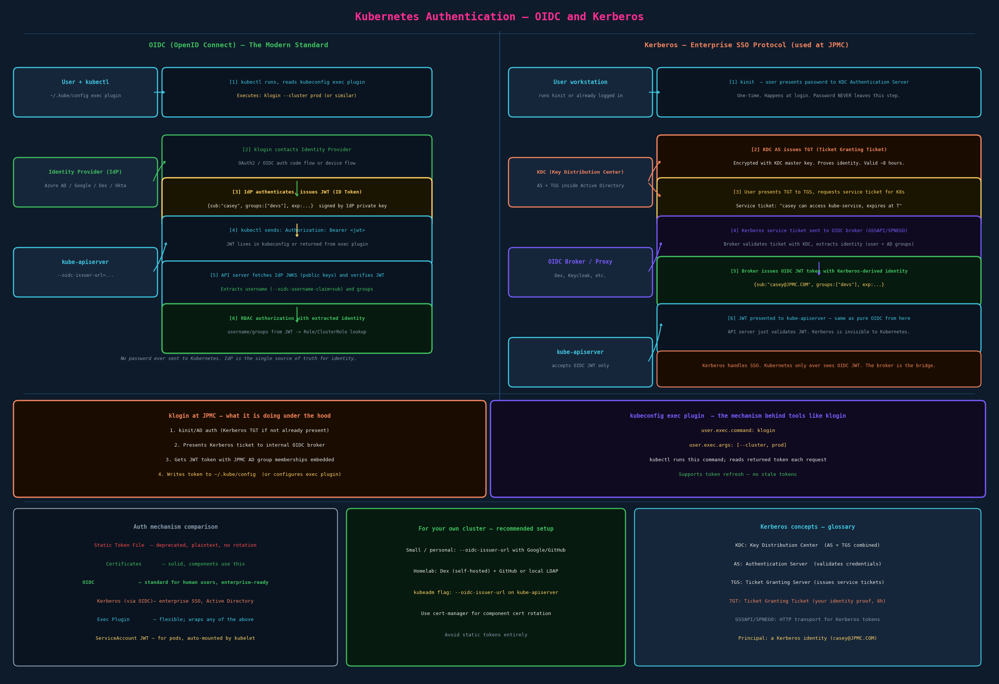

# Authentication

## Two Types of Accounts in Kubernetes

Kubernetes distinguishes two account types with fundamentally different properties:

| | User Accounts | Service Accounts |
|---|---|---|
| Who uses it | Humans (admins, developers) | Pods and in-cluster processes |
| Managed by | External system (IdP, certs) | Kubernetes (`kubectl create serviceaccount`) |
| Kubernetes object? | **No** | **Yes** — `kind: ServiceAccount` |
| Scope | Cluster-wide | Namespaced |
| Example | `casey`, `admin` | `default`, `my-app-sa` |

**The critical distinction:** Kubernetes has no `kubectl create user` command. There is no `User` object in the API. Users exist only in external systems (cert files, LDAP/AD, OIDC tokens) — Kubernetes just trusts what the authentication mechanism tells it about the caller's identity. This is by design: credential management is delegated to infrastructure that's already built for it.

```bash
# This does NOT exist:
kubectl create user casey          # no such command
kubectl get users                  # no such resource

# This DOES:
kubectl create serviceaccount sa1
kubectl get serviceaccount
```

---

## How Access Works

Two entry points to the API server:

```bash
# kubectl — reads ~/.kube/config for credentials and cluster address
kubectl get pods

# Direct HTTP (curl, REST clients, in-cluster pod calls)
curl -v https://kube-apiserver-ip:6443/api/v1/pods \
  --header "Authorization: Bearer <token>" \
  --cacert /path/to/ca.crt
```

Both go to the same endpoint. kubectl is a wrapper that reads kubeconfig and constructs the HTTP request. When debugging auth issues, `curl` strips away the kubectl abstraction and shows exactly what the API server sees.

---

## Auth Mechanisms — Overview

The API server supports multiple authentication plugins simultaneously. A request is accepted if **any** configured mechanism validates it.



| Mechanism | Status | Used for |
|---|---|---|
| Static Token File | Deprecated — never use | Teaching only |
| X.509 Certificates | Standard | Cluster components, kubeadm bootstrap |
| OIDC | Standard for humans | Enterprise users, most modern clusters |
| Kerberos (via OIDC) | Enterprise | Active Directory environments (JPMC) |
| ServiceAccount JWT | Standard | Pods / in-cluster applications |
| Exec Plugin | Standard (kubeconfig) | Wraps any external auth tool |
| Webhook Token Auth | Advanced | Custom auth logic |

---

## Static Token File — Skip It

A CSV file (`token,user,uid,group`) passed to the API server via `--token-auth-file`. The user sends the token in an `Authorization: Bearer` header.

**Why it's dead:** tokens are plaintext on disk, no rotation without API server restart, no expiry, no audit integration. Removed from CKS exam scope, deprecated in the course, not something you'd touch in production or your own cluster.

The one thing worth knowing: the header format `Authorization: Bearer <token>` is used by all token-based auth mechanisms, not just static tokens.

---

## X.509 Certificates — Cluster Components Use This

Every cluster component authenticates to the API server with a TLS client certificate. The certificate has two fields Kubernetes uses:

- `CN` (Common Name) → becomes the **username**
- `O` (Organization) → becomes the **group**

Examples from a real cluster:
```
kubelet CN:    system:node:worker-1     (group: system:nodes)
scheduler CN:  system:kube-scheduler
controller CN: system:kube-controller-manager
admin CN:      kubernetes-admin         (group: system:masters)
```

The `system:masters` group is hardcoded to have full cluster access. The admin kubeconfig from `kubeadm` uses this group, which is why it can do everything.

For human users in small clusters (no OIDC), you can create client certs:
```bash
# Generate a key and CSR
openssl genrsa -out casey.key 2048
openssl req -new -key casey.key -out casey.csr -subj "/CN=casey/O=developers"

# Sign with cluster CA (kubeadm stores CA at /etc/kubernetes/pki/ca.{crt,key})
openssl x509 -req -in casey.csr -CA ca.crt -CAkey ca.key \
  -CAcreateserial -out casey.crt -days 365

# Add to kubeconfig
kubectl config set-credentials casey \
  --client-certificate=casey.crt --client-key=casey.key
```

Certificates are covered in detail in the TLS chapter (ch05). The important thing here: `CN=casey` means Kubernetes sees the username `casey` and routes it through RBAC.

---

## OIDC — The Modern Standard for Human Users

OIDC (OpenID Connect) is an identity layer on top of OAuth2. It's the right way to add human users to a production cluster.

### The flow

1. **User runs kubectl.** kubectl reads kubeconfig and finds an exec plugin (or a token).
2. **Exec plugin runs** (e.g., `klogin`, `kubelogin`, `aws eks get-token`). It contacts the Identity Provider.
3. **IdP authenticates the user** (username+password, MFA, browser redirect, device flow — whatever the IdP requires).
4. **IdP issues a JWT (ID Token).** The JWT contains signed claims: `sub` (subject/username), `groups`, `email`, expiry timestamp. Signed with the IdP's private key.
5. **kubectl sends the JWT** in `Authorization: Bearer <jwt>` to the API server.
6. **API server validates the JWT.** It fetches the IdP's public keys from the JWKS endpoint (`<issuer>/.well-known/openid-configuration` → `jwks_uri`). Verifies the JWT signature. No password ever reaches Kubernetes — only a signed token.
7. **API server extracts identity.** Configured with `--oidc-username-claim=sub` (or `email`), `--oidc-groups-claim=groups`. These become the username and groups for RBAC.
8. **RBAC authorization** with the extracted identity.

### API server flags for OIDC

```bash
kube-apiserver \
  --oidc-issuer-url=https://accounts.google.com \
  --oidc-client-id=<your-client-id> \
  --oidc-username-claim=email \
  --oidc-groups-claim=groups \
  --oidc-ca-file=/etc/kubernetes/oidc-ca.crt   # if IdP uses private CA
```

### kubeconfig exec plugin

The exec plugin is the mechanism that makes enterprise login tools work. Instead of a static token in kubeconfig, you specify a command to run:

```yaml
# ~/.kube/config
users:
- name: casey
  user:
    exec:
      apiVersion: client.authentication.k8s.io/v1beta1
      command: klogin           # or: kubelogin, aws, gke-gcloud-auth-plugin
      args:
        - --cluster
        - prod-cluster
      env:
        - name: LOGIN_TENANT
          value: example
```

Every time kubectl needs credentials, it runs this command and reads the returned `ExecCredential` object (contains the Bearer token). This enables:
- Token refresh (exec plugin called again when token expires)
- MFA support (exec plugin opens browser)
- Custom enterprise auth flows

---

## Kerberos — How It Actually Works

Kerberos is a network authentication protocol from MIT (1980s), now ubiquitous in enterprise environments via Microsoft Active Directory. It solves a specific problem: how do you prove your identity to multiple services without sending your password to each one?

### The three parties

- **Client**: you (or any user/machine needing access)
- **KDC (Key Distribution Center)**: the trusted authority; implemented as `AS + TGS`
  - **AS (Authentication Server)**: validates your initial credentials
  - **TGS (Ticket Granting Server)**: issues tickets for specific services
- **Service**: whatever you want to access (Kubernetes, LDAP, email, etc.)

### The ticket flow (step by step)

**Step 1 — Initial authentication (`kinit`)**
You type your password once. The client sends your username to the AS. The AS responds with a **TGT (Ticket Granting Ticket)** encrypted with a key derived from your password. Your client decrypts the TGT with your password. If decryption succeeds, you have a TGT. Your password is now done — it never leaves your machine again.

**Step 2 — The TGT is your identity proof**
The TGT is an encrypted blob you can't read directly (it's for the KDC), but you carry it. It says "the AS verified this principal at this time, expiring at T." Typically valid for 8 hours. This is why you don't need to re-enter your password every time at work — you authenticated once, got a TGT, and it's still valid.

**Step 3 — Requesting a service ticket**
When you want to access a service (say, Kubernetes), your client presents the TGT to the TGS and says "I want a ticket for `HTTP/kubernetes.jpmc.com`." The TGS validates the TGT, creates a **service ticket** for that specific service, and returns it.

**Step 4 — Presenting the service ticket**
Your client presents the service ticket to the service via GSSAPI/SPNEGO (HTTP-layer protocols that carry Kerberos tokens). The service decrypts the ticket using its own secret key (shared with the KDC during service registration). If it decrypts correctly, you're authenticated.

**The key properties:**
- Your password is used exactly once, locally, at `kinit` time
- Every other authentication step uses cryptographic tickets, not passwords
- Tickets are time-limited and forwardable with restrictions
- The KDC is the only party that can issue valid tickets

### Why Kubernetes doesn't speak Kerberos natively

Kubernetes only understands OIDC JWTs, certificates, and a few other token formats. It doesn't have a GSSAPI/Kerberos plugin. So in enterprise environments, there's a broker:

```
User (Kerberos TGT)
  → presents service ticket to OIDC broker (Dex, Keycloak, custom)
  → broker validates ticket with KDC
  → broker issues OIDC JWT with identity claims
  → JWT presented to kube-apiserver
  → API server validates JWT normally
```

Kubernetes never knows Kerberos was involved. It just sees a valid OIDC JWT. The broker is the translation layer.

### Enterprise klogin-style flow

An enterprise auth tool typically:
1. Checks for an existing valid Kerberos TGT (`klist`). If expired, triggers re-authentication (`kinit`) against Active Directory
2. Requests a service ticket for the internal OIDC broker
3. Exchanges the Kerberos service ticket for an OIDC JWT via the broker
4. Writes the JWT (or configures an exec plugin that fetches it) into `~/.kube/config` for the target cluster

When a token expires mid-session and kubectl throws 401 errors, the JWT expired. Re-run the login tool to get a fresh one.

---

## ServiceAccount JWT — For Pods

ServiceAccounts give pods an identity to call the Kubernetes API. Covered in depth in the ServiceAccounts chapter (ch04). Key facts for now:

- Auto-mounted at `/var/run/secrets/kubernetes.io/serviceaccount/token`
- JWT format since Kubernetes 1.12+; "projected service account tokens" since 1.20 (audience-bound, time-limited)
- Every namespace has a `default` ServiceAccount that pods use unless `serviceAccountName:` is set
- The token is the pod's Bearer credential for API calls

---

## kubeconfig Structure

```yaml
apiVersion: v1
kind: Config
clusters:
  - name: prod-cluster
    cluster:
      server: https://api.prod.example.com:6443
      certificate-authority-data: <base64 CA cert>   # or certificate-authority: /path
contexts:
  - name: casey@prod
    context:
      cluster: prod-cluster
      user: casey
      namespace: default        # optional default namespace
current-context: casey@prod
users:
  - name: casey
    user:
      # Option A: static client cert
      client-certificate-data: <base64 cert>
      client-key-data: <base64 key>
      # Option B: static token
      token: eyJhbGciOiJSUzI1NiIs...
      # Option C: exec plugin (modern)
      exec:
        apiVersion: client.authentication.k8s.io/v1beta1
        command: klogin
        args: [--cluster, prod-cluster]
```

`kubectl config` commands:
```bash
kubectl config view                            # show kubeconfig
kubectl config current-context                 # active context
kubectl config use-context casey@prod          # switch context
kubectl config get-contexts                    # list all contexts
kubectl config set-context --current --namespace=700515d201053-caas-dev  # change default ns
```

---

## For Your Own Cluster — Authentication Setup

When you stand up your own cluster (kubeadm on Hetzner or kind for dev), here's how to do auth properly:

**Personal homelab / VPS (Hetzner):**

The simplest approach that's actually secure: OIDC with GitHub or Google as the IdP.

1. Register an OAuth2 app at GitHub/Google
2. Install [kubelogin](https://github.com/int128/kubelogin) (exec plugin wrapper for OIDC)
3. Pass OIDC flags to kube-apiserver at cluster creation:
   ```yaml
   # kubeadm ClusterConfiguration
   apiServer:
     extraArgs:
       oidc-issuer-url: "https://accounts.google.com"
       oidc-client-id: "<your-client-id>"
       oidc-username-claim: "email"
   ```
4. Configure kubeconfig with `kubelogin` exec plugin

After `kubeadm init`, you can add the OIDC flags by editing `/etc/kubernetes/manifests/kube-apiserver.yaml` directly (it's a static pod).

**Self-hosted identity (more control):**
- [Dex](https://dexidp.io): supports GitHub, Google, LDAP, SAML, and Kerberos as backends; issues OIDC tokens to Kubernetes
- [Keycloak](https://www.keycloak.org): enterprise-grade, supports Kerberos natively, heavy but full-featured

**cert-manager** for TLS cert rotation:
```bash
helm repo add jetstack https://charts.jetstack.io
helm install cert-manager jetstack/cert-manager --namespace cert-manager \
  --set installCRDs=true
```

The combination of OIDC (for users) + cert-manager (for component certs) gives you a cluster where no credentials are static files.

---

## Exam-Pattern Gotchas

- **`kubectl create user` doesn't exist.** If an exam question says "create a user," they mean create a certificate and bind it via kubeconfig.
- **ServiceAccount is the only Kubernetes-managed account type.** Everything else is external.
- **The `system:masters` group is hardcoded admin.** Any cert with `O=system:masters` gets full access regardless of RBAC.
- **`kubectl config set-context --current --namespace=<ns>`** is the way to change your default namespace without editing the file directly — useful shortcut during the exam.
