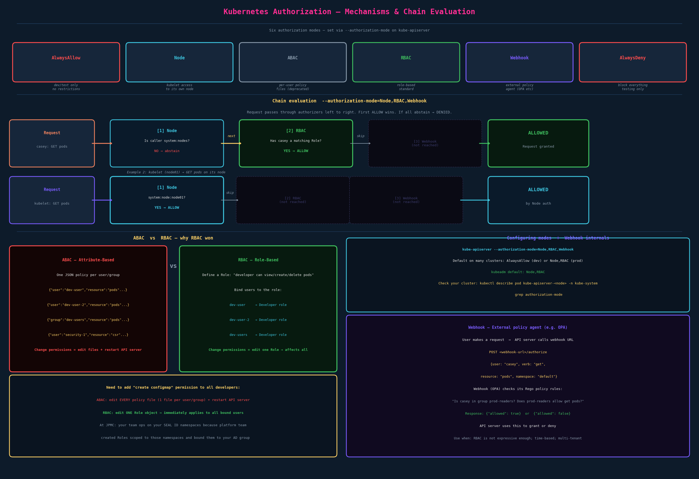

# Authorization

## Why Authorization Matters

Authentication answers "who are you?" Authorization answers "what are you allowed to do?" You need both. Without authorization, any authenticated user can do anything — admins, developers, bots, and CI pipelines all have the same unlimited access. That's not viable at scale, and it's a serious security risk.

The principle of **least privilege**: every account should only have the minimum permissions it needs to do its job. Nothing more.

In practice:
- Admins can do anything — create/delete nodes, manage cluster state
- Developers can deploy and manage their applications — `get`, `list`, `create`, `delete` pods, deployments in their namespaces
- Bots/CI pipelines may only need to push new images or update a specific deployment
- Nothing should be able to delete nodes except admins

In an enterprise setting, limited permissions map exactly to this: a platform team creates Roles scoped to team namespaces and binds them to an AD group via RoleBindings. The login token carries group membership, which is what RBAC checks. The kubeadm admin certificate (`CN=kubernetes-admin, O=system:masters`) has unrestricted access.

---

## The Six Authorization Modes



Set via `--authorization-mode` on the API server. Six modes exist:

| Mode | What it does | Use it when |
|---|---|---|
| `AlwaysAllow` | Every request is allowed, no checking | Local dev only. Never production. |
| `Node` | Kubelets can access their own node's data | Always on in production (alongside RBAC) |
| `ABAC` | Per-user JSON policy files | Legacy; don't use in new clusters |
| `RBAC` | Role-based access control | Standard for all user/service authorization |
| `Webhook` | External service makes the decision | OPA, Azure AD, custom enterprise auth |
| `AlwaysDeny` | Every request is denied | Testing only |

---

## Mode 1: Node Authorization

**The problem it solves:** every cluster node runs a `kubelet` process. The kubelet needs to call the API server constantly to do its job — it has to know what pods are scheduled on its node, fetch secrets/configmaps those pods need, report its own status, update pod statuses, write events. That's a lot of API access from a machine-level component, not a human.

Without any restriction, a compromised node could use its kubelet credentials to read secrets for pods running on *other* nodes. That's a serious lateral movement risk.

**What the Node Authorizer does:** it's a special-purpose authorizer that allows kubelets to read/write data, but *only for pods and resources on their own node*. The kubelet on `worker-1` can read secrets mounted by pods on `worker-1`. It cannot read secrets for pods on `worker-2`.

**How it identifies kubelets:** kubelets authenticate using client certificates in a specific format:
- Certificate `CN` (Common Name): `system:node:worker-1`
- Certificate `O` (Organization/Group): `system:nodes`

The Node Authorizer looks for the `system:nodes` group and applies the restricted permission set. If a request comes from that group, it checks: "is this kubelet only accessing data for its own node?" If yes → allow. If no → deny.

**What kubelets are permitted to access:**

| Read | Write |
|---|---|
| Services | Node status |
| Endpoints | Pod status |
| Nodes | Events |
| Pods | |
| Secrets (for pods on its node) | |
| ConfigMaps (for pods on its node) | |

**The key takeaway:** Node authorization is about cluster internals, not user access. It's the mechanism that makes kubelets work securely. It runs in parallel with RBAC. When a human runs `kubectl get pods`, the request doesn't go through the Node authorizer — it goes through RBAC.

---

## Mode 2: ABAC — Attribute-Based Access Control

In ABAC, you define permissions as JSON policy documents, one per user or group, and pass them to the API server at startup.

```json
{"kind": "Policy", "spec": {"user": "dev-user", "namespace": "*", "resource": "pods", "apiGroup": "*"}}
{"kind": "Policy", "spec": {"user": "dev-user-2", "namespace": "*", "resource": "pods", "apiGroup": "*"}}
{"kind": "Policy", "spec": {"group": "dev-users", "namespace": "*", "resource": "pods", "apiGroup": "*"}}
{"kind": "Policy", "spec": {"user": "security-1", "resource": "certificatesigningrequests", "apiGroup": "*"}}
```

**Why ABAC is painful:**
- One policy entry per user/group per resource type
- To add a permission for all developers (e.g., "can now create ConfigMaps"), you edit every developer's policy entry
- Every policy change requires editing the file on disk and **restarting the API server** (`kube-apiserver` is a static pod — it restarts automatically when the manifest changes, but there's a disruption window)
- No dynamic updates; no `kubectl apply` path

ABAC predates RBAC and is considered deprecated for new deployments. Mentioned in CKAD only as background contrast.

---

## Mode 3: RBAC — Role-Based Access Control

RBAC inverts the relationship. Instead of "user X can do A, B, C," you define "the Developer role can do A, B, C" and then bind multiple users to that role.

```
Developer role:  can view, create, delete pods + create configmaps
Security role:   can view, create certificatesigningrequests

dev-user   → Developer role
dev-user-2 → Developer role
dev-users  → Developer role  (entire group)
security-1 → Security role
```

Now if you need to add "can get nodes" to all developers, you edit one Role object. All bound users get the change immediately. No API server restart. No editing individual policy files.

This is the standard. RBAC is covered in full depth in the next chapter.

In an enterprise setting, a platform team maintains ClusterRoles (or Roles) defining what a team can do in its namespaces, and binds AD groups to those Roles via RoleBindings. The JWT obtained at login embeds the user's AD group memberships, and RBAC checks those groups against the bindings.

---

## Mode 4: Webhook

A webhook is an **HTTP callback** — instead of Kubernetes making the authorization decision internally, it hands the question to an external service.

**The clearest mental model:** imagine you're a bouncer at a club.

- **RBAC** = you have a list in your hand. You check it yourself, instantly.
- **Webhook** = you pick up a phone, call the manager, describe the person, and wait for the manager to say "let them in" or "send them away." The bouncer (API server) doesn't make the decision — an external authority does.

**What actually happens:**

1. User sends a request: `GET /api/v1/namespaces/default/pods`
2. API server reaches the Webhook authorizer in the chain
3. API server makes an HTTP POST to your webhook URL (e.g., your OPA service):
   ```json
   {
     "user": "casey",
     "groups": ["developers"],
     "verb": "get",
     "resource": "pods",
     "namespace": "default"
   }
   ```
4. Your webhook service runs its policy logic: "Is `casey` in `developers`? Does the `developers` policy allow `get pods` in `default`?"
5. Webhook responds: `{"allowed": true}` or `{"allowed": false, "reason": "policy X denied"}`
6. API server uses that response

**Why use it over RBAC?**

RBAC is purely about who you are (user/group) and what resource/verb. It can't express:
- "allow this only between 9–5 weekdays"
- "allow access to resources tagged with the user's tenant ID"
- "allow this if the user has completed a security training record in our HR system"
- "allow this for any user whose IP is in the corporate VPN range"

OPA (Open Policy Agent) and its Kubernetes implementation Gatekeeper can express all of this via Rego policy language. Most large enterprises use RBAC + Webhook(OPA) together.

---

## Chain Evaluation — Multiple Modes

```
--authorization-mode=Node,RBAC,Webhook
```

When multiple modes are configured, every request passes through them **in order**. The first mode that returns **Allow** ends the chain — the request is granted. If a mode has no applicable policy (can't make a decision), it **abstains** and the request passes to the next mode. If all modes abstain, the request is **denied**.

> **Important precision:** in Kubernetes, RBAC and Node don't have explicit "deny" rules — they either allow or abstain. Only `AlwaysDeny` always denies. "Deny" in casual speech usually means "no matching allow rule → abstain → passes to next → eventually denied if nothing allows."

**Example 1: Human developer `casey` requests `GET pods`**

```
Node Authorizer:  casey is NOT in system:nodes group → abstain
RBAC:             casey has a Role that allows get pods → ALLOW ✓
Webhook:          (not reached)
Result: ALLOWED
```

**Example 2: Kubelet on `worker-1` requests `GET pods`**

```
Node Authorizer:  system:node:worker-1 is in system:nodes, requesting pods for its node → ALLOW ✓
RBAC:             (not reached)
Webhook:          (not reached)
Result: ALLOWED
```

**Example 3: Unknown user requests `DELETE nodes`**

```
Node Authorizer:  not in system:nodes → abstain
RBAC:             no Role grants delete nodes → abstain
Webhook:          OPA policy denies → {"allowed": false}
Result: DENIED
```

---

## Configuring the Mode

For clusters set up with kubeadm, the API server runs as a static pod. Find the current mode:

```bash
# Option 1: look at the static pod manifest
cat /etc/kubernetes/manifests/kube-apiserver.yaml | grep authorization-mode

# Option 2: describe the running pod
kubectl describe pod kube-apiserver-<node-name> -n kube-system | grep authorization-mode

# Option 3: process listing on control-plane node
ps aux | grep kube-apiserver | grep authorization-mode
```

**kubeadm default:** `Node,RBAC`

To change it, edit `/etc/kubernetes/manifests/kube-apiserver.yaml` (static pod — kubelet will restart it):
```yaml
spec:
  containers:
  - command:
    - kube-apiserver
    - --authorization-mode=Node,RBAC,Webhook
    - --authorization-webhook-config-file=/etc/kubernetes/webhook.yaml
    ...
```

> Note: very old clusters (pre-1.6) defaulted to `AlwaysAllow`. Modern kubeadm clusters default to `Node,RBAC`. Check your specific cluster; don't assume.
