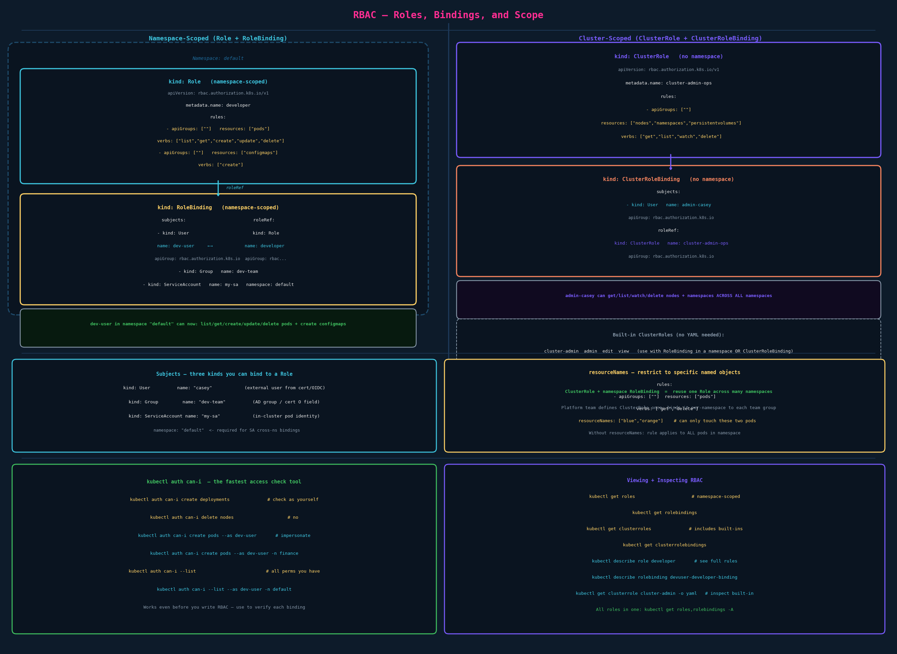

# RBAC — Role-Based Access Control

## The Two Steps

RBAC in Kubernetes always requires two objects working together:

1. **Role (or ClusterRole)** — defines *what* is allowed: which resources, which verbs
2. **RoleBinding (or ClusterRoleBinding)** — says *who* gets that Role

Without a binding, a Role does nothing. Without a Role, a binding can't reference anything useful. You need both.

---

## Step 1: Define a Role

```yaml
apiVersion: rbac.authorization.k8s.io/v1
kind: Role
metadata:
  name: developer
  namespace: default          # Role is namespace-scoped; omit = current namespace
rules:
  - apiGroups: [""]           # "" = core group (pods, services, configmaps)
    resources: ["pods"]
    verbs: ["list", "get", "create", "update", "delete"]
  - apiGroups: [""]
    resources: ["configmaps"]
    verbs: ["create"]
```



### Rule anatomy

Each item under `rules:` is one permission block. A Role can have many rules.

| Field | What it does | Example values |
|---|---|---|
| `apiGroups` | Which API group | `[""]` = core, `["apps"]`, `["networking.k8s.io"]` |
| `resources` | Which resource types | `["pods"]`, `["deployments","replicasets"]` |
| `verbs` | Which HTTP operations | `["get","list","watch","create","update","patch","delete"]` |
| `resourceNames` | Restrict to named objects | `["blue","orange"]` (optional) |

**`apiGroups: [""]`** — the empty string means the core group (`/api/v1`). This is the most common mistake on the exam: people write `["v1"]` or `["core"]`. Neither works. Core group is always `""`.

**Wildcards:** `["*"]` means all. Avoid in production; used in `cluster-admin` for full access.

### Multiple rules = one Role

Rules are additive. Stack as many as you need:

```yaml
rules:
  - apiGroups: [""]
    resources: ["pods"]
    verbs: ["list", "get", "watch"]
  - apiGroups: ["apps"]
    resources: ["deployments"]
    verbs: ["list", "get"]
  - apiGroups: ["networking.k8s.io"]
    resources: ["networkpolicies"]
    verbs: ["list", "get", "watch"]
```

---

## Step 2: Bind a User to the Role (RoleBinding)

```yaml
apiVersion: rbac.authorization.k8s.io/v1
kind: RoleBinding
metadata:
  name: devuser-developer-binding
  namespace: default          # binding is also namespace-scoped
subjects:
  - kind: User                # who gets the role
    name: dev-user
    apiGroup: rbac.authorization.k8s.io
roleRef:                      # which role to grant
  kind: Role
  name: developer
  apiGroup: rbac.authorization.k8s.io
```

The `roleRef` is **immutable** — you can't change which Role a binding points to. If you need to change it, delete and recreate the binding.

### Subjects — three kinds

```yaml
subjects:
  # A specific human user (from cert CN or OIDC sub/email)
  - kind: User
    name: dev-user
    apiGroup: rbac.authorization.k8s.io

  # An AD group or cert Organization field
  - kind: Group
    name: dev-team
    apiGroup: rbac.authorization.k8s.io

  # A ServiceAccount (for pods / CI pipelines)
  - kind: ServiceAccount
    name: my-sa
    namespace: default          # required for ServiceAccount subjects
```

A binding can have multiple subjects — one binding can grant the same Role to multiple users and groups.

---

## Namespace Scope

A `Role` only applies within the namespace it's created in. A `RoleBinding` grants access only within its own namespace.

```
Namespace: default
  Role "developer" → rules about pods/configmaps
  RoleBinding "devuser-developer-binding" → grants "developer" to dev-user

Namespace: finance
  dev-user has NO access here unless another Role+RoleBinding exists
```

This is how enterprises scope team access: a platform team creates Roles in team namespaces, then creates RoleBindings that bind an AD group to those Roles. A user can operate in those namespaces because their AD group membership (embedded in the login JWT) matches a subject in those RoleBindings.

---

## ClusterRole and ClusterRoleBinding

For resources that aren't namespaced — nodes, persistentvolumes, namespaces themselves, clusterroles — or when you need the same permissions across all namespaces, use ClusterRole.

```yaml
apiVersion: rbac.authorization.k8s.io/v1
kind: ClusterRole
metadata:
  name: cluster-node-reader      # no namespace field
rules:
  - apiGroups: [""]
    resources: ["nodes", "persistentvolumes", "namespaces"]
    verbs: ["get", "list", "watch"]
```

```yaml
apiVersion: rbac.authorization.k8s.io/v1
kind: ClusterRoleBinding
metadata:
  name: casey-node-reader        # no namespace field
subjects:
  - kind: User
    name: casey
    apiGroup: rbac.authorization.k8s.io
roleRef:
  kind: ClusterRole              # must be ClusterRole here
  name: cluster-node-reader
  apiGroup: rbac.authorization.k8s.io
```

**The four combinations:**

| Role type | Binding type | Scope of access |
|---|---|---|
| `Role` | `RoleBinding` | Namespace-scoped (standard) |
| `ClusterRole` | `ClusterRoleBinding` | All namespaces + cluster resources |
| `ClusterRole` | `RoleBinding` | Only one namespace (reuse without recreating) |
| `Role` | `ClusterRoleBinding` | Not allowed (error) |

**The third row is powerful:** define a ClusterRole once (e.g., "developer") and use namespace-scoped RoleBindings to grant it in specific namespaces. No need to recreate identical Roles in every namespace. This is the common enterprise platform pattern.

### Built-in ClusterRoles

Kubernetes ships pre-defined ClusterRoles you can bind without writing YAML:

| ClusterRole | What it grants |
|---|---|
| `cluster-admin` | Full cluster access (equivalent to root) |
| `admin` | Full namespace access — create/delete most resources |
| `edit` | Create/edit/delete workloads, services, configmaps |
| `view` | Read-only across most resources in namespace |

```bash
# Bind the built-in "view" ClusterRole to a user in one namespace
kubectl create rolebinding casey-view \
  --clusterrole=view \
  --user=casey \
  --namespace=default
```

---

## resourceNames — Object-Level Restriction

By default, a verb permission applies to all objects of that resource type. `resourceNames` restricts it to specific named objects.

```yaml
rules:
  - apiGroups: [""]
    resources: ["pods"]
    verbs: ["get", "delete"]
    resourceNames: ["blue", "orange"]   # only these two pods; "green" or "pink" are denied
```

The developer can `delete pod blue` and `delete pod orange`. Any other pod is denied.

**When to use:** multi-tenant scenarios where different teams own different named objects within the same namespace. Uncommon in normal cluster setups but useful for shared namespaces.

---

## Checking Access — `kubectl auth can-i`

Your single most important RBAC debugging tool. Tests whether the current user (or an impersonated user) has a specific permission.

```bash
# Check your own permissions
kubectl auth can-i create deployments
kubectl auth can-i delete nodes
kubectl auth can-i list secrets -n kube-system

# List ALL your permissions in a namespace
kubectl auth can-i --list
kubectl auth can-i --list -n finance

# Impersonate another user (requires admin privileges)
kubectl auth can-i create pods --as dev-user
kubectl auth can-i create pods --as dev-user -n default

# List all permissions for another user
kubectl auth can-i --list --as dev-user -n default

# Impersonate a service account
kubectl auth can-i list pods --as system:serviceaccount:default:my-sa
```

**Use this constantly on the exam.** After creating any Role or binding, verify it with `auth can-i`. It's instant, it's correct, and it saves you from debugging failed operations later. `kubectl auth can-i --list` shows every permission your identity's groups grant in the current namespace.

---

## Viewing and Inspecting RBAC

```bash
# List Roles and RoleBindings in current namespace
kubectl get roles
kubectl get rolebindings
kubectl get roles,rolebindings                  # together

# All namespaces
kubectl get roles -A
kubectl get rolebindings -A

# ClusterRoles (includes all the built-in system ones)
kubectl get clusterroles
kubectl get clusterrolebindings

# Detail inspection
kubectl describe role developer
kubectl describe rolebinding devuser-developer-binding

# Who is bound to what (for a specific binding)
kubectl describe rolebinding devuser-developer-binding -n default
# Shows: Subject (User/Group/SA name) and Role being referenced

# Inspect a built-in ClusterRole's rules
kubectl get clusterrole cluster-admin -o yaml
kubectl get clusterrole edit -o yaml
```

---

## Imperative Shortcuts

```bash
# Create a Role imperatively (exam speed)
kubectl create role developer \
  --verb=list,get,create,update,delete \
  --resource=pods \
  --namespace=default

# Multiple resource types
kubectl create role developer \
  --verb=list,get,create,update,delete \
  --resource=pods,configmaps

# Specific named resources
kubectl create role developer \
  --verb=get,delete \
  --resource=pods \
  --resource-name=blue,orange

# Create a RoleBinding
kubectl create rolebinding devuser-developer-binding \
  --role=developer \
  --user=dev-user \
  --namespace=default

# Bind a group
kubectl create rolebinding team-binding \
  --role=developer \
  --group=dev-team \
  --namespace=default

# Bind a ServiceAccount
kubectl create rolebinding sa-binding \
  --role=developer \
  --serviceaccount=default:my-sa

# ClusterRole
kubectl create clusterrole node-reader \
  --verb=get,list,watch \
  --resource=nodes

# ClusterRoleBinding
kubectl create clusterrolebinding casey-node-reader \
  --clusterrole=node-reader \
  --user=casey

# Dry-run first (exam pattern: generate YAML then apply)
kubectl create role developer --verb=get,list --resource=pods \
  --dry-run=client -o yaml > developer-role.yaml
```

---

## Exam-Pattern Gotchas

- **`apiGroups: [""]` not `["v1"]` or `["core"]`** for core resources. This will be wrong and cause a silent permission failure. Always.
- **`roleRef` is immutable** — you cannot `kubectl edit` the roleRef of an existing binding. Delete and recreate.
- **Namespace on the binding, not the Role** — the binding determines which namespace the permission applies in. A Role named `developer` in namespace `finance` is different from one in `default`.
- **ClusterRole + RoleBinding = namespace-only** — using a ClusterRole in a RoleBinding does NOT give cluster-wide access. It restricts the ClusterRole's permissions to the RoleBinding's namespace only.
- **`resources` is plural but `kind` in subjects is singular** — `resources: ["pods"]` (plural), `kind: User` (singular).
- **ServiceAccount subjects need `namespace:`** — when binding a ServiceAccount in a different namespace, the `namespace` field on the subject is required.
- **`kubectl auth can-i` uses your current kubeconfig user** — if you switch context or `--as`, it uses that identity instead.
- **Verify after creating** — always follow `kubectl create role` + `kubectl create rolebinding` with `kubectl auth can-i <verb> <resource> --as <user>`.

## References

- [Using RBAC Authorization](https://kubernetes.io/docs/reference/access-authn-authz/rbac/) — Role/RoleBinding YAML, subjects, roleRef, resourceNames, and built-in roles
- [Authorization](https://kubernetes.io/docs/reference/access-authn-authz/authorization/) — where RBAC sits among the authorization modes and how requests are checked
