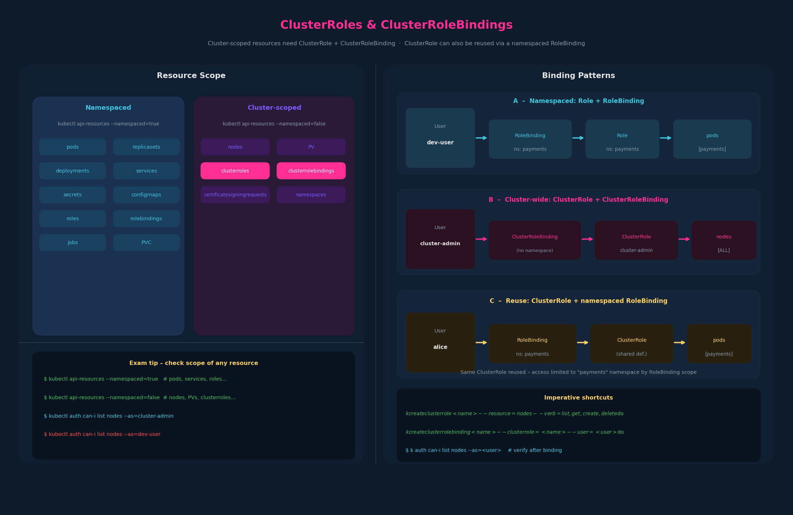

# 07 – Cluster Roles and ClusterRoleBindings



---

## 1. Why ClusterRoles exist

Everything from chapter 06 – Roles and RoleBindings – is namespaced.
A `Role` lives in a namespace; the permissions it grants are siloed to that
namespace.  That model breaks down for resources that have no namespace:

> Can node-0 belong to namespace `dev`?  No.  Nodes are cluster-wide objects.

Resources in Kubernetes are divided into two scopes at the API level:

| Scope | What it means | Examples |
|---|---|---|
| **Namespaced** | Must be created in a namespace; access controlled per namespace | pods, deployments, services, configmaps, secrets, roles, rolebindings, jobs, replicasets, PVC |
| **Cluster-scoped** | No namespace; exist at the cluster level | nodes, PV, namespaces, clusterroles, clusterrolebindings, certificatesigningrequests |

Note that `namespaces` itself is a cluster-scoped resource – you can't put a
namespace inside a namespace.

### How to check the scope of any resource

```bash
# Everything that IS namespaced
kubectl api-resources --namespaced=true

# Everything that is NOT namespaced (cluster-scoped)
kubectl api-resources --namespaced=false
```

This is useful on the exam when you're unsure whether something needs a Role
or a ClusterRole.

---

## 2. ClusterRole mechanics

A `ClusterRole` is structurally identical to a `Role` – same `rules` block,
same verbs, same `apiGroups` – but `kind: ClusterRole` and no `namespace` in
`metadata`.

```yaml
# cluster-admin-role.yaml
apiVersion: rbac.authorization.k8s.io/v1
kind: ClusterRole
metadata:
  name: cluster-administrator   # no namespace field
rules:
  - apiGroups: [""]             # "" = core API group
    resources: ["nodes"]
    verbs: ["list", "get", "create", "delete"]
```

```bash
kubectl create -f cluster-admin-role.yaml

# or imperatively:
kubectl create clusterrole cluster-administrator \
  --resource=nodes \
  --verb=list,get,create,delete
```

### Concrete examples

**Cluster Admin** – manages nodes:
- `list`, `get`, `create`, `delete` on `nodes`

**Storage Admin** – manages persistent storage:
- `list`, `get`, `create`, `delete` on `persistentvolumes`
- `list`, `get`, `create`, `delete` on `persistentvolumeclaims`

These are exactly the kinds of operator roles a platform team would define
to hand off to SREs without giving them `cluster-admin`.

---

## 3. ClusterRoleBinding – linking a user to a ClusterRole

Same pattern as `RoleBinding`, but `kind: ClusterRoleBinding` and
`roleRef.kind: ClusterRole`.

```yaml
# cluster-admin-role-binding.yaml
apiVersion: rbac.authorization.k8s.io/v1
kind: ClusterRoleBinding
metadata:
  name: cluster-admin-role-binding
subjects:
  - kind: User
    name: cluster-admin           # the user (or SA, or Group)
    apiGroup: rbac.authorization.k8s.io
roleRef:
  kind: ClusterRole
  name: cluster-administrator     # must match the ClusterRole name exactly
  apiGroup: rbac.authorization.k8s.io
```

```bash
kubectl create -f cluster-admin-role-binding.yaml

# or imperatively:
kubectl create clusterrolebinding cluster-admin-role-binding \
  --clusterrole=cluster-administrator \
  --user=cluster-admin
```

The binding is what triggers Kubernetes RBAC to grant access.  Without the
binding the ClusterRole is just a definition sitting there doing nothing.

---

## 4. The dual-use twist: ClusterRole bound at namespace scope

> **You can bind a ClusterRole with a namespaced RoleBinding.**

When you do this, the permissions granted by the ClusterRole apply only
within the namespace that the RoleBinding lives in.  The effect is the same
as a regular Role scoped to that namespace – you just wrote the permission
set once as a ClusterRole and reused it.

```yaml
# Reuse a ClusterRole but restrict it to the "payments" namespace
apiVersion: rbac.authorization.k8s.io/v1
kind: RoleBinding
metadata:
  name: payments-pod-admin
  namespace: payments             # scope is the payments namespace only
subjects:
  - kind: User
    name: alice
    apiGroup: rbac.authorization.k8s.io
roleRef:
  kind: ClusterRole               # referencing a ClusterRole from a RoleBinding
  name: cluster-administrator
  apiGroup: rbac.authorization.k8s.io
```

This pattern is handy when multiple teams need identical permission sets
across different namespaces.  Define one ClusterRole, deploy one RoleBinding
per namespace.

---

## 5. Role / RoleBinding vs ClusterRole / ClusterRoleBinding – decision matrix

| What you want | Role type | Binding type | Scope |
|---|---|---|---|
| Access to namespaced resources in one namespace | `Role` | `RoleBinding` | Single namespace |
| Access to cluster-scoped resources (nodes, PVs) | `ClusterRole` | `ClusterRoleBinding` | Entire cluster |
| Re-use a ClusterRole's rules, but limit to one namespace | `ClusterRole` | `RoleBinding` (namespaced) | Single namespace |

---

## 6. Imperative shortcuts

```bash
# List all ClusterRoles
kubectl get clusterroles

# List all ClusterRoleBindings
kubectl get clusterrolebindings

# Describe a specific ClusterRole
kubectl describe clusterrole cluster-administrator

# Describe a specific ClusterRoleBinding
kubectl describe clusterrolebinding cluster-admin-role-binding

# Create ClusterRole imperatively
kubectl create clusterrole <name> \
  --resource=<resource> \
  --verb=<verb1>,<verb2>

# Create ClusterRoleBinding imperatively
kubectl create clusterrolebinding <name> \
  --clusterrole=<clusterrole-name> \
  --user=<username>          # or --group=<group> or --serviceaccount=<ns>:<sa>

# Dry-run pattern for exam speed
k create clusterrole storage-admin \
  --resource=persistentvolumes,persistentvolumeclaims \
  --verb=list,get,create,delete $do > storage-admin.yaml
```

Alias reminder (must type at exam start):
```bash
alias k=kubectl
export do="--dry-run=client -o yaml"
export now="--grace-period=0 --force"
```

---

## 7. Exam-pattern gotchas

**Gotcha 1 – Kind mismatch between Role and RoleBinding**
If you create a `ClusterRoleBinding` but reference `kind: Role` (not
`ClusterRole`) in `roleRef`, the API will reject it.  `roleRef.kind` must
match the actual kind of the object you're referencing.

**Gotcha 2 – ClusterRole ≠ cluster-admin**
`ClusterRole` is just a resource type.  A ClusterRole named `pod-reader`
that only allows `get pods` is not privileged at all.  Don't confuse the
resource kind with the built-in `cluster-admin` ClusterRole.

**Gotcha 3 – RoleBinding cannot reference a Role in another namespace**
A `RoleBinding` in namespace `dev` must reference a `Role` in `dev` or a
`ClusterRole`.  It cannot reference a `Role` in namespace `prod`.

**Gotcha 4 – Verifying access**
After creating a ClusterRoleBinding, confirm with:
```bash
kubectl auth can-i list nodes --as=cluster-admin
# yes

kubectl auth can-i list nodes --as=dev-user
# no (if dev-user has no cluster-wide node access)
```

**Gotcha 5 – api-resources flags**
`kubectl api-resources --namespaced=false` is a fast way to answer "is this
a ClusterRole or Role resource?" on the exam without memorizing the full list.

---

## 8. Notes

- ClusterRoleBinding subjects can be ServiceAccounts (`kind: ServiceAccount`),
  not just Users and Groups.
- Built-in ClusterRoles (`cluster-admin`, `admin`, `edit`, `view`) exist;
  `cluster-admin` is the highest-privilege ClusterRole and should be bound
  with extreme care.

## References

- [Using RBAC Authorization](https://kubernetes.io/docs/reference/access-authn-authz/rbac/) — ClusterRole/ClusterRoleBinding, the ClusterRole+RoleBinding pattern, aggregation, and default roles
- [Authorization](https://kubernetes.io/docs/reference/access-authn-authz/authorization/) — request attributes including resource scope (cluster-scoped vs namespaced)
