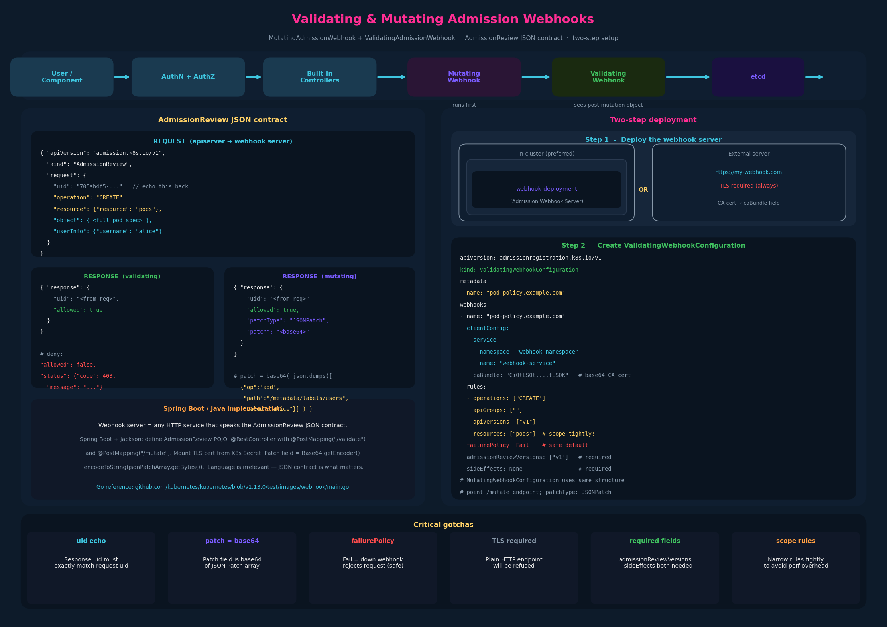

# 09 – Validating and Mutating Admission Controllers (Webhooks)



---

## 1. The two admission controller types, precisely defined

The previous chapter introduced this distinction. Here it gets concrete:

**Mutating admission controller** – receives the object, can modify it, and
passes a (potentially changed) version downstream. The object that reaches
etcd may be different from what the user submitted.

Example: `DefaultStorageClass`. When a PVC arrives without a
`storageClassName`, this controller injects the cluster-default StorageClass
into the PVC spec before it's persisted. The user never specified it; the
controller added it.

**Validating admission controller** – receives the object (already post-
mutation), inspects it, and returns allow or deny. It cannot change the
object.

Example: `NamespaceLifecycle`. It checks whether the target namespace exists
and rejects the request if not. No modification — pure allow/deny.

**Some controllers do both** – they mutate first (as a mutating controller)
and then validate the result (as a validating controller). These are registered
for both phases.

### Execution order — why it matters

```
Mutating controllers  →  Validating controllers  →  etcd
```

Mutating runs first so that validators see the **final form** of the object.
If validators ran on the pre-mutated object, a `DefaultStorageClass` injection
would never be visible to a quota validator that checks storage class limits.
The ordering is not configurable — it's enforced by the apiserver pipeline.

---

## 2. The extensibility problem the webhooks solve

All built-in admission controllers are compiled into kube-apiserver. You can
enable or disable them, but you can't add new logic without modifying
Kubernetes source code and rebuilding.

Two built-in controllers solve this:

| Controller | Purpose |
|---|---|
| `MutatingAdmissionWebhook` | Calls out to an external HTTP server during the mutating phase |
| `ValidatingAdmissionWebhook` | Calls out to an external HTTP server during the validating phase |

These are generic call-out mechanisms. The external server contains your
custom logic. Kubernetes just handles the HTTP call and interprets the
response. The result is a clean extension point without forking k8s.

---

## 3. How the webhook call works

When a request reaches the webhook controller, it serializes the incoming
object into an **AdmissionReview** JSON object and POSTs it to your server.

### AdmissionReview request (what your server receives)

```json
{
  "apiVersion": "admission.k8s.io/v1",
  "kind": "AdmissionReview",
  "request": {
    "uid": "705ab4f5-6393-11e8-b7cc-42010a800002",
    "kind": {"group": "autoscaling", "version": "v1", "kind": "Scale"},
    "resource": {"group": "apps", "version": "v1", "resource": "deployments"},
    "subResource": "scale",
    "requestKind": {"group": "autoscaling", "version": "v1", "kind": "Scale"},
    "requestResource": {"group": "apps", "version": "v1", "resource": "deployments"},
    "userInfo": {
      "username": "admin",
      "uid": "014fbff9-a0af-11e8-a8c9-42010af003bb",
      "groups": ["system:authenticated", "system:masters"]
    },
    "object": { ... },      // the object being created/modified
    "oldObject": null,      // previous version (for UPDATE operations)
    "dryRun": false
  }
}
```

Key fields your webhook will read:
- `request.uid` – echo this back verbatim in your response
- `request.object` – the full object spec (pod, deployment, etc.)
- `request.userInfo` – who made the request
- `request.operation` – CREATE, UPDATE, DELETE, CONNECT

### AdmissionReview response (what your server returns)

**Validating response:**
```json
{
  "apiVersion": "admission.k8s.io/v1",
  "kind": "AdmissionReview",
  "response": {
    "uid": "<value_from_request.uid>",   // must match
    "allowed": true
  }
}
```

For a denial:
```json
{
  "response": {
    "uid": "<value_from_request.uid>",
    "allowed": false,
    "status": {
      "code": 403,
      "message": "You can't create objects with your own name"
    }
  }
}
```

**Mutating response** – same envelope but adds a JSONPatch:
```json
{
  "response": {
    "uid": "<value_from_request.uid>",
    "allowed": true,
    "patchType": "JSONPatch",
    "patch": "<base64-encoded JSON patch>"
  }
}
```

The patch field is a base64-encoded array of [RFC 6902 JSON Patch](https://jsonpatch.com/)
operations. For example, to add a label `users: alice` to the object's metadata:

```python
patch = [{"op": "add", "path": "/metadata/labels/users", "value": user_name}]
# Encode as base64 before sending
"patch": base64.b64encode(json.dumps(patch).encode()).decode()
```

A mutating webhook that always allows but injects a label looks like this
(simplified Python/Flask):

```python
@app.route("/mutate", methods=["POST"])
def mutate():
    user_name = request.json["request"]["userInfo"]["name"]
    patch = [{"op": "add", "path": "/metadata/labels/users", "value": user_name}]
    return jsonify({
        "response": {
            "allowed": True,
            "uid": request.json["request"]["uid"],
            "patch": base64.b64encode(json.dumps(patch).encode()).decode(),
            "patchType": "JSONPatch",
        }
    })

@app.route("/validate", methods=["POST"])
def validate():
    object_name = request.json["request"]["object"]["metadata"]["name"]
    user_name   = request.json["request"]["userInfo"]["name"]
    allowed = object_name != user_name
    message = "You can't create objects with your own name" if not allowed else ""
    return jsonify({
        "response": {
            "allowed": allowed,
            "uid": request.json["request"]["uid"],
            "status": {"message": message},
        }
    })
```

The reference implementation from the Kubernetes repo is in Go:
`https://github.com/kubernetes/kubernetes/blob/v1.13.0/test/images/webhook/main.go`

> **Java note**: the webhook server is just an HTTP service that accepts
> JSON POST requests and returns JSON. Spring Boot + Jackson is a
> natural fit — define a `AdmissionReview` POJO, deserialize the incoming
> request, apply your logic, serialize the response. The k8s Go reference
> is for structure; your Spring Boot implementation would use the same JSON
> contract.

---

## 4. Two-step deployment

### Step 1 – Deploy the webhook server

The server runs anywhere that kube-apiserver can reach over HTTPS:

- **Inside the cluster** (preferred): deploy as a standard Deployment + Service.
  Easier to manage TLS with a cluster CA.
- **Outside the cluster**: deploy anywhere accessible, provide its URL in the
  webhook configuration.

TLS is mandatory — kube-apiserver will not call a plain HTTP endpoint.
Your server needs a TLS certificate, and the `caBundle` field in the
WebhookConfiguration must contain the CA that signed it (so apiserver can
verify the server).

### Step 2 – Create the WebhookConfiguration object

This is a cluster-scoped Kubernetes resource that tells the apiserver where
to call and for what operations.

**ValidatingWebhookConfiguration:**
```yaml
apiVersion: admissionregistration.k8s.io/v1
kind: ValidatingWebhookConfiguration
metadata:
  name: "pod-policy.example.com"
webhooks:
  - name: "pod-policy.example.com"
    clientConfig:
      # Option A: in-cluster service
      service:
        namespace: "webhook-namespace"
        name: "webhook-service"
      # Option B: external URL
      # url: "https://my-webhook.example.com/validate"
      caBundle: "Ci0tLS0t......tLS0K"   # base64 CA cert
    rules:
      - operations: ["CREATE"]
        apiGroups: [""]
        apiVersions: ["v1"]
        resources: ["pods"]             # only fires on pod creation
    admissionReviewVersions: ["v1"]
    sideEffects: None
    failurePolicy: Fail                 # Fail or Ignore — see gotchas
```

**MutatingWebhookConfiguration** uses the same structure but `kind:
MutatingWebhookConfiguration`. The server endpoints are typically different
paths on the same server (`/validate` vs `/mutate`).

### rules field — controlling when the webhook fires

The `rules` array is how you scope the webhook to only the operations and
resources you care about:

```yaml
rules:
  - operations: ["CREATE", "UPDATE"]
    apiGroups: ["apps"]
    apiVersions: ["v1"]
    resources: ["deployments"]
```

This is important for performance: you don't want a heavy external call on
every single API operation. Scope it tightly.

---

## 5. Full deployment picture

```
kube-apiserver
    │
    ├─ AuthN → AuthZ → Built-in admission controllers
    │
    ├─ MutatingAdmissionWebhook
    │       │  POST AdmissionReview (JSON)
    │       ▼
    │  Webhook Server (/mutate)
    │       │  returns AdmissionReview + JSONPatch
    │       ▼
    │  [object mutated in memory]
    │
    ├─ ValidatingAdmissionWebhook
    │       │  POST AdmissionReview (JSON)
    │       ▼
    │  Webhook Server (/validate)
    │       │  returns allowed: true/false
    │       ▼
    │  [rejected or allowed]
    │
    └─ etcd (if allowed)
```

The webhook server in-cluster topology:

```
Kubernetes cluster
┌────────────────────────────────────────────┐
│  webhook-namespace                         │
│  ┌──────────────────────┐                  │
│  │  webhook-deployment  │                  │
│  │  (Admission Webhook  │◄─────────────────┤── kube-apiserver
│  │   Server pod)        │                  │
│  └──────────┬───────────┘                  │
│             │                              │
│  webhook-service (ClusterIP)               │
└────────────────────────────────────────────┘
```

---

## 6. The Java angle — writing a webhook server in Spring Boot

The JSON contract is all that matters; the language is irrelevant to
Kubernetes. Structure of a Spring Boot implementation:

```java
// AdmissionReview POJO (simplified)
@Data
public class AdmissionReview {
    private String apiVersion = "admission.k8s.io/v1";
    private String kind = "AdmissionReview";
    private AdmissionRequest request;
    private AdmissionResponse response;
}

@Data
public class AdmissionResponse {
    private String uid;       // must echo request.uid
    private boolean allowed;
    private String patchType; // "JSONPatch" for mutations
    private String patch;     // base64-encoded JSON patch array
    private Status status;
}

// Controller
@RestController
public class WebhookController {

    @PostMapping("/validate")
    public AdmissionReview validate(@RequestBody AdmissionReview review) {
        String objectName = extractName(review.getRequest());
        String userName   = review.getRequest().getUserInfo().getName();
        boolean allowed   = !objectName.equals(userName);

        AdmissionResponse resp = new AdmissionResponse();
        resp.setUid(review.getRequest().getUid());
        resp.setAllowed(allowed);
        if (!allowed) {
            resp.setStatus(new Status(403, "Can't create object with your own name"));
        }

        AdmissionReview response = new AdmissionReview();
        response.setResponse(resp);
        return response;
    }

    @PostMapping("/mutate")
    public AdmissionReview mutate(@RequestBody AdmissionReview review) {
        String userName = review.getRequest().getUserInfo().getName();

        // JSON Patch: add /metadata/labels/users = userName
        String patchJson = String.format(
            "[{\"op\":\"add\",\"path\":\"/metadata/labels/users\",\"value\":\"%s\"}]",
            userName
        );
        String patchB64 = Base64.getEncoder()
            .encodeToString(patchJson.getBytes(StandardCharsets.UTF_8));

        AdmissionResponse resp = new AdmissionResponse();
        resp.setUid(review.getRequest().getUid());
        resp.setAllowed(true);
        resp.setPatchType("JSONPatch");
        resp.setPatch(patchB64);

        AdmissionReview response = new AdmissionReview();
        response.setResponse(resp);
        return response;
    }
}
```

TLS wiring for Spring Boot:
```yaml
# application.yaml
server:
  port: 8443
  ssl:
    key-store: /tls/keystore.p12
    key-store-password: changeit
    key-store-type: PKCS12
```

Kubernetes secret mount:
```yaml
volumes:
  - name: tls
    secret:
      secretName: webhook-tls-secret
volumeMounts:
  - name: tls
    mountPath: /tls
    readOnly: true
```

The webhook contract is identical regardless of server language.

---

## 7. Exam-pattern gotchas

**Gotcha 1 – `failurePolicy` is a security-critical field**
```yaml
failurePolicy: Fail    # if the webhook is unreachable, reject the request
failurePolicy: Ignore  # if the webhook is unreachable, allow the request
```
`Fail` is the safe default for security-sensitive webhooks. `Ignore` means
a downed webhook server silently allows everything through — dangerous for
image policy enforcement.

**Gotcha 2 – uid echo is mandatory**
The response `uid` must exactly match the request `uid`. Kubernetes uses this
to correlate requests to responses. A mismatch or missing uid causes the
admission to fail.

**Gotcha 3 – patch must be base64-encoded**
The `patch` field in a mutating response is base64 of the JSON Patch array,
not the raw JSON. Sending raw JSON fails silently or causes a decode error.

**Gotcha 4 – TLS is non-negotiable**
kube-apiserver refuses plain HTTP webhook endpoints. If your webhook server
cert is signed by a custom CA, that CA must appear in `caBundle`; otherwise
the apiserver rejects the TLS handshake.

**Gotcha 5 – mutating runs before validating (again)**
This is worth repeating because exam questions can test it indirectly.
A `ValidatingWebhookConfiguration` sees the object after any
`MutatingWebhookConfiguration` has already transformed it. Ordering within
the same phase (multiple mutating webhooks) is not guaranteed.

**Gotcha 6 – `admissionReviewVersions` and `sideEffects` are required fields**
In Kubernetes ≥ 1.16, both `admissionReviewVersions` and `sideEffects` must
be present on every webhook. Missing them causes the
`WebhookConfiguration` object itself to be rejected by the API. Use:
```yaml
admissionReviewVersions: ["v1"]
sideEffects: None
```
