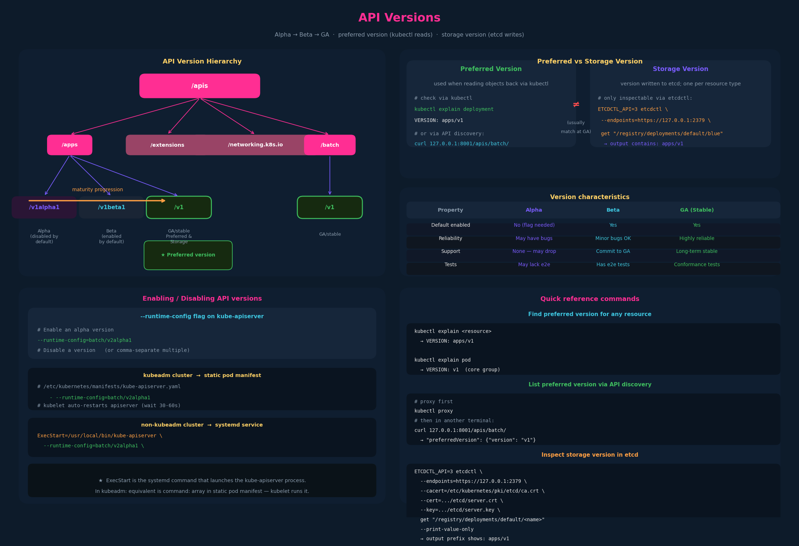

# 10 – API Versions



---

## 1. API version levels — what they mean

Every API group in Kubernetes can simultaneously support multiple versions of
the same resource. A Deployment can be expressed as `apps/v1alpha1`,
`apps/v1beta1`, or `apps/v1` — those describe the maturity of the API
schema for that resource, not the Deployment workload itself.

| | Alpha | Beta | GA (Stable) |
|---|---|---|---|
| **Version naming** | `vXalphaY` e.g. `v1alpha1` | `vXbetaY` e.g. `v1beta1` | `vX` e.g. `v1` |
| **Enabled by default** | No — must be explicitly enabled | Yes | Yes |
| **Tests** | May lack end-to-end tests | Has e2e tests | Has conformance tests |
| **Reliability** | May have bugs; breaking changes possible | Minor bugs; breaking changes unlikely | Highly reliable; backward compatible |
| **Support commitment** | None — may be dropped without notice | Commits to completing feature and reaching GA | Present in many future releases |
| **Target audience** | Expert users providing early feedback | Users comfortable testing pre-stable APIs | All users |

### The maturity progression

Features travel: `Alpha → Beta → GA`. Each step adds stability guarantees
and drops the requirement for explicit opt-in:

```
Not enabled (alpha)  →  Enabled by default (beta)  →  Stable GA (v1)
```

Breaking changes are allowed between alpha versions and allowed (with notice)
between beta and GA. Once GA, the API is stable and breaking changes require
the full deprecation policy (typically 12 months minimum).

---

## 2. Preferred version vs storage version

Two distinct concepts that are often confused.

### Preferred version

The version kube-apiserver uses when you **read** objects back without
specifying a version. It drives:

- `kubectl get deployment` — returns objects serialized in the preferred version
- `kubectl explain deployment` — reports `VERSION: apps/v1` (the preferred)
- API discovery responses (`/apis/<group>/`) — lists `preferredVersion`

You can verify the preferred version for any API group by querying the
API discovery endpoint directly:

```bash
# Proxy to the apiserver (runs on localhost:8001)
kubectl proxy

# In another terminal — list the batch API group
curl 127.0.0.1:8001/apis/batch/
```

The JSON response includes:
```json
{
  "kind": "APIGroup",
  "name": "batch",
  "versions": [
    {"groupVersion": "batch/v1",      "version": "v1"},
    {"groupVersion": "batch/v1beta1", "version": "v1beta1"}
  ],
  "preferredVersion": {
    "groupVersion": "batch/v1",
    "version": "v1"
  }
}
```

The `preferredVersion` field is the answer. For `batch`, it's `v1`.

### Storage version

The version in which a Kubernetes object is **written to etcd**, regardless
of which API version was used to create it. This is a single canonical version
per resource type — all stored objects are converted to it at write time.

Key properties:
- There is **exactly one** storage version per resource type at any moment
- It is typically the most recent stable (GA) version
- It is **not exposed** through any standard kubectl command or API endpoint —
  the storage version is declared in the CRD spec for custom resources but is
  an internal implementation detail for built-in resources

### How to inspect the storage version directly

Since there's no kubectl command for this, you query etcd directly with
`etcdctl`. This requires access to the control plane and the etcd TLS certs:

```bash
ETCDCTL_API=3 etcdctl \
  --endpoints=https://[127.0.0.1]:2379 \
  --cacert=/etc/kubernetes/pki/etcd/ca.crt \
  --cert=/etc/kubernetes/pki/etcd/server.crt \
  --key=/etc/kubernetes/pki/etcd/server.key \
  get "/registry/deployments/default/blue" --print-value-only
```

The output contains the raw protobuf-encoded object. In the readable prefix
of that output you'll see:

```
k8s
apps/v1        ← storage version
Deployment
```

This confirms that regardless of whether the object was created with
`apps/v1alpha1`, `apps/v1beta1`, or `apps/v1`, it is stored in etcd as
`apps/v1`. Note this etcdctl query is only possible from the control-plane
node where the etcd TLS certs live.

### Practical consequence: you can write any supported version

```yaml
# All three of these are valid (if those versions exist)
apiVersion: apps/v1alpha1    # alpha — not enabled by default
apiVersion: apps/v1beta1     # beta
apiVersion: apps/v1          # GA — preferred and storage version
```

All three create the same Deployment. The apiserver converts the submitted
version to the storage version before writing. When you later `kubectl get`
it, you get it back in the preferred version regardless of what you used
to create it.

---

## 3. How kubectl explain reveals preferred version

```bash
kubectl explain deployment
# KIND:     Deployment
# VERSION:  apps/v1          ← this is the preferred version

kubectl explain pod
# KIND:     Pod
# VERSION:  v1               ← core group, preferred = v1
```

This is a fast exam-time sanity check: if you're unsure what version to put
in `apiVersion`, `kubectl explain <resource>` tells you exactly.

---

## 4. Enabling and disabling API versions

### Why you'd do this

- Enable an alpha API version to experiment with a new feature
- Disable an older API version during migration (rare on exam)

### The `--runtime-config` flag

This is added to the kube-apiserver command. It takes a comma-delimited list
of `group/version=true|false` pairs:

```bash
# Enable an alpha version of the batch group
--runtime-config=batch/v2alpha1
# (default is true when you name a version without =false)

# Disable a version explicitly
--runtime-config=batch/v1=false

# Multiple at once
--runtime-config=batch/v2alpha1=true,apps/v1beta1=false
```

### Where to set it — kubeadm cluster

Edit the static pod manifest and add the flag to the command array:

```yaml
# /etc/kubernetes/manifests/kube-apiserver.yaml
spec:
  containers:
  - command:
    - kube-apiserver
    - --runtime-config=batch/v2alpha1
    # ... other flags
```

Saving the file triggers kubelet to restart the apiserver static pod
automatically. Wait 30–60 seconds and confirm with:

```bash
kubectl get pods -n kube-system | grep apiserver
```

### Where to set it — non-kubeadm / systemd

```bash
# /etc/systemd/system/kube-apiserver.service
ExecStart=/usr/local/bin/kube-apiserver \
  --runtime-config=batch/v2alpha1 \
  # ... other flags
```

Then reload and restart:
```bash
systemctl daemon-reload
systemctl restart kube-apiserver
```

In a non-kubeadm cluster, kube-apiserver is a systemd service and `ExecStart`
is the command systemd runs to launch the process; the flags after the binary
name are its configuration options. In a kubeadm cluster the equivalent is the
`command:` array in the static pod manifest — kubelet runs that command inside
the pod, and kubelet itself is a systemd service.

---

## 5. The `/internal.apiserver.k8s.io` group and storageversion

`/internal.apiserver.k8s.io` is the group that contains the
`StorageVersion` resource — a cluster-scoped
object that records which version of each resource type is currently the
storage version. It's alpha-level machinery for cluster operators doing
version migrations, not something you'd use day-to-day or on the CKAD exam.
Worth flagging for CKA/CKS context.

---

## 6. API deprecation policy (beyond the lecture — exam-relevant)

The Kubernetes API deprecation policy governs how versions are retired.
Key rules for the exam:

- **Alpha**: can be removed in any release with no notice
- **Beta**: must be supported for at least 3 releases or 9 months after
  deprecation announcement, whichever is longer
- **GA**: must be supported for at least 12 months or 3 releases after
  deprecation announcement, whichever is longer

For example, `extensions/v1beta1` (used in old Ingress YAML) was removed and
replaced by `networking.k8s.io/v1`. If you encounter old YAML using a
deprecated `apiVersion`, `kubectl convert` (or manual edit) is the fix.

---

## 7. Exam-pattern gotchas

**Gotcha 1 – Alpha APIs are disabled by default**
If a question involves an alpha resource and your `kubectl apply` returns
`no matches for kind "Foo" in version "batch/v2alpha1"`, the API version
isn't enabled. You need to add `--runtime-config=batch/v2alpha1` to the
apiserver and restart it.

**Gotcha 2 – `kubectl explain` is your version oracle**
Forget which `apiVersion` to use? `kubectl explain <resource>` shows you
the preferred version. On the exam this is faster than consulting docs.

**Gotcha 3 – Preferred ≠ Storage (but they usually match)**
For GA resources the preferred version and storage version are almost always
the same. The distinction matters during version migrations when a new version
becomes preferred before all stored objects have been converted.

**Gotcha 4 – `kubectl get` returns preferred version, not creation version**
If you created a resource with `apps/v1beta1` and then `kubectl get` it,
the output shows `apps/v1`. This is expected — the apiserver converted it
on the way in. Your YAML's `apiVersion` field is the submission version, not
the stored version.

**Gotcha 5 – Static pod restart timing**
After editing `/etc/kubernetes/manifests/kube-apiserver.yaml`, the apiserver
takes 30–60 seconds to restart. Trying to `kubectl` immediately after saving
will return connection errors. Wait and verify before continuing.
