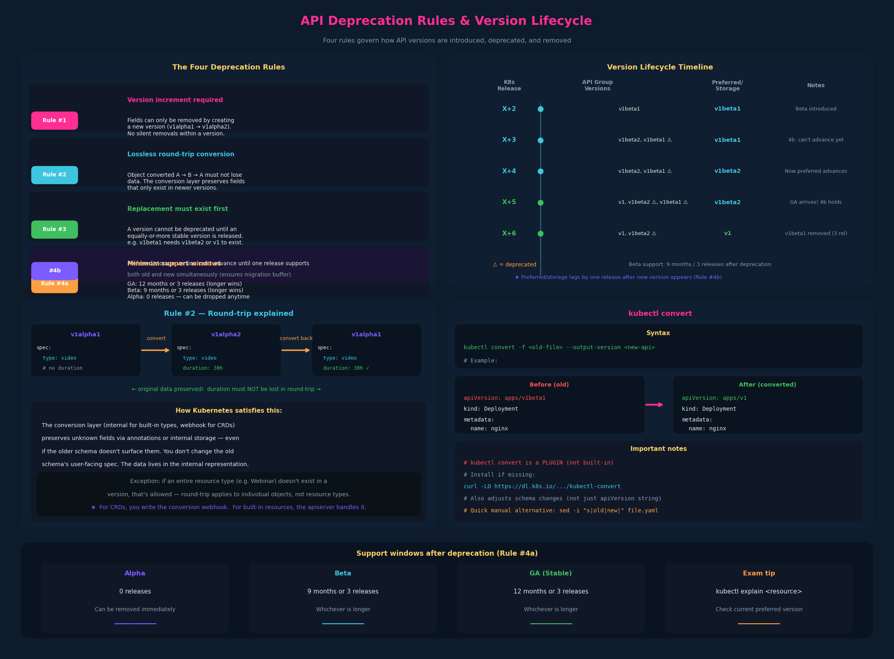

# 11 – API Deprecations



---

## 1. The problem: APIs evolve, manifests must keep up

The previous chapter covered how API groups support multiple versions
simultaneously. But versions can't live forever — alpha versions are
experimental, beta versions mature into GA, and old versions need to be
retired. The API deprecation policy defines **how** and **when** versions
can be removed, protecting users from surprise breakage.

Consider a custom API group `/kodekloud.com` that starts with `/v1alpha1`
containing `Course` and `Webinar` resources. As the API matures it moves
through `v1alpha2` → `v1beta1` → `v1beta2` → `v1`. The rules below govern
how that progression works.

---

## 2. The four deprecation rules

### Rule #1 — Version increment required for removal

> API elements may only be removed by incrementing the version of the API
> group.

You cannot remove a field, resource, or behavior within the same version.
If `v1alpha1` has a `spec.type` field, you can't silently drop it from
`v1alpha1` in a later Kubernetes release. You must create `v1alpha2` and
remove it there. This ensures that within a single version, the contract
is stable.

Think of it like a Java interface: once published, you don't remove methods
from the same interface version. You create a new interface.

---

### Rule #2 — Round-trip lossless conversion

> API objects must be able to round-trip between API versions in a given
> release without information loss, with the exception of whole REST
> resources that do not exist in some versions.

**This is the rule that needs careful unpacking.**

"Round-trip" means: if you create an object in version A, convert it to
version B, and convert it back to version A, you get the same object — no
fields lost.

**Why this matters and what it really means:**

Say `v1alpha1` has `spec.type` but not `spec.duration`.
Then `v1alpha2` adds `spec.duration`.

A user creates an object with `v1alpha2` that includes `duration: 30m`.
The apiserver stores it in the storage version. If someone then reads it
back using the `v1alpha1` API endpoint, what happens to `duration`?

The round-trip rule says: `v1alpha1` must **not lose** that `duration`
field. If `v1alpha1` doesn't have `duration` in its schema, the conversion
layer must preserve it (typically via annotations like
`kubectl.kubernetes.io/last-applied-configuration` or internal storage
annotations).

**The key insight:** you don't literally change the old schema's user-facing
spec to add the new field. Instead, the **conversion layer** (internal to
the apiserver for built-in types, or a conversion webhook for CRDs) is
responsible for carrying fields that exist in one version but not another.
The data round-trips through the internal representation — no information
is dropped even if the older schema doesn't surface the field to users.

The exception clause ("whole REST resources that do not exist in some
versions") means: if `v1alpha1` has `Course` and `Webinar` but `v1alpha2`
only has `Course` (i.e., `Webinar` was dropped entirely as a resource
type), that's allowed. The round-trip guarantee applies to individual
objects, not to the existence of entire resource types across versions.

---

### Rule #3 — Deprecation requires a replacement at least as stable

> An API version in a given track may not be deprecated until a new API
> version at least as stable is released.

You cannot deprecate `v1beta1` unless `v1beta2` or `v1` (or higher) is
already available. This ensures users always have a migration target that
is at least as mature as what they're leaving.

Concretely:
- Can't deprecate `v1beta1` until `v1beta2` or `v1` exists
- Can't deprecate `v1` until `v2` exists
- Alpha versions are exempt from this — they can be dropped freely (Rule #4a)

---

### Rule #4a — Minimum support duration after deprecation

> Other than the most recent API versions in each track, older API versions
> must be supported after their announced deprecation for a duration of no
> less than:

| Track | Minimum support after deprecation |
|---|---|
| **GA (stable)** | 12 months or 3 releases, whichever is longer |
| **Beta** | 9 months or 3 releases, whichever is longer |
| **Alpha** | 0 releases — can be removed immediately |

This is the rule that gives you a concrete migration window. When you see a
deprecation warning in `kubectl apply`, you have at least this long before
the version is actually removed.

Alpha APIs get zero grace period — they can vanish in the very next release
with no warning. This is why alpha APIs should never be used in production
manifests.

---

### Rule #4b — Preferred/storage version advancement constraint

> The "preferred" API version and the "storage version" for a given group
> may not advance until after a release has been made that supports both
> the new version and the previous version.

This prevents the following scenario:
- Release X supports `v1beta1` (preferred + storage)
- Release X+1 jumps to `v1` as preferred+storage and drops `v1beta1`

That would mean anyone upgrading from X to X+1 has no overlap period. Rule
#4b forces at least one release where both the old and new versions are
simultaneously supported, giving users time to migrate their manifests.

---

## 3. Version lifecycle timeline — the X+N visualization

How versions progress across Kubernetes releases. Reading this top-to-bottom:

```
K8s Release  │ API Group Version (latest in each track)  │ Preferred/Storage
─────────────┼────────────────────────────────────────────┼──────────────────
 X + 2       │ v1beta1 (new)                              │ v1beta1
             │                                            │
 X + 3       │ v1beta2 (new), v1beta1 (deprecated)        │ v1beta1 *
             │                                            │
 X + 4       │ v1beta2, v1beta1 (deprecated)              │ v1beta2
             │                                            │
 X + 5       │ v1 (new, GA!), v1beta1 (deprecated),       │ v1beta2 *
             │   v1beta2 (deprecated)                     │
             │                                            │
 X + 6       │ v1, v1beta2 (deprecated)                   │ v1
             │ (v1beta1 can now be removed — 3 releases   │
             │  since deprecation at X+3)                 │
```

`*` = preferred/storage can't advance until one release supports both old
and new (Rule #4b). So when `v1beta2` arrives at X+3, preferred stays at
`v1beta1` for that release; it advances to `v1beta2` at X+4.

Key observations from this timeline:

- **Deprecated ≠ removed.** A deprecated version keeps working for the
  required support window.
- **Preferred/storage lags by one release** after a new version appears,
  giving users a migration buffer.
- **Beta → GA transition** triggers deprecation of the last beta version, but
  that beta stays supported for 9 months / 3 releases.
- **Multiple versions coexist** in any given release. The apiserver handles
  conversion between them transparently.

---

## 4. `kubectl convert` — migrating manifests between API versions

When a version is deprecated and you need to update your YAML files, 
`kubectl convert` automates the transformation:

```bash
# General syntax
kubectl convert -f <old-file> --output-version <new-api>

# Concrete example: apps/v1beta1 → apps/v1
kubectl convert -f nginx.yaml --output-version apps/v1
```

The output is the converted YAML with `apiVersion: apps/v1` and any schema
adjustments applied. You can redirect to a file:

```bash
kubectl convert -f nginx.yaml --output-version apps/v1 > nginx-v1.yaml
```

### Important: `kubectl convert` is a plugin

`kubectl convert` is **not** part of core kubectl. It's a separate plugin
that must be installed:

```bash
# Install the kubectl-convert plugin
curl -LO "https://dl.k8s.io/release/$(curl -L -s https://dl.k8s.io/release/stable.txt)/bin/linux/amd64/kubectl-convert"
chmod +x kubectl-convert
sudo mv kubectl-convert /usr/local/bin/
```

On the exam environment, `kubectl convert` should be available. If it's not
and you only need to change `apiVersion`, a manual edit is faster anyway:

```bash
# Quick manual approach
sed -i 's|apps/v1beta1|apps/v1|' nginx.yaml
```

But `kubectl convert` is preferred because it also adjusts schema
differences (e.g., fields that moved or were renamed between versions), not
just the `apiVersion` string.

---

## 5. CRD context — custom API groups and versions

The `/kodekloud.com` example is really about Custom Resource
Definitions (CRDs). When you create a CRD you define your own API group
(`kodekloud.com`), your own versions (`v1alpha1`), and your own resource
types (`Course`, `Webinar`).

```yaml
apiVersion: kodekloud.com/v1alpha1
kind: Course
metadata:
  name: ckad
spec:
  type: video
  duration: 30h
```

CRDs follow the exact same deprecation rules. If your CRD supports multiple
versions, you must provide a conversion webhook to handle round-trip
conversion between them (Rule #2). For built-in resources, the apiserver
handles conversion internally; for CRDs, you write the conversion logic.

This connects directly to the admission webhook chapter: a conversion
webhook is conceptually similar to a mutating admission webhook — it's an
HTTP server that receives an object in one version and returns it converted
to another.

---

## 6. Exam-pattern gotchas

**Gotcha 1 – Deprecation warnings in kubectl output**
When you `kubectl apply` a manifest with a deprecated `apiVersion`, kubectl
prints a warning like:
```
Warning: apps/v1beta1 Deployment is deprecated in v1.9+, unavailable in v1.16+
```
This doesn't mean it failed — it applied successfully but the version is on
its way out. Update your YAML.

**Gotcha 2 – "no matches for kind" after cluster upgrade**
If after a cluster upgrade `kubectl apply -f nginx.yaml` returns:
```
error: unable to recognize "nginx.yaml": no matches for kind "Deployment"
  in version "apps/v1beta1"
```
The API version has been **removed** (not just deprecated). You must convert
the manifest. Use `kubectl convert` or manually change `apiVersion`.

**Gotcha 3 – `kubectl convert` is a plugin, not built-in**
If `kubectl convert` returns "unknown command", install the plugin. On the
exam it should be pre-installed, but verify.

**Gotcha 4 – Alpha versions need no deprecation grace**
If an exam scenario involves an alpha API disappearing, that's expected
behavior — alpha has zero-release support guarantee.

**Gotcha 5 – Know the support windows**
For exam questions asking "how long must X be supported": GA = 12 months or
3 releases; Beta = 9 months or 3 releases; Alpha = 0. Always "whichever is
longer" for GA and Beta.
