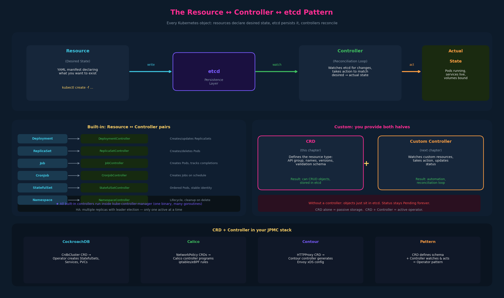
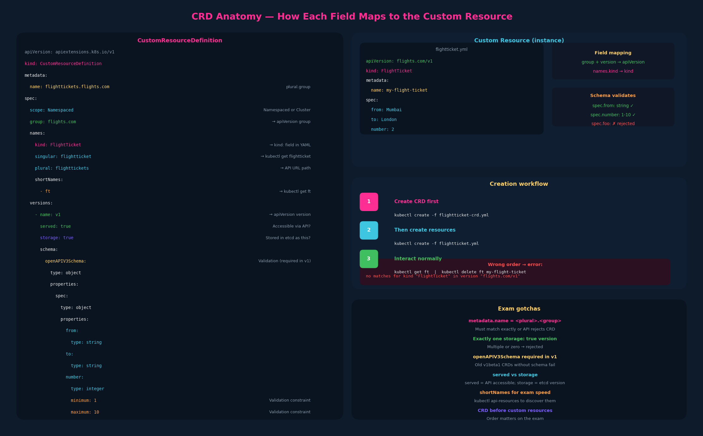

# 12 – Custom Resource Definitions (CRDs)





---

## 1. The Resource + Controller pattern

Every Kubernetes object follows the same fundamental pattern:

```
Resource (desired state)  ←→  etcd (persisted state)  ←→  Controller (reconciliation loop)
```

**Resource**: a YAML/JSON declaration of desired state. A Deployment, a Pod,
a Service — you `kubectl create -f` it and it gets stored in etcd.

**etcd**: the persistence layer. All cluster state lives here as key-value pairs.

**Controller**: a process that continuously watches etcd for changes to its
resource type and takes action to reconcile actual state with desired state.
The Deployment controller watches Deployment objects and creates/updates
ReplicaSets. The ReplicaSet controller watches ReplicaSets and creates/deletes
Pods. The Job controller watches Jobs and creates Pods.

### Are controllers separate processes?

No — most built-in controllers run inside a single binary called
**kube-controller-manager**. Each controller is a separate Go goroutine
(lightweight thread) within that process. The kube-controller-manager binary
embeds dozens of controllers: Deployment, ReplicaSet, StatefulSet, Job,
CronJob, Namespace, ServiceAccount, Node, PV, and many more.

For HA clusters, you run multiple replicas of kube-controller-manager across
control-plane nodes, but **only one is the active leader** at a time (via
leader election). The other replicas are standby — they become active if the
leader fails. This means all the controllers within the manager fail over
together.

```
Control Plane Node 1                    Control Plane Node 2 (standby)
┌──────────────────────────┐           ┌──────────────────────────┐
│ kube-controller-manager  │           │ kube-controller-manager  │
│   ├─ DeploymentController│           │   (leader election:      │
│   ├─ ReplicaSetController│  ← active │    standby, watching)    │
│   ├─ JobController       │           │                          │
│   ├─ NamespaceController │           │                          │
│   └─ ... 30+ more        │           │                          │
└──────────────────────────┘           └──────────────────────────┘
```

The Kubernetes source code for each controller lives in its own package
(e.g., `deployment_controller.go`). The `DeploymentController` struct has a
`Run()` method that starts watching and syncing, and an `addReplicaSet()`
method that creates the ReplicaSet child objects.

### Every built-in resource type has a matching controller

| Resource | Controller | What it does |
|---|---|---|
| Deployment | DeploymentController | Creates/updates ReplicaSets, manages rollouts |
| ReplicaSet | ReplicaSetController | Creates/deletes Pods to match replica count |
| Job | JobController | Creates Pods, tracks completions |
| CronJob | CronJobController | Creates Jobs on schedule |
| StatefulSet | StatefulSetController | Creates Pods with stable identity, ordered scaling |
| Namespace | NamespaceController | Manages namespace lifecycle, cleanup on deletion |

---

## 2. Custom Resources — extending Kubernetes

What if you want Kubernetes to manage something that isn't a built-in type?
Example: a `FlightTicket` resource for booking flights.

```yaml
# flightticket.yml
apiVersion: flights.com/v1
kind: FlightTicket
metadata:
  name: my-flight-ticket
spec:
  from: Mumbai
  to: London
  number: 2
```

If you try to create this without configuring anything:

```bash
$ kubectl create -f flightticket.yml
error: no matches for kind "FlightTicket" in version "flights.com/v1"
```

Kubernetes doesn't know what a `FlightTicket` is. You need two things:

1. **A CRD** — tells Kubernetes the schema of your new resource type (what
   fields it has, what API group it belongs to, what names it uses)
2. **A custom controller** — watches your custom resources and takes action
   (next chapter)

The CRD alone gives you storage — you can create, read, update, delete your
custom objects in etcd. But without a controller, nothing *happens* when you
create one. It just sits in etcd. A `FlightTicket` with `status: Pending`
will stay Pending forever unless a controller is watching and acting on it.

---

## 3. CRD YAML anatomy

```yaml
# flightticket-custom-definition.yml
apiVersion: apiextensions.k8s.io/v1
kind: CustomResourceDefinition
metadata:
  name: flighttickets.flights.com   # plural.group — must match
spec:
  scope: Namespaced                 # or Cluster
  group: flights.com                # the API group for your resources
  names:
    kind: FlightTicket              # PascalCase — used in YAML manifests
    singular: flightticket          # lowercase — used in CLI (kubectl get flightticket)
    plural: flighttickets           # lowercase — used in API URL path
    shortNames:
      - ft                          # kubectl get ft
  versions:
    - name: v1
      served: true                  # is this version available via the API?
      storage: true                 # is this the storage version?
      schema:
        openAPIV3Schema:
          type: object
          properties:
            spec:
              type: object
              properties:
                from:
                  type: string
                to:
                  type: string
                number:
                  type: integer
                  minimum: 1
                  maximum: 10
```

### Field-by-field breakdown

**`apiVersion: apiextensions.k8s.io/v1`** — CRDs themselves are a built-in
Kubernetes resource in the `apiextensions` API group. This is the meta-level:
you're using Kubernetes' own API to define a new API type.

**`metadata.name`** — must be `<plural>.<group>`. In this case
`flighttickets.flights.com`. This naming convention is enforced by the API.

**`spec.scope`** — `Namespaced` means instances live in a namespace (like
Pods); `Cluster` means they're cluster-wide (like Nodes). Most custom
resources are `Namespaced`.

**`spec.group`** — your custom API group. This becomes the first part of
`apiVersion` in your custom resource manifests (`flights.com/v1`).

**`spec.names`** — four forms of the name:
- `kind`: PascalCase, used in YAML `kind:` field
- `singular`: lowercase, for `kubectl get flightticket`
- `plural`: lowercase, used in API URL paths and `kubectl get flighttickets`
- `shortNames`: abbreviation for kubectl speed (`kubectl get ft`)

**`spec.versions`** — list of API versions this CRD supports. Each version
has:
- `served: true/false` — is this version active in the API?
- `storage: true` — exactly one version must be the storage version (connects
  back to ch10)
- `schema.openAPIV3Schema` — the validation schema. This is where you define
  the structure of your custom resource's `spec`, `status`, and other fields.
  The schema is validated at creation time — if someone tries to set `number`
  to a string, the API rejects it.

---

## 4. Creating the CRD and using it

```bash
# Step 1: Create the CRD (defines the new resource type)
kubectl create -f flightticket-custom-definition.yml
# customresourcedefinition.apiextensions.k8s.io/flighttickets.flights.com created

# Step 2: Now create an instance of the custom resource
kubectl create -f flightticket.yml
# flightticket "my-flight-ticket" created

# Step 3: Interact with it like any other resource
kubectl get flightticket
# NAME               STATUS
# my-flight-ticket   Pending

kubectl get ft       # shortName works too
# NAME               AGE
# my-flight-ticket   24m

# It shows up in api-resources:
kubectl api-resources | grep flight
# flighttickets   ft   flights.com   true   FlightTicket

kubectl delete -f flightticket.yml
# flightticket "my-flight-ticket" deleted
```

The order matters: CRD first, then custom resources. If you try to create
a `FlightTicket` before the CRD exists, you get the "no matches for kind"
error.

---

## 5. The schema validation layer

The `openAPIV3Schema` in the CRD is powerful — it's the same OpenAPI v3
validation that built-in resources use:

```yaml
schema:
  openAPIV3Schema:
    type: object
    properties:
      spec:
        type: object
        properties:
          from:
            type: string
          to:
            type: string
          number:
            type: integer
            minimum: 1
            maximum: 10
```

This enforces:
- `spec.from` must be a string
- `spec.number` must be an integer between 1 and 10
- Unknown fields are rejected (by default in `apiextensions.k8s.io/v1`)

You can add `required`, `enum`, `pattern`, `default`, and other OpenAPI
validators. In `v1` CRDs, the schema is **required** — you can't create a
CRD without it (older `v1beta1` CRDs didn't require schema, but that API
version is removed).

---

## 6. CRD vs. what's still missing: the controller

At this point after creating the CRD, you have:
- ✅ A new resource type registered in the Kubernetes API
- ✅ The ability to CRUD objects of that type
- ✅ Schema validation on create/update
- ✅ Objects persisted in etcd
- ✅ RBAC integration (you can create Roles for `flighttickets` resources)
- ❌ **No automation** — nothing happens when you create a FlightTicket
- ❌ **No status updates** — status stays whatever the user set
- ❌ **No reconciliation** — if something fails, nobody retries

The controller is what turns a passive data store into an active system.
The next chapter covers custom controllers.

---

## 7. Exam-pattern gotchas

**Gotcha 1 – `metadata.name` must be `<plural>.<group>`**
If you define `names.plural: flighttickets` and `group: flights.com`, the
CRD `metadata.name` must be exactly `flighttickets.flights.com`. Any
mismatch and the API rejects the CRD.

**Gotcha 2 – Exactly one version must have `storage: true`**
If you define multiple versions, exactly one must be the storage version.
Two with `storage: true` or zero with `storage: true` causes rejection.

**Gotcha 3 – Schema is required in `apiextensions.k8s.io/v1`**
You can't create a CRD without an `openAPIV3Schema`. Old examples using
`v1beta1` without a schema won't work on modern clusters.

**Gotcha 4 – CRD must exist before custom resources**
Create the CRD first, then the custom resources. On the exam, if you're
given both files, apply the CRD first.

**Gotcha 5 – `served` vs `storage`**
`served: true` means "this version is accessible via the API."
`storage: true` means "this is the version objects are stored as in etcd."
You can have multiple versions served but only one stored. A version can be
`served: false, storage: true` (still stores as that version but users can't
access it directly — rare, mainly for migration).

**Gotcha 6 – shortNames for exam speed**
If a CRD defines `shortNames: [ft]`, you can use `kubectl get ft` instead
of `kubectl get flighttickets`. On the exam this saves keystrokes. Check
`kubectl api-resources` to discover shortNames for any resource.

## References

- [Extend the Kubernetes API with CustomResourceDefinitions](https://kubernetes.io/docs/tasks/extend-kubernetes/custom-resources/custom-resource-definitions/) — CRD YAML anatomy, scope, versions, openAPIV3Schema, served/storage
- [Custom Resources](https://kubernetes.io/docs/concepts/extend-kubernetes/api-extension/custom-resources/) — the resource + controller model and when to use a CRD vs a ConfigMap
- [Kubernetes API Concepts](https://kubernetes.io/docs/reference/using-api/api-concepts/) — how custom resources plug into the same API URL and verb structure
