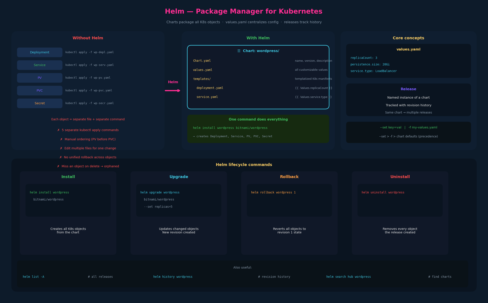

# 01 – Helm Introduction and Installation



---

## 1. The problem Helm solves

Even a relatively simple application like WordPress requires multiple
Kubernetes objects:

| Object | Purpose |
|---|---|
| Deployment | Manages the WordPress pods (image, replicas, strategy) |
| Service | Exposes the pods (LoadBalancer or ClusterIP) |
| PersistentVolume | Provides storage backend |
| PersistentVolumeClaim | Requests storage for the pods |
| Secret | Stores the admin password |

Each object needs its own YAML file and its own `kubectl apply`:

```bash
kubectl apply -f wp-deploy.yaml
kubectl apply -f wp-svc.yaml
kubectl apply -f wp-pv.yaml
kubectl apply -f wp-pvc.yaml
kubectl apply -f wp-secret.yaml
```

This creates several operational pain points:

**Installation**: five separate `kubectl apply` commands, in the right order
(PV before PVC, Secret before Deployment that references it).

**Updates**: edit individual YAML files, figure out which objects changed,
re-apply them. If a field rename spans multiple files, you edit all of them.

**Rollback**: there's no native "undo the last change across all five
objects" in kubectl. You'd have to manually track what changed and reverse
it.

**Uninstall**: `kubectl delete` for each object individually. Miss one and
you leave orphaned resources behind.

Now scale this to a production application with dozens or hundreds of
objects — Deployments, StatefulSets, ConfigMaps, Secrets, Services,
Ingresses, ServiceAccounts, Roles, RoleBindings, NetworkPolicies, HPAs.
Managing them individually becomes untenable.

---

## 2. Helm — the package manager for Kubernetes

Helm treats all the Kubernetes objects that make up an application as a
single **package** (called a **chart**). Analogy: installing a video game.
The game consists of thousands of files (executables, audio, graphics,
configs), but you don't place each file manually — you run an installer that
handles everything. Helm is that installer for Kubernetes.

### What Helm provides

**Single-command lifecycle**: one command to install, upgrade, rollback, or
uninstall an entire application regardless of how many Kubernetes objects
it contains.

```bash
helm install wordpress ...       # creates all objects
helm upgrade wordpress ...       # updates changed objects
helm rollback wordpress ...      # reverts to previous state
helm uninstall wordpress ...     # removes all objects
```

**Templatized manifests**: instead of hardcoding values in YAML files, Helm
charts use Go templates with variables. The actual values are injected at
install time from a `values.yaml` file or command-line overrides.

**Release management**: every `helm install` creates a **release** — a
named, versioned instance of a chart. Helm tracks the history of each
release, enabling upgrade and rollback by comparing release revisions.

**Repository ecosystem**: Helm charts are published to repositories (like
Artifact Hub), so you can install complex applications without writing any
YAML yourself.

---

## 3. Core Helm concepts

### Chart

A chart is a directory (or packaged `.tgz` archive) containing all the
templatized Kubernetes manifests, a `values.yaml` file with defaults, and
metadata (`Chart.yaml`).

```
wordpress/
├── Chart.yaml          # name, version, description
├── values.yaml         # default configuration values
├── templates/
│   ├── deployment.yaml # Go-template with {{ .Values.xxx }}
│   ├── service.yaml
│   ├── pv.yaml
│   ├── pvc.yaml
│   └── secret.yaml
└── charts/             # sub-chart dependencies
```

### values.yaml

The single file where all customizable parameters live. Instead of editing
five YAML files to change the PV size, you change one value:

```yaml
# values.yaml
wordpressUsername: user
wordpressEmail: user@example.com
wordpressFirstName: FirstName
wordpressLastName: LastName
# wordpressPassword:   # defaults to random 10-char string

persistence:
  size: 20Gi
  storageClass: standard

service:
  type: LoadBalancer
  port: 80

replicaCount: 3
```

You can override values at install time without editing the file:

```bash
helm install wordpress bitnami/wordpress \
  --set persistence.size=50Gi \
  --set replicaCount=5

# or with a custom values file:
helm install wordpress bitnami/wordpress \
  -f my-values.yaml
```

### Release

A release is a running instance of a chart. You can install the same chart
multiple times with different release names and different values:

```bash
helm install blog      bitnami/wordpress --set service.port=8080
helm install marketing bitnami/wordpress --set service.port=8081
```

Each release is tracked independently — upgrading `blog` doesn't affect
`marketing`.

---

## 4. Helm lifecycle commands

```bash
# Search for charts
helm search repo wordpress        # search configured repos
helm search hub wordpress         # search Artifact Hub

# Add a repository
helm repo add bitnami https://charts.bitnami.com/bitnami
helm repo update

# Install a chart (creates a release)
helm install <release-name> <chart> [flags]
helm install wordpress bitnami/wordpress

# List releases
helm list
helm list --all-namespaces

# Upgrade a release (applies changes)
helm upgrade <release-name> <chart> [flags]
helm upgrade wordpress bitnami/wordpress --set replicaCount=5

# Rollback to a previous revision
helm rollback <release-name> <revision>
helm rollback wordpress 1          # roll back to revision 1

# View release history
helm history wordpress

# Uninstall a release (removes all objects)
helm uninstall <release-name>
helm uninstall wordpress
```

---

## 5. Installing Helm

### Prerequisites

- A functional Kubernetes cluster (kind, kubeadm, managed — any will do)
- `kubectl` installed and configured with a valid kubeconfig (`~/.kube/config`)
- Helm communicates with the cluster through the same kubeconfig kubectl uses

### Installation on Linux

```bash
# Option 1: official install script (most common)
curl https://raw.githubusercontent.com/helm/helm/main/scripts/get-helm-3 | bash

# Option 2: snap
sudo snap install helm --classic

# Option 3: apt (Debian/Ubuntu)
curl https://baltocdn.com/helm/signing.asc | gpg --dearmor | \
  sudo tee /usr/share/keyrings/helm.gpg > /dev/null
echo "deb [signed-by=/usr/share/keyrings/helm.gpg] https://baltocdn.com/helm/stable/debian/ all main" | \
  sudo tee /etc/apt/sources.list.d/helm-stable-debian.list
sudo apt-get update && sudo apt-get install helm

# Verify
helm version
```

### Other platforms

- **macOS**: `brew install helm`
- **Windows**: `choco install kubernetes-helm` or `scoop install helm`
- **WSL2**: use the Linux instructions above inside your Ubuntu WSL2 environment

### On the CKAD exam

Helm is pre-installed — no installation needed. Just verify it's available
with `helm version` if unsure.

---

## 6. How Helm fits with what you already know

### Helm vs. Operators

Helm and operators solve different problems and are often used together:

| Aspect | Helm | Operator |
|---|---|---|
| **What it does** | Packages and deploys Kubernetes manifests | Runs a controller that continuously reconciles state |
| **Lifecycle** | Install/upgrade/rollback/uninstall | Continuous monitoring, self-healing, auto-scaling |
| **Complexity** | Template rendering at deploy time | Active controller process watching resources |
| **Day-2 ops** | Manual upgrades via `helm upgrade` | Automated backup, failover, scaling |

Many operators are **installed via Helm charts**. For example, you might
`helm install cert-manager jetstack/cert-manager` — Helm deploys the
operator's CRDs, controller Deployment, and RBAC in one command. After
that, the operator takes over day-2 operations.

### Helm vs. kubectl apply

Helm doesn't replace kubectl — it uses kubectl (or the Kubernetes API
directly) under the hood. Helm adds the packaging, templating, and release
management layer on top.

---

## 7. Exam-pattern gotchas

**Gotcha 1 – Helm is available on the exam**
Helm is pre-installed in the CKAD exam environment. You may need to use
`helm install`, `helm upgrade`, or `helm uninstall`. Know the basic commands.

**Gotcha 2 – `--set` vs `-f` for value overrides**
`--set key=value` for individual overrides on the command line.
`-f values.yaml` for a file of overrides. `--set` takes precedence over
`-f` which takes precedence over the chart's default `values.yaml`.

**Gotcha 3 – Release names must be unique within a namespace**
You can't have two releases named `wordpress` in the same namespace.
Different namespaces can have the same release name.

**Gotcha 4 – `helm list` shows the current namespace**
By default `helm list` only shows releases in the current namespace.
Use `--all-namespaces` or `-A` to see everything.

**Gotcha 5 – `helm uninstall` removes everything**
Unlike `kubectl delete -f`, `helm uninstall` knows every object the
release created and removes them all. Clean teardown.
