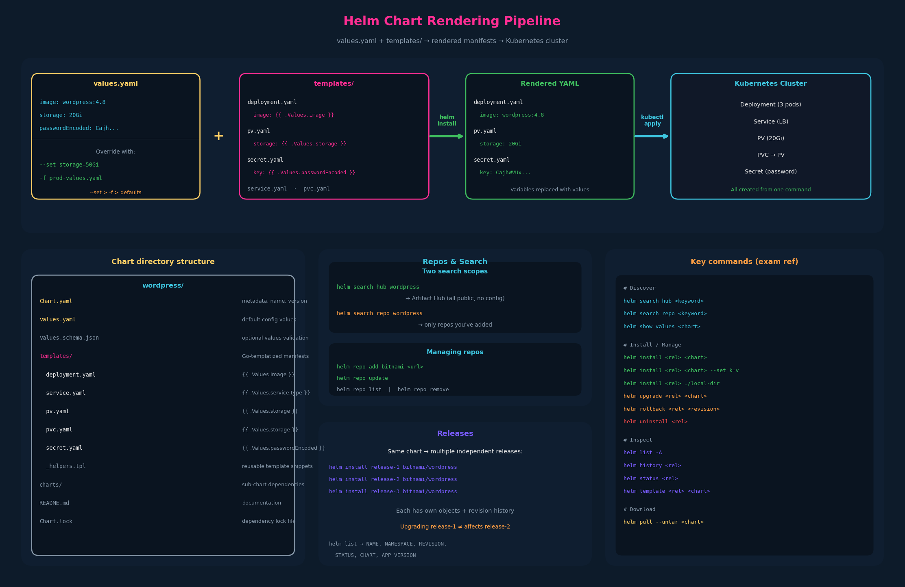

# 02 – Helm Concepts — Charts, Templates, Repos, and Releases



---

## 1. From hardcoded YAML to templates

The WordPress example shows the core problem templates solve. The raw YAML
files have environment-specific values hardcoded directly in them:

```yaml
# templates/deployment.yaml (BEFORE templating — hardcoded)
spec:
  containers:
    - image: wordpress:4.8-apache    # hardcoded image tag
      name: wordpress

# templates/pv.yaml
spec:
  capacity:
    storage: 20Gi                     # hardcoded size

# templates/secret.yaml
data:
  key: CajhWVUxSdzI2Qzg0SERXhBQT... # hardcoded password
```

Different environments need different values: dev might use `wordpress:latest`
with 5Gi storage, staging might use `wordpress:5.9` with 10Gi, production
uses `wordpress:5.9.3` with 50Gi. Editing five files per environment is
error-prone and tedious.

### The fix: replace hardcoded values with Go template variables

```yaml
# templates/deployment.yaml (AFTER templating)
spec:
  containers:
    - image: {{ .Values.image }}       # variable reference
      name: wordpress

# templates/pv.yaml
spec:
  capacity:
    storage: {{ .Values.storage }}     # same variable system

# templates/pvc.yaml
spec:
  resources:
    requests:
      storage: {{ .Values.storage }}   # reuse the same value

# templates/secret.yaml
data:
  key: {{ .Values.passwordEncoded }}
```

The `{{ }}` double curly braces are Go template syntax. `.Values` refers to
the values.yaml file (or overrides passed at install time). Everything after
`.Values.` is a key path into that YAML structure.

### values.yaml provides the actual values

```yaml
# values.yaml
image: wordpress:4.8-apache
storage: 20Gi
passwordEncoded: CajhWVUxSdzI2Qzg0SERXhBQTVrQ1FzN2JE9PQ==
```

At install time, Helm reads the templates, substitutes the `{{ .Values.xxx }}`
placeholders with values from `values.yaml`, and sends the rendered manifests
to the Kubernetes API. The templates + values.yaml → fully rendered YAML is
the fundamental Helm operation.

### Customizing per environment

Anyone deploying this chart can override values without touching the
templates:

```bash
# Dev environment — small footprint
helm install wp-dev bitnami/wordpress \
  --set storage=5Gi \
  --set image=wordpress:latest

# Production — full resources
helm install wp-prod bitnami/wordpress \
  -f prod-values.yaml
```

Where `prod-values.yaml` might contain:
```yaml
image: wordpress:5.9.3
storage: 50Gi
replicaCount: 5
```

---

## 2. The three components of a Helm chart

A chart is a directory containing three key parts:

### Chart.yaml — metadata about the chart

```yaml
# Chart.yaml
apiVersion: v2                # Helm chart API version (v2 for Helm 3)
name: Wordpress
version: 9.0.3                # chart version (the package version)
description: Web publishing platform for building blogs and websites.
keywords:
  - wordpress
  - cms
  - blog
  - http
  - web
  - application
  - php
home: http://www.wordpress.com/
sources:
  - https://github.com/bitnami/bitnami-docker-wordpress
maintainers:
  - email: containers@bitnami.com
    name: Bitnami
```

Key fields:
- `apiVersion: v2` — always `v2` for Helm 3 charts (`v1` was Helm 2)
- `name` — the chart name
- `version` — the version of the chart packaging itself (not the app version)
- `description`, `keywords` — used for search and discovery
- `maintainers` — who maintains the chart

### templates/ — templatized Kubernetes manifests

```
templates/
├── deployment.yaml      # {{ .Values.image }}, {{ .Values.replicaCount }}
├── service.yaml         # {{ .Values.service.type }}
├── pv.yaml              # {{ .Values.storage }}
├── pvc.yaml             # {{ .Values.storage }}
├── secret.yaml          # {{ .Values.passwordEncoded }}
└── _helpers.tpl         # reusable template snippets (optional)
```

These are not valid Kubernetes YAML on their own — they contain Go template
directives that Helm renders at install time.

### values.yaml — default configuration

```yaml
# values.yaml (defaults shipped with the chart)
image: wordpress:4.8-apache
storage: 20Gi
passwordEncoded: CajhWVUxSdzI2Qzg...
replicaCount: 3
service:
  type: LoadBalancer
  port: 80
```

Users override these defaults with `--set` or `-f` at install time. The
chart author sets sensible defaults; the deployer customizes for their
environment.

### Full chart directory structure

```
wordpress/
├── Chart.yaml           # metadata
├── Chart.lock           # dependency lock file
├── values.yaml          # defaults
├── values.schema.json   # optional JSON schema for values validation
├── templates/           # Go-templatized K8s manifests
│   ├── deployment.yaml
│   ├── service.yaml
│   ├── pv.yaml
│   ├── pvc.yaml
│   ├── secret.yaml
│   └── _helpers.tpl
├── charts/              # sub-chart dependencies (e.g., MariaDB)
├── README.md
└── ci/                  # CI test values
```

---

## 3. Helm repositories and search

### Hub, repo, chart, release — four nouns, four layers

Kustomize has no distribution layer: a base is a directory you point at.
Helm adds packaging and distribution, and these four words are its layers.

| Layer | What it physically is | Commands that touch it |
|---|---|---|
| **Hub** | artifacthub.io — a search engine over repos that registered with it. It hosts nothing. | `helm search hub` |
| **Repo** | an HTTP server with packaged charts (`.tgz`) and one `index.yaml` listing every chart and version | `helm repo add/update/list`, `helm search repo` |
| **Chart** | a directory (or that directory packaged as `<name>-<version>.tgz`): `Chart.yaml`, `values.yaml`, `templates/` | `helm show values`, `helm pull`, `helm install` |
| **Release** | one installed copy of a chart, tracked as Secrets in its Namespace | `helm ls`, `upgrade`, `rollback`, `uninstall` |

The hub is not a repository. It crawls the `index.yaml` of every registered
repo so that `helm search hub` can tell you *which repo to add*; the charts
themselves are downloaded from that repo. `helm search hub` therefore works
with no repos configured, while `helm search repo` searches only the repos
you added.

A repo is deliberately dumb: static files behind any web server, which is
why so many live on GitHub Pages (`https://<org>.github.io/<charts>`). The
`index.yaml` is what `helm repo update` downloads into a local cache and what
`helm search repo` reads:

```yaml
apiVersion: v1
entries:
  ingress-nginx:
    - version: 4.15.1          # chart version — what --version selects
      appVersion: 1.15.1       # the software inside
      digest: 3eff0bd18151d6e6b1c441463410571443dda1ac78292cb189346628de784f0c
      urls:
        - https://github.com/kubernetes/ingress-nginx/releases/download/helm-chart-4.15.1/ingress-nginx-4.15.1.tgz
    - ...                      # one block per older version
```
(excerpt of the real index as of 2026-09-04; abbreviated)

**"Packaged" means a gzipped tar archive.** `helm package ./mychart` writes
`mychart-1.0.0.tgz`, which is `tar -czf` of the chart directory: tar
concatenates the files into one stream keeping paths and Unix permissions,
gzip compresses the whole stream. A zip compresses each file separately and
keeps an index (random access); a jar is a zip with `META-INF/MANIFEST.MF`.
Helm chose tar+gzip because it is the Unix default and preserves file modes.
`helm pull` downloads the `.tgz`, `--untar` extracts it (`tar -xzf`),
`tar -tzf mychart-1.0.0.tgz` lists what is inside without extracting.

```bash
helm package ./mychart -d ./repo             # -> ./repo/mychart-1.0.0.tgz
helm repo index ./repo --url https://example.com/repo    # writes ./repo/index.yaml
# serve ./repo over HTTP and it is a chart repository
```

See each layer in a browser:

- Hub: [artifacthub.io](https://artifacthub.io/); a chart page such as
  [ingress-nginx](https://artifacthub.io/packages/helm/ingress-nginx/ingress-nginx)
  shows the repo URL to add, the version list, and the default values.
- Repo, raw: [kubernetes.github.io/ingress-nginx/index.yaml](https://kubernetes.github.io/ingress-nginx/index.yaml)
  or [charts.jetstack.io/index.yaml](https://charts.jetstack.io/index.yaml)
  (cert-manager). This is exactly what `helm search repo --versions` prints.
- Chart source: [the ingress-nginx chart on GitHub](https://github.com/kubernetes/ingress-nginx/tree/main/charts/ingress-nginx)
  — `values.yaml` next to `templates/` shows the `{{ .Values }}` plumbing.

Newer charts are often published to container registries as OCI artifacts
instead: no `helm repo add`, just
`helm install x oci://ghcr.io/<org>/charts/<name> --version 1.2.3`.
Artifact Hub indexes those too.

### Two search scopes

```bash
# Search Artifact Hub (all public charts, no repo config needed)
helm search hub wordpress
```
```
URL                                          CHART VERSION  APP VERSION  DESCRIPTION
https://hub.helm.sh/charts/bitnami-aks/...   12.1.1        5.8.0        Web publishing platform...
https://hub.helm.sh/charts/groundhog2k/...    0.4.1        5.8.0-apache A Helm chart for Wordpress...
https://hub.helm.sh/charts/kube-wordpress/... 0.1.0        1.1          this is my wordpress package
```

```bash
# Search locally-configured repos only
helm search repo wordpress
```
```
NAME                CHART VERSION  APP VERSION  DESCRIPTION
bitnami/wordpress   12.1.14       5.8.1        Web publishing platform...
```

`helm search hub` searches the public Artifact Hub — no repo configuration
needed. `helm search repo` only searches repos you've explicitly added.

### Managing repos

```bash
# Add a repository
helm repo add bitnami https://charts.bitnami.com/bitnami

# Update repo index (fetch latest chart versions)
helm repo update

# List configured repos
helm repo list
# NAME    URL
# bitnami https://charts.bitnami.com/bitnami

# Remove a repo
helm repo remove bitnami
```

After adding a repo, you reference charts as `<repo-name>/<chart-name>`,
e.g., `bitnami/wordpress`.

---

## 4. Releases — independent instances of a chart

Every `helm install` creates a **release**: a named, tracked deployment of
a chart. The same chart can be installed multiple times with different
release names, and each release is completely independent.

```bash
# Three independent WordPress instances from the same chart
helm install release-1 bitnami/wordpress
helm install release-2 bitnami/wordpress
helm install release-3 bitnami/wordpress
```

Each release gets its own set of Kubernetes objects (Deployments, Services,
etc.) and its own revision history. Upgrading `release-1` has no effect on
`release-2`.

### Viewing releases

```bash
helm list
# NAME         NAMESPACE  REVISION  UPDATED                   STATUS    CHART              APP VERSION
# my-release   default    1         2021-05-30 09:52:38...    deployed  wordpress-11.0.12  5.7.2
```

Key columns:
- `REVISION` — increments with each `helm upgrade`; used for rollback
- `STATUS` — `deployed`, `failed`, `pending-install`, etc.
- `CHART` — chart name + version
- `APP VERSION` — the application version (from Chart.yaml `appVersion`)

---

## 5. Additional Helm commands

### Pull a chart locally (inspect or customize before installing)

```bash
# Download and extract a chart to a local directory
helm pull --untar bitnami/wordpress

# Inspect the contents
ls wordpress/
# Chart.lock  Chart.yaml  README.md  charts  ci  templates  values.schema.json  values.yaml

# Install from the local directory instead of the repo
helm install release-4 ./wordpress
```

This is useful when you want to read the templates, inspect the default
`values.yaml`, or vendor a chart into your own repo.

### Full command reference for the exam

```bash
# ── Discovery ──────────────────────────────────────────────────
helm search hub <keyword>           # search Artifact Hub (public)
helm search repo <keyword>          # search local repos

# ── Repos ──────────────────────────────────────────────────────
helm repo add <name> <url>          # add a chart repository
helm repo update                    # refresh repo index
helm repo list                      # show configured repos
helm repo remove <name>             # remove a repo

# ── Install / Upgrade / Rollback ──────────────────────────────
helm install <release> <chart>      # install a chart as a release
helm install <release> <chart> --set key=val   # override values
helm install <release> <chart> -f values.yaml  # override file
helm install <release> ./local-chart           # install from local dir

helm upgrade <release> <chart>      # upgrade to new chart version or values
helm rollback <release> <revision>  # revert to a previous revision

# ── Inspect ────────────────────────────────────────────────────
helm list                           # releases in current namespace
helm list -A                        # releases in all namespaces
helm history <release>              # revision history
helm status <release>               # current status and notes
helm show values <chart>            # print default values.yaml
helm show chart <chart>             # print Chart.yaml

# ── Download / Inspect ─────────────────────────────────────────
helm pull <chart>                   # download chart archive (.tgz)
helm pull --untar <chart>           # download and extract
helm template <release> <chart>     # render templates locally (no install)

# ── Cleanup ────────────────────────────────────────────────────
helm uninstall <release>            # remove all objects from a release
```

---

## 6. Exam-pattern gotchas

**Gotcha 1 – `helm search hub` vs `helm search repo`**
`hub` = Artifact Hub (everything public, no repo config needed).
`repo` = only repos you've added with `helm repo add`. If a search returns
nothing, you probably haven't added the repo yet.

**Gotcha 2 – `helm pull --untar` for local inspection**
If the exam asks you to inspect a chart's templates or values before
installing, `helm pull --untar <chart>` downloads it locally.

**Gotcha 3 – `helm template` renders without installing**
`helm template my-release bitnami/wordpress` renders the templates and
prints the Kubernetes manifests to stdout without creating any objects.
Useful for previewing what will be deployed.

**Gotcha 4 – Chart version vs App version**
`CHART VERSION` (e.g., 12.1.14) is the version of the Helm packaging.
`APP VERSION` (e.g., 5.8.1) is the version of the application being deployed.
They're independent and shown separately in `helm list` and `helm search`.

**Gotcha 5 – `helm show values` to see available configuration**
Before installing a chart, `helm show values bitnami/wordpress` prints the
full `values.yaml` so you know what you can override.

**Gotcha 6 – Installing from a local directory**
`helm install release-4 ./wordpress` installs from a local chart directory
(after `helm pull --untar`). The path starts with `./` — without it, Helm
looks for a repo chart.

## References

- [Charts](https://helm.sh/docs/topics/charts/) — chart structure, `Chart.yaml` fields (chart vs app version), and `templates/`
- [Values Files](https://helm.sh/docs/chart_template_guide/values_files/) — the `.Values` object and the precedence order (`values.yaml` → `-f` → `--set`)
- [Using Helm](https://helm.sh/docs/intro/using_helm/) — `helm search`, repo management, and the release lifecycle commands
- [helm — CLI reference](https://helm.sh/docs/helm/helm/) — top-level command index and global flags
- [The Chart Repository Guide](https://helm.sh/docs/topics/chart_repository/) — what a repo is (`index.yaml` + `.tgz` files on an HTTP server), `helm package`, `helm repo index`
- [Use OCI-based registries](https://helm.sh/docs/topics/registries/) — installing and pushing charts via `oci://` without a repo
