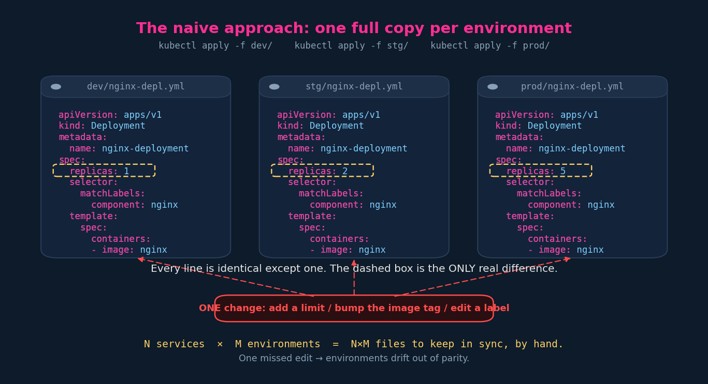
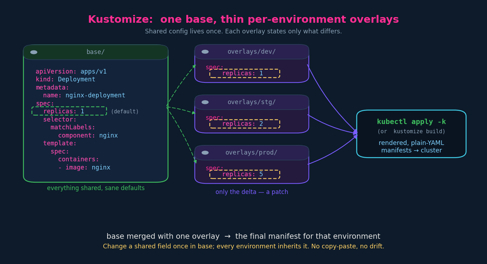
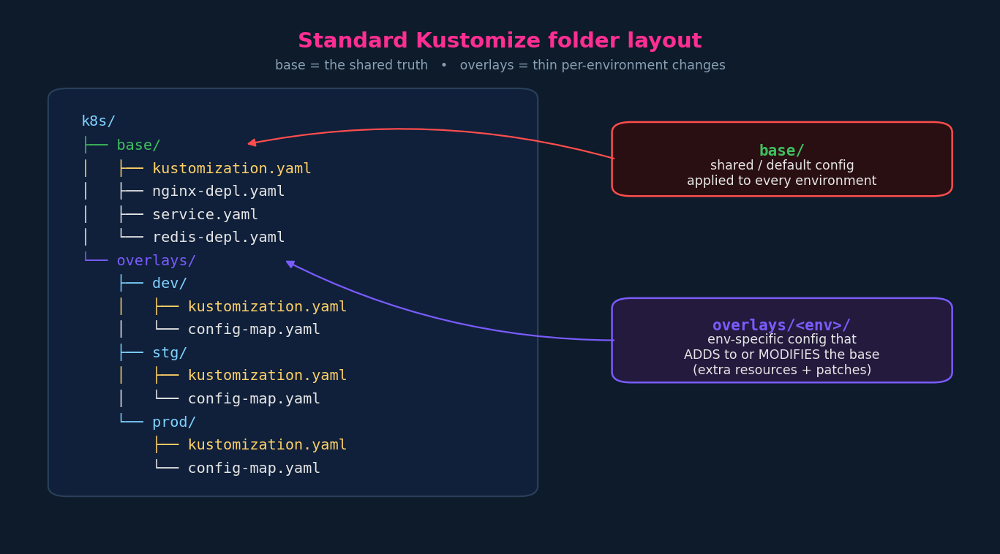

# Kustomize: Problem Statement & Ideology

Understand the duplication problem Kustomize solves and the **base + overlays**
mental model, because every later chapter is just mechanics hung on this skeleton.

CKAD note: Kustomize *is* examinable. It's templating-free and lives inside
`kubectl`, so questions tend to be "edit this overlay / add this patch / build
this directory," not deep tooling.

---

## 1. The problem: per-environment config without copy-paste

You have one app and three environments — `dev`, `stg`, `prod`. Almost everything
is identical; a few fields differ per env (start with the classic one:
`replicas`). How do you manage that?

### The naive answer: one full directory per environment

Make `dev/`, `stg/`, `prod/`, drop a complete copy of every manifest in each, and
deploy a whole environment with a directory apply:

```bash
kubectl apply -f dev/      # applies every *.yaml in dev/ as-is
kubectl apply -f stg/
kubectl apply -f prod/
```

This **works**. It is also the trap. Look at what you actually maintain:



Every line in `dev/nginx-depl.yml`, `stg/nginx-depl.yml`, and
`prod/nginx-depl.yml` is identical **except `replicas`**. So:

- Add a `resources.limits` block? Edit it in three files.
- Bump the image tag? Three files.
- Rename a label? Three files — and the deployment's `selector` is immutable, so
  a half-applied rename is a genuine outage.

Scale it: **N services × M environments = N×M files to keep byte-for-byte in
sync, by hand.** The moment one edit is missed, environments drift and you're
debugging a "works in stg, breaks in prod" ghost that is really just a typo.

> The directory approach is *a* valid solution. It's fine for a toy. It does not
> scale, and "doesn't scale" here specifically means "doesn't stay correct."

> Depth — `-f dir/` vs `-k dir/`: `kubectl apply -f dev/` just applies whatever
> YAML is sitting in the folder, no processing. That's the naive model.
> Kustomize is triggered by **`-k`** (or `kustomize build`), which *renders*
> manifests from a base + overlay before applying. Different flag, different
> behaviour — keep them straight.

---

## 2. The ideology: a shared base + thin overlays

Kustomize splits config into two kinds of thing:

- **base** — everything that is the **same** across environments, plus sane
  **default** values you can override later. The single source of truth.
- **overlays** — one per environment, each containing **only the delta** for that
  env (the patch). An overlay says "take the base, then change *these* fields."



The merge is the whole idea:

```
base   +   overlays/<env>   →   final rendered manifest for <env>
```

`replicas: 1` lives in the base as a default. `overlays/prod` carries
`replicas: 5` and nothing else it doesn't need to. Change a *shared* field once
in the base and every environment inherits it — no fan-out, no drift. You only
ever hand-edit the thing that is genuinely different.

This is the DRY version of the three-directory idea: same outcome
(`apply` a whole environment), without duplicating the parts that don't change.

---

## 3. Standard folder layout

The convention you'll see everywhere (and on the exam):



```
k8s/
├── base/                      # shared / default config for all envs
│   ├── kustomization.yaml     # entry point: lists the base resources
│   ├── nginx-depl.yaml
│   ├── service.yaml
│   └── redis-depl.yaml
└── overlays/                  # per-environment deltas
    ├── dev/
    │   ├── kustomization.yaml  # references ../../base + its patches
    │   └── config-map.yaml
    ├── stg/
    │   ├── kustomization.yaml
    │   └── config-map.yaml
    └── prod/
        ├── kustomization.yaml
        └── config-map.yaml
```

Key thing to lock in now: **`kustomization.yaml` is the entry file Kustomize
reads in every directory.** A base has one (it enumerates the base resources);
each overlay has one (it points at the base and declares its patches). If a
directory has no `kustomization.yaml`, Kustomize won't process it. The *contents*
of that file are chapter 02 — for now, just know it's the anchor in each folder.

Nothing here is magic naming except `kustomization.yaml` itself. `base/` and
`overlays/` are convention, not a requirement; you could call them anything, but
don't — stick to the convention so reviewers (and the exam grader's mental model)
recognise it instantly.

---

## 4. Why Kustomize (vs. Helm)

The advantages that justify reaching for Kustomize over a templating system:

- **Built into `kubectl`** — `kubectl apply -k` / `kubectl kustomize` work with
  no extra install. Nothing to add to a cluster or a CI image.
  - Caveat: the kustomize embedded in `kubectl` **lags** the standalone
    `kustomize` CLI. If you need a newer feature, install the standalone CLI and
    run `kustomize build | kubectl apply -f -`. (Worth flagging in CI where the
    `kubectl` version is pinned.)
- **No templating language to learn.** Helm uses Go templates — `{{ .Values.x }}`,
  conditionals, ranges — which turn a manifest into a program. Kustomize patches
  plain YAML with plain YAML. Lower cognitive load, fewer ways to footgun.
- **Every artifact is valid YAML.** Bases, overlays, patches — all of it is real
  YAML that `kubeval`, `kubectl --dry-run`, IDE schema validation, and `git diff`
  understand directly. A Helm template is *not* valid YAML until rendered, so your
  tooling and your PR diff see gibberish until `helm template` runs.

The honest trade-off (depth beyond the lecture): Helm also gives you packaging,
versioned releases, and `helm rollback` — a lifecycle Kustomize doesn't have.
They're not strictly either/or. A very common enterprise pattern is **Helm for
third-party charts** (cert-manager, ingress controllers, CockroachDB's chart)
and **Kustomize for your own manifests** — and you can even Kustomize-patch the
output of `helm template`. Pick Kustomize when the job is "same manifests, small
per-env differences"; reach for Helm when you need real packaging/distribution.

---

## 5. How you actually run it

Two equivalent ways to render + apply an environment:

```bash
# 1) kubectl drives kustomize and applies the result
kubectl apply -k overlays/dev/

# 2) standalone CLI renders to stdout; you pipe it
kustomize build overlays/dev/ | kubectl apply -f -

# just see the rendered YAML without applying (do this constantly):
kubectl kustomize overlays/dev/
# or:  kustomize build overlays/dev/
```

`kubectl kustomize <dir>` / `kustomize build <dir>` printing the final manifest
is your sanity check — in the exam, render before you apply so you can see
exactly what the overlay produced.

---

## 6. Exam-pattern gotchas

- **`-k` not `-f`.** `apply -f overlays/dev/` will try to apply the overlay's raw
  files (and choke on / ignore `kustomization.yaml`); `apply -k overlays/dev/`
  runs the merge. Easy to fat-finger under time pressure.
- **Point `-k`/`build` at the directory, not the file.** You give it the folder
  containing `kustomization.yaml`, never the yaml file itself.
- **Missing `kustomization.yaml` = no processing.** If a task says "build the dev
  overlay" and nothing happens, check the file exists and is named exactly
  `kustomization.yaml` (also accepted: `kustomization.yml`, `Kustomization`).
- **Render to verify.** When asked to change replicas/an image in an overlay,
  edit the overlay then `kubectl kustomize <dir>` to confirm the field actually
  changed in the rendered output before applying.

