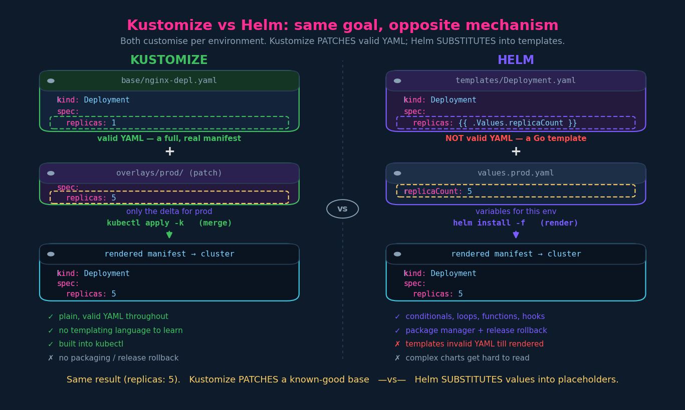

# Kustomize vs Helm

Helm is the *other* answer to the same question from ch.01 — "how do I customise
manifests per environment without copy-pasting?" Same goal, fundamentally
different mechanism. Know how the two differ and why a team picks one.

**CKAD scope:** both are examinable. Kustomize as covered in this section;
Helm as a *user* — the curriculum item is "use the Helm package manager to
deploy existing packages", so installing, upgrading, rolling back and removing
releases of a given chart, not authoring one. See
`../10-helm-fund/03-helm-exam-patterns.md`.

---

## 1. The one-line difference

- **Kustomize — patch model.** Start from a real, valid manifest (the base) and
  apply small YAML patches per environment. Everything stays valid YAML the whole
  way through. *Merge.*
- **Helm — substitute model.** Write a *template* full of placeholders, supply the
  values separately, and render the two together into a final manifest. The
  template is **not** valid YAML until rendered. *Substitute.*



---

## 2. How Helm actually works

Helm uses **Go templates** to assign variables to properties. Inside a template
you reference values with `{{ ... }}`:

```yaml
# templates/deployment.yaml  (a Helm chart template — NOT valid YAML on its own)
apiVersion: apps/v1
kind: Deployment
metadata:
  name: {{ .Values.name }}
spec:
  replicas: {{ .Values.replicaCount }}
  selector:
    matchLabels:
      app: {{ .Values.name }}
  template:
    metadata:
      labels:
        app: {{ .Values.name }}
    spec:
      containers:
        - name: {{ .Chart.Name }}
          image: "nginx:{{ .Values.image.tag }}"
```

The placeholders pull from a **`values.yaml`** at render time:

```yaml
# values.yaml  (the variables)
name: nginx
replicaCount: 1
image:
  tag: "1.27"
```


Per-environment customisation in Helm = **swap the values file** (or override
keys), the template is untouched:

```bash
helm install web ./mychart -f environments/values.dev.yaml
helm install web ./mychart -f environments/values.prod.yaml
helm install web ./mychart --set replicaCount=5      # ad-hoc override
helm template web ./mychart -f values.prod.yaml       # render only, no apply
```

Built-in objects you'll see in templates: `.Values` (your values file),
`.Chart` (chart metadata), `.Release` (release name/namespace/revision),
`.Capabilities`, `.Files`.

### Helm folder layout

The instructor's simplified picture: one set of `templates/` plus a values file
per environment.

```
k8s/
├── environments/
│   ├── values.dev.yaml      # per-env variables
│   ├── values.stg.yaml
│   └── values.prod.yaml
└── templates/               # the templated manifests (shared)
    ├── nginx-deployment.yaml
    ├── nginx-service.yaml
    ├── db-deployment.yaml
    └── db-service.yaml
```

A *real* Helm chart is a bit more than that — worth knowing the canonical shape:

```
mychart/
├── Chart.yaml        # chart metadata: name, version, appVersion
├── values.yaml       # default values (overridden by -f / --set)
├── templates/        # templated manifests + _helpers.tpl (named templates)
└── charts/           # vendored subchart dependencies
```

> Helm 3 note: there is **no Tiller** (the old in-cluster server component was
> removed in v3). Release state is stored as **Secrets in the release's
> namespace**. If you hit old tutorials talking about `helm init`/Tiller, that's
> Helm 2 — ignore it.

---

## 3. Helm is more than per-env config

The lecture's key framing: Helm isn't *just* a per-environment customiser — it's
a **package manager** for Kubernetes apps. That's the real reason teams adopt it:

- **Packaging & distribution** — a chart is a versioned, shareable unit. Pull
  charts from repos / OCI registries (`helm repo add`, `helm pull`). This is how
  you install third-party software (cert-manager, ingress-nginx, Prometheus).
- **Release lifecycle** — Helm tracks what it installed as a *release* with a
  revision history: `helm upgrade`, `helm rollback`, `helm history`, `helm list`.
  Kustomize has none of this — `apply -k` is fire-and-forget; rollback is "go
  re-apply the old YAML / `kubectl rollout undo`."
- **Logic** — conditionals (`{{ if }}`), loops (`{{ range }}`), functions and
  pipelines (`{{ .Values.x | default "y" | quote }}`), named templates
  (`define`/`include`), and **hooks** (pre/post-install/upgrade jobs via
  annotations). Kustomize is deliberately logic-free.

The cost of that power (also from the lecture): **templates aren't valid YAML**,
so your editor, `kubeval`, and `git diff` see template soup until you render with
`helm template`. **Complex charts become genuinely hard to read** — whitespace
and indentation in Go templates are their own special misery (`{{- -}}` trimming,
anyone). Debug with `helm template --debug` and `helm install --dry-run`.

---

## 4. Head-to-head

| Dimension | Kustomize | Helm |
|---|---|---|
| Mechanism | overlay / patch (merge) | template + values (substitute) |
| Artifacts | always valid YAML | templates invalid until rendered |
| Learning curve | low — YAML only | higher — Go templates |
| Install | built into `kubectl` (`-k`) | separate binary |
| Packaging / sharing | none native | charts, repos, OCI registries |
| Release lifecycle | none (just `apply`) | install / upgrade / **rollback** / history |
| Logic (if / loops / fns) | no (by design) | yes |
| Best fit | in-house manifests, small per-env deltas | distributable apps, heavy parameterization, 3rd-party software |

**It's not either/or.** Extremely common pattern: **Helm for third-party charts**
(you don't want to hand-maintain cert-manager's manifests) and **Kustomize for
your own services**. They even compose — Kustomize has a `helmCharts` inflation
generator that can render a chart and then patch it, so you can apply org policy
(labels, NetworkPolicies, registry rewrites) over a vendor chart without forking
it. Don't reach for that on day one; just know the two aren't enemies.

---

## 5. Three ways to inject values (the mental model that ties it together)

This is the useful generalisation. "Customise per environment" decomposes into
three distinct techniques, and your work setup uses more than one:

1. **Structural overlay / patch** *(Kustomize)* — merge YAML fragments onto a base.
   Operates on YAML structure. No string templating, no logic.
2. **Template substitution** *(Helm)* — a templating engine evaluates placeholders
   against a values tree, *with* logic (conditionals/loops/functions).
3. **Variable injection** *(envsubst / CI systems)* — plain `${VAR}` string
   substitution from key/value pairs at build/pipeline time. Simpler than Helm
   (no engine, no logic), and it can sit on top of plain *or* Kustomized YAML.

These layer. You can have a Kustomize base+overlay whose values are filled in by
a pipeline's variable injection.

## References

- [Declarative Management of Kubernetes Objects Using Kustomize](https://kubernetes.io/docs/tasks/manage-kubernetes-objects/kustomization/) — the merge/patch model Kustomize uses, contrasted here with Helm's substitute model
- [Charts](https://helm.sh/docs/topics/charts/) — Helm's chart structure and Go-template manifests (the substitute side of the comparison)
- [Using Helm](https://helm.sh/docs/intro/using_helm/) — Helm's package-manager features: repos, install/upgrade/rollback that Kustomize lacks

