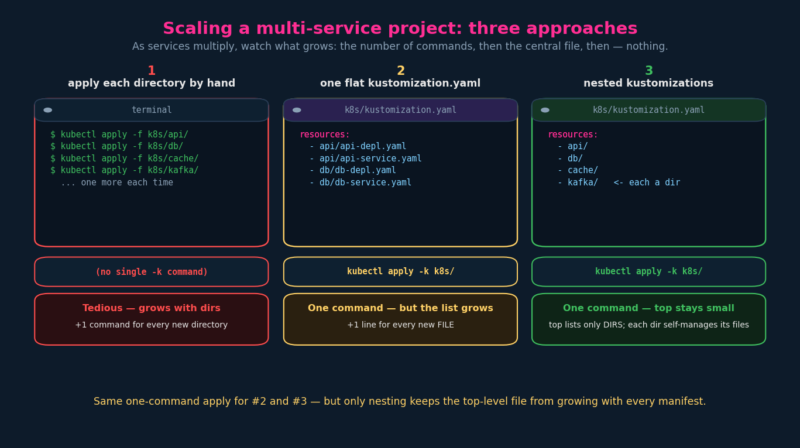
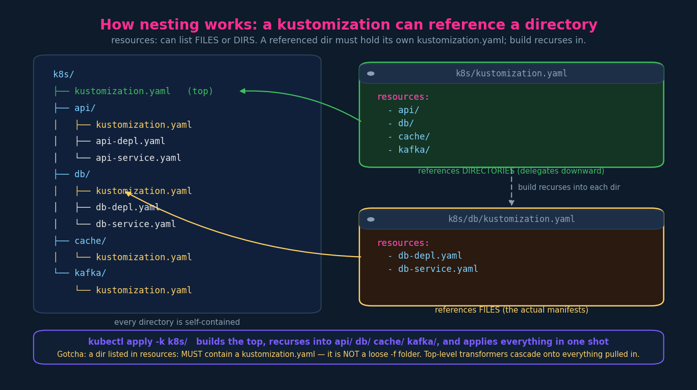

# Managing Directories (Nested kustomization.yaml)

Once a project has several services, you split them into subdirectories
(`api/`, `db/`, …). The one new mechanic: **a `kustomization.yaml` can reference a
directory, not just a file** — which lets you nest kustomizations.

---

## 1. The setup and the naive apply

Files organised by service under `k8s/`:

```
k8s/
├── api-depl.yaml
├── api-service.yaml
├── db-depl.yaml
└── db-service.yaml
```

…or, more realistically, split into per-service subdirectories:

```
k8s/
├── api/
│   ├── api-depl.yaml
│   └── api-service.yaml
└── db/
    ├── db-depl.yaml
    └── db-service.yaml
```

You *can* still deploy this with plain kubectl, one directory at a time:

```bash
kubectl apply -f k8s/api/
kubectl apply -f k8s/db/
```

That's fine for two directories. Add `cache/`, `kafka/`, `worker/`… and it's one
more command every time — tedious and easy to forget one.

---

## 2. Step 1 — a single flat kustomization.yaml

Put one `kustomization.yaml` at `k8s/` listing every manifest (note the subdir
path prefixes), and Kustomize does the applying for you in **one** command:

```yaml
# k8s/kustomization.yaml
apiVersion: kustomize.config.k8s.io/v1beta1
kind: Kustomization
resources:
  - api/api-depl.yaml
  - api/api-service.yaml
  - db/db-depl.yaml
  - db/db-service.yaml
```

```bash
kustomize build k8s/ | kubectl apply -f -      # or: kubectl apply -k k8s/
```

Better — one command regardless of directory count. **But** it doesn't fully
scale either: every new manifest is another line you must remember to add to this
central list. The toil moved from "+1 command per dir" to "+1 line per file."



---

## 3. Step 2 — nested kustomizations (the actual lesson)

Give **each subdirectory its own `kustomization.yaml`** that lists *that
directory's* files, then have the **top-level** `kustomization.yaml` reference the
**directories** instead of individual files:

```yaml
# k8s/kustomization.yaml   (top level)
resources:
  - api/
  - db/
  - cache/
  - kafka/
```

```yaml
# k8s/db/kustomization.yaml   (per-service)
resources:
  - db-depl.yaml
  - db-service.yaml
```



`kubectl apply -k k8s/` now builds the top level, **recurses into each referenced
directory**, builds each one, and applies the combined result — all in one shot.
The top-level file stays tiny (one line per service); each service owns and
manages its own manifests. That's the structure that actually scales.

> The key realisation: `resources:` entries can be **files or directories**. A
> directory entry is itself built as a kustomization and folded in. That single
> rule is the whole nesting feature.

---

## 4. Mechanics & gotchas

- **A directory in `resources:` must contain its own `kustomization.yaml`.** It is
  *not* a loose `-f` folder. `kubectl apply -f some/dir/` applies every YAML in
  that dir as-is; `resources: [ some/dir/ ]` requires `some/dir/kustomization.yaml`
  to exist, or build fails. Different rules — don't conflate them.
- **`build` recurses.** Building the top level builds every nested kustomization
  beneath it, depth permitting. One `-k` covers the whole tree.
- **Relative paths** are relative to the location of the `kustomization.yaml` that
  names them (so `../../base/` walks up from an overlay).
- **Transformers cascade.** A transformer at the top level (e.g. `commonLabels`,
  `namespace`) applies to **everything** pulled in from nested kustomizations.
  Each nested kustomization can *also* run its own transformers first, at its own
  level. Inner transforms happen, then outer transforms apply over the merged
  result — this layering is exactly what makes overlays work (next point).
- **`bases:` was the old nesting field** — it existed *specifically* to reference
  base directories. It's deprecated; modern kustomize folds base dirs straight
  into `resources:`. (Flagged in ch.03; this is *why* it existed.)

---

## 5. Imperative / exam shortcuts

```bash
kubectl apply  -k k8s/         # build top, recurse, apply
kubectl kustomize k8s/         # render the whole nested tree to stdout (inspect!)
kustomize build k8s/           # same render via the standalone CLI

# scaffold a kustomization.yaml in the current dir from the YAML already there
kustomize create --autodetect          # in k8s/db/, picks up db-*.yaml
kustomize edit add resource cache/      # add a dir/file to resources: in place
```

When a nested build misbehaves, `kubectl kustomize k8s/` (render-only) is the
fastest way to see the fully-merged output and spot the missing/duplicated
resource before you ever apply.

## References

- [resources](https://kubectl.docs.kubernetes.io/references/kustomize/kustomization/resource/) — `resources:` entries may be files, kustomization directories, or remote URLs (the nesting rule)
- [The Kustomization File](https://kubectl.docs.kubernetes.io/references/kustomize/kustomization/) — how nested kustomizations compose and how transformers cascade
- [kustomize build](https://kubectl.docs.kubernetes.io/references/kustomize/cmd/build/) — recursive (depth-first) build across referenced directories
