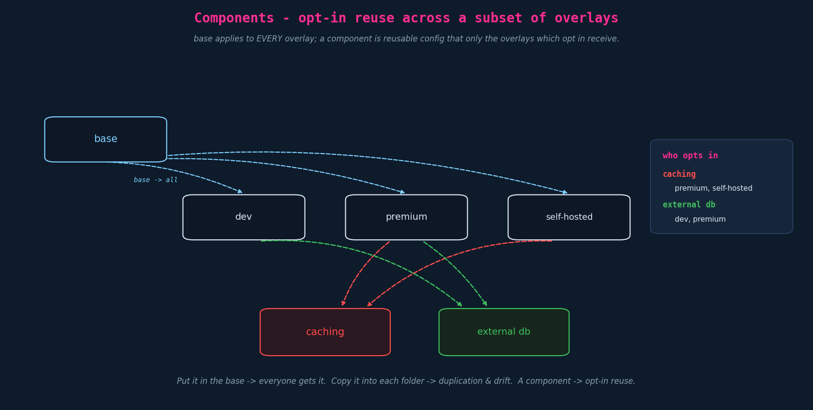
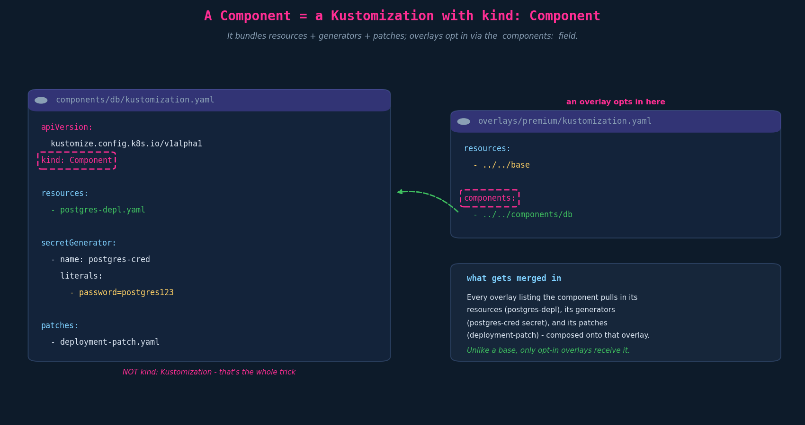
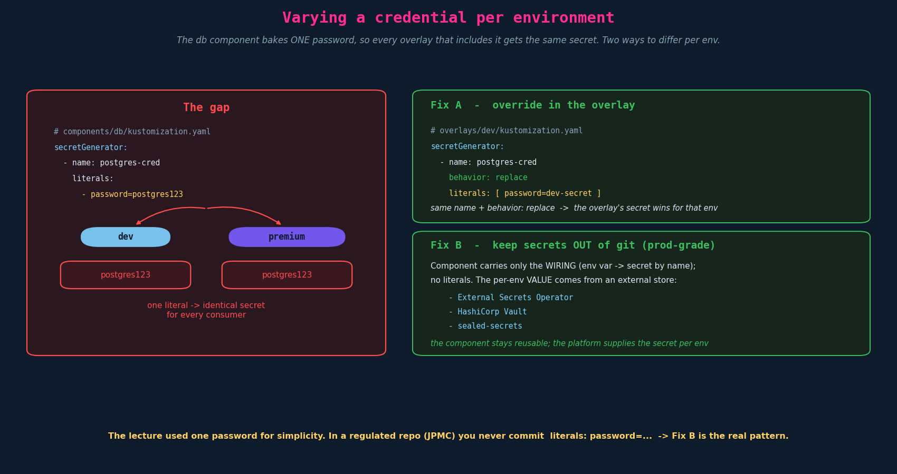

# Components — reusable, opt-in config bundles

Overlays (Ch09) layer per-environment deltas onto a base. But some config is a **feature**
that several — but not *all* — environments need: a caching layer, an external database, a
premium-only add-on. Putting it in the **base** forces it on *everyone*; **copying** it into
each overlay duplicates it and invites drift. **Components** are the answer: a reusable bundle
of resources + patches (+ generators) that an overlay **opts into**.

---

## 1. The problem components solve



| Approach | Who gets it | Problem |
|---|---|---|
| Put it in the **base** | **every** overlay | can't be optional — dev gets prod's caching too |
| **Copy** into each overlay | only where copied | duplication → drift; edit it in N places |
| **Component** | only overlays that **opt in** | none — define once, include where needed |

The lecture's example: a **caching** component used by `premium` + `self-hosted`, and an
**external-db** component used by `dev` + `premium`. Each overlay pulls in just the features it
wants. Components are explicitly for *"applications that support multiple optional features
enabled only in a subset of overlays."*

---

## 2. Anatomy: a Kustomization with `kind: Component`

A component lives in its own directory and is **not** a normal kustomization — its
`kustomization.yaml` declares a different kind:



```yaml
# components/db/kustomization.yaml
apiVersion: kustomize.config.k8s.io/v1alpha1   # NOTE: component apiVersion (alpha)
kind: Component                                # NOT kind: Kustomization
resources:
  - postgres-depl.yaml
secretGenerator:
  - name: postgres-cred
    literals:
      - password=postgres123
patches:
  - deployment-patch.yaml
```

A component can carry **everything a kustomization can** — `resources`, `patches`,
`secretGenerator`/`configMapGenerator`, transformers — and they all compose into whatever
overlay includes it. The defining detail (and a classic gotcha): **`kind: Component`, not
`kind: Kustomization`**, and **`apiVersion: kustomize.config.k8s.io/v1alpha1`**.

### 2.1 Components compose onto the consumer

A component isn't isolated — its patches act on the resources already present in the consuming
overlay/base. In the example, the db component's `deployment-patch.yaml` patches the **base's
`api-deployment`** to inject a `DB_PASSWORD` env var sourced from the secret the component itself
generates:

```yaml
# components/db/deployment-patch.yaml — patches the base api Deployment
apiVersion: apps/v1
kind: Deployment
metadata: { name: api-deployment }
spec:
  template:
    spec:
      containers:
        - name: api
          env:
            - name: DB_PASSWORD
              valueFrom:
                secretKeyRef:
                  name: postgres-cred      # the secret this component generates
                  key: password
```

So one component bundles: a new resource (postgres), a generated secret, **and** the wiring that
plugs it into the existing app.

---

## 3. How an overlay opts in

The consuming overlay lists the component under **`components:`** (a relative path), alongside its
base reference:

```yaml
# overlays/premium/kustomization.yaml
resources:                 # (or the deprecated bases:)
  - ../../base
components:
  - ../../components/db     # opt in; dev/kustomization.yaml does the same
```

Only overlays that list it receive it. Components are applied **in the order listed**, **after**
the base/resources — so a later component sees the output of earlier ones.

```
k8s/
├── base/        { kustomization.yaml, api-depl.yaml }
├── components/
│   ├── caching/ { kustomization.yaml (kind: Component), deployment-patch.yaml, redis-depl.yaml }
│   └── db/      { kustomization.yaml (kind: Component), deployment-patch.yaml, postgres-depl.yaml }
└── overlays/
    ├── dev/        kustomization.yaml   # components: - ../../components/db
    ├── premium/    kustomization.yaml   # components: - ../../components/db (+ caching)
    └── standalone/ kustomization.yaml
```

---

## 4. Per-environment credentials — the gap the lecture left

The lecture's db component bakes a single `password=postgres123`, so **every** overlay that
includes it gets the **same** secret. What if the structure is shared but each environment
needs a *different* password? There are two clean ways.



**Fix A — override in the overlay (`behavior: replace`).** Keep the component identical; in each
overlay, declare a `secretGenerator` with the **same name** and `behavior: replace` (or `merge`)
to supply the env-specific value:

```yaml
# overlays/dev/kustomization.yaml
components:
  - ../../components/db
secretGenerator:
  - name: postgres-cred
    behavior: replace                 # overrides the component's generated secret
    literals:
      - password=dev-secret
```

The component stays generic; only the password differs per overlay. (Caveat: generated
Secrets/ConfigMaps get a **name-hash suffix**; `behavior: replace`/`merge` matches by the base
`name` and kustomize rewrites references — keep the names identical, and reach for
`generatorOptions.disableNameSuffixHash: true` if a downstream reference must stay stable.)

**Fix B — keep secrets out of git (the real-world answer).** Don't generate the secret in the
component at all. The component carries only the **wiring** (the env var → `secretKeyRef: postgres-cred`),
and the actual per-env value lives in an external store — **External Secrets Operator**, **Vault**,
or **sealed-secrets**. The component reuses cleanly; the platform supplies the value per environment.

> **Flag:** the lecture's `literals: [ password=postgres123 ]` is a **teaching simplification**.
> Committing plaintext credentials to git is a no-go in any regulated repo — use Fix B. Treat
> the literal as illustrative only.

---

## 5. Component vs base vs overlay

| | **Base** | **Overlay** | **Component** |
|---|---|---|---|
| `kind:` | `Kustomization` | `Kustomization` | **`Component`** |
| `apiVersion:` | `kustomize.config.k8s.io/v1beta1` | …`v1beta1` | **…`v1alpha1`** |
| Referenced via | `resources:`/`bases:` | (built directly) | **`components:`** |
| Applies to | the build that includes it | itself (the env) | **only overlays that opt in** |
| Role | shared foundation | per-env delta | **optional, reusable feature** |

---

## 6. Exam-pattern gotchas

- **`kind: Component`, not `Kustomization`** — and `apiVersion: kustomize.config.k8s.io/v1alpha1`.
  Wrong kind/apiVersion → kustomize won't treat it as a component.
- **Include via `components:`, not `resources:`.** A component referenced under `resources:` errors
  (wrong kind); a base referenced under `components:` is equally wrong.
- **Order matters.** Components apply in listed order, after the base — later ones see earlier output.
- **Components can patch base/overlay resources,** not just add their own (the env-var injection).
- **Per-env secret differences** → overlay `secretGenerator` with `behavior: replace`, or externalize
  the secret entirely. Don't fork the component per env.

---

## 7. Imperative / `kustomize edit` shortcuts

```bash
# add a component reference to an overlay's kustomization
kustomize edit add component ../../components/db

# preview an overlay WITH its components resolved
kubectl kustomize overlays/premium      # confirm the component's resources/patches landed
```

## References

- [Kustomize Components](https://kubectl.docs.kubernetes.io/guides/config_management/components/) — the canonical components guide: `kind: Component`, opt-in via `components:`, and optional-feature composition
- [The Kustomization File](https://kubectl.docs.kubernetes.io/references/kustomize/kustomization/) — where `components:` fits among the kustomization fields and how it composes with resources/patches
