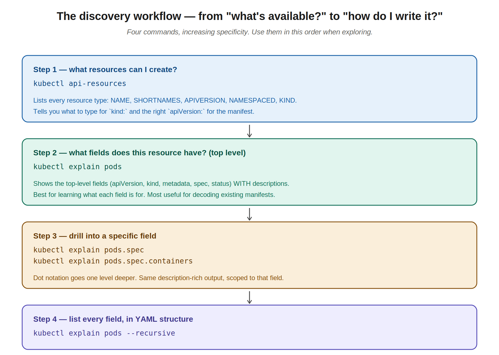
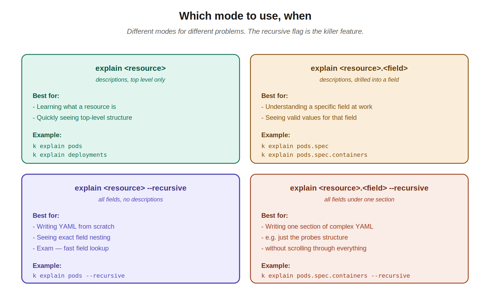

# 10 — Exploring the API: `api-resources` and `explain`

> Two commands that pay back the time you spend learning them many times over: `kubectl api-resources` to discover what you can create, and `kubectl explain` to learn what every field means. Both are exam-allowed and indispensable for decoding real-world manifests at work.

---

## 1. Why these commands matter

Nobody memorizes every Kubernetes field. There are thousands. The Kubernetes docs at kubernetes.io list them, but on the exam you only have one Firefox tab and limited time, and at JPMC you'll regularly stare at a 300-line manifest with fields you've never seen.

The two commands in this chapter solve both problems:

- **`kubectl api-resources`** answers: *"what resource types exist, and what do I write for `kind:` and `apiVersion:`?"*
- **`kubectl explain`** answers: *"what does this specific field do, and what fields are nested under it?"*

Both run against the API server you're connected to, so they always show you the truth for *that exact cluster's* Kubernetes version. The docs on kubernetes.io can be slightly off if you're on an older or vendored Kubernetes; `explain` cannot.

> **Exam relevance:** these are arguably the two most useful commands during the CKAD exam (after kubectl itself). Practice using them locally enough that they're reflexive — when you blank on a field, your hands type `k explain` before your brain catches up.

---

## 2. `kubectl api-resources` — what can I create?

```bash
kubectl api-resources
```

Sample output:

```
NAME                              SHORTNAMES   APIVERSION                        NAMESPACED   KIND
bindings                                       v1                                true         Binding
componentstatuses                 cs           v1                                false        ComponentStatus
configmaps                        cm           v1                                true         ConfigMap
endpoints                         ep           v1                                true         Endpoints
events                            ev           v1                                true         Event
limitranges                       limits       v1                                true         LimitRange
namespaces                        ns           v1                                false        Namespace
nodes                             no           v1                                false        Node
persistentvolumeclaims            pvc          v1                                true         PersistentVolumeClaim
persistentvolumes                 pv           v1                                false        PersistentVolume
pods                              po           v1                                true         Pod
replicationcontrollers            rc           v1                                true         ReplicationController
resourcequotas                    quota        v1                                true         ResourceQuota
secrets                                        v1                                true         Secret
services                          svc          v1                                true         Service
deployments                       deploy       apps/v1                           true         Deployment
replicasets                       rs           apps/v1                           true         ReplicaSet
statefulsets                      sts          apps/v1                           true         StatefulSet
daemonsets                        ds           apps/v1                           true         DaemonSet
jobs                                           batch/v1                          true         Job
cronjobs                          cj           batch/v1                          true         CronJob
ingresses                         ing          networking.k8s.io/v1              true         Ingress
networkpolicies                   netpol       networking.k8s.io/v1              true         NetworkPolicy
```

### What each column tells you

| Column | What it's for |
|---|---|
| **NAME** | The plural lowercase form used in URLs and `kubectl get <name>` |
| **SHORTNAMES** | The 2-4 letter alias — saves typing. `po` for pods, `svc` for services, `deploy` for deployments |
| **APIVERSION** | What to put in `apiVersion:` at the top of your manifest |
| **NAMESPACED** | Whether the resource belongs to a namespace. Pods, Deployments, Services → true. Nodes, Namespaces, PersistentVolumes → false (cluster-scoped) |
| **KIND** | What to put in `kind:` at the top of your manifest (PascalCase) |

### Filtering the list

The full output is long. Filter it:

```bash
# Only namespaced resources
kubectl api-resources --namespaced=true

# Only cluster-scoped resources
kubectl api-resources --namespaced=false

# Just one API group
kubectl api-resources --api-group=apps              # Deployments, ReplicaSets, StatefulSets, DaemonSets
kubectl api-resources --api-group=batch             # Jobs, CronJobs
kubectl api-resources --api-group=networking.k8s.io # Ingresses, NetworkPolicies

# Output just the names (good for piping into other commands)
kubectl api-resources -o name
```

### Why this matters on the exam

When a CKAD question says "create a deployment that..." you immediately need:
- `kind: Deployment`
- `apiVersion: apps/v1`

If you blank on which API version goes with which kind (easy to do — Pod is `v1` but Deployment is `apps/v1`, while Ingress is `networking.k8s.io/v1`), `api-resources` is the lookup. Faster than browsing kubernetes.io.

---

## 3. `kubectl explain` — what do these fields mean?

Three modes in increasing detail:



### Mode 1: top-level fields

```bash
kubectl explain pods
```

Output (abbreviated):

```
KIND:       Pod
VERSION:    v1

FIELDS:
  apiVersion    <string>
    APIVersion defines the versioned schema of this representation of an object.
    Servers should convert recognized schemas to the latest internal value, and
    may reject unrecognized values.

  kind  <string>
    Kind is a string value representing the REST resource this object
    represents. Servers may infer this from the endpoint the client submits
    requests to.

  metadata      <ObjectMeta>
    Standard object's metadata. More info:
    https://git.k8s.io/community/contributors/devel/sig-architecture/api-conventions.md#metadata

  spec  <PodSpec>
    Specification of the desired behavior of the pod. More info:
    ...

  status        <PodStatus>
    Most recently observed status of the pod. This data may not be up to date.
```

The four top-level fields you know (`apiVersion`, `kind`, `metadata`, `spec`) plus `status` (which Kubernetes fills in itself — you don't write it). Each comes with a description.

Most importantly, the type annotations like `<ObjectMeta>` and `<PodSpec>` tell you that those fields are themselves complex objects with their own structure. You drill in next.

### Mode 2: drill into a specific field

```bash
kubectl explain pods.spec
```

This expands the `spec` field, showing its sub-fields with descriptions:

```
KIND:       Pod
VERSION:    v1

FIELD: spec <PodSpec>

DESCRIPTION:
    Specification of the desired behavior of the pod. ...

FIELDS:
  activeDeadlineSeconds <integer>
    Optional duration in seconds the pod may be active on the node relative to
    StartTime before the system will actively try to mark it failed and kill
    associated containers. Value must be a positive integer.

  affinity      <Affinity>
    If specified, the pod's scheduling constraints

  automountServiceAccountToken  <boolean>
    AutomountServiceAccountToken indicates whether a service account token
    should be automatically mounted.

  containers    <[]Container>  -required-
    List of containers belonging to the pod. ...
    ...
```

You can chain deeper:

```bash
kubectl explain pods.spec.containers              # what a single container looks like
kubectl explain pods.spec.containers.resources    # the resources block
kubectl explain pods.spec.containers.livenessProbe # liveness probe options
```

Two things to notice in the output:

- **`-required-`** marks required fields (like `containers` under `spec`). Anything without `-required-` is optional.
- **`<[]Container>`** means "a list of Container objects." `<[]string>` would mean a list of strings.

### Mode 3: list every field, in YAML structure

```bash
kubectl explain pods --recursive
```

This dumps every field at every nesting level, indented to match YAML structure, **without** descriptions:

```
KIND:       Pod
VERSION:    v1

FIELDS:
  apiVersion    <string>
  kind  <string>
  metadata      <ObjectMeta>
    annotations <map[string]string>
    creationTimestamp   <string>
    deletionGracePeriodSeconds  <integer>
    finalizers  <[]string>
    generateName        <string>
    labels      <map[string]string>
    ...
  spec  <PodSpec>
    activeDeadlineSeconds       <integer>
    containers  <[]Container>
      args      <[]string>
      command   <[]string>
      env       <[]EnvVar>
        name    <string>
        value   <string>
        valueFrom <EnvVarSource>
          configMapKeyRef <ConfigMapKeySelector>
            key <string>
            name        <string>
            optional    <boolean>
          ...
```

This is the writing-from-scratch mode. The exact field names, in the exact nesting, ready to copy into a manifest.

### Mode 4: combine — recursive but scoped to one section

```bash
kubectl explain pods.spec.containers --recursive
```

When you only need the structure of one section (like containers, or volumes, or probes) without scrolling through 200 lines of the full pod recursive output.



---

## 4. The two main use cases

### Use case A: writing YAML from scratch (the exam)

When you're writing a manifest from memory and don't recall a field name:

```bash
# Quick: see all fields available under what you're building
k explain pods.spec --recursive

# Look up just one field if you remember roughly where it is
k explain pods.spec.containers.resources
```

The `--recursive` flag is the workhorse here. On the exam, it saves you searching kubernetes.io for the exact field names.

### Use case B: decoding manifests at work (your JPMC use case)

When you're looking at the JPMC customer-account-alias-service manifest and you see a field you don't recognize:

```bash
# What does `livenessProbe.httpGet.scheme` actually do?
k explain pods.spec.containers.livenessProbe.httpGet.scheme

# What about `terminationMessagePolicy`?
k explain pods.spec.containers.terminationMessagePolicy

# What goes under `seccompProfile`?
k explain pods.spec.containers.securityContext.seccompProfile
```

You get an authoritative answer from the Kubernetes API itself, no Googling, no guessing. Combine this with AI (asking Claude or another assistant for context/examples) and you have a powerful workflow for understanding any production manifest:

1. `kubectl explain` for the authoritative definition
2. AI for examples, context, and "what would you typically set this to?"

The two complement each other: `explain` is correct but terse. AI is conversational but can be wrong. Together they're great.

---

## 5. A few useful patterns

### See all short names at once

```bash
kubectl api-resources -o wide
```

The wide output adds a VERBS column too (showing which kubectl operations are valid for each resource).

### Quickly check if a resource is namespaced

When you're not sure if you need `-n <namespace>` for a resource:

```bash
kubectl api-resources | grep nodes
# nodes                             no           v1                                false        Node
```

`false` means cluster-scoped — no namespace flag needed (or accepted).

### Search for a field across the whole resource

Less reliable, but useful when you forget where something lives:

```bash
kubectl explain pods --recursive | grep -i probe
#   livenessProbe       <Probe>
#   readinessProbe      <Probe>
#   startupProbe        <Probe>
```

Now you know all three probe fields exist and where they sit. Drill in for details.

### Check what API group an alias belongs to

```bash
kubectl api-resources | grep -E "^(rs|deploy|po) "
```

Quick way to confirm `rs` is the short form for ReplicaSet, etc.

---

## 6. Connecting back to chapter 4 — your JPMC pod walkthrough

In chapter 4 I walked through the JPMC pod's fields based on what I knew. With `explain` you can verify and deepen anything in that manifest yourself. Some examples worth running:

```bash
# What's terminationMessagePolicy and what are the valid values?
k explain pods.spec.containers.terminationMessagePolicy

# What are all the security context fields you saw at JPMC?
k explain pods.spec.containers.securityContext --recursive

# What does the limit-ranger annotation do (well, that's an annotation, but
# what shows up in the resource fields for ephemeral storage)?
k explain pods.spec.containers.resources

# Full structure of envFrom (the bulk-import from ConfigMaps)
k explain pods.spec.containers.envFrom --recursive
```

These are the kind of "self-paced learning" loops `explain` enables. You don't need to wait for a course to teach you a field; you can look it up the moment you encounter it in production code.

---

## 7. Cheat sheet

```bash
# Discovery
kubectl api-resources                          # list all resource types
kubectl api-resources --namespaced=true        # only namespaced ones
kubectl api-resources --api-group=apps         # only apps/v1 group
kubectl api-resources -o name                  # just the names

# Field exploration
kubectl explain <resource>                     # top-level fields with descriptions
kubectl explain <resource>.<field>             # drill into one field
kubectl explain <resource> --recursive         # all fields, YAML-structured, no descriptions
kubectl explain <resource>.<field> --recursive # all fields under one section

# Common starting points
kubectl explain pods --recursive               # everything you can put in a Pod
kubectl explain deployments.spec               # what goes in a Deployment spec
kubectl explain services.spec                  # what goes in a Service spec
kubectl explain configmaps                     # ConfigMap structure
kubectl explain secrets                        # Secret structure
```

---

## Quick recall checklist

- [ ] Which command lists every resource type the cluster supports?
- [ ] What two values does `api-resources` give you that are required at the top of every manifest?
- [ ] What's the short name for `replicasets`? For `services`? For `deployments`?
- [ ] What's the difference between `kubectl explain pods` and `kubectl explain pods --recursive`?
- [ ] How would you find out what fields exist under `spec.containers.livenessProbe`?
- [ ] What does `-required-` mean in `explain` output?
- [ ] What does `<[]Container>` mean as a field type?
- [ ] Why would you use `kubectl explain` instead of just looking at kubernetes.io?
- [ ] How does `--recursive` change the output? When is it more useful than without?
- [ ] How would you check whether a resource is namespaced or cluster-scoped?

---

## Notes for next chapters

These commands are reference tools, not topics on their own — you'll use them constantly in the chapters that come next. Up next is likely **imperative vs declarative commands** (formalizing the patterns you've already been using) or **ConfigMaps and Secrets** (how to externalize configuration, which the JPMC pod uses heavily via `envFrom` and `secretKeyRef`). When you hit a field you don't recognize in either chapter, run `k explain <resource>.<field>` and read the source.
