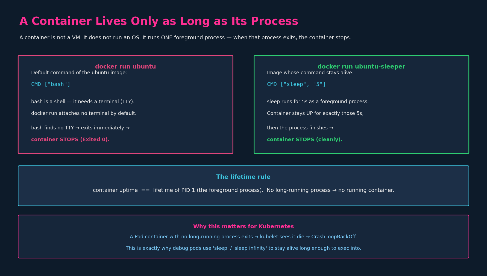
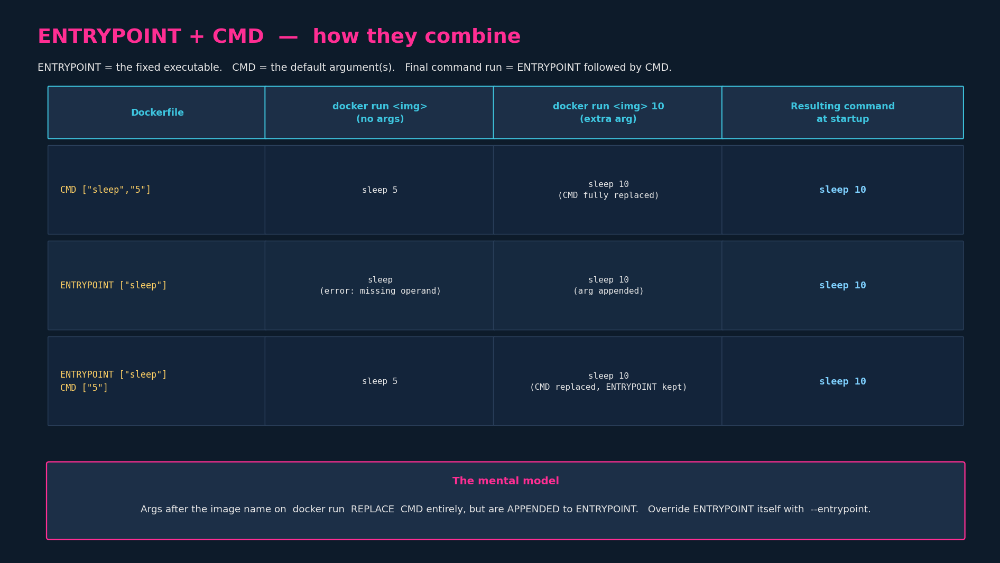
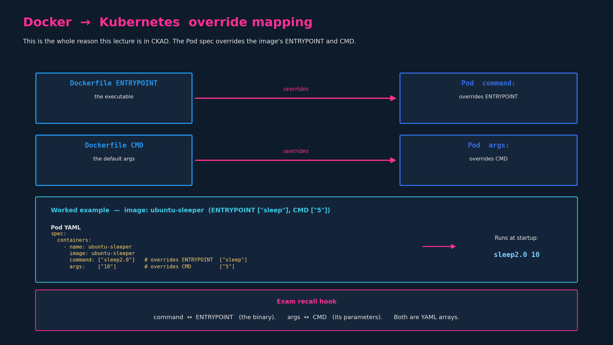

# Commands & Arguments

> **Section:** Configuration
> **Course chapter:** Commands & Arguments in Docker
> **Instructor's framing:** "Very important, although not a direct topic."
> **What that actually means:** Docker CLI fluency is *not* tested by CKAD. What
> *is* tested, and frequently fumbled, is the mapping of Docker's
> `ENTRYPOINT`/`CMD` onto a Pod's `command:`/`args:`. This chapter exists to make
> that mapping automatic. Treat the Docker half as context; treat the
> Kubernetes half as the payload.

---

## 1. The foundational idea: a container is not a VM

A VM boots an operating system and keeps running because the OS (and its many
daemons) keep running. A **container is not designed to run an OS** — it is
designed to run **one task**: a web server, a database, an application instance,
a batch job.

The consequence, and the single most important sentence in this chapter:

> **A container lives only as long as the process inside it is alive.**

When that foreground process exits — whether it finishes successfully, crashes,
or can't start — the container stops. There is no "OS" left running to keep it
up. The container's uptime is identical to the lifetime of its main process
(PID 1 inside the container).



### 1.1 Why `docker run ubuntu` exits immediately

The instructor's demonstration:

```bash
docker run ubuntu
docker ps          # empty — nothing running
docker ps -a       # shows: ubuntu, COMMAND "/bin/bash", STATUS Exited (0)
```

The `ubuntu` image ships with a default command of `bash` (`CMD ["bash"]`).
`bash` is an **interactive shell** — it expects a terminal (TTY) attached to
read input from. `docker run` with no `-it` flags attaches **no terminal**. So
`bash` starts, immediately finds no terminal to read from, has nothing to do,
and exits. Its exit ends PID 1, so the container stops.

This is not a bug. It is the lifetime rule working exactly as designed: `bash`
with no terminal is a process that has nothing to do and finishes, so the
container finishes too. (`docker run -it ubuntu` *does* keep it alive, because
now there's a terminal and `bash` waits on it.)

> The slide's lightbulb "Cannot find the terminal" is the whole point: the image
> didn't fail to install anything; the process simply had no reason to keep
> running.

---

## 2. Changing what runs: at runtime vs. permanently

There are two ways to make a container run something other than its image's
default.

### 2.1 Temporarily — append a command on `docker run`

```bash
docker run ubuntu sleep 5
```

Anything after the image name **overrides the image's default command for that
run only**. Here `sleep 5` replaces `bash`; the container stays up for ~5
seconds (because `sleep` is a foreground process that genuinely runs for 5s),
then `sleep` finishes and the container stops — cleanly this time.

### 2.2 Permanently — bake it into your own image

If you want that behaviour to be the image's default, build a custom image using
`ubuntu` as the base and set the command at the end:

```dockerfile
FROM ubuntu
CMD ["sleep", "5"]
```

```bash
docker build -t ubuntu-sleeper .
docker run ubuntu-sleeper          # sleeps 5s by default, no args needed
```

This is the `ubuntu-sleeper` image the rest of the chapter (and the lab) builds
on.

---

## 3. `CMD` — the shell form vs. JSON (exec) form

The instructor is explicit about the syntax, and it's a real gotcha worth
internalizing because it bites people in Pod YAML too.

`CMD` (and `ENTRYPOINT`) accept two forms:

| Form | Example | Notes |
|---|---|---|
| **Shell form** | `CMD sleep 5` | Runs via `/bin/sh -c "sleep 5"`. |
| **Exec form (JSON array)** | `CMD ["sleep", "5"]` | Runs the binary directly, no shell. **Preferred.** |

The rule for the JSON/exec form: it is a JSON array of strings. **The first
element is the executable; each subsequent element is a separate argument.**

What he flags as wrong:

```dockerfile
CMD ["sleep 5"]      # WRONG — one element: tries to run a binary
                     #         literally named "sleep 5"
CMD ["sleep", "5"]   # CORRECT — executable "sleep", argument "5"
```

So `CMD command param1` ≡ `CMD ["command", "param1"]`, **not**
`CMD ["command param1"]`. Splitting the executable from each argument into
separate array elements is mandatory in exec form. (This exact mistake reappears
later as a Pod `command:`/`args:` YAML error.)

> Prefer the exec/JSON form. Shell form wraps your process in `/bin/sh -c`,
> which becomes PID 1 instead of your actual program — that breaks signal
> handling (e.g. `SIGTERM` on pod termination doesn't reach your app cleanly).
> This matters in Kubernetes for graceful shutdown.

---

## 4. `ENTRYPOINT` vs `CMD` — the core mechanism

This is the conceptual heart of the chapter and the examinable part. Both define
"what runs when the container starts," but they behave differently when you pass
arguments at runtime.

- **`CMD`** — the *entire* default command. Anything you pass on `docker run`
  after the image name **replaces it completely**.
- **`ENTRYPOINT`** — the fixed *executable*. Anything you pass on `docker run`
  is **appended to it as arguments**, not replaced.
- **`ENTRYPOINT` + `CMD` together** — `ENTRYPOINT` is the executable, `CMD`
  supplies the *default arguments*. Runtime args replace only the `CMD` part;
  the `ENTRYPOINT` stays fixed.



Walking the instructor's three cases for the `ubuntu-sleeper` image:

| Dockerfile | `docker run ubuntu-sleeper` | `docker run ubuntu-sleeper 10` |
|---|---|---|
| `CMD ["sleep","5"]` | `sleep 5` | `sleep 10` (whole CMD replaced) |
| `ENTRYPOINT ["sleep"]` | `sleep` → **error: missing operand** | `sleep 10` (arg appended) |
| `ENTRYPOINT ["sleep"]` + `CMD ["5"]` | `sleep 5` | `sleep 10` (only CMD replaced) |

The third row is the idiomatic pattern: a fixed executable with a sensible
default argument that callers can override just by passing a value — without
having to restate the command.

### 4.1 Overriding `ENTRYPOINT` itself

`CMD` is overridden by positional args. To override the **`ENTRYPOINT`** at
runtime you need an explicit flag:

```bash
docker run --entrypoint sleep2.0 ubuntu-sleeper 10
# runs:  sleep2.0 10
```

(The instructor's slide 10 shows exactly this — `--entrypoint sleep2.0` with
arg `10` → `sleep2.0 10`.)

---

## 5. THE CKAD PAYLOAD — mapping to Pod `command:` / `args:`

Everything above was setup for this. In a Pod spec you can override the image's
`ENTRYPOINT` and `CMD` per container. The mapping is fixed and you must have it
memorized cold:

| Dockerfile | Pod spec field | Overrides |
|---|---|---|
| `ENTRYPOINT` | `command:` | the executable |
| `CMD` | `args:` | the arguments |



Worked example — the `ubuntu-sleeper` image
(`ENTRYPOINT ["sleep"]`, `CMD ["5"]`):

```yaml
apiVersion: v1
kind: Pod
metadata:
  name: ubuntu-sleeper
spec:
  containers:
    - name: ubuntu-sleeper
      image: ubuntu-sleeper
      command: ["sleep2.0"]    # overrides ENTRYPOINT ["sleep"]
      args: ["10"]             # overrides CMD        ["5"]
```

Runs at startup: `sleep2.0 10`.

### 5.1 The recall hook (do not mix these up)

> **`command:`  ↔  `ENTRYPOINT`**  — the binary.
> **`args:`  ↔  `CMD`**  — its parameters.
> Both are YAML arrays (exec form). Same "first element is the executable, rest
> are separate args" rule as Section 3.

Common confusion to pre-empt: people assume `command:` maps to `CMD` because the
words look alike. **It does not.** `command:` maps to `ENTRYPOINT`. This
near-homophone trap is exactly the kind of thing the exam exploits, and it's
worth over-learning the *opposite* of the intuitive guess.

### 5.2 Behaviour rules in the Pod context

- Set **only `args:`** → image's `ENTRYPOINT` is kept, its `CMD` is replaced by
  your `args`. (Most common real-world case: same binary, different parameters.)
- Set **only `command:`** → overrides `ENTRYPOINT`; **the image's `CMD` is
  dropped** (not reused). This surprises people — if you override `command:` and
  still need arguments, you must also supply `args:`.
- Set **both** → fully replaces both; container runs exactly
  `command + args`.

---

## 6. CKAD exam relevance & speed notes

- **Imperative generation.** You'll often produce these via
  `kubectl run` then edit. Example:
  ```bash
  k run ubuntu-sleeper --image=ubuntu-sleeper $do > pod.yaml
  # then edit in vim to add command:/args:
  ```
  `kubectl run` also accepts an inline command after `--`:
  ```bash
  k run tmp --image=ubuntu --restart=Never -- sleep 3600
  ```
  Everything after `--` becomes the container's **`args`** (with the image's
  entrypoint), which connects directly to the debug-pod pattern from the DNS
  chapter (`sleep`-based pods that stay alive to exec into).
- **YAML array form is mandatory** for multi-token commands. `command: ["sleep"]`
  + `args: ["10"]`, or the block list form:
  ```yaml
  command:
    - sleep
  args:
    - "10"
  ```
  Numeric-looking args should be quoted (`"10"`) — YAML would otherwise type
  them as integers and the container spec expects strings.
- **The classic exam stumble:** wrong `command`/`args` split (whole command
  jammed into one array element, or `command`/`args` swapped). Tie-back to the
  YAML-indentation/command-split failure modes already noted in earlier
  chapters — same family of mistake, just under time pressure.

---

## 7. Key takeaways

1. A container runs **one foreground process**; its uptime == that process's
   lifetime. No long-running process → container exits. (`docker run ubuntu`
   exits because `bash` finds no TTY.)
2. Override the default **temporarily** by appending to `docker run`;
   **permanently** by setting `CMD`/`ENTRYPOINT` in a custom image built
   `FROM` a base.
3. Exec/JSON form: `["executable", "arg1", "arg2"]` — executable and each arg
   are **separate** elements. `["sleep 5"]` is wrong; `["sleep","5"]` is right.
   Prefer exec form (signal handling / graceful shutdown).
4. `CMD` = whole default command, fully replaced by runtime args.
   `ENTRYPOINT` = fixed executable, runtime args appended.
   Together: `ENTRYPOINT` + default-arg `CMD` is the idiomatic pattern.
   Override `ENTRYPOINT` itself with `--entrypoint`.
5. **CKAD payload — memorize cold:**
   `command:` ↔ `ENTRYPOINT` (the binary);
   `args:` ↔ `CMD` (its parameters).
   *Not* the intuitive name-match. Both are YAML arrays.
6. Pod: only `args:` → keeps image ENTRYPOINT; only `command:` → drops image
   CMD; both → fully replaces.

### Resolved threads from the previous chapter
- [x] `ENTRYPOINT`/`CMD` → Pod `command:`/`args:` — done here (Section 5)

### Open threads for later chapters
- [ ] Env vars: `ENV` (Dockerfile) → Pod `env:` / `envFrom:` (next chapter)
- [ ] ConfigMaps & Secrets feeding `env:` and volumes
- [ ] Writable container layer → Volumes (still open from Ch.7)
