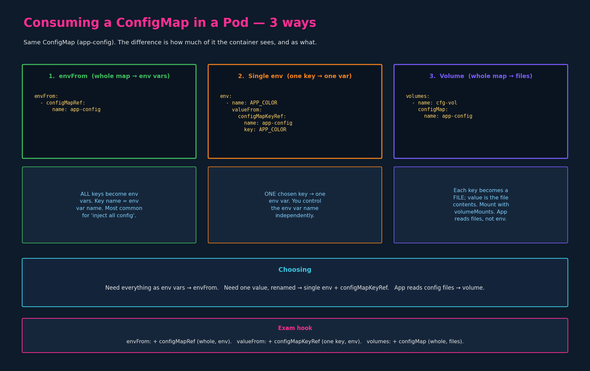

# ConfigMaps

> **Section:** 02-configuration
> **Course chapter:** 04 (ConfigMaps)
> **Why this is in CKAD:** High-frequency exam resource. You will create
> ConfigMaps imperatively under time pressure and wire them into Pods three
> different ways. The instructor's last slide showed `envFrom`, single-`env`,
> and volume mounts quickly without explaining them — sections 5 and 6 below
> cover those properly, since the exam tests choosing the right one.

---

## 1. What a ConfigMap is and why

When config lives inline in each Pod's `env:` list, it's scattered and
duplicated across every Pod that needs it. A **ConfigMap** centralizes
non-sensitive key/value configuration into one object that many Pods reference.
Two phases, always:

1. **Create** the ConfigMap.
2. **Inject** it into a Pod.

ConfigMaps are for *non-sensitive* data only. Sensitive values
(passwords, tokens) go in Secrets — next chapter — which share almost the same
shapes.

---

## 2. Creating a ConfigMap — imperative

Two `--from-*` sources, same as the instructor's slides.

From literals (most common in the exam — fast, no file needed):

```bash
kubectl create configmap <name> --from-literal=<key>=<value>

# real example, multiple keys = repeat the flag:
kubectl create configmap app-config \
  --from-literal=APP_COLOR=blue \
  --from-literal=APP_MODE=prod
```

From a file:

```bash
kubectl create configmap <name> --from-file=<path-to-file>

kubectl create configmap app-config --from-file=app_config.properties
```

> `--from-file` behaviour worth knowing: by default the **filename becomes the
> key** and the **entire file content becomes the value**. So
> `--from-file=app_config.properties` produces one key
> `app_config.properties` whose value is the whole file. You can point at a
> directory to load every file in it as its own key. (Contrast with
> `--from-literal`, which creates clean `KEY=value` pairs — usually what you
> want for env-var-style config.)

> Slide typo to ignore: the instructor's slide shows
> `--from-literal=APP_MOD=prod` (missing the `E`). The intended key is
> `APP_MODE`. Mentioned only so the note matches reality, not the screenshot.

---

## 3. Creating a ConfigMap — declarative

```yaml
# config-map.yaml
apiVersion: v1
kind: ConfigMap
metadata:
  name: app-config
data:
  APP_COLOR: blue
  APP_MODE: prod
```

```bash
kubectl create -f config-map.yaml
# (kubectl apply -f config-map.yaml is the idempotent equivalent)
```

Key structural point: ConfigMap data lives under **`data:`** — not `spec:`.
ConfigMap (like Secret) has no `spec`/`status`; it's a flat data object. This
trips people who pattern-match every Kubernetes object to `spec:`.

---

## 4. Naming convention & viewing

Multiple ConfigMaps for different components is normal and expected:
`app-config`, `mysql-config`, `redis-config` — one per concern, each holding
that component's keys. Name them by what they configure.

```bash
kubectl get configmaps                 # NAME, DATA (# of keys), AGE
kubectl get cm                         # 'cm' is the short name
kubectl describe configmaps app-config # shows the actual keys + values
```

`describe` prints each key, a `----` separator, then its value (e.g.
`APP_COLOR` / `----` / `blue`). `get` only shows the **count** of keys under
`DATA`, not their contents — use `describe` to see values.

---

## 5. Injecting into a Pod — the three methods

This is the conceptual core and the part the instructor rushed. Same
`app-config` ConfigMap; three different ways a container can consume it.



### 5.1 Method 1 — `envFrom` (whole map → all env vars)

Injects **every key** in the ConfigMap as an environment variable. Key name
becomes the env var name, value becomes the env var value.

```yaml
apiVersion: v1
kind: Pod
metadata:
  name: simple-webapp-color
spec:
  containers:
    - name: simple-webapp-color
      image: simple-webapp-color
      ports:
        - containerPort: 8080
      envFrom:
        - configMapRef:
            name: app-config
```

Result inside the container: `APP_COLOR=blue` and `APP_MODE=prod` both exist as
env vars, automatically. This is the "inject all of this component's config"
pattern and the most common real-world usage.

Structural notes that matter (he did not explain these):

- `envFrom:` is a **list** (note the `-`), and each item is a *source
  reference*, not a variable. `configMapRef:` (singular ref to the whole map)
  is the source.
- Contrast the names carefully: `envFrom: + configMapRef` pulls the **whole
  map**. `env: + valueFrom: + configMapKeyRef` (next method) pulls **one key**.
  `configMapRef` vs `configMapKeyRef` — the `Key` is the tell that it's the
  single-key form. This near-identical naming is a classic exam trap.

### 5.2 Method 2 — single `env` with `configMapKeyRef` (one key → one var)

Pulls **one specific key** out of the ConfigMap into **one** env var. You choose
the env var name independently of the ConfigMap key name.

```yaml
spec:
  containers:
    - name: simple-webapp-color
      image: simple-webapp-color
      env:
        - name: APP_COLOR              # env var name (your choice)
          valueFrom:
            configMapKeyRef:
              name: app-config         # which ConfigMap
              key: APP_COLOR           # which key within it
```

Use this when you want only one value, or when the container expects an env var
named differently from the ConfigMap key (set `name:` to whatever the app
wants, point `key:` at the ConfigMap's actual key). This is the same
`valueFrom:` shape introduced in `03-environment-variables.md` — now with the
ConfigMap source filled in.

### 5.3 Method 3 — volume mount (whole map → files)

Mounts the ConfigMap as a **volume**. Each key becomes a **file**; the file's
name is the key, the file's contents are the value. The app reads config from
files, not environment.

He showed only the `volumes:` fragment and moved on. The complete, working
pattern needs **both** a `volumes:` entry and a `volumeMounts:` entry — the
volume alone does nothing until a container mounts it:

```yaml
apiVersion: v1
kind: Pod
metadata:
  name: simple-webapp-color
spec:
  containers:
    - name: simple-webapp-color
      image: simple-webapp-color
      volumeMounts:                    # <-- the half he didn't show
        - name: app-config-volume
          mountPath: /etc/config
  volumes:
    - name: app-config-volume
      configMap:
        name: app-config
```

Result: inside the container, `/etc/config/` contains two files:

```
/etc/config/APP_COLOR     ->  contents: blue
/etc/config/APP_MODE      ->  contents: prod
```

So `cat /etc/config/APP_COLOR` prints `blue`. Why this form exists: many real
applications (databases, proxies, anything expecting a config file) read a
file path, not env vars — `mysql-config` or `redis-config` style settings are
a natural fit. It also picks up ConfigMap updates without recreating the Pod
(env-var forms do not — they're fixed at container start). This is a forward
reference into the Volumes chapter; the mechanics of `volumes:` /
`volumeMounts:` get full treatment there. Captured here because the exam tests
the ConfigMap-as-volume pattern directly and the lecture left it half-shown.

---

## 6. Choosing between the three

| Need | Method | Fields |
|---|---|---|
| All keys as env vars | `envFrom` | `envFrom: [ configMapRef: { name } ]` |
| One key as one (possibly renamed) env var | single `env` | `env: [ valueFrom: { configMapKeyRef: { name, key } } ]` |
| Config as files (app reads a path) | volume | `volumes: [ configMap: { name } ]` + `volumeMounts` |

Decision shortcut: everything as env → `envFrom`; one value (or rename) →
`configMapKeyRef`; app wants a file / live updates → volume mount.

---

## 7. CKAD speed notes

- Imperative create is faster than writing YAML — prefer it:
  ```bash
  k create configmap app-config \
    --from-literal=APP_COLOR=blue --from-literal=APP_MODE=prod
  ```
- Generate ConfigMap YAML to edit (when a file source / many keys is easier):
  ```bash
  k create configmap app-config --from-literal=APP_COLOR=blue \
    $do > cm.yaml
  ```
  (`$do` = `--dry-run=client -o yaml`, per the lab-setup aliases.)
- The Pod side (`envFrom` / `configMapKeyRef` / volume) has **no imperative
  shortcut** — generate the Pod with `k run ... $do > pod.yaml` and add the
  block in vim. Know all three shapes cold; this is a frequent exam task.
- Verify what actually reached the container (ties back to the exec workflow
  from the DNS chapter):
  ```bash
  k exec simple-webapp-color -- env | grep APP_      # env methods
  k exec simple-webapp-color -- ls /etc/config       # volume method
  k exec simple-webapp-color -- cat /etc/config/APP_COLOR
  ```
  Most "value didn't show up" failures are a `key:` name mismatch or a
  missing `volumeMounts` half — check both first.

---

## 8. Key takeaways

1. ConfigMap = centralized non-sensitive key/value config. Workflow is always
   create → inject.
2. Create: imperative `--from-literal` (repeat per key) or `--from-file`
   (filename = key, contents = value); declarative under **`data:`** (no
   `spec:`).
3. View: `get cm` shows key *count*; `describe cm` shows the actual values.
4. Three consumption methods — memorize the field names, they're a trap:
   - **`envFrom: + configMapRef`** → whole map → all env vars
   - **`env: + valueFrom: + configMapKeyRef`** → one key → one env var
   - **`volumes: + configMap`** (+ `volumeMounts`) → keys → files
5. `configMapRef` (whole) vs `configMapKeyRef` (single key) — the `Key`
   distinguishes them.
6. Volume method needs BOTH `volumes:` and `volumeMounts:`; only it reflects
   later ConfigMap edits without a Pod restart.

### Open threads
- [ ] Secrets — same three injection shapes with `secretRef` /
      `secretKeyRef` / `secret`, plus base64 encoding — next chapter
- [ ] Volumes proper — `volumes:`/`volumeMounts:` mechanics, beyond ConfigMaps
- [ ] Per layout doc: add ConfigMap commands to `commands/configmaps-secrets.md`
      and the global `commands.md` (the file already exists in the tree)
