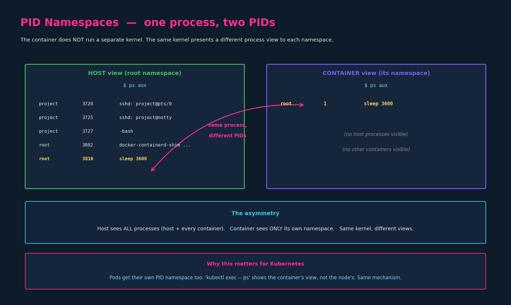
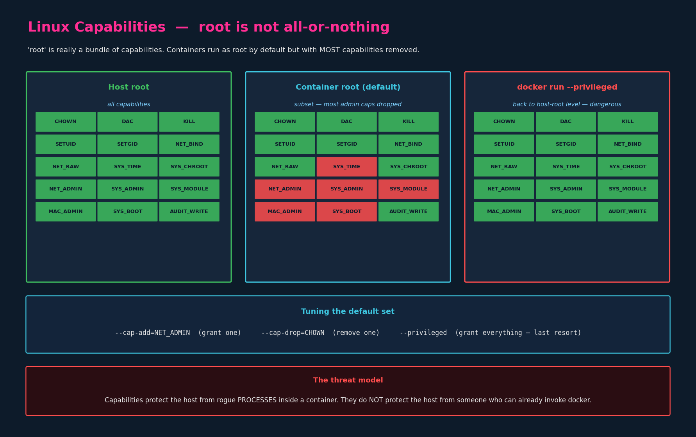

# Docker Security (Prerequisite for K8s Security Contexts)

> **Section:** 02-configuration
> **Course chapter:** 06 (Security in Docker)
> **Why this is in CKAD:** Not directly examinable as Docker — but it is the
> substrate for Kubernetes Security Contexts (next chapter), which IS
> examinable. The fields `runAsUser`, `capabilities`, and `privileged` in a
> Pod spec are direct translations of the Docker concepts in this chapter.
> Learn this once, the next chapter is a substitution exercise.

---

## 1. Containers share the host kernel — they are isolated, not separated

The lecture's foundational point, worth being precise about:

A container is **not** a VM. A VM runs its own kernel; a container does not.
Every container on a host runs on **the host's single Linux kernel**. What
makes them appear isolated is **Linux namespaces** — a kernel feature that
presents a different view of system resources (processes, network, mounts,
users, etc.) to each namespace.

Each container gets its own set of namespaces. The host has its "root"
namespace. The kernel uses these to filter what each process can *see*.

This matters because:

- The isolation is **a view, not a separation**. The host kernel knows about
  every process; the container's view just hides everything outside its
  namespace.
- A kernel exploit in the container is a kernel exploit on the host. Same
  kernel.
- Cheaper than VMs (no separate kernel, no virtual hardware) — which is the
  whole reason containers exist — but a weaker isolation boundary. Different
  threat model than virtualization.

> Tie-back to chapter 1: this is the kernel-level reality underneath the
> "container vs VM" framing in `01-container-images-docker.md §1`. Same idea,
> finally explained mechanically.

---

## 2. PID namespaces — same process, different PIDs

The instructor's `sleep 3600` walkthrough is the cleanest illustration of how
namespaces work in practice.



The setup:

```bash
docker run ubuntu sleep 3600     # start a long-running container
```

Inside the container, `ps aux` shows exactly one process:

```
USER  PID  COMMAND
root  1    sleep 3600
```

On the **host**, `ps aux` shows that same `sleep 3600` process — but with a
**different PID** (e.g. 3816) — alongside every other process running on the
machine, including the host's own `sshd`, your shell, the
`docker-containerd-shim` that manages this container, and PIDs from other
containers.

### The asymmetry to internalize

| Vantage point | What it sees |
|---|---|
| Host | every process on the system, host + all containers, with host PIDs |
| Container | only its own namespace, with PIDs starting from 1 |

It really is *one process* in the kernel's process table — just shown with
different PIDs in different namespaces. The first process in a container's PID
namespace gets PID 1 (which is also why signal handling for PID 1 matters, as
we saw in `02-commands-and-arguments.md §3` on exec form vs shell form).

> Why "PID 1" inside the container is important: PID 1 is the init process.
> If it exits, the namespace ends — i.e. the container stops. This is the
> mechanical reason behind chapter 02's "container lives only as long as its
> process" rule.

### Other namespaces (mentioned for completeness)

PID isn't the only namespace. The lecture focuses on it because it's the most
visceral, but Linux provides several types and Docker uses them all by default:

- **PID** — process tree isolation (the one the lecture demonstrates)
- **Net** — separate network stack (own interfaces, routing, ports)
- **Mount** — separate filesystem mount table
- **UTS** — separate hostname
- **IPC** — separate System V IPC and POSIX message queues
- **User** — separate UID/GID mapping (used selectively; off by default in
  Docker)

You don't need to memorize these for CKAD, but the *existence* of multiple
namespace types matters: when Kubernetes talks about a Pod's containers
sharing a network namespace (so they can talk via `localhost`), that's exactly
this Net-namespace mechanism, applied at the Pod boundary instead of the
single-container boundary.

---

## 3. Users — containers run as root by default

By default, the process inside a container runs as **root** (UID 0) inside
the container's namespace. This is convenient but not what you want in
production.

### 3.1 Overriding the user

Three ways, in increasing permanence:

```bash
# 1. Per-run override
docker run --user=1001 ubuntu sleep 3600

# 2. Baked into the image via Dockerfile
USER 1001
```

After either:

```
$ ps aux
USER  PID  COMMAND
1001  1    sleep 3600
```

Same `sleep` command; runs as UID 1001 instead of root.

### 3.2 Why the default is root, and why you should change it

The reason it's root by default: many base images and many startup scripts
need root briefly (to bind to privileged ports, to write to system paths
during init). Making non-root the default would break a lot of existing
images.

The reason you should override it for your own images:

- A non-root process inside the container has dramatically fewer ways to
  exploit a kernel vulnerability into a container escape.
- It catches accidental "I'll just write to /etc" bugs early — they fail
  loudly instead of silently working in dev and breaking in prod.
- It's what Kubernetes Security Contexts will let you enforce per-Pod with
  `runAsUser`, `runAsNonRoot`, and `runAsGroup` (next chapter).

> Forward reference: in K8s, `securityContext.runAsUser: 1001` on a Pod or
> container is the direct equivalent of `docker run --user=1001`. Same
> mechanism, different surface.

---

## 4. Linux capabilities — root is a bundle, not a switch

This is the most important concept in the chapter, and the one the lecture
introduced well.



### 4.1 What capabilities are

On modern Linux, "root" is not a single boolean. The kernel splits root's
privileges into a list of ~40 **capabilities**, each granting one specific
kind of privileged action:

| Capability | What it lets the process do |
|---|---|
| `CAP_CHOWN` | change file ownership |
| `CAP_KILL` | send signals to processes it doesn't own |
| `CAP_SETUID` / `CAP_SETGID` | change its UID / GID |
| `CAP_NET_BIND_SERVICE` | bind to ports below 1024 |
| `CAP_NET_RAW` | use raw sockets (e.g. `ping`) |
| `CAP_NET_ADMIN` | configure interfaces, routing, firewalls |
| `CAP_SYS_ADMIN` | huge bag — mounts, namespaces, hostname, more |
| `CAP_SYS_TIME` | set the system clock |
| `CAP_SYS_MODULE` | load/unload kernel modules |
| `CAP_AUDIT_WRITE` | write to the kernel audit log |

A process holds a *set* of capabilities. Holding `CAP_SYS_ADMIN` doesn't grant
`CAP_NET_BIND_SERVICE`. "Being root" historically just meant "have all of
them"; modern kernels let you grant any subset.

### 4.2 What Docker actually does

The instructor's question — *"if the container runs as root, does it have
the same power as host root?"* — has a precise answer:

**No.** Docker starts every container with a **restricted default capability
set**. The container's "root" gets things like `CHOWN`, `KILL`, `SETUID`,
`NET_BIND_SERVICE`, `NET_RAW`, `AUDIT_WRITE` — the capabilities ordinary
applications might need — but **drops the dangerous ones**: `SYS_ADMIN`,
`SYS_TIME`, `SYS_MODULE`, `MAC_ADMIN`, `NET_ADMIN`, `SYS_BOOT`, and others.

This is why a process inside a container running as "root" cannot:

- Load kernel modules (`SYS_MODULE` dropped)
- Change the host's clock (`SYS_TIME` dropped)
- Reconfigure host networking (`NET_ADMIN` dropped)
- Mount arbitrary filesystems (`SYS_ADMIN` dropped)

Container root is "root, but with the dangerous parts taken away."

### 4.3 Tuning the capability set

```bash
docker run --cap-add=NET_ADMIN ubuntu       # grant one extra
docker run --cap-drop=CHOWN  ubuntu         # remove one from defaults
docker run --privileged      ubuntu         # grant ALL capabilities
```

Repeat `--cap-add` / `--cap-drop` to set several. The flags compose with the
default set; you're tuning, not replacing.

`--privileged` is the nuclear option: every capability granted, all device
nodes from the host exposed, several other isolations weakened. **It is
effectively "run this container with host-root power."** It exists for
legitimate niche cases (running Docker inside Docker, low-level system
tooling) but is almost never the right answer.

---

## 5. The threat model — what containers actually protect

This is the answer to your question about "doesn't someone running a
container on the host being able to add permissions risk the host?" — and
it's a subtle point worth being precise about, because it matters in
production and it carries directly into how Kubernetes RBAC and Pod Security
admission work.

### 5.1 What container isolation protects against

> **Processes inside the container** trying to affect the host or other
> containers.

This is the threat model containers are designed for. Namespaces hide other
processes from view; capabilities prevent the in-container root from doing
dangerous kernel operations; cgroups limit resource consumption. A
compromised app process inside a container has a hard time becoming a
compromised host.

### 5.2 What container isolation does NOT protect against

> **The person who invokes `docker run` in the first place.**

The Docker daemon runs as **root on the host**. Anyone who can talk to the
Docker socket is implicitly granting themselves root-equivalent access — they
can ask for `--privileged`, they can ask for host volume mounts (`-v
/:/host`), they can ask to share host namespaces (`--pid=host`,
`--net=host`). The daemon will obey because that's its job.

So when you ask "doesn't this let someone mess up the host" — yes, **if they
already have `docker` access**. The standard Linux rule is:

> Membership in the `docker` group on a host is effectively passwordless
> sudo. Treat it that way when granting it.

`--privileged` doesn't *bypass* a security check; the security check is at
the daemon socket, and the user is already through it. The flag just makes
that pre-existing trust visible.

### 5.3 How the real world handles this

The mitigations real production environments use:

- **Rootless Docker / Podman** — run the container daemon as a non-root user
  so `docker` group membership stops being root-equivalent.
- **Kubernetes RBAC** — users talk to the API server, not the container
  runtime. They can `create pod` but the API server (via Pod Security
  admission, OPA/Gatekeeper, Kyverno, etc.) can refuse Pods that request
  `privileged: true`, host mounts, or host namespaces.
- **Pod Security Standards** — `restricted` profile in Kubernetes
  effectively forbids the dangerous Docker-equivalent options at admission
  time.

This is exactly why your eventual CKS prep will spend a lot of time on Pod
Security admission: it's the layer that turns "anyone with cluster access
can ask for `--privileged`" into "you can't get a privileged Pod past
admission unless policy explicitly allows it."

---

## 6. The Docker → Kubernetes mapping (the chapter's whole purpose)

Everything above translates directly into Kubernetes fields. This table is
the takeaway you actually need for CKAD; the rest of the chapter exists so
the table makes sense.

| Docker (this chapter) | Kubernetes Security Context (next) |
|---|---|
| `docker run --user=1001` | `securityContext.runAsUser: 1001` |
| `USER 1001` in Dockerfile | image default; Pod can still override |
| `docker run --cap-add=NET_ADMIN` | `securityContext.capabilities.add: ["NET_ADMIN"]` |
| `docker run --cap-drop=CHOWN` | `securityContext.capabilities.drop: ["CHOWN"]` |
| `docker run --privileged` | `securityContext.privileged: true` |
| Default restricted cap set | Same default; Pod Security restricts what you can `add` |
| (no Docker equivalent) | `securityContext.runAsNonRoot: true` — refuse to start as UID 0 |

`securityContext:` can sit at **two levels**:

- **Pod level** (`spec.securityContext`) — applies to all containers in the
  Pod.
- **Container level** (`spec.containers[*].securityContext`) — applies to
  just that container, **overrides** the Pod-level setting when both are
  present.

The capabilities sub-field (`capabilities.add` / `capabilities.drop`) only
exists at the **container** level, not the Pod level. The exam tests this
specifically because it's the one place the parallel breaks.

---

## 7. Key takeaways

1. Containers share the host kernel; isolation is implemented by Linux
   namespaces giving each container its own filtered view of system
   resources (PID, net, mount, etc.). Same kernel; different views.
2. PID namespaces are the cleanest illustration: the container's `sleep`
   process is PID 1 inside the container and (say) PID 3816 on the host —
   one process, two PIDs.
3. Container processes run as root **inside the container's namespace** by
   default. Override with `docker run --user=N` or `USER N` in the
   Dockerfile.
4. "root" is a bundle of ~40 Linux capabilities. Container root has a
   **restricted default subset** — the obviously dangerous ones
   (`SYS_ADMIN`, `SYS_TIME`, `SYS_MODULE`, `NET_ADMIN`, ...) are dropped.
5. Tune with `--cap-add`, `--cap-drop`. `--privileged` re-grants everything;
   treat it as a last resort.
6. The threat model containers address is "rogue processes inside the
   container." It does NOT protect the host from someone with Docker access
   in the first place — the `docker` group is effectively root.
7. Kubernetes Security Contexts (next chapter) are a direct mapping of
   these Docker flags onto Pod/container YAML fields. Learn this once.

### Resolved threads
- [x] `01-container-images-docker.md` §1 — "container vs VM": kernel-level
      reality now explained
- [x] `02-commands-and-arguments.md` §3 — PID 1 / signal handling
      consequence now grounded in PID namespaces

### Open threads
- [ ] Kubernetes `securityContext:` — Pod-level vs container-level,
      `runAsUser` / `runAsNonRoot` / `capabilities` — next chapter
- [ ] Pod Security Standards (`restricted`/`baseline`/`privileged`) and
      Pod Security admission — CKS territory, but worth a forward reference
- [ ] ServiceAccounts (still open from `05-secrets.md`)
- [ ] Volumes proper (still open from `04-configmaps.md`)
