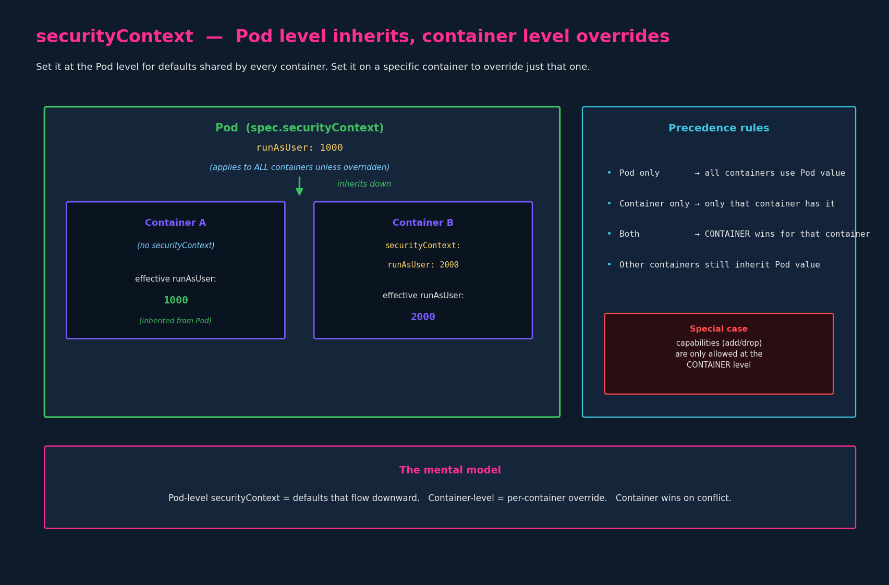

# Security Contexts

> **Section:** 02-configuration
> **Course chapter:** 07 (Security Contexts)
> **Why this is in CKAD:** Directly examinable. Small set of fields, easy
> exam wins once you internalize *what level each field is allowed at* and
> *who wins when both levels are set*.
> **Companion file:** `06-docker-security.md` — this chapter is the
> Kubernetes surface for the Docker mechanics there. The §6 mapping table in
> that chapter is the cheat sheet for this one.

---

## 1. What a Security Context is

A **Security Context** is the field in a Pod or container spec that controls
the underlying Linux security mechanics covered in the previous chapter —
who the process runs as (`runAsUser`, `runAsGroup`), whether it's allowed to
be root (`runAsNonRoot`), which Linux capabilities it gets
(`capabilities.add` / `.drop`), and whether to run privileged
(`privileged: true`).

The whole chapter is one idea expressed twice:

1. You can set it at **Pod level** (`spec.securityContext`) or **container
   level** (`spec.containers[*].securityContext`).
2. Pod-level settings flow down to all containers; container-level settings
   override the Pod-level value **for that container only**.



---

## 2. The two levels — what each looks like

### 2.1 Pod-level (applies to every container in the Pod)

```yaml
apiVersion: v1
kind: Pod
metadata:
  name: web-pod
spec:
  securityContext:            # <-- POD level: under spec, not under containers
    runAsUser: 1000
  containers:
    - name: ubuntu
      image: ubuntu
      command: ["sleep", "3600"]
    - name: sidecar
      image: nginx
```

Effective `runAsUser` inside each container at startup: **1000** (both
inherit from the Pod). Same as `docker run --user=1000` for every container.

### 2.2 Container-level (applies only to that container)

```yaml
apiVersion: v1
kind: Pod
metadata:
  name: web-pod
spec:
  containers:
    - name: ubuntu
      image: ubuntu
      command: ["sleep", "3600"]
      securityContext:        # <-- CONTAINER level: under the container
        runAsUser: 1000
        capabilities:
          add: ["MAC_ADMIN"]
```

This is the manifest from the instructor's slide. Note the indentation:
`securityContext:` is at the same level as `name:` / `image:` / `command:` —
i.e. a field of the *container*, not a field of the Pod.

### 2.3 Both — container wins for that container

```yaml
apiVersion: v1
kind: Pod
metadata:
  name: web-pod
spec:
  securityContext:
    runAsUser: 1000           # Pod default
  containers:
    - name: app                 # inherits Pod default
      image: my-app
    - name: legacy              # overrides for itself only
      image: legacy-app
      securityContext:
        runAsUser: 2000
```

Effective `runAsUser`:

- `app` runs as **1000** (inherited from Pod).
- `legacy` runs as **2000** (overrode the Pod default for itself).
- If a third container were added with no `securityContext`, it would also
  inherit **1000**. Container-level overrides are per-container, not
  cumulative across the Pod.

---

## 3. The fields you actually need

Five fields cover the vast majority of CKAD usage. Each maps to a Docker
concept from the previous chapter.

| Field | Allowed at | Docker equivalent | What it does |
|---|---|---|---|
| `runAsUser: <uid>` | Pod, container | `docker run --user` | Run the container's process as this UID |
| `runAsGroup: <gid>` | Pod, container | `docker run --user=u:g` | Primary GID |
| `runAsNonRoot: true` | Pod, container | (no equivalent) | Refuse to start if the image's user is UID 0 |
| `capabilities: { add: [...], drop: [...] }` | **container only** | `--cap-add` / `--cap-drop` | Tune Linux capabilities |
| `privileged: true` | container | `docker run --privileged` | Grant everything; last resort |

> The one structural gotcha — flagged on the instructor's slide and worth
> burning in: **`capabilities:` is only valid at container level.** Putting
> it under `spec.securityContext:` (Pod level) is a manifest error. The
> reason is that capabilities are a *per-process* concept and a Pod isn't a
> process; only its containers are. Every other field on the table above
> works at either level.

### 3.1 `runAsNonRoot` — the field with no Docker analog

This one earns a callout because it's a frequent exam scenario and didn't
appear in the previous lecture. Setting `runAsNonRoot: true` doesn't *change*
the user — it tells the kubelet to **refuse to start the container if it
would run as UID 0**.

```yaml
spec:
  securityContext:
    runAsNonRoot: true
```

If the image's default user is root and no `runAsUser` was specified to
override it, the Pod fails to start with `CreateContainerConfigError`.
Equivalent to a policy assertion: "I assert this workload never needs root;
fail loudly if anything would make it root."

Useful in combination with `runAsUser`: `runAsUser: 1000` actively sets the
UID; `runAsNonRoot: true` is a belt-and-braces guard that catches the case
where `runAsUser` was forgotten or removed in a future edit.

---

## 4. CKAD speed notes

- **No imperative shortcut.** `kubectl run` has no `--security-context` flag.
  Generate the Pod with `k run ... $do > pod.yaml`, then add the
  `securityContext:` block in vim.
- **Indentation watch — the recurring failure mode.** Pod-level
  `securityContext:` is under `spec:`; container-level is under the
  container item in `spec.containers:`. Two YAML levels apart. Misindent the
  container-level one too far back and it becomes Pod-level — manifest
  validates but doesn't do what you expected, *and* if you put `capabilities:`
  in it, you'll get a validation error referring to the Pod, which is
  confusing until you remember why.
- **Verify what actually landed** — same `exec` pattern as the env-vars and
  DNS chapters:
  ```bash
  k exec web-pod -- id
  # uid=1000 gid=0(root) groups=0(root)

  k exec web-pod -- whoami
  # 1000   (or a username if /etc/passwd has one for this UID)
  ```
  If `id` shows `uid=0` when you expected 1000, your `runAsUser` didn't take
  — most often a container/Pod-level mismatch.
- **Capabilities verification** (less common on exam, useful in practice):
  ```bash
  k exec web-pod -- capsh --print
  ```
  Lists the capabilities the process actually holds. If the image doesn't
  ship `capsh`, exec into it differently or use a debug pod with a richer
  image.
- **The common exam scenarios:**
  - "Set this Pod to run as UID 1000" → Pod-level `runAsUser`.
  - "Add `NET_ADMIN` capability to the container" → container-level
    `capabilities.add`, *not* Pod-level.
  - "Make the second container in this Pod run as a different user" →
    container-level `runAsUser` on that one container, leaving the others
    untouched.
  - "Refuse to run if the image would run as root" → `runAsNonRoot: true`.

---

## 5. Key takeaways

1. `securityContext:` is the Pod/container field that exposes the Linux
   security knobs from chapter 06: user, capabilities, privileged mode.
2. Two levels: `spec.securityContext` (Pod, defaults for all containers) and
   `spec.containers[*].securityContext` (per container, overrides Pod).
3. Pod-level inherits down. Container-level overrides for *that* container
   only. Other containers continue to inherit the Pod default.
4. **`capabilities:` is container-level only** — the one place the parallel
   between Pod and container security contexts breaks.
5. `runAsNonRoot: true` is an assertion, not a setting: it refuses to start
   if the resolved user would be UID 0. Useful as a guard rail alongside
   `runAsUser`.
6. No imperative shortcut: generate Pod YAML, add the block, apply, verify
   with `k exec -- id`.

### Resolved threads
- [x] Kubernetes `securityContext:` (Pod vs container, capabilities at
      container only) — done here

### Open threads
- [ ] Pod Security Standards (`restricted`/`baseline`/`privileged`) and Pod
      Security admission — CKS territory; forward reference for later
- [ ] `fsGroup`, `seLinuxOptions`, `seccompProfile`, `appArmorProfile` —
      additional securityContext fields, mostly CKS-relevant; CKAD rarely
      tests beyond §3's table
- [ ] ServiceAccounts (still open from `05-secrets.md`)
- [ ] Volumes proper (still open from `04-configmaps.md`)
