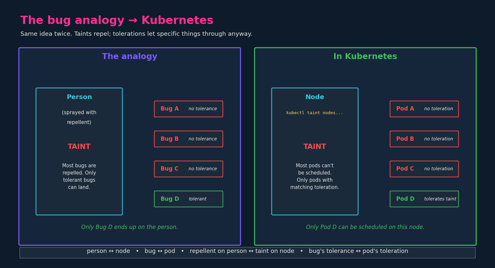
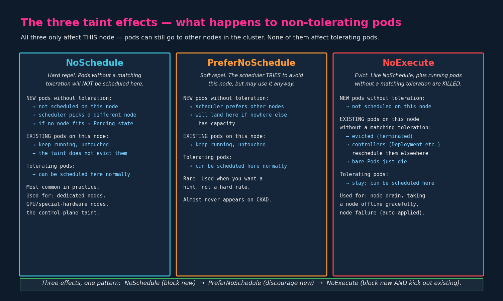
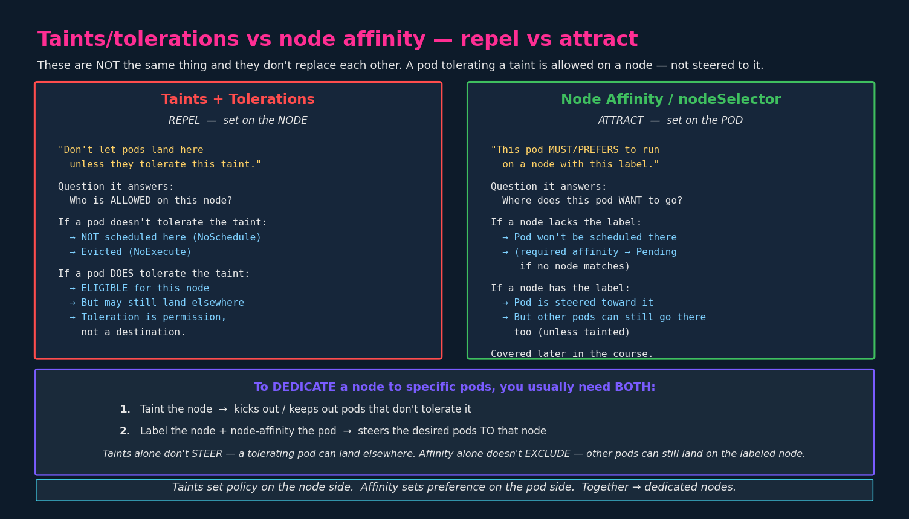

# Taints and Tolerations

> **Section:** 02-configuration
> **Course chapter:** 10 (Taints and Tolerations)
> **Why this is in CKAD:** Examinable. Small surface (one command on the
> node, one block in the pod spec) but a classic source of "why isn't my
> pod scheduling?" trick questions. Know the three effects cold and you'll
> be fine.
> **Companion files:** none yet — node affinity is a separate later
> chapter and will pair with this one. The instructor mentions it but
> doesn't teach it here.

---

## 1. The mental model

The instructor uses an analogy worth keeping in your head:

- A **person** gets sprayed with bug repellent — a **taint**.
- Most **bugs** that try to land are repelled. Some bugs happen to be
  **tolerant** to that specific repellent and land anyway.

In Kubernetes:

- The **node** is the person.
- The **pod** is the bug.
- A **taint** is applied to the node and repels pods.
- A **toleration** is set on the pod and lets it land on a tainted node.



The mechanism exists for one purpose: **restrict which pods can run on
which nodes.** The instructor's example was a node with special resources
(GPU, high memory, licensed software) where only specific workloads
should run — tainting that node keeps everything else away.

---

## 2. The two halves

Both halves are required. A taint with no matching toleration just keeps
pods off. A toleration with no matching taint does nothing.

### Taint on the node (the repellent)

```bash
kubectl taint nodes <node-name> <key>=<value>:<effect>

# Concrete example: only pods that tolerate 'app=blue' can be scheduled
# on node1
kubectl taint nodes node1 app=blue:NoSchedule
```

Three pieces:

| Piece    | Example     | What it is                                                |
|----------|-------------|-----------------------------------------------------------|
| `key`    | `app`       | Arbitrary string you choose                               |
| `value`  | `blue`      | Arbitrary string you choose (optional)                    |
| `effect` | `NoSchedule`| One of three behaviors — see §3                           |

The key/value pair is just a label-shaped identifier — there's no
predefined meaning. `app=blue`, `gpu=true`, `dedicated=payments` all work.
Pods must reference the same key/value/effect in their toleration to be
allowed.

### Toleration on the pod (the tolerance)

```yaml
apiVersion: v1
kind: Pod
metadata:
  name: myapp-pod
spec:
  containers:
    - name: nginx-container
      image: nginx
  tolerations:
    - key: "app"
      operator: "Equal"
      value: "blue"
      effect: "NoSchedule"
```

The four fields mirror the taint command:

| Field      | Must match the taint's...                                       |
|------------|-----------------------------------------------------------------|
| `key`      | key (`app`)                                                     |
| `value`    | value (`blue`)                                                  |
| `operator` | how to compare — `Equal` (default) or `Exists`                  |
| `effect`   | effect (`NoSchedule`)                                           |

**Quoting matters.** Every value in the toleration is a string. Even
though `NoSchedule` and `Equal` look like identifiers, write them as
quoted strings (`"NoSchedule"`, `"Equal"`) in YAML. Otherwise YAML may
interpret them weirdly depending on context. This is one of those CKAD
gotchas where you lose points to YAML syntax, not to Kubernetes
understanding.

**Operators:**

- `Equal` (default) — matches a taint with the same key AND value.
- `Exists` — matches a taint with the same key, regardless of value.
  Omit the `value` field when using `Exists`.

```yaml
# "Tolerate any taint with key=gpu, whatever the value"
tolerations:
  - key: "gpu"
    operator: "Exists"
    effect: "NoSchedule"
```

---

## 3. The three taint effects

This is the part the instructor breezed past, and it's the one that
shows up most often in exam questions. The effect determines what
happens to **non-tolerating pods** — pods that already match the taint
are unaffected in all three cases.



### `NoSchedule` — hard repel (don't add new ones)

- **New pods without a matching toleration:** scheduler refuses to place
  them on this node. They go to a different node, or sit `Pending` if
  no other node can fit them.
- **Existing pods already running on the node:** untouched. The taint
  only affects future scheduling decisions, not pods that are already
  there.
- **Common in practice.** Used for dedicated nodes, GPU/special-hardware
  nodes, and (automatically) for control-plane nodes.

> **Important nuance for your question:** the pod just doesn't get
> scheduled on *this* node. The scheduler picks a different one. If
> no node in the cluster is acceptable to the pod, *then* the pod stays
> in `Pending` state. The taint doesn't "fail" the pod globally — it
> just removes one node from the candidate list.

### `PreferNoSchedule` — soft repel (try to avoid)

- **New pods without toleration:** scheduler **prefers** to put them
  elsewhere, but **will** schedule them here if nowhere else has
  capacity. Best-effort, not enforced.
- **Existing pods:** untouched.
- **Rare in real clusters and almost never appears on CKAD.** Know it
  exists, don't memorize beyond that.

### `NoExecute` — evict (block new AND kick out existing)

- **New pods without toleration:** not scheduled here (same as
  `NoSchedule`).
- **Existing pods running on the node without a matching toleration:**
  **evicted** — terminated by the kubelet. Pods owned by a controller
  (Deployment, ReplicaSet, DaemonSet) get rescheduled elsewhere
  automatically. Bare Pods just die.
- **What this means in practice:** applying a `NoExecute` taint to a
  node is the gentle way to take a node offline. Kubernetes also
  applies a `node.kubernetes.io/unreachable:NoExecute` taint
  automatically when it detects a node has failed — the same mechanism
  drives pod rescheduling during node failures.

### One-line summary

```
NoSchedule        block new
PreferNoSchedule  discourage new (best-effort)
NoExecute         block new AND kick out existing
```

---

## 4. Tolerating does NOT mean "schedule here"

This is the instructor's most important throwaway line and it deserves
loud emphasis. **A toleration is permission to land on a tainted node,
not a directive to go there.**

If you taint `node1` with `app=blue:NoSchedule` and add the matching
toleration to `Pod D`, what happens is:

- Pods A, B, C (no toleration) → **cannot** be scheduled on `node1`,
  but can be scheduled anywhere else.
- Pod D (with toleration) → **can** be scheduled on `node1`, **or**
  on `node2`, **or** on `node3`. The toleration just adds `node1` to
  D's eligible list. The scheduler still picks where to actually put D
  based on resources, other constraints, etc.

If you actually want Pod D to *go* to `node1`, you need a separate
mechanism that **steers** rather than merely **permits**:



- **Taints + tolerations** = "who is **allowed** on this node?" (set on
  the **node**, push-away mechanism)
- **Node affinity / `nodeSelector`** = "where does this pod **want** to
  go?" (set on the **pod**, pull-toward mechanism)

To **dedicate** a node to specific pods, you usually need both:

1. **Taint the node** so other pods can't land there.
2. **Label the node + add node-affinity to the pod** so the pod goes
   *there* specifically.

Either alone is incomplete:

- Taint alone → tolerating pods are allowed on the node, but the
  scheduler might still put them elsewhere.
- Affinity alone → the pod is steered to the node, but other pods can
  still land there too (because there's no taint repelling them).

Node affinity gets its own chapter later in the course. Worth flagging
the gap now so you don't think tolerations are doing more than they are.

---

## 5. The master/control-plane node taint

The instructor's closing point: by default, **no application pods run
on the control plane node** — only system components like kube-apiserver,
etcd, scheduler, controller-manager.

The mechanism is exactly this chapter: when you bootstrap a cluster
(`kubeadm init`), the control plane node gets tainted automatically:

```bash
kubectl describe node <control-plane-node> | grep Taints
# Taints:  node-role.kubernetes.io/control-plane:NoSchedule
```

That taint repels every regular pod. The system components that DO run
there have a matching toleration baked in, so they're allowed through.

You'll see this on any real cluster. On your local single-node `kind`
cluster, the taint is typically removed so your test pods will actually
schedule somewhere — but on a production multi-node cluster, leaving the
taint in place is standard.

**(Historical note:** older Kubernetes versions used the taint key
`node-role.kubernetes.io/master`. From v1.24 onward it's `control-plane`.
You may still see `master` in older docs/tutorials/code.)

---

## 6. Verifying and removing taints

```bash
# See current taints on a node
kubectl describe node <node-name> | grep -A1 Taints

# Or get just the taints field
kubectl get node <node-name> -o jsonpath='{.spec.taints}'

# Remove a taint (note the trailing minus sign)
kubectl taint nodes <node-name> app=blue:NoSchedule-
```

The trailing `-` on the command is the "delete" syntax. Easy to miss
under exam pressure — write it as one fluid command, not as a
copy-paste of the original with `-` glued on.

---

## 7. Worked example, end to end

Scenario: you have 3 worker nodes. Node 1 has special GPU hardware. You
want only GPU-needing pods to schedule there, and you don't care that
much where they land for now (you'll add affinity later when you learn
it).

**Taint node1:**

```bash
kubectl taint nodes node1 hardware=gpu:NoSchedule
```

**A pod with no toleration:**

```yaml
apiVersion: v1
kind: Pod
metadata:
  name: regular-app
spec:
  containers:
    - name: app
      image: nginx
# No tolerations → can be scheduled on node2 or node3, never node1.
```

**A GPU-needing pod with toleration:**

```yaml
apiVersion: v1
kind: Pod
metadata:
  name: gpu-app
spec:
  containers:
    - name: tensorflow
      image: tensorflow/tensorflow:latest-gpu
  tolerations:
    - key: "hardware"
      operator: "Equal"
      value: "gpu"
      effect: "NoSchedule"
# Can be scheduled on node1, node2, OR node3.
# Toleration lets it land on node1 — doesn't force it.
```

If you want to actually pin `gpu-app` to `node1`, that's node affinity
territory — separate later chapter.

---

## 8. Exam-pattern gotchas

- **Tolerations don't schedule, they permit.** Most-tested misconception.
  If a question asks "which pods will run on node1?" — the answer is
  pods *eligible* for node1, but the scheduler still picks the actual
  landing node.
- **Quote your strings.** `effect: NoSchedule` without quotes might be
  fine in newer kubectl, but `effect: "NoSchedule"` always is. Same for
  `operator: "Equal"`, `value: "blue"`. Lose-a-point territory.
- **Effect must match.** A taint with `:NoSchedule` and a toleration
  with `effect: "NoExecute"` do not match. Same key+value, different
  effect → not a match.
- **`Exists` operator drops the value field.** A toleration with
  `operator: "Exists"` and a `value` field is malformed. The exam may
  hand you a manifest with this bug to fix.
- **Master/control-plane is tainted by default.** If you create a Pod
  and it stays `Pending` on a single-control-plane test cluster with no
  worker nodes, this is usually why.
- **`NoExecute` is the only effect that affects already-running pods.**
  Adding `NoSchedule` to a node never kills anything that's already
  there.
- **A node can have multiple taints.** A pod needs a toleration for
  EACH of them to be eligible. One missing toleration is enough to
  block scheduling.

---

## 9. Imperative shortcuts

```bash
# Taint a node
kubectl taint nodes node1 app=blue:NoSchedule

# Untaint (note the trailing `-`)
kubectl taint nodes node1 app=blue:NoSchedule-

# Inspect taints on a node
kubectl describe node node1 | grep -A1 Taints
kubectl get node node1 -o jsonpath='{.spec.taints}'

# Inspect tolerations on a pod
kubectl describe pod my-pod | grep -A10 Tolerations
kubectl get pod my-pod -o jsonpath='{.spec.tolerations}'

# Generate a pod with a toleration in one shot? No direct flag.
# Use $do then edit:
kubectl run myapp --image=nginx $do > pod.yaml
# Then add the tolerations: block by hand under spec:
```

No imperative shortcut for adding a toleration to a Pod manifest — it's
always a YAML edit. On the exam, generate with `$do` then add the four
lines of toleration under `spec:`. Practice that flow in killer.sh.

---

## 10. TL;DR / takeaways

1. **Taint** on the node (push pods away). **Toleration** on the pod
   (permission to land anyway). Both halves must match for the pod to
   be allowed on the node.
2. Three effects: `NoSchedule` (block new), `PreferNoSchedule` (soft
   block new), `NoExecute` (block new AND evict existing
   non-tolerating pods).
3. **Toleration = permission, not destination.** A tolerating pod is
   *eligible* for the tainted node, not *steered* to it. To steer, you
   need node affinity (later chapter).
4. Control-plane nodes carry a default `NoSchedule` taint
   (`node-role.kubernetes.io/control-plane`) that's how Kubernetes
   keeps app pods off them.
5. Multiple taints on a node → pod needs tolerations for ALL of them.
6. Remove a taint with the trailing `-` syntax:
   `kubectl taint nodes node1 app=blue:NoSchedule-`
7. Quote string values in toleration YAML to avoid YAML-parsing edge
   cases.

### Resolved threads
- (none from prior chapters)

### Open threads
- [ ] **Node affinity / `nodeSelector`** — the pull-toward complement
      to taints. Covered in a later chapter; will close the
      "dedicated node" pattern referenced in §4.
- [ ] **Pod-to-pod affinity / anti-affinity** — same mechanism applied
      to pod-level co-location (run near, run away from). Later.
- [ ] **Eviction** — `NoExecute` is one source of pod eviction.
      Resource pressure (memory, disk) is another, covered later under
      QoS classes / `08-resource-requirements.md` companion topics.
