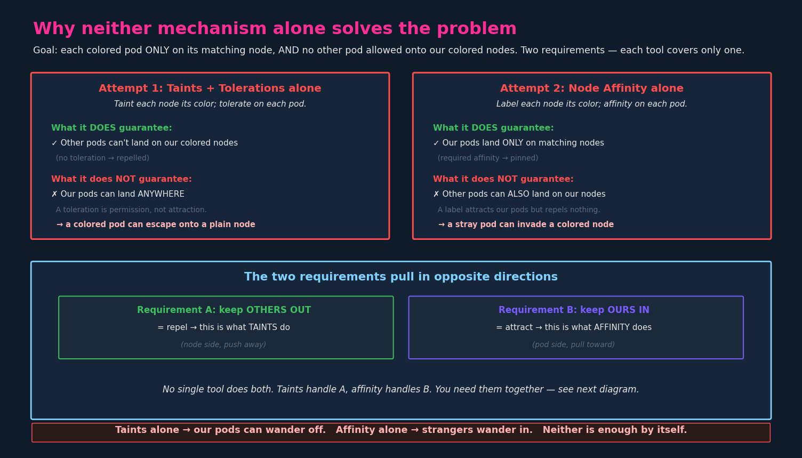
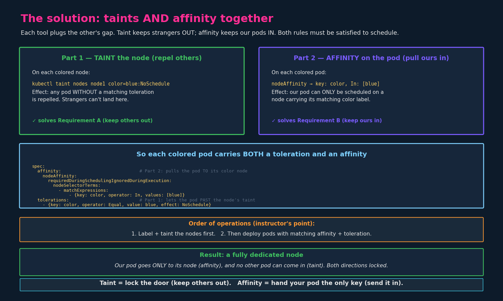

# Node Affinity vs Taints and Tolerations

> **Section:** 02-configuration
> **Course chapter:** 13 (Node Affinity vs Taints and Tolerations)
> **Why this is in CKAD:** This is the synthesis lecture — it doesn't add
> new syntax, it shows how the three previous mechanisms combine. The
> exam loves "dedicate these nodes to these pods and nothing else" — that
> question needs the combination, and getting it right means knowing why
> one tool alone fails.
> **Companion files:** `10-taints-and-tolerations.md` (repel),
> `11-node-selectors.md` (simple attract), `12-node-affinity.md`
> (expressive attract). This chapter is where the open threads from all
> three close.

---

## 1. The exercise

The instructor sets up a concrete problem. Three colored pods (blue,
red, green/orange in the slides — colors vary), three matching colored
nodes, and a cluster that also contains **other pods and other nodes**.

Two requirements, and both must hold:

- **A.** Each colored pod must land **only** on its matching colored node.
- **B.** No **other** pod may land on our colored nodes, and our colored
  pods may not land on **other** nodes.

The phrasing matters: it's not just "put the blue pod on the blue node."
It's "blue pod on blue node *and nothing else allowed there* *and* blue
pod *allowed nowhere else*." That two-sided requirement is what makes a
single mechanism insufficient.

---

## 2. Attempt 1 — taints and tolerations alone

Approach: "paint" each node by tainting it its color, then give each pod
a matching toleration.

```bash
kubectl taint nodes node1 color=blue:NoSchedule
kubectl taint nodes node2 color=red:NoSchedule
kubectl taint nodes node3 color=green:NoSchedule
```

…and each pod gets the matching toleration.

**What works:** other pods (no toleration) are repelled from the colored
nodes. Requirement A's "keep others out" half is satisfied — strangers
can't get onto our nodes.

**What fails:** a toleration is *permission, not attraction* (the core
point from chapter 10 §4). The blue pod tolerates the blue taint — but
nothing *steers* it to the blue node. The scheduler is free to place it
on any **untainted** node elsewhere in the cluster. In the instructor's
run, two pods happened to land correctly, but one escaped onto a
different node. Taints don't pin pods down; they only push the wrong
pods away.

> **Result: our pods can wander off.** Taints solve "keep others out" but
> not "keep ours in."

---

## 3. Attempt 2 — node affinity alone

Approach: label each node its color, give each pod a `required` node
affinity matching its color.

```bash
kubectl label nodes node1 color=blue
kubectl label nodes node2 color=red
kubectl label nodes node3 color=green
```

…and each pod gets a `requiredDuringSchedulingIgnoredDuringExecution`
affinity for its color.

**What works:** each colored pod is now pinned to its matching node —
the blue pod can *only* go to the blue node. Requirement B's "keep ours
in" half is satisfied.

**What fails:** a label *attracts* our pods but *repels nothing*. An
unrelated pod with no affinity rules is free to be scheduled onto any
node, including our blue/red/green nodes. Affinity says where *our* pod
must go; it says nothing about keeping *other* pods away.

> **Result: strangers can wander in.** Affinity solves "keep ours in" but
> not "keep others out."



---

## 4. The key insight: the two requirements pull opposite ways

This is the part the instructor said wasn't clicking, so here it is
stated as plainly as possible:

The problem has **two independent halves**, and each tool only covers one:

| Requirement | In plain terms | Direction | Tool that does it |
|---|---|---|---|
| **A. Keep others OUT** | strangers can't use our nodes | **repel** (node side) | **taints** |
| **B. Keep ours IN** | our pods can't use other nodes | **attract** (pod side) | **node affinity** |

- A **taint** is a *repel* mechanism living on the *node*. It pushes away
  anything that doesn't tolerate it. It does nothing to attract.
- An **affinity** is an *attract* mechanism living on the *pod*. It pulls
  the pod toward matching nodes. It does nothing to repel.

No single mechanism does both directions. That's not a limitation to
work around — it's the design. Taints and affinity are *complementary*,
each covering the gap the other leaves.

---

## 5. The solution — use both together

Taint the nodes **and** give the pods affinity. Each colored pod ends up
carrying **two** things:

- a **toleration** so it can get *past* its node's taint (Part 1)
- an **affinity** so it's *pulled to* its node and nowhere else (Part 2)



### Node side

```bash
# Label (for affinity to match) AND taint (to repel others) — both
kubectl label nodes node1 color=blue
kubectl taint nodes node1 color=blue:NoSchedule
```

Each node gets **both** a label and a taint with the same key/value. The
label is what affinity matches on; the taint is what repels non-tolerating
pods. They're separate Kubernetes features that happen to use the same
`color=blue` string here for clarity.

### Pod side

```yaml
apiVersion: v1
kind: Pod
metadata:
  name: blue-pod
spec:
  affinity:                                 # Part 2: pulls pod TO the blue node
    nodeAffinity:
      requiredDuringSchedulingIgnoredDuringExecution:
        nodeSelectorTerms:
          - matchExpressions:
              - key: color
                operator: In
                values:
                  - blue
  tolerations:                              # Part 1: lets pod PAST the blue taint
    - key: color
      operator: Equal
      value: blue
      effect: NoSchedule
  containers:
    - name: blue-container
      image: nginx
```

### Why this satisfies both requirements

- **Our blue pod → blue node only.** The affinity pins it to the blue
  node (can't go elsewhere), and the toleration lets it past the blue
  node's taint (can actually land there). Both halves of "keep ours in."
- **Other pods → kept off our nodes.** A stranger pod has no toleration
  for the `color=blue:NoSchedule` taint, so it's repelled from the blue
  node. "Keep others out."

The taint plugs affinity's gap (repelling strangers); the affinity plugs
the taint's gap (pinning our pod down). Together → a **fully dedicated
node**.

### A metaphor that sticks

- **Taint = lock the door.** Keeps everyone out unless they have the key.
- **Toleration = the key.** Lets our pod through the locked door.
- **Affinity = the address.** Tells our pod that's the *only* door to go
  to.

Lock + key + address = our pod goes there, and only our pod can.

---

## 6. Order of operations

The instructor stressed: **taints/labels on nodes first, then deploy the
pods.** The reason is the same as the nodeSelector ordering trap (chapter
11 §3) — affinity and tolerations are evaluated at scheduling time, so
the node-side setup has to exist before the scheduler places the pod.

1. Label the nodes (for affinity).
2. Taint the nodes (to repel others).
3. Deploy the pods with matching affinity + toleration.

If you deploy pods first, they may schedule wrong (or stay `Pending`)
before the node setup is in place.

---

## 7. Do you always need both?

No — it depends on which half of the problem you actually have:

- **Only need "keep ours in"?** (Our pod must run on a specific node, but
  you don't care if other pods also use that node.) → **affinity alone.**
- **Only need "keep others out"?** (Reserve a node for a class of
  workloads, but those workloads can run elsewhere too.) → **taints
  alone.**
- **Need both — a truly dedicated node?** → **both together.** This is
  the exam's favorite and the instructor's exercise.

Recognising which requirement(s) a question actually states is half the
battle. "Place the pod on node X" is affinity. "Reserve node X for these
pods only" is both.

---

## 8. The control-plane node — a real example of "both"

You've already seen this combination in the wild (and in a recent lab):
the control-plane node ships with **both** a taint and a label.

- Taint: `node-role.kubernetes.io/control-plane:NoSchedule` — repels
  regular workloads.
- Label: `node-role.kubernetes.io/control-plane` — lets you target it
  with affinity (using `operator: Exists`, since the label has no value).

To run a pod *on* the control-plane node you need the toleration (to get
past the taint) and, if you want to pin it there specifically, the
affinity (to attract it). Exactly the pattern from §5, already set up by
`kubeadm`.

---

## 9. Exam-pattern gotchas

- **Read for both directions.** "Run X on node Y" = affinity. "Only X may
  run on Y, and X only on Y" = both. The word "only" (especially "only
  these pods" / "nowhere else") is the signal you need the combination.
- **Same key/value on label and taint** is convention, not requirement —
  they're independent features. But matching them keeps the manifest
  readable and is what the exercises do.
- **Toleration without affinity** → pod *may* wander to other untainted
  nodes (Attempt 1's failure).
- **Affinity without toleration** → if the target node is tainted, the
  pod stays `Pending` (affinity makes it eligible, taint still repels) —
  this is the exact bug from the control-plane lab.
- **Order:** node setup (label + taint) before pod deployment.
- **`effect` must match** between taint and toleration; `values`/`value`
  must match between label and affinity/toleration.

---

## 10. TL;DR / takeaways

1. The "dedicated node" problem has **two halves**: keep others OUT
   (repel) and keep ours IN (attract). They pull in opposite directions.
2. **Taints alone** keep others out but let our pods wander off.
3. **Affinity alone** pins our pods but lets strangers wander in.
4. **Use both** for a truly dedicated node: taint the node (+ toleration
   on the pod) to repel others, label the node (+ affinity on the pod) to
   attract ours.
5. Each colored pod ends up with **both** a toleration and a node
   affinity.
6. **Order:** label + taint nodes first, then deploy pods.
7. **Taint = lock; toleration = key; affinity = address.**
8. Match the tool to the requirement: affinity-only, taint-only, or both
   — driven by whether the question needs one direction or both.
9. The control-plane node is a built-in example of the "both" pattern.

### Resolved threads
- [x] **The "dedicate a node" pattern** — open since
      `10-taints-and-tolerations.md` §4 and `11-node-selectors.md` §8.
      Fully closed here: taint (repel) + affinity (attract) = dedicated
      node, with the why-each-alone-fails reasoning made explicit.
- [x] **Combining affinity with taints** — open from
      `12-node-affinity.md`. Covered in §5–§8.

### Open threads
- [ ] **Pod affinity / anti-affinity** — the *pod-to-pod* version of this
      idea (co-locate or spread pods relative to other pods, via
      `topologyKey`). Still upcoming; same attract/repel thinking applied
      to pods instead of nodes.
- [ ] **DaemonSets** — run a pod on every node (or every node matching a
      selector). Relevant because DaemonSet pods often carry broad
      tolerations to land on tainted nodes too. Later.
