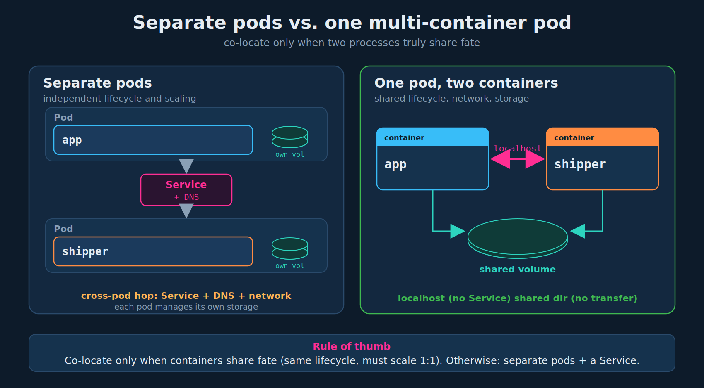
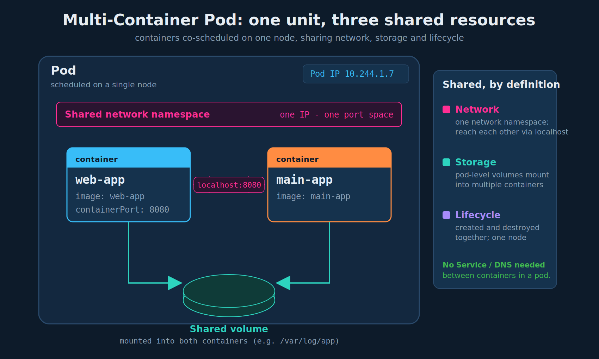

# Multi-Container Pods (Introduction)

> **Section:** 03-multi-container-pods
> **Course chapter:** 1 (Multi-Container PODs)
> **Why this is in CKAD:** Defining and creating multi-container pods is a core CKAD design task. You will be asked to add a second container to an existing pod, to read logs/exec into a *specific* container, and to reason about why co-located containers share localhost and volumes. The follow-on lecture (design patterns) is directly testable.
> **Companion files:** `../01-core-concepts/03-pods.md` (single-container pod basics); `../02-configuration/08-resource-requirements.md` (requests/limits are per-container, which starts to matter once a pod has more than one container)

---

## 1. The microservices motivation (instructor's framing)

The instructor opens with microservices: the trend of decomposing a monolith into small, independently deployable services. That decoupling is usually the goal. Each service scales, deploys, and fails on its own.

But sometimes two processes are so tightly coupled that splitting them into separate pods buys nothing and adds complexity. The teaching example is a **web server plus a helper that processes its output**, developed and scaled together, each useless without the other.

A cleaner real-world example than "web server + app" (the one you asked for):

- **A log shipper next to an app.** The application writes logs to a file; a second container (e.g. Fluent Bit or Vector) tails that file and ships it to a central system. The app does not need to know how logs are shipped, and the shipper does not need to know what the app does. They only need to share a directory and the same lifetime.

That helper-alongside-the-main-app shape is exactly what your team calls a **sidecar** (see section 5, and the next lecture covers the formal patterns).

## 2. When to put containers in the same pod (and when not)

This is the decision the rest of the lecture justifies. Co-locate two containers in one pod **only when they truly share fate**: same lifecycle, want `localhost` networking, and need a shared filesystem. If they can scale or fail independently, they belong in separate pods talking through a Service.



| Question | If "yes" -> | If "no" -> |
|---|---|---|
| Do they start and stop as one unit? | Same pod | Separate pods |
| Must they always scale 1:1? | Same pod | Separate pods (you cannot scale one container in a pod independently) |
| Do they need `localhost` / a shared local file? | Same pod | Separate pods + Service |

> Anti-pattern: stuffing two unrelated services into one pod "to save resources". You lose independent scaling, independent rollout, and independent failure recovery.

## 3. What co-located containers actually share

The instructor's slide lists three things. This is the whole mental model — memorize the three words.



| Shared resource | What it means | The practical payoff |
|---|---|---|
| **Lifecycle** | Containers are scheduled onto the same node and created/torn down together as a pod. | No cross-pod "start B after A" coordination. |
| **Network** | They share one network namespace: one pod IP, one port space. | They reach each other on `localhost`. No Service or DNS needed *between them*. |
| **Storage** | Volumes are declared at the **pod** level and can be mounted into multiple containers. | File handoff is just a shared directory — no network transfer, no volume-sharing plumbing. |

Depth beyond the lecture (mine, not the instructor's):

- **Lifecycle is not "one dies, all die."** The pod is created and deleted as a unit, but an individual container that crashes is restarted according to the pod's `restartPolicy`; it does not necessarily delete the pod. The pod simply will not report `Ready` while a container is unhealthy.
- **One network namespace means one port space.** Two containers in the same pod **cannot both bind the same port** (see gotchas).
- **`localhost` is the pod, not the node.** Container A reaches container B at `localhost:<B's port>`.

## 4. Defining a multi-container pod (the `containers` array)

`spec.containers` is a YAML **list**. A single-container pod has one list item; a multi-container pod just has more. This mirrors the instructor's "Create" slide.

```yaml
apiVersion: v1
kind: Pod
metadata:
  name: simple-webapp
  labels:
    name: simple-webapp
spec:
  containers:               # this is an ARRAY — one list item per container
    - name: web-app         # container 1
      image: web-app        # placeholder image name; real image needs repo[:tag]
      ports:
        - containerPort: 8080
    - name: main-app        # container 2 — just another list item under the same spec
      image: main-app
```

Each container is its own list entry beginning with `- name:`. That leading hyphen is the thing people drop under exam time pressure (see gotchas). The `image` values `web-app` / `main-app` here are placeholders from the slide; in practice they would be something like `nginx:1.27` or `myregistry/main-app:1.4`.

## 5. The sidecar pattern (real world + a forward note)

Your team's "sidecar" is the most common reason to run a second container: a helper that augments the main app (log shipping, a service-mesh proxy like Envoy, a config/secret refresher, a metrics exporter). The main app stays oblivious; the sidecar does the cross-cutting work. The next lecture formalizes this alongside the **adapter** and **ambassador** patterns.

Forward note (beyond this lecture, worth knowing for work): historically a sidecar was just a regular container in `spec.containers`, which has a subtle problem — ordering and shutdown are not guaranteed relative to the main app. Kubernetes later added **native sidecar containers**, declared as an `initContainer` with `restartPolicy: Always`, which start before the main containers and shut down after them. That is not required for CKAD intro, but it is the modern, correct way to model a true sidecar and will likely come up at work.

## 6. Exam-pattern gotchas

- **The `containers` list item.** Adding a second container means adding a `- name:` entry under `spec.containers`. Forgetting the `-` (or mis-indenting it) is the most common failure. Each container's fields (`name`, `image`, `ports`, ...) align under the hyphen.
- **Port conflicts.** Containers in a pod share the network namespace, so two of them **cannot listen on the same port**. One will fail to bind and crash. Pick distinct ports.
- **`logs` and `exec` need `-c` when there is more than one container.** This is a near-guaranteed exam touchpoint:
  - `kubectl logs <pod> -c <container>`
  - `kubectl exec -it <pod> -c <container> -- sh`
  Without `-c`, kubectl errors asking you to choose a container (or silently targets a default you did not mean).
- **You cannot scale one container in a pod.** Scaling a Deployment scales whole pods. If you find yourself wanting to scale containers independently, they should be separate pods.
- **Resource requests/limits are per container.** A pod's effective request/limit is the sum across its containers — relevant to scheduling and to your section 02 notes.
- **Readiness is pod-wide.** A crash-looping sidecar keeps the whole pod out of `Ready`, which can stall a rollout even though the main app is fine.
- **A "run-once" helper as a normal container churns.** With the default `restartPolicy: Always`, a helper that completes and exits gets restarted repeatedly (CrashLoopBackOff-style churn). Use an **init container** for run-before-app work, or a **native sidecar** for run-alongside work.

## 7. Imperative shortcuts

There is **no direct imperative command** to create a multi-container pod. The exam workflow is: generate a single-container pod, then hand-edit the YAML to add the second container.

```bash
# 1) scaffold the first container ($do = --dry-run=client -o yaml)
kubectl run simple-webapp --image=web-app --port=8080 $do > pod.yaml

# 2) open pod.yaml and add the second container as another list item
#    under spec.containers, then apply:
kubectl apply -f pod.yaml
```

Reference / debug commands worth keeping in the command file:

```bash
kubectl explain pod.spec.containers            # recall available container fields
kubectl logs <pod> -c <container>              # logs from a SPECIFIC container
kubectl logs <pod> --all-containers=true       # logs from every container at once
kubectl exec -it <pod> -c <container> -- sh     # shell into a SPECIFIC container
kubectl describe pod <pod>                     # per-container state, restart counts, events
```

## 8. TL;DR / takeaways

- A multi-container pod is a set of containers that share **lifecycle**, **network namespace**, and **storage volumes**.
- They communicate over `localhost` and share files by mounting the same pod-level volume — no Service, no DNS, no network transfer between them.
- `spec.containers` is an **array**; add another container by adding a list item beginning with `- name:`.
- Co-locate only tightly coupled, 1:1-scaling processes. Independent scaling/failure/rollout => separate pods + a Service.
- For multi-container pods, `kubectl logs`/`exec` need **`-c <container>`**.
- The helper-alongside-the-app shape is the **sidecar**; formal design patterns (sidecar, adapter, ambassador) are the next lecture.

---

### Open threads
- [ ] Next lecture: multi-container pod **design patterns** (sidecar / adapter / ambassador) — fill in `02-design-patterns.md`.
- [ ] Revisit **init containers** as their own chapter if the course breaks them out.
- [ ] Tie back to section 02 resource requirements: confirm pod-level scheduling uses the sum of per-container requests.
