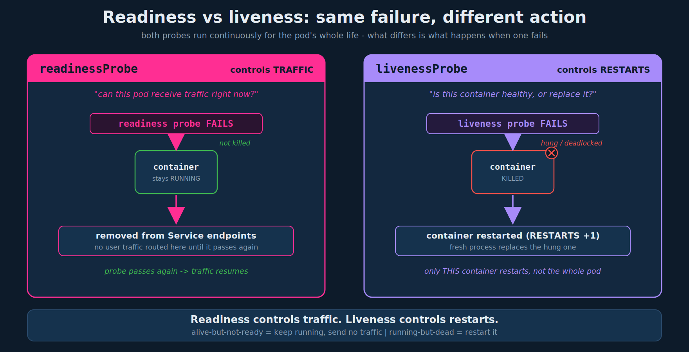

# Liveness Probes

> **Section:** 04-observability
> **Course chapter:** 2 (Readiness and Liveness Probes - liveness portion)
> **Why this is in CKAD:** Liveness probes are core, frequently-tested, and the readiness-vs-liveness distinction is a favorite exam trap. You must be able to add a `livenessProbe` (httpGet/tcpSocket/exec), tune its timing, and explain that failure restarts the container.
> **Companion files:** `01-readiness-probes.md` (same probe mechanisms and timing fields; opposite failure behavior - read together)

---

## 1. The motivation (instructor's framing)

Start with plain Docker. You run nginx in a container; if the application crashes and the container exits, it **stays down** - Docker is not an orchestrator, so nothing brings it back.

Run the same thing in Kubernetes and the kubelet **restarts the container automatically** when it exits (subject to `restartPolicy`). That is the baseline self-healing you get for free.

But the instructor raises the failure case that self-healing does **not** catch: the application is broken but the **container is still alive**. A bug puts the app in an infinite loop or a deadlock - the process is running (so Kubernetes sees a healthy container and does nothing), yet users are not being served. The container needs to be killed and replaced, but nothing has told Kubernetes anything is wrong.

That is the gap a **liveness probe** fills: a test the kubelet runs periodically to check whether the app inside the container is actually healthy. If the probe fails, the kubelet **kills and restarts the container**.

## 2. The readiness vs liveness distinction (read this first)

This is the part to get exactly right - your intuition ("readiness is startup-only, liveness is ongoing") is a common and understandable misread, so here is the precise version:

**Both probes run continuously for the container's whole life.** Readiness does not switch off after startup. What differs is the **action taken when the probe fails**:

| | Readiness probe | Liveness probe |
|---|---|---|
| Question it answers | "Can this pod receive traffic *right now*?" | "Is this container *healthy*, or should it be replaced?" |
| Runs when | continuously, for the pod's whole life | continuously, for the pod's whole life |
| On failure | pod removed from Service **endpoints** (no traffic); container keeps running | container is **killed and restarted** |
| On recovery | pod added back to endpoints, traffic resumes | n/a - a restart already happened |
| Restart count | unaffected | increments on each liveness-triggered restart |
| Typical use | gate traffic during slow warmup; shed load when a dependency is temporarily down | recover from hangs/deadlocks the process can't detect itself |

One-line mental model: **readiness controls traffic, liveness controls restarts.** A pod can be alive-but-not-ready (warming up, or briefly overloaded - keep it running, just don't send traffic) or it can be running-but-dead (hung - restart it). They are answering different questions, which is why a container often has *both*.



## 3. Defining a liveness probe

Same three mechanisms and same YAML shape as readiness - only the key name (`livenessProbe`) and usually the endpoint differ. The instructor's HTTP example probes a health endpoint (`/api/healthy`) rather than a readiness endpoint (`/api/ready`):

```yaml
apiVersion: v1
kind: Pod
metadata:
  name: simple-webapp
  labels:
    name: simple-webapp
spec:
  containers:
  - name: simple-webapp
    image: simple-webapp
    ports:
      - containerPort: 8080
    livenessProbe:
      httpGet:
        path: /api/healthy
        port: 8080
```

TCP and exec forms, identical in structure to readiness:

```yaml
    livenessProbe:
      tcpSocket:
        port: 3306
```

```yaml
    livenessProbe:
      exec:
        command:
          - cat
          - /app/is_healthy      # command MUST be a YAML list
```

| Type | Field | Passes when |
|---|---|---|
| HTTP | `httpGet` (`path`, `port`) | response code is 200-399 |
| TCP | `tcpSocket` (`port`) | a TCP connection can be opened |
| Exec | `exec` (`command`) | the command exits `0` |

## 4. Tuning (same fields as readiness)

The instructor's example uses the same timing knobs as the readiness lecture:

```yaml
    livenessProbe:
      httpGet:
        path: /api/healthy
        port: 8080
      initialDelaySeconds: 10      # wait before the first probe
      periodSeconds: 5             # probe every 5s
      failureThreshold: 8          # consecutive fails before killing the container
```

| Field | Meaning | Default |
|---|---|---|
| `initialDelaySeconds` | delay before the first probe | `0` |
| `periodSeconds` | interval between probes | `10` |
| `timeoutSeconds` | per-probe timeout before it counts as failed | `1` |
| `failureThreshold` | consecutive failures before the container is killed/restarted | `3` |
| `successThreshold` | consecutive successes to be considered healthy (must be `1` for liveness) | `1` |

For liveness specifically, `failureThreshold` x `periodSeconds` is roughly how long a hang is tolerated before a restart. Set `initialDelaySeconds` high enough that a slow-starting app is not killed mid-startup - otherwise you get a **restart loop**: the app never finishes booting before liveness fails and kills it (see gotchas).

## 5. Health endpoints: keep liveness and readiness separate

Depth beyond the lecture, and directly useful at work: point liveness and readiness at **different** endpoints with different meanings.

- `/api/healthy` (liveness) - "is the process itself sane?" Keep it cheap and dependency-free. It should **not** check downstream services.
- `/api/ready` (readiness) - "can I serve a request end to end *right now*?" This one *may* check dependencies (DB reachable, cache warm).

Why it matters: if your liveness endpoint also checks the database and the database has a brief outage, liveness fails -> every replica restarts simultaneously -> a recoverable dependency blip becomes a self-inflicted outage. Readiness is the right place to react to dependency state (shed traffic, don't restart). This is the most common real-world probe mistake.

## 6. Exam-pattern gotchas

- **Liveness restarts; readiness reroutes.** If a question says "restart the container when the app is unhealthy," that is **liveness**. If it says "stop sending traffic until ready," that is **readiness**. This is the single most likely thing to be tested.
- **Liveness restart loop.** A liveness probe with too small an `initialDelaySeconds` for a slow app kills the container before it finishes starting, forever. Symptom: a climbing `RESTARTS` count and `CrashLoopBackOff`. Fix: raise `initialDelaySeconds` (or use a startup probe - next thread).
- **`exec.command` is a YAML list**, not a string - same rule as init containers and readiness.
- **Probe is per container**, under each `spec.containers` entry. In a multi-container pod each container has its own liveness probe, and a liveness failure restarts **only that container**, not the whole pod.
- **`successThreshold` must be 1 for liveness** (and startup) probes; the API rejects other values. Only readiness may set it higher.
- **Default = no liveness probe**, meaning the container is only ever restarted when its process actually exits - exactly the hung-but-alive case the lecture is about.
- **Debugging:** a liveness-driven restart shows up in `kubectl describe pod` Events as `Liveness probe failed:` plus `Killing`/`Started`, and the `RESTARTS` column in `kubectl get pod` climbs.

## 7. Imperative shortcuts

No imperative flag for probes - generate the pod YAML and add the `livenessProbe` block by hand:

```bash
kubectl run simple-webapp --image=simple-webapp --port=8080 $do > pod.yaml
# add livenessProbe under the container, then validate before applying:
kubectl apply -f pod.yaml --dry-run=client
kubectl apply -f pod.yaml
```

Field-recall and debug commands for the command reference:

```bash
kubectl explain pod.spec.containers.livenessProbe           # recall the field tree
kubectl get pod simple-webapp                                # RESTARTS column climbing = liveness kills
kubectl describe pod simple-webapp                           # Events: "Liveness probe failed" / "Killing"
```

## 8. TL;DR / takeaways

- Kubernetes already restarts a container that **exits**; a **liveness probe** also catches the **hung-but-alive** case (deadlock, infinite loop) and restarts the container.
- **Readiness controls traffic, liveness controls restarts.** Both run continuously for the pod's life; they differ in what happens on failure - readiness pulls the pod from Service endpoints, liveness kills and restarts the container.
- Same three mechanisms as readiness: **httpGet** (200-399), **tcpSocket** (connects), **exec** (exit 0); same timing fields.
- Set `initialDelaySeconds` high enough to avoid a **restart loop** on slow-starting apps.
- Keep liveness (`/api/healthy`, cheap, no dependency checks) and readiness (`/api/ready`, may check dependencies) on **separate** endpoints, so a dependency blip sheds traffic instead of restarting every replica.
- `exec.command` is a list; probes are per container; `successThreshold` must be 1 for liveness.

---

### Open threads
- [x] Resolves the chapter-01 thread to add liveness as its own file and carry the readiness-vs-liveness contrast.
- [ ] **Startup probes** - the clean fix for the liveness restart-loop on slow starters; they gate liveness/readiness until the app has booted. Add as `03-startup-probes.md` if the course covers them (or fold into a probes summary).
- [ ] Tie liveness-driven restarts to `restartPolicy` semantics when the **Jobs/CronJobs** material is reached (`Always` vs `OnFailure` vs `Never`).
