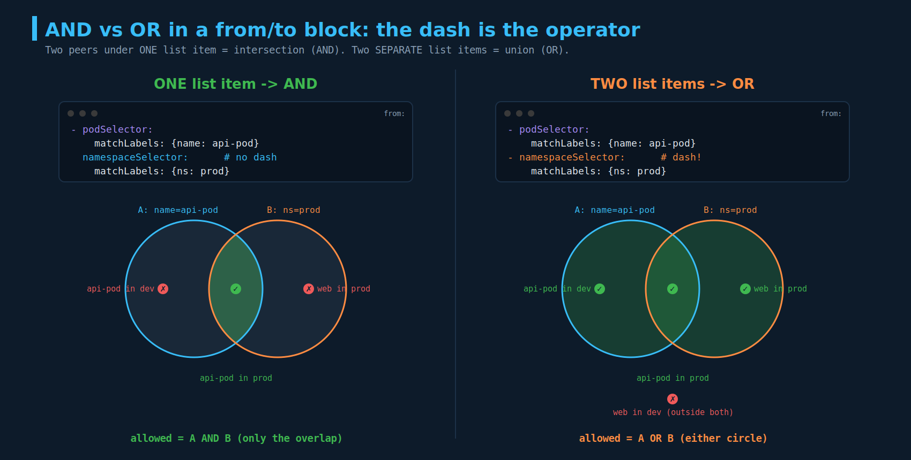
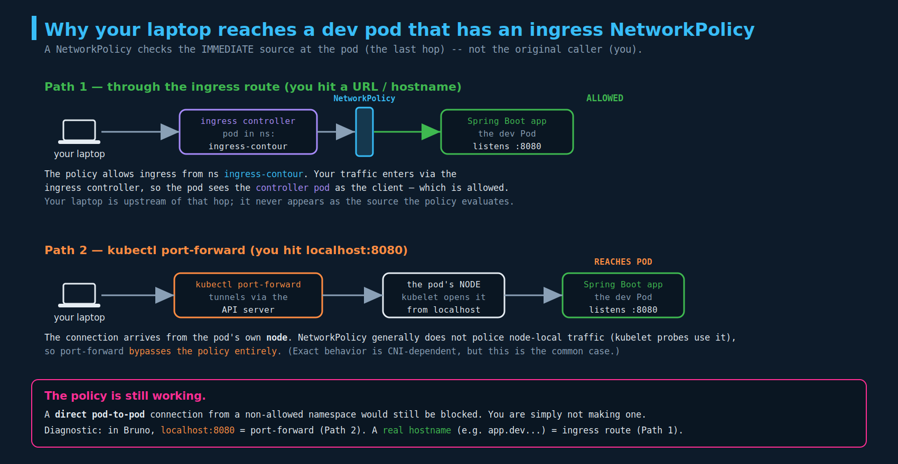

# Network Policies — Selectors & Rules (deep dive)

> **Section:** 06-services-networking
> **Course chapter:** 2 (Developing Network Policies)
> **Why this is in CKAD:** This is where the examinable detail lives — `namespaceSelector`, `ipBlock`, the AND-vs-OR rule semantics, and egress. Exam tasks phrase requirements as "allow traffic from X in namespace Y but not Z," and the dash-level YAML structure decides whether you pass.
> **Companion files:** `01-network-policies.md` (the basics — ingress/egress direction, default-deny, the whitelist model; read first). The AND/OR trap was introduced there and is fully worked here.

---

## 1. Recap and scope: we look from the DB pod's perspective

Same three-tier app as the last chapter — web `:80`, API `:5000`, DB `:3306` — but Mumshad drops the web pod from the picture because it never talks to the DB. The goal: **the DB pod should accept connections only from the API pod, only on 3306.**

The deliberate framing: stand at the **DB pod** and reason about its **ingress**. The API pod sends queries (ingress to the DB); the DB returns results. Because NetworkPolicy is **stateful** (covered in `01`), the return traffic for an allowed connection is automatic — so you write **one ingress rule and no egress rule**. The DB doesn't need an egress rule just to answer queries it already accepted.

```yaml
apiVersion: networking.k8s.io/v1
kind: NetworkPolicy
metadata:
  name: db-policy
spec:
  podSelector:
    matchLabels:
      role: db                 # this policy attaches to the DB pod(s)
  policyTypes:
    - Ingress
  ingress:
    - from:
        - podSelector:
            matchLabels:
              name: api-pod    # only the API pod may connect
      ports:
        - protocol: TCP
          port: 3306
```

That's the baseline. The rest of the chapter is about what happens when "only the API pod" isn't specific enough.

---

## 2. `namespaceSelector` — when "name: api-pod" isn't unique

Mumshad's next question: what if there's an `api-pod` in **dev**, **test**, and **prod**, and you only want the **prod** one? The `podSelector` above matches by label, and labels are **not unique across namespaces** — an `api-pod` in dev carries the same `name: api-pod` label as the one in prod. So `podSelector` alone would let all three in.

Fix: add a **`namespaceSelector`** to pin the namespace. Critically, `namespaceSelector` matches **namespaces by their labels**, not pods:

```yaml
  ingress:
    - from:
        - podSelector:
            matchLabels:
              name: api-pod
          namespaceSelector:                     # note the indentation — see section 3
            matchLabels:
              kubernetes.io/metadata.name: prod
```

Two things worth knowing beyond the lecture:

- **`kubernetes.io/metadata.name`** is a label Kubernetes **adds to every namespace automatically**, set to the namespace's own name (stable since v1.22). You don't have to label namespaces yourself to select one by name — this label is always there. Very handy on the exam: `namespaceSelector: { matchLabels: { kubernetes.io/metadata.name: prod } }` selects exactly the `prod` namespace with zero setup.
- **`namespaceSelector` *by itself* (no `podSelector`) means "any pod in the matching namespace(s)."** This is the point you flagged from the lecture — and it's exactly what your dev app's policy does (see section 6). `namespaceSelector: {}` (empty) = **all** namespaces.

---

## 3. The AND vs OR rule semantics (generic explanation)

This is the part you wanted crystal clear, so here it is in the most generic terms, independent of the example.

A `from:` (or `to:`) is a **list of peer items**. Two rules govern how they combine:

**Rule 1 — Separate list items are OR-ed (union).** Each `-` under `from:` is an independent way in. Traffic is allowed if it matches **any** item.

**Rule 2 — Multiple fields *inside one list item* are AND-ed (intersection).** If a single `-` item contains both a `podSelector` and a `namespaceSelector`, the source must satisfy **both** simultaneously.

The operator is literally **the dash**. Same two selectors, one dash of difference, opposite meaning:



```yaml
# AND  — ONE list item, two fields. Source must match BOTH.
from:
  - podSelector:
      matchLabels: { name: api-pod }
    namespaceSelector:                 # NO dash → same peer → intersection
      matchLabels: { kubernetes.io/metadata.name: prod }
# => allowed: a pod labelled name=api-pod  AND  living in namespace prod
```

```yaml
# OR  — TWO list items. Source may match EITHER.
from:
  - podSelector:
      matchLabels: { name: api-pod }
  - namespaceSelector:                 # dash → separate peer → union
      matchLabels: { kubernetes.io/metadata.name: prod }
# => allowed: anything labelled name=api-pod (in any ns)  OR  anything at all in namespace prod
```

Read them as set operations: **AND = A ∩ B** (only the overlap), **OR = A ∪ B** (either circle). The diagram plots example pods into the regions so you can see why `api-pod in dev` passes under OR (it's in circle A) but fails under AND (it's not in the prod circle).

> **Exam tactic:** translate the English requirement into ∩/∪ first, then write the dashes. "From the api pods **in** the prod namespace" = ∩ = one item, two fields. "From the api pods, **and also** from anything in prod" = ∪ = two items. The word "in" almost always signals AND; "and also / or" signals OR.

---

## 4. `ipBlock` — the third peer type (for non-pod / external IPs)

The lecture then adds a backup server that lives **outside** the pod network at `192.168.5.10`. Pods and namespaces are selected by label, but an external host has no Kubernetes labels — so there's a third peer type: **`ipBlock`**, which matches by **CIDR**.

```yaml
  ingress:
    - from:
        - podSelector:
            matchLabels:
              name: api-pod
          namespaceSelector:
            matchLabels:
              kubernetes.io/metadata.name: prod
        - ipBlock:                       # SEPARATE list item → OR-ed with the rule above
            cidr: 192.168.5.10/32
      ports:
        - protocol: TCP
          port: 3306
```

This is the OR/AND rule in action and matches the instructor's slide grouping (he boxed the `podSelector+namespaceSelector` as one rule and `ipBlock` as another): **(api-pod AND in prod) OR (the backup server IP)** may reach the DB on 3306.

Notes beyond the lecture:

- **`ipBlock` is its own peer type** — it does *not* combine with `podSelector`/`namespaceSelector` inside the same item. It's for IPs that aren't pods: external services, on-prem hosts, a VM-hosted database, etc.
- **`/32`** is a single host (the backup server). You can widen it (`192.168.0.0/16`) and carve out exceptions with `except: [ ... ]`.
- Don't use `ipBlock` to target **pods** — pod IPs are ephemeral and reassigned. Use `podSelector` for pods; reserve `ipBlock` for stable external addresses.

---

## 5. Egress — when the pod *initiates* an outbound connection

The final scenario: the DB runs a **backup agent** that *initiates* a connection out to the backup server. Now the DB is the **client**, so this is **egress** from the DB's perspective — and since it's a *new* connection the DB starts (not a reply to an allowed ingress), a stateful ingress rule won't cover it. You must add an explicit egress rule.

Two changes are required together:

1. Add `Egress` to `policyTypes` (otherwise the `egress:` block is ignored).
2. Add an `egress:` block with `to:` peers and `ports`.

```yaml
apiVersion: networking.k8s.io/v1
kind: NetworkPolicy
metadata:
  name: db-policy
spec:
  podSelector:
    matchLabels:
      role: db
  policyTypes:
    - Ingress
    - Egress                       # MUST add this, or the egress block does nothing
  ingress:
    - from:
        - podSelector:
            matchLabels:
              name: api-pod
      ports:
        - protocol: TCP
          port: 3306
  egress:
    - to:
        - ipBlock:
            cidr: 192.168.5.10/32  # the backup server
      ports:
        - protocol: TCP
          port: 80                 # the port the DB connects OUT to
```

The `to:`/`from:` structure and the AND/OR dash rules are **identical** for egress and ingress — only the direction word and the field name (`to` vs `from`) change. The egress `ports` are the **destination** ports on the target you're connecting to (here the backup server's `80`), just as ingress ports are the destination ports on your selected pods.

> **The egress gotcha that bites everyone (from `01`, repeated because it matters):** if you add `Egress` to `policyTypes`, that direction becomes default-deny, and you've now blocked **DNS** unless you also allow UDP/TCP 53 to CoreDNS. The backup agent resolving a hostname will silently fail. The lecture's example connects to a raw IP so it dodges this, but real egress policies almost always need a `:53` allow rule too.

---

## 6. Your real-world puzzle: hitting the dev pod from your laptop

You said your dev Spring Boot app has an **ingress** NetworkPolicy allowing `:8080` from a namespace, yet you can call its APIs from Bruno on your laptop — which is obviously *not* a pod in that namespace. Good catch; here's what's actually happening.

The core principle: **a NetworkPolicy evaluates the *immediate* source of the connection as it arrives at the pod — the last hop — not the original human who started it.** Your laptop is never the thing the policy inspects. There are two ways your traffic gets in, and your dev policy permits both without contradiction:



**Path 1 — you hit a URL/hostname (ingress route).** Your request goes to the ingress controller (Contour, in the `ingress-contour` namespace — this is the `caas-management-plane.allow-ingress` policy from `01`). The controller then opens a *fresh* connection to your app pod. At the pod, the source is the **ingress-controller pod**, and your policy says `from: namespaceSelector → gkp_namespace: ingress-contour` — allowed. Note your dev policy uses **`namespaceSelector` only** (no `podSelector`), so *any* pod in `ingress-contour` is permitted, which is exactly why the controller pod gets through. Your laptop is upstream of that hop and invisible to the policy.

**Path 2 — you `kubectl port-forward` and hit `localhost:8080`.** This tunnels through the API server to the kubelet on the pod's node, and the kubelet opens the connection to the pod **from the node itself (localhost)**. NetworkPolicy generally does **not** police traffic originating on the pod's own node (the kubelet needs unfettered access for liveness/readiness probes), so **port-forward bypasses the policy entirely.** Exact behavior is CNI-dependent, but on Calico/Cilium this is the normal case.

**The diagnostic:** look at the URL in Bruno. `http://localhost:8080/...` = you're port-forwarding (Path 2, policy bypassed). A real hostname like `https://<app>.dev.<...>.jpmchase.net/...` = you're going through the ingress (Path 1, policy *allowed* it because the controller is the source).

**The policy is still doing its job.** To actually *see* it block something, you'd `kubectl exec` into a pod in a non-allowed namespace and `curl` your app's pod IP / Service on 8080 — that direct pod-to-pod connection is what the policy denies. You just haven't been making that kind of connection from your laptop.

> Side note tying back to `01`: this is also why the `:8080` in that policy is the **pod's** port, not the Service's `:80`. The ingress controller connects to the pod on its real container port.

---

## Imperative shortcuts / command reference

Still **no `kubectl create networkpolicy` generator** — hand-write it (copy the skeleton from the docs "Network Policies" page and edit). What `kubectl` *is* good for here is discovering the labels you need so your selectors are exact:

```bash
kubectl get pods --show-labels                  # find pod labels for podSelector
kubectl get ns --show-labels                    # find namespace labels for namespaceSelector
kubectl get ns prod -o jsonpath='{.metadata.labels}'   # confirm kubernetes.io/metadata.name=prod

kubectl describe netpol db-policy               # shows parsed Ingress/Egress, peers, ports
kubectl get netpol -A

# prove the rules behave (allowed passes, denied hangs/times out)
kubectl run tester --image=busybox -it --rm --restart=Never -- \
  sh -c 'nc -zvw3 db-service 3306'              # from an allowed vs non-allowed pod/ns
```

Exam flow: `--show-labels` first → write the policy translating English to ∩/∪ → `apply` → `exec`/`run` a probe pod to confirm allow and deny both behave.

---

## Exam-pattern gotchas

- **The dash is the operator.** Fields under one `-` item = AND (intersection). Separate `-` items = OR (union). Re-read this on every NetworkPolicy task.
- **`namespaceSelector` selects namespaces by *namespace labels*** (not pod labels). `namespaceSelector` alone = any pod in that namespace; `namespaceSelector: {}` = all namespaces.
- **`kubernetes.io/metadata.name`** is auto-set to each namespace's name — use it to select a namespace by name with no manual labeling.
- **`ipBlock` is its own peer type** for CIDRs; never combined with pod/namespace selectors in the same item; not for pods.
- **Egress needs `policyTypes: [..., Egress]`** *and* an `egress:` block — adding only the block silently does nothing.
- **Stateful:** replies to an allowed connection are automatic. You only write rules for the direction the connection is *initiated*. A backup the DB *starts* is egress and needs its own rule.
- **Egress + DNS:** locking egress breaks name resolution unless you allow `:53` to CoreDNS.
- **Ports are destination ports** on the target (ingress: your selected pods; egress: the thing you connect to).
- **Policy evaluates the immediate source/last hop**, not the original caller — the reason laptop→ingress→pod is allowed while laptop→(direct pod-to-pod) would be denied.

---

## TL;DR / takeaways

- Reason from the pod the policy is attached to. For the DB: one **ingress** rule (from api-pod, :3306), no egress rule for replies — NetworkPolicy is **stateful**.
- **`namespaceSelector`** disambiguates same-labelled pods across namespaces; it matches **namespace** labels. `kubernetes.io/metadata.name` is the free, always-present "select by namespace name" label.
- **AND vs OR = the dash.** One item with two fields = intersection; separate items = union. Translate the requirement to ∩/∪ before writing YAML.
- **`ipBlock`** is the third peer type, for external CIDRs (the backup server), OR-ed in as its own item.
- **Egress** requires both `policyTypes: Egress` and an `egress:` block; same `to`/AND/OR rules as ingress; watch DNS.
- Your laptop reaches the dev pod because the policy checks the **last hop** (ingress controller in an allowed ns) or because **port-forward** bypasses policy at the node — the policy still blocks direct pod-to-pod from non-allowed namespaces.

---

## Resolved threads

- [x] **AND vs OR semantics** — fully worked here with the set-logic diagram (04). The one-dash difference is the whole rule.
- [x] **"namespaceSelector alone allows any pod in the namespace"** — confirmed; it's exactly how your dev `allow-ingress` policy admits the Contour controller.
- [x] **Why your laptop can hit the dev pod despite the policy** — ingress-route last-hop vs port-forward node bypass (diagram 05).
- [x] **80 vs 8080 in the JPMC ingress policy** (carried from `01`) — reinforced: NetworkPolicy ports are the pod's real container port.

### Open threads

- [ ] Confirm which path your Bruno calls actually use (check the URL: `localhost` vs hostname) — and, for learning, `exec` into a pod in a different namespace and curl the app on 8080 to watch the policy *deny* it.
- [ ] Install Calico/Cilium on the kind lab (carried from `01`) so these selector/egress rules actually enforce — then reproduce the AND vs OR difference hands-on with two probe pods.
- [ ] Practice the egress+DNS combo: restrict DB egress to the backup IP only, watch a hostname-based backup fail, fix with a `:53` rule.
- [ ] **Next lecture:** likely the **Ingress resource** (L7 HTTP routing) — the naming collision flagged in `01`. Next file = `03-...`; next diagram = `06-...` (section-06 numbering continues).
