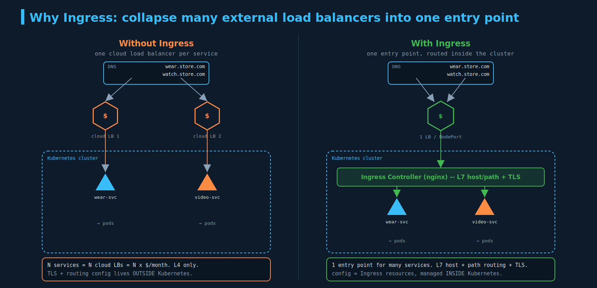
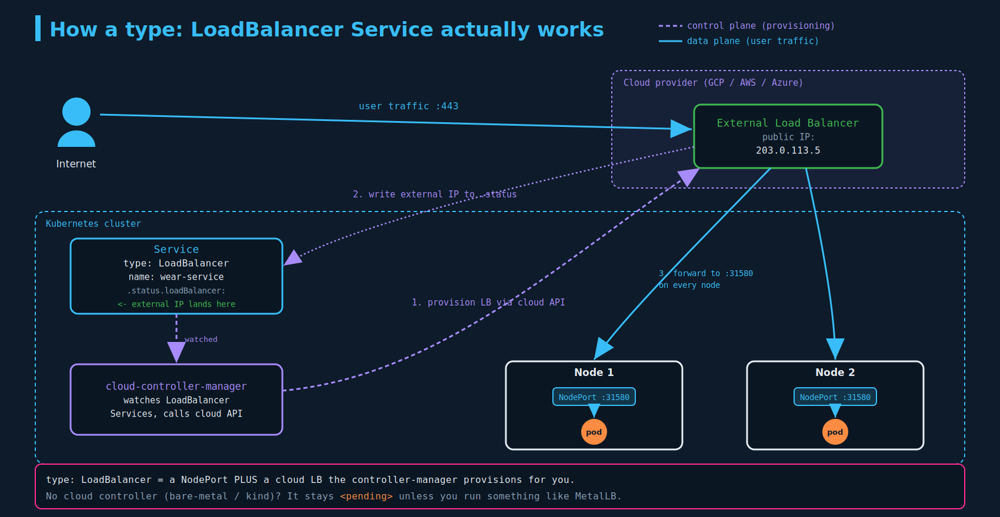
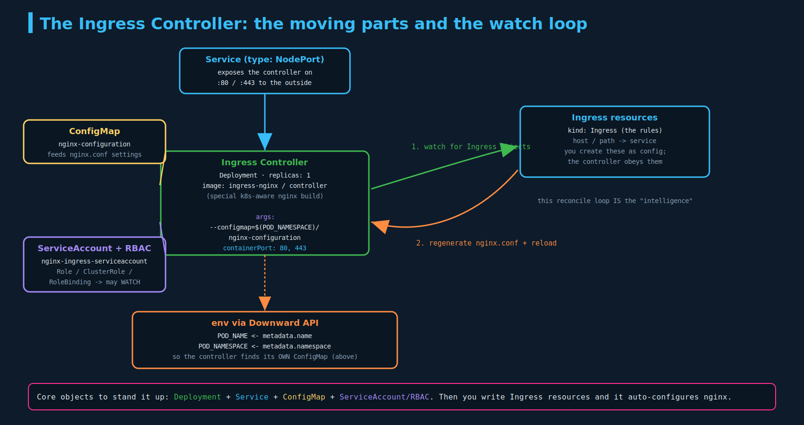

# Ingress (and the Service types it builds on)

> **Section:** 06-services-networking
> **Course chapter:** 3 (Ingress)
> **Why this is in CKAD:** Ingress is examinable and a perennial confusion point with Services. You'll write Ingress resources, read `kubectl describe ingress`, and get tripped by the **`networking.k8s.io/v1` structure** (nested `service.port.number`, required `pathType`) that the course slides predate. Knowing `kubectl create ingress` saves real time.
> **Companion files:** `01-network-policies.md` and `02-network-policy-selectors-and-rules.md` (note the **"ingress" naming collision** flagged there — this chapter is the actual `Ingress` *resource*, L7 routing, which is a different thing from the ingress *direction* in a NetworkPolicy). Builds on Services from `01-core-concepts`.

---

## 1. The setup we're improving on (instructor framing)

Mumshad builds up the problem before naming the solution. An online store:

1. Deploy the app (`wear`) as pods via a Deployment.
2. It needs a database, so deploy a **MySQL** pod and a **`mysql-service` (ClusterIP)** so the app reaches the DB by a stable in-cluster name. ClusterIP = internal only; the outside world can't touch the DB. Good.
3. Expose the app to users with a **`wear-service` (NodePort)** on `30080`. Now `http://<node-ip>:30080` works.
4. In production you don't hand users `:30080`, so you put a **proxy** in front mapping `:80 → :30080`, and **DNS** maps `www.my-online-store.com` to the node/proxy. Now it's a clean URL.

Then he moves to a cloud (GCP): instead of NodePort + your own proxy, set `wear-service` to **`type: LoadBalancer`**, and GCP gives you a real load balancer with a public IP. DNS points at that.

The complexity creeps in when you add a second app (`video`/`watch`): a second LoadBalancer Service → a **second** cloud LB, and now you need **yet another load balancer** in front to route `/apparel → LB1`, `/video → LB2`, plus TLS to manage. Multiple cloud LBs = multiple monthly bills and config (routing, SSL) living **outside** Kubernetes.



That sprawl — "so many load balancers and shit going on outside the cluster," as you put it — is exactly what Ingress exists to fix: one entry point, with host/path routing and TLS handled **inside** Kubernetes as config you version-control.

---

## 2. Service types recap (the part that gets confused with Ingress)

Since this lecture pairs Ingress with Services, pin down the three Service types first. Each is a superset of the one above:

| Type | Reachable from | How | Use in the example |
|---|---|---|---|
| **ClusterIP** (default) | inside the cluster only | a stable virtual IP + DNS name | `mysql-service` — DB stays private |
| **NodePort** | outside, via `<any-node-ip>:<30000–32767>` | opens a high port on **every** node, forwards to the Service | `wear-service` before the cloud |
| **LoadBalancer** | outside, via a cloud LB's public IP | NodePort **plus** a cloud-provisioned external LB | `wear-service` on GCP |

**Ingress is not a fourth Service type.** It sits *in front of* Services and does L7 (HTTP) routing. A typical production shape is: one `LoadBalancer` (or `NodePort`) Service exposes the **ingress controller**, and the controller routes to many **ClusterIP** Services by host/path. So you still use Services — Ingress just means you need far fewer externally-exposed ones.

---

## 3. How `type: LoadBalancer` actually talks to the cloud

You said the cloud-LB syncing was the fuzzy part. Here's the mechanism.

Creating a `type: LoadBalancer` Service does **not** make Kubernetes build a load balancer itself. A component called the **cloud-controller-manager (CCM)** — running in the cluster, holding the cloud credentials — watches for LoadBalancer Services and calls the **cloud provider's API** to provision a real external LB. The cloud returns a public IP, the CCM writes it into the Service's `status.loadBalancer.ingress`, and the external LB forwards incoming traffic to the **NodePort** that the LoadBalancer Service automatically allocated on every node. From there `kube-proxy` routes to the backend pods.



Key takeaways:

- **`type: LoadBalancer` = `NodePort` + a cloud LB the CCM provisions for you.** It's layered on top of NodePort, not a separate mechanism.
- **No cloud controller, no LB.** On bare metal, your Hetzner VPS, or a local **kind** cluster, there's no CCM to fulfill the request, so the Service sits at `EXTERNAL-IP: <pending>` forever — unless you install something like **MetalLB** to play that role.
- **This is the cost driver.** Every `type: LoadBalancer` Service is its own cloud LB (its own monthly cost), and it's **L4** — it can't look at the URL path or hostname. That's why N user-facing apps meant N LBs in the slides, and why Ingress (one L7 entry) is the fix.

---

## 4. What Ingress is

**Ingress is an L7 (HTTP/HTTPS) reverse proxy + router that lives inside the cluster.** One external entry point; it inspects the **hostname** and **URL path** of each request and forwards to the right Service, and it can terminate **TLS**. It's two cooperating pieces:

1. **Ingress Controller** — the actual proxy software (nginx, HAProxy, Traefik, Contour, GCE…). **Not deployed by default**; you install one.
2. **Ingress Resources** — the `kind: Ingress` objects: the rules/config the controller obeys.

> **Real-world bridge (this should click for you):** the nginx reverse proxy you run on your Hetzner VPS — terminating TLS and routing hostnames/paths to your containerized app, DB, and Redis — *is* conceptually an ingress controller. The only difference in Kubernetes is that you don't hand-edit `nginx.conf`; the controller **watches the cluster** and rewrites nginx config automatically as you add Ingress resources. And **HAProxy at Visa** is one of the controller options (see the slide listing nginx / HAProxy / Traefik). You weren't lost because it was exotic — you were just missing the layer that maps "reverse proxy I know" onto "thing Kubernetes manages for me."

---

## 5. The Ingress Controller — the moving parts (and those env vars)

The controller is deployed as an ordinary **Deployment**, but using a **special, Kubernetes-aware build** of nginx (not stock nginx). Its "additional intelligence" is a **reconcile loop**: it watches the API server for Ingress resources (and the Services/Endpoints they point at) and **regenerates and reloads its nginx config** whenever they change. That watch loop is the whole point.



The pieces Mumshad assembles, and what each is for:

| Object | Why it's needed |
|---|---|
| **Deployment** | runs the controller pod(s) from the special nginx-ingress image |
| **ConfigMap** (`nginx-configuration`) | where you put nginx tunables (timeouts, body size, etc.) without rebuilding the image; the controller reads it |
| **env `POD_NAME` / `POD_NAMESPACE`** | injected via the **Downward API** (`fieldRef` → `metadata.name` / `metadata.namespace`) — see below |
| **`containerPort` 80 / 443** | the HTTP/HTTPS ports the controller listens on |
| **Service** (NodePort or LoadBalancer) | exposes the controller to the outside world |
| **ServiceAccount + Role/ClusterRole/RoleBinding** | RBAC so the controller is *allowed* to watch Ingresses, Services, Endpoints, etc. Without it the watch loop can't read anything. |

**Clearing up `POD_NAME` / `POD_NAMESPACE` (your confusion):** the **Downward API** lets a container read facts about *its own* pod and inject them as environment variables. Here the controller needs to know **which namespace it's running in**, because its launch argument is:

```
args:
  - /nginx-ingress-controller
  - --configmap=$(POD_NAMESPACE)/nginx-configuration
```

`$(POD_NAMESPACE)` expands to the controller's own namespace at runtime, so the arg resolves to e.g. `default/nginx-configuration` — telling the controller exactly where to find its ConfigMap **without hardcoding the namespace** (the same manifest then works in any namespace). `POD_NAME` is used similarly for leader election and for writing status/events back to the right object. In short: the env vars make the controller **self-aware of its own identity** so it can locate its config and report status.

```yaml
env:
  - name: POD_NAME
    valueFrom:
      fieldRef:
        fieldPath: metadata.name        # Downward API: this pod's name
  - name: POD_NAMESPACE
    valueFrom:
      fieldRef:
        fieldPath: metadata.namespace    # this pod's namespace
```

**Corrections to the slides:**
- The controller Deployment slide shows `apiVersion: extensions/v1beta1` for `kind: Deployment`. That's dead — **Deployments are `apps/v1`** (removed from `extensions` in 1.16). One of the slides already shows `apps/v1`; use that.
- The image `quay.io/kubernetes-ingress-controller/nginx-ingress-controller:0.21.0` is the old project path/version. The current community controller is `registry.k8s.io/ingress-nginx/controller:<vX.Y.Z>`. Not exam-critical (you won't memorize image tags), but don't copy that ref into anything real.
- **Two different "nginx ingress" projects** exist and confuse everyone: the community **ingress-nginx** (what these slides use) and **NGINX Inc.'s nginx-ingress**. Different annotations and features. For CKAD assume community ingress-nginx.

---

## 6. Ingress Resources — the rules

An Ingress resource is "a set of rules applied on the ingress controller." Three shapes, increasing in power:

**(a) Single backend — send everything to one Service.** Uses `defaultBackend`, no rules.

```yaml
apiVersion: networking.k8s.io/v1     # NOT extensions/v1beta1 — see corrections
kind: Ingress
metadata:
  name: ingress-wear
spec:
  defaultBackend:
    service:
      name: wear-service
      port:
        number: 80                   # v1: nested under port.number, not a flat servicePort
```

**(b) Path-based — one host, route by URL path.** Rules with multiple `paths`.

```yaml
apiVersion: networking.k8s.io/v1
kind: Ingress
metadata:
  name: ingress-wear-watch
spec:
  rules:
    - http:
        paths:
          - path: /wear
            pathType: Prefix          # REQUIRED in v1 (the slides omit it)
            backend:
              service:
                name: wear-service
                port:
                  number: 80
          - path: /watch
            pathType: Prefix
            backend:
              service:
                name: watch-service
                port:
                  number: 80
```

**(c) Host-based — route by hostname.** Each `- host:` is its own rule.

```yaml
apiVersion: networking.k8s.io/v1
kind: Ingress
metadata:
  name: ingress-wear-watch
spec:
  rules:
    - host: wear.my-online-store.com
      http:
        paths:
          - path: /
            pathType: Prefix
            backend:
              service:
                name: wear-service
                port:
                  number: 80
    - host: watch.my-online-store.com
      http:
        paths:
          - path: /
            pathType: Prefix
            backend:
              service:
                name: watch-service
                port:
                  number: 80
```

**rules vs paths — the mental model:** a **rule** splits traffic on the **host** (or "no host" = match any). **paths** split traffic *within* a host on the **URL path**. So host-based = many rules each with one path; path-based = one rule with many paths. You point many DNS names at the **same** controller IP and let host rules fan them out (the "splitting traffic by domain name" slide).

**`defaultBackend` = the 404 catcher.** If a request matches no rule/path, the controller sends it to the `defaultBackend` (in the slides, the "Everything else → 404 page" rule). No default backend and no match → the controller's own default 404.

### The big `networking.k8s.io/v1` corrections (this is the exam trap)

The course was recorded on the old API. On any current cluster (and the exam):

- **`apiVersion: networking.k8s.io/v1`.** `extensions/v1beta1` and `networking.k8s.io/v1beta1` are **removed** (gone in 1.22). The slide's `kubectl create` printing `ingress.extensions/...` reflects the dead group.
- **`pathType` is required** on every path: `Prefix`, `Exact`, or `ImplementationSpecific`. Omit it in v1 and the object is rejected. The course YAML has no `pathType` — add it.
- **Backend is nested:** `backend.service.name` + `backend.service.port.number` (or `port.name` for a named port). The old flat `serviceName:` / `servicePort:` is gone.
- **`defaultBackend`** (one word) replaces the old `backend:`, and also uses `service.name` + `service.port.number`.
- **`spec.ingressClassName`** (a field now, e.g. `nginx`) replaces the old `kubernetes.io/ingress.class` annotation when you have more than one controller.

---

## 7. Inspecting Ingress

```bash
kubectl get ingress
kubectl get ing -A
kubectl describe ingress ingress-wear-watch
```

`describe` is the one to read — it lays out the routing table:

```
Rules:
  Host  Path    Backends
  ----  ----    --------
  *     /wear   wear-service:80  (<endpoints>)
        /watch  watch-service:80 (<endpoints>)
```

`Host: *` means "any host" (no host rule). If `Backends` shows `<error: endpoints not found>` or `<none>`, the target Service name/port is wrong or the Service has no ready pods — a common "my ingress 404s" cause.

> **Lab gotcha you *will* hit (nginx, beyond the lecture):** with path-based routing, a request to `/wear` arrives at the backend pod still pathed as `/wear`, but the `wear` app serves its content at `/`. You fix that with the nginx annotation `nginx.ingress.kubernetes.io/rewrite-target: /` (often with a regex capture in the path). This bites in the KodeKloud Ingress labs specifically — when a route "connects but 404s," suspect rewrite-target.

---

## Imperative shortcuts / command reference

Unlike NetworkPolicy, **`kubectl create ingress` exists** — use it on the exam, it sets `pathType` for you:

```bash
# one rule, two paths (path ending in * => pathType Prefix; otherwise Exact)
kubectl create ingress ingress-wear-watch \
  --rule="my-online-store.com/wear*=wear-service:80" \
  --rule="my-online-store.com/watch*=watch-service:80"

# scaffold YAML to edit (your $do alias)
k create ingress ingress-wear-watch --rule="/wear*=wear-service:80" $do > ing.yaml

# extras
#   --class=nginx                      -> spec.ingressClassName
#   --default-backend=wear-service:80  -> spec.defaultBackend
#   --annotation key=value             -> e.g. the rewrite-target annotation
```

Reading the `--rule` syntax: `host/path=service:port`. Omit the host (`/path=svc:port`) for a no-host rule. A trailing `*` on the path makes it a `Prefix` match.

---

## Exam-pattern gotchas

- **`apiVersion: networking.k8s.io/v1`.** `extensions/*` and `networking.../v1beta1` are removed. The course predates this.
- **`pathType` is required** per path (`Prefix` / `Exact` / `ImplementationSpecific`). Missing it = rejected.
- **Backend is nested:** `service.name` + `service.port.number`. Not flat `serviceName`/`servicePort`.
- **`defaultBackend`** is one word and catches unmatched requests.
- **An Ingress resource does nothing without a running Ingress controller.** Creating the object alone won't route anything — there must be a controller watching.
- **`ingressClassName`** selects which controller handles the Ingress when several exist.
- **rewrite-target** (`nginx.ingress.kubernetes.io/rewrite-target: /`) for path-based routing when the backend serves at `/` — classic lab 404.
- **Service types:** ClusterIP (internal), NodePort (`30000–32767` on every node), LoadBalancer (needs a cloud/CCM or MetalLB; else `<pending>`).
- **`kubectl create ingress --rule=...` exists** (NetworkPolicy has no generator; Ingress does) — and it fills in `pathType`.
- **Ingress (resource) ≠ ingress (NetworkPolicy direction).** Same word, unrelated mechanisms.

---

## TL;DR / takeaways

- The lecture's arc: NodePort + DIY proxy + DNS → cloud `LoadBalancer` → many LBs (costly, L4, config outside k8s) → **Ingress** (one L7 entry, host/path routing + TLS, config inside k8s).
- **`type: LoadBalancer` = NodePort + a cloud LB the cloud-controller-manager provisions.** Bare-metal/kind → `<pending>` without MetalLB.
- **Ingress = controller (the proxy you deploy) + resources (the rules).** Not a Service type; it sits in front of Services.
- The **controller** is a Deployment of a special nginx build with a **watch loop** that auto-rewrites nginx from Ingress resources; needs a ConfigMap, a Service to expose it, RBAC, and **Downward API env vars** (`POD_NAMESPACE` feeds `--configmap=$(POD_NAMESPACE)/...`).
- **Ingress resources:** `defaultBackend` (single/404), host rules, path rules. **rules split on host; paths split on URL.**
- **v1 structure is the exam trap:** `networking.k8s.io/v1`, required `pathType`, nested `service.port.number`, `ingressClassName`.
- Use **`kubectl create ingress --rule=...`**.

---

## Resolved threads

- [x] **"ingress" naming collision** (carried from `01`/`02`) — resolved: this chapter is the `Ingress` *resource* (L7 routing via a controller), a different mechanism from the ingress *direction* in a NetworkPolicy.
- [x] **How Kubernetes syncs with cloud load balancers** — cloud-controller-manager watches LoadBalancer Services and provisions the external LB (diagram 07).
- [x] **What the controller's `POD_NAME` / `POD_NAMESPACE` env vars do** — Downward API self-identity, used to locate its ConfigMap (diagram 08).
- [x] **Why this all exists** — to collapse many external LBs into one in-cluster L7 entry point (diagram 06).

### Open threads

- [ ] Do the KodeKloud Ingress labs hands-on, and deliberately trigger + fix the **rewrite-target** 404.
- [ ] Install **ingress-nginx** on the kind lab (kind has a documented ingress-ready setup) and route two hostnames to two Services — confirm `describe ingress` shows the table.
- [ ] On kind, create a `type: LoadBalancer` Service and watch it sit `<pending>`; optionally install **MetalLB** to fulfill it — makes the diagram-07 mechanism concrete.
- [ ] Practice `kubectl create ingress --rule=...` until the host/path/`*` syntax is automatic.
- [ ] **Forward-looking:** the **Gateway API** is the successor to Ingress (more expressive, role-oriented). Out of CKAD scope today, but worth a note when you hit CKA/real-world — your Contour setup at JPMC (`HTTPProxy`) and HAProxy at Visa are both in this same "edge routing" space.
- [ ] **Next lecture:** likely Ingress annotations/rewrite-target detail or moving on within Services & Networking. Next file = `04-...`; next diagram = `09-...`.
