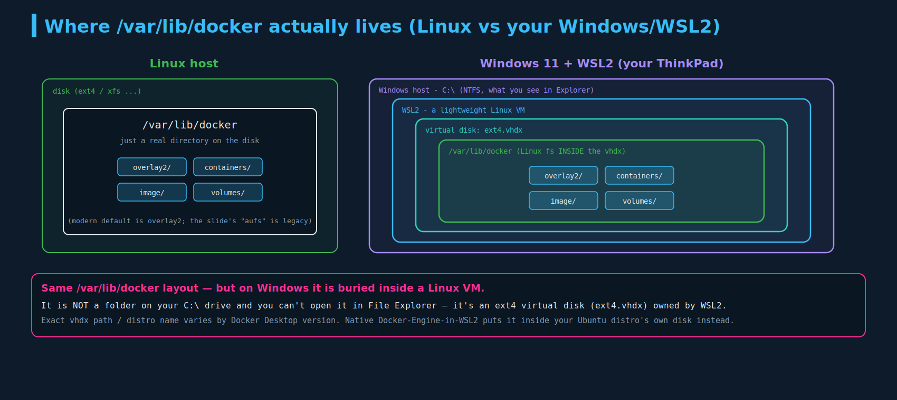
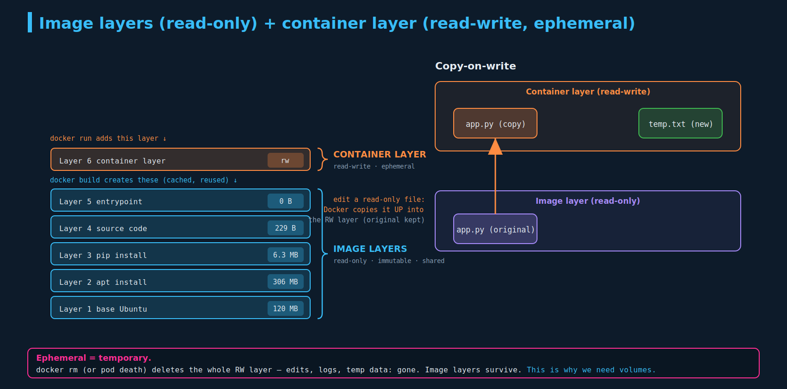
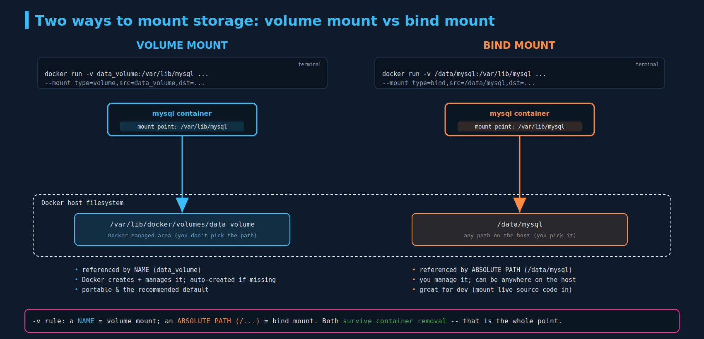

# Docker Storage: layers, copy-on-write, and volumes

> **Section:** 07-storage
> **Course chapter:** 1 (Docker Storage)
> **Why this is in CKAD — read this first:** This lecture is **background, not directly examinable.** Storage drivers, `/var/lib/docker`, AUFS/overlay2, and Docker's `-v` flag do **not** appear on the CKAD exam. What *is* examinable comes in the next lectures: Kubernetes **volumes** (`emptyDir`, `hostPath`), **PersistentVolumes**, **PersistentVolumeClaims**, **StorageClasses**. But the one idea here — the container's read-write layer is **ephemeral** — is the entire reason those Kubernetes objects exist. Learn the concept; don't memorize the Docker internals.
> **Companion files:** none yet in this section (first chapter). Conceptually this is the "why" that the upcoming `02-kubernetes-volumes.md` / PV / PVC chapters build on.

---

## 1. The two halves of Docker storage, and where data lives

Docker storage splits into two concerns (the opening slide):

- **Storage drivers** — implement the *layered image + container filesystem* and copy-on-write (sections 2–3). Examples: overlay2, AUFS, BTRFS, ZFS, Device Mapper.
- **Volume drivers** — manage *volumes*, the persistent storage you attach to containers (section 4). Default driver: `local`; plugins exist for cloud/network storage.

These are different jobs — keep them apart in your head; section 5 nails the distinction.

**Where Docker keeps everything:** installing Docker on Linux creates `/var/lib/docker` with subfolders:

```
/var/lib/docker
├── overlay2/     <- the layered filesystem (the slide shows "aufs"; see note)
├── containers/   <- per-container metadata + logs
├── image/        <- image layer metadata
└── volumes/      <- named volumes live here
```

> **Correction to the slide:** it shows an `aufs/` folder. AUFS was the *old* default storage driver; modern Docker uses **overlay2**, so on a current system you'll see `overlay2/` there instead. Same idea, newer driver.

### "Is it like this on Windows?" — your question (and your actual setup)

Good instinct: Docker *is* special on Windows. Docker only runs Linux containers on top of a Linux kernel, so on Windows there is **no native `/var/lib/docker` folder on your `C:` drive.** Docker runs inside a lightweight Linux environment provided by **WSL2**, and `/var/lib/docker` lives **inside that environment's virtual disk** (an `ext4.vhdx` file), not as a browsable Windows folder.



The `/var/lib/docker` *layout* is identical to Linux — it's just nested inside a Linux VM:

- **Docker Desktop (WSL2 backend):** the data sits in a Docker-managed WSL2 distro's `ext4.vhdx` (historically `docker-desktop-data`; newer Docker Desktop versions consolidated this — the exact path/distro name varies by version). You can't open it in File Explorer; it's an ext4 virtual disk.
- **Docker Engine installed natively inside your Ubuntu WSL2 distro:** then `/var/lib/docker` is a real path inside *your Ubuntu distro's* own `ext4.vhdx`.

Either way: on your ThinkPad, "where Docker stores data" is a Linux filesystem inside a virtual disk managed by WSL2 — which is also why your **kind** cluster (which runs on Docker) behaves like real Linux even though the host is Windows.

---

## 2. Layered architecture: how images are built

When Docker builds an image, **each instruction in the Dockerfile becomes a layer**, and each layer stores **only the changes** from the layer below it. The example Dockerfile:

```dockerfile
FROM Ubuntu                                    # Layer 1: base Ubuntu        120 MB
RUN apt-get update && apt-get -y install python # Layer 2: apt packages       306 MB
RUN pip install flask flask-mysql              # Layer 3: pip packages       6.3 MB
COPY . /opt/source-code                        # Layer 4: your source code   229 B
ENTRYPOINT FLASK_APP=/opt/source-code/app.py flask run  # Layer 5: entrypoint   0 B
```

Because each layer is just a diff, sizes vary wildly — the base OS and apt packages are big; your source and the entrypoint are tiny.

### Caching and layer sharing (clearing up your note)

You wrote that Docker "is not going to use the cache instead of redownloading" — it's actually the **opposite**, and this is the whole payoff:

Take a second Dockerfile, identical except it copies a *different* source file (`app2.py`) and uses a different entrypoint. When you build it, Docker **reuses the cached layers** for everything that didn't change — Layers 1–3 (base Ubuntu, apt, pip) are **already on disk from the first build**, so they cost **0 MB** and aren't rebuilt or re-downloaded. Only **Layer 4 onward** (the first instruction whose input changed) is rebuilt.



The rule: **the cache is valid up to the first instruction whose inputs changed; from there down, every layer is rebuilt.** Two consequences:

- **Disk savings:** identical layers are stored once and **shared** across all images that use them. Ten images on the same Ubuntu base share one copy of that 120 MB layer.
- **Build speed:** unchanged steps are skipped.

> **Practical Dockerfile tip (earns its place — you build images for your Hetzner site's CI):** order instructions from *least* to *most* frequently changing. Put `apt`/`pip`/`npm install` **before** `COPY . .`. Your source changes every commit, but your dependencies rarely do — so keeping the install steps above the COPY means the expensive dependency layers stay cached on every build, and only the cheap source layer rebuilds. Reordering them (COPY first) silently busts the cache on every commit.

---

## 3. Read-only image layers + the read-write container layer

Once an image is built, **all its layers are read-only** — the only way to change them is a new build.

When you `docker run` an image, Docker adds one more layer on top: the **container layer**, which is **read-write**. This is where the running container writes everything — temp files, logs, any file it creates or modifies. Crucially:

> **The container layer is ephemeral** — yes, "ephemeral" = temporary, exactly as you guessed. It exists only as long as that container exists. **`docker rm` the container (or a Kubernetes pod dies) and the entire read-write layer — and all the data in it — is gone.** The read-only image layers are untouched and reused for the next container.

### Copy-on-write

What happens if the running container modifies a file that came from a read-only image layer (say `app.py`)? Docker can't change the read-only layer, so it uses **copy-on-write**: it **copies the file up into the read-write container layer**, and the container edits *that* copy. The original in the image layer is never touched; other containers from the same image still see the pristine version. New files (like `temp.txt`) are created directly in the read-write layer.

All of those copies and new files live in the ephemeral layer — so they all vanish when the container is removed. **That data-loss problem is the entire motivation for volumes**, and (in the next chapters) for Kubernetes volumes and PersistentVolumes. A database container that stored its data in the container layer would lose the whole database on every restart.

---

## 4. Volumes: making data persist (your requested explanation)

**What *is* a volume?** Yes — it's "just some storage," but specifically: a **named, Docker-managed storage location that exists independently of any container's lifecycle.** It lives outside the container's ephemeral layer, so data written to it **survives** the container being stopped, removed, and recreated. A volume is a first-class Docker object you can create, list, inspect, and delete on its own.

Create one, then mount it into a container:

```bash
docker volume create data_volume
# creates /var/lib/docker/volumes/data_volume on the host

docker run -v data_volume:/var/lib/mysql mysql
# mounts that volume at /var/lib/mysql inside the container.
# MySQL now writes its data into the volume, NOT the ephemeral layer -> it persists.
```

If you reference a volume that doesn't exist yet (`-v data_volume2:/var/lib/mysql`), Docker **auto-creates** it. Now the container's writes to `/var/lib/mysql` land in the volume; remove and recreate the container and the data is still there.

### Volume mount vs bind mount (your other requested distinction)

Your note said "volume mounts and volume mounts" — the two types are **volume mounts** and **bind mounts**. The difference is *where the host-side storage lives and who manages it*:



| | **Volume mount** | **Bind mount** |
|---|---|---|
| Syntax (`-v`) | `-v data_volume:/var/lib/mysql` | `-v /data/mysql:/var/lib/mysql` |
| Host side | `/var/lib/docker/volumes/<name>` (Docker picks the path) | **any** path you choose on the host |
| Referenced by | a **name** | an **absolute path** (starts with `/`) |
| Managed by | **Docker** (create/list/inspect/prune) | **you** (it's just a host directory) |
| Typical use | persistent app/DB data; the recommended default | dev (mount live source code into a container), or reusing existing host files |

The `-v` flag disambiguates by what's on the left: **a name → volume mount; an absolute path → bind mount.** That's the whole rule.

### `-v` vs `--mount`

`-v` is the old terse syntax. `--mount` is the newer, explicit key=value form Docker now recommends (it's clearer and fails loudly instead of silently creating things):

```bash
# volume mount
docker run --mount type=volume,source=data_volume,target=/var/lib/mysql mysql
# bind mount
docker run --mount type=bind,source=/data/mysql,target=/var/lib/mysql mysql
```

> **Real-world anchor (your Hetzner deployment):** your Postgres/MySQL and Redis containers almost certainly use one of these so their data survives `docker compose down && up`. If your `docker-compose.yml` has a top-level `volumes:` block and `db_data:/var/lib/postgresql/data`, that's a **volume mount**. If it maps `./data:/var/lib/postgresql/data`, that's a **bind mount** to a folder in your repo/host. Same two mechanisms, just expressed in Compose. This is exactly the persistence layer that ties into your *Designing Data-Intensive Applications* reading — durable storage decoupled from the process.

---

## 5. Storage drivers vs volume drivers (so the two don't blur)

The opening slide split storage into two driver types; here's the clean distinction:

| | **Storage driver** | **Volume driver** |
|---|---|---|
| Job | implements the **layered image + container filesystem** and copy-on-write | provisions and manages **volumes** |
| Examples | **overlay2** (modern default), AUFS, BTRFS, ZFS, Device Mapper, Overlay | **local** (default), plus plugins: rexray (EBS/GCE PD), Portworx, Azure File, NetApp… |
| Who picks it | Docker chooses based on OS/kernel (you rarely set it) | `local` by default; specify `--volume-driver` for external/network storage |
| Operates on | image layers + the ephemeral RW layer | the persistent data you mount in |

So: **storage drivers make layers and copy-on-write work; volume drivers make persistent storage work.** AUFS/overlay2 are storage drivers (the layered fs); `local`/rexray/etc. are volume drivers (where volumes physically live). The CKAD exam tests neither directly — this is the mental model, not memorization.

---

## Imperative shortcuts / command reference

```bash
# volumes
docker volume create data_volume
docker volume ls
docker volume inspect data_volume        # shows Mountpoint under /var/lib/docker/volumes
docker volume rm data_volume
docker volume prune                      # delete all unused volumes

# mounting
docker run -v data_volume:/var/lib/mysql mysql        # volume mount (name)
docker run -v /data/mysql:/var/lib/mysql mysql        # bind mount (abs path)
docker run --mount type=volume,source=data_volume,target=/var/lib/mysql mysql
docker run --mount type=bind,source=/data/mysql,target=/var/lib/mysql mysql

# inspecting storage usage / driver
docker system df                         # reclaimable space: images, containers, volumes, cache
docker info | grep -i 'storage driver'   # which storage driver is active (expect overlay2)
docker build --no-cache ...              # force a rebuild ignoring the layer cache
```

---

## Exam-pattern gotchas / scope notes

- **None of this lecture is directly on CKAD.** Don't memorize `/var/lib/docker`, AUFS vs overlay2, or `-v` syntax for the exam. Carry forward **one** idea: the container's writable layer is **ephemeral**, so persistent data needs a volume.
- The Kubernetes equivalents (examinable, coming next): `volumes` + `volumeMounts` in a pod spec, `emptyDir` (ephemeral, pod-scoped), `hostPath` (a bind mount to the node — the k8s cousin of a Docker bind mount), and `PersistentVolume` / `PersistentVolumeClaim` / `StorageClass`.
- **overlay2**, not aufs, on any modern host (the slide is dated).
- **`-v name` = volume; `-v /abs/path` = bind.** Prefer `--mount` for clarity in real work.
- Kubernetes nodes don't use Docker anymore (dockershim removed in 1.24) — they run **containerd/CRI-O** — but the same layered/overlayfs + copy-on-write model carries straight over, so this mental model still applies on your cluster nodes.

---

## TL;DR / takeaways

- Docker storage = **storage drivers** (layered fs + copy-on-write) + **volume drivers** (persistent volumes). Data lives under `/var/lib/docker`.
- On **Windows/WSL2** that path is the same, but it's **inside a Linux VM's `ext4.vhdx`**, not a folder on `C:`.
- Images are built in **layers**, one per Dockerfile instruction, each storing only the diff. Layers are **cached and shared** — a rebuild reuses everything up to the first changed instruction (order cheap-changing steps last).
- Image layers are **read-only**; `docker run` adds a **read-write container layer** that is **ephemeral** (gone on `docker rm`). Edits to image files use **copy-on-write** (copied up into the RW layer).
- **Volumes** persist data beyond the container. **Volume mount** = a Docker-managed named volume under `/var/lib/docker/volumes`; **bind mount** = any host path you point at. `-v name` vs `-v /abs/path` picks between them.
- This is the **why** behind Kubernetes volumes/PV/PVC — the examinable material in the next chapters.

---

## Resolved threads

- [x] **"ephemeral storage = temporary?"** — yes; the read-write container layer lives only as long as the container.
- [x] **"What really is a volume?"** — a named, Docker-managed storage object decoupled from container lifecycle, so its data persists.
- [x] **"Volume mounts vs (bind) mounts"** — volume = Docker-managed under `/var/lib/docker/volumes` (referenced by name); bind = any host path (referenced by absolute path). Diagram 02.
- [x] **"Is `/var/lib/docker` like this on Windows?"** — same layout, but inside a WSL2 Linux VM's `ext4.vhdx`, not on `C:`. Diagram 03.
- [x] **"Docker won't use the cache / redownloads?"** — inverted: it **does** reuse cached unchanged layers (0 MB) and only rebuilds from the first changed instruction down.

### Open threads

- [ ] Inspect your own Hetzner stack: is the DB using a **volume** (`db_data:/...`) or a **bind** (`./data:/...`) in the compose file? Run `docker volume ls` / `docker volume inspect` on the VPS to see.
- [ ] On the WSL2 box: `docker info | grep -i storage` to confirm **overlay2**, and `docker system df` to see how much space images/volumes/build-cache are using.
- [ ] **Next lecture:** Kubernetes **Volumes** (`emptyDir`, `hostPath`) — the first *examinable* storage topic, and the direct successor to this Docker model. Next file = `02-...`; next diagram = `04-...`.
- [ ] After that: **PersistentVolumes / PersistentVolumeClaims / StorageClasses** — the core CKAD storage objects. Watch for the PV↔PVC binding lifecycle and `accessModes`/`reclaimPolicy`.
